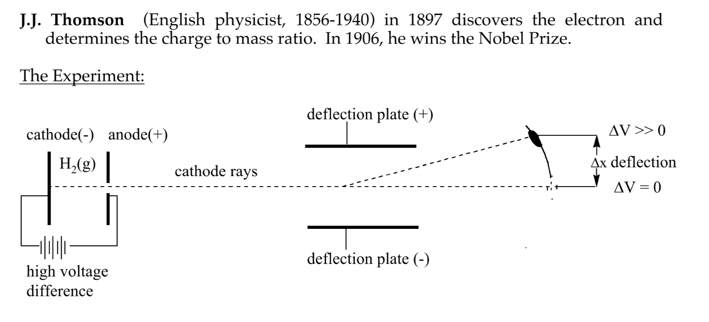
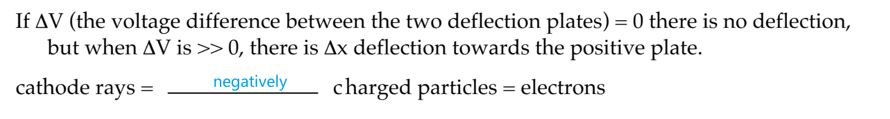
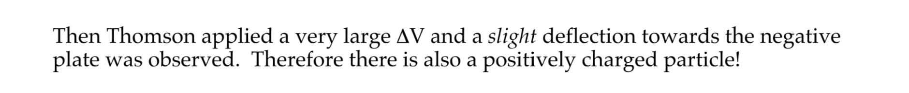
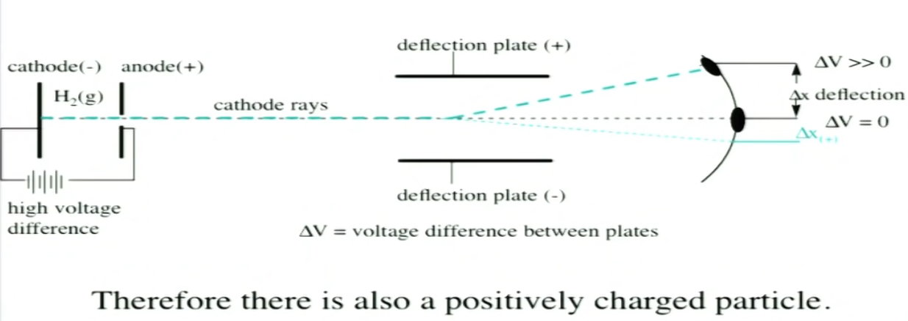
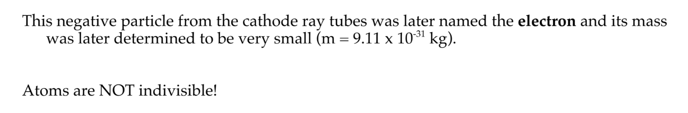
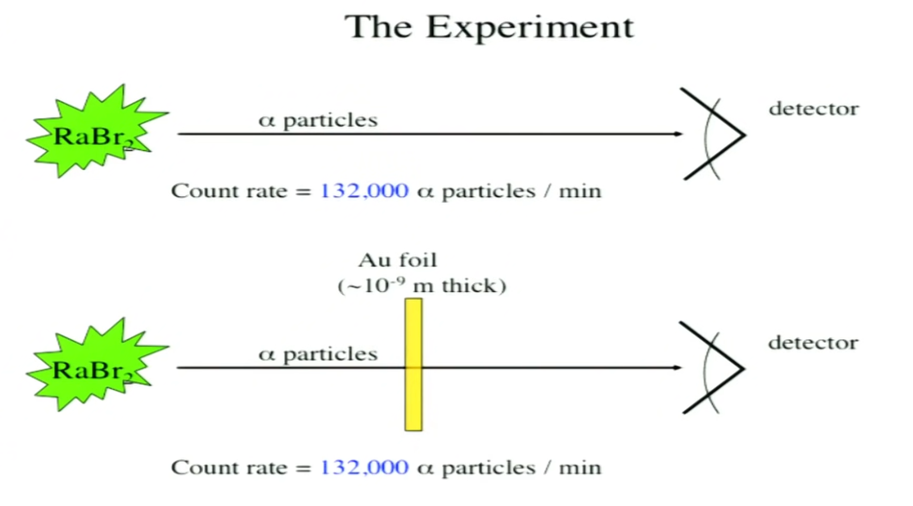
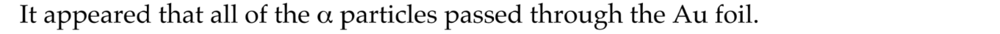
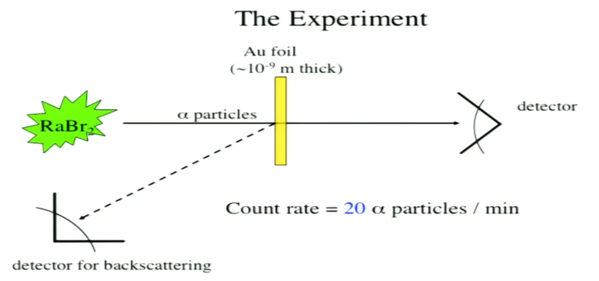
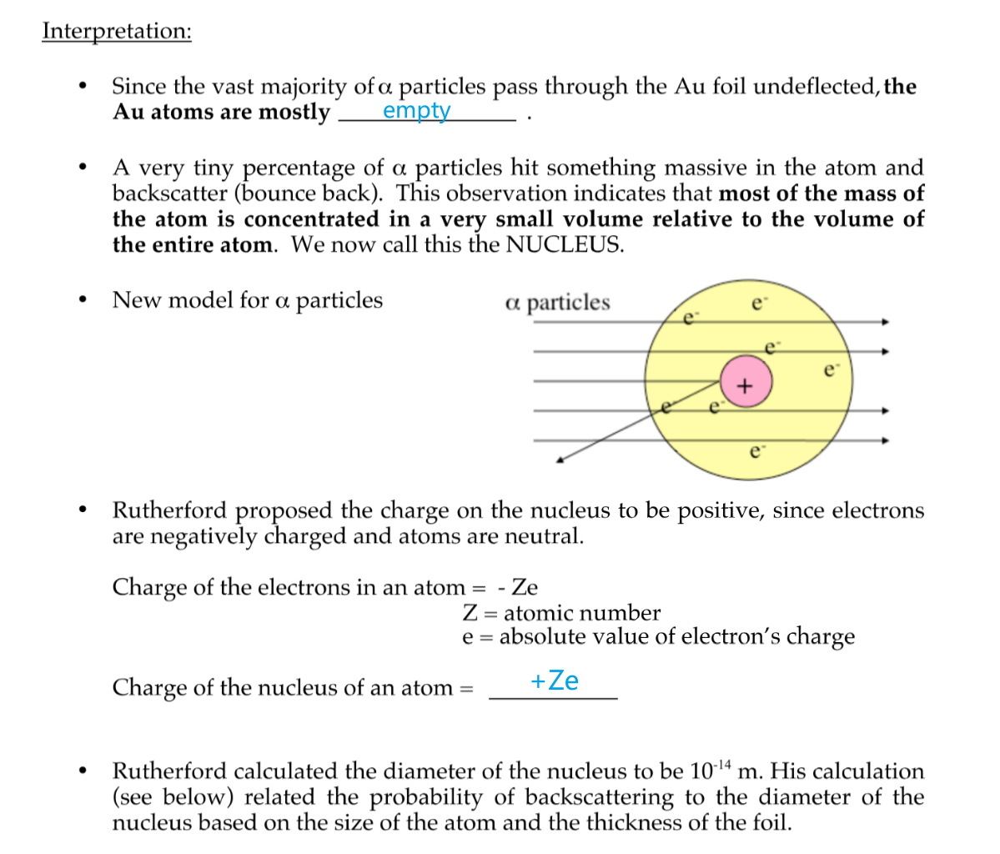

[Lec2 Notes.pdf](https://www.yuque.com/attachments/yuque/0/2022/pdf/12393765/1662470994131-6c88c318-e0f0-433c-ad9b-5aeeb92617bd.pdf)

# Discovery of Electrons - J.J Tompson
> 1. **Negative Particles**
> 

> 2. **Positive Particles**
> 

> 3. **Mass of Charges**
> 
From classical electromagnetism, we have:
> 1.  $\Delta x_{(-)}\propto \frac{e_{(-)}}{m_{(-)}}$
> 2. $\Delta x_{(+)}\propto \frac{e_{(+)}}{m_{(+)}}$
> 
其中$e_{(-)}$是负电荷携带的电荷量，$e_{(+)}$是正电荷携带得到电荷量。$m_{(-)}$是负电荷的质量，$m_{(+)}$是正电荷的质量，我们进行如下计算得到:
> $\frac{|\Delta x_{(-)}|}{|\Delta x_{(+)}|}=\frac{|\frac{e_{(-)}}{m_{(-)}}|}{|\frac{e_{(+)}}{m_{(+)}}|}=\frac{m_{(+)}}{m_{(-)}}$。
> 从实验的结果我们可以得到，$\Delta x_{(-)}>>\Delta x_{(+)}$, 于是$\frac{m_{(+)}}{m_{(-)}}>>1$, 即负电荷的质量远小于正电荷的质量。
> 

# Discovery of Nucleus - Ernest Rutherford
## Experiment
> 1. **Phase 1: Passing Through Au Foil**
> 

> 2. **Phase 2: Back Scatter Detection**
> 

## Interpretation - Nucleu
> 

