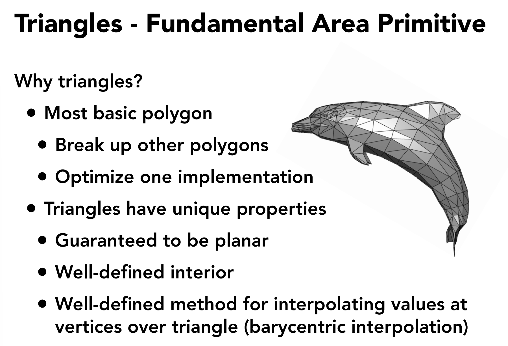

# Abstract Drawing Machine
> [!def]
> 

# Drawing Trangles - Fundamental Area Primitive
## Why Triangles?
> [!def]
> 

## Sampling a Function
> [!def]
> 

## Rasterizing a Triangle
> [!algo]
> 

## Interior of a Triangle
> [!algo]
> The above algorithm heavily relies on an indicator function inside(t, x, y), but how to implement this indicator function? We will use what we call "three line test".
> 
> The algorithm is described in the following way:
> 
> Suppose we have a triangle with vertices $P_1=(X_1,Y_1)$, $P_2=(X_2,Y_2)$ and $P_3=(X_{3},Y_3)$, then for a test point $(x,y)$ , we:
> - First for each side of the triangle compute the direction of the side by $dX_i=X_{i+1}-X_i$ and $dY_i=Y_{i+1}-Y_i$
> - Compute the normal vector of each side(pointing inwards) by $\vec{N}_i=(-dY_i,dX_i)$
> - Compute the test vector of each side by $\vec{V}=\langle(x-X_{i,}y-Y_i\rangle$
> - Use Line Test:
> 	- If $\vec{N}\cdot\vec{V}=0$, then the test point $(x,y)$ is on edge i.
> 	- If $\vec{N}\cdot\vec{V}<0$, then the test point $(x,y)$ is outside edge i.
> 	- If $\vec{N}\cdot\vec{V}>0$, then the test point $(x,y)$ is inside edge i.
> 
> 

## Edge Cases
> [!important]
> 

## Tiled Triangle Traversal
> [!def]
> 

