# Coordinate Systems
## Canonical Coordinates

## Homogeneous Coordinates
> [!important]
> 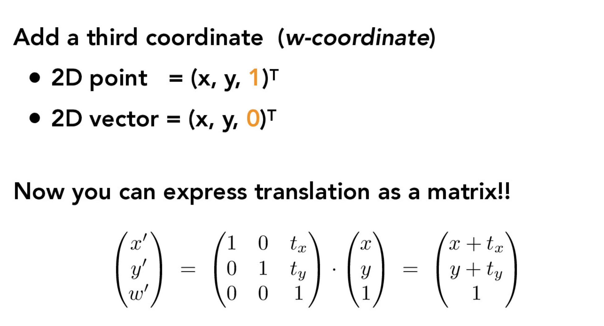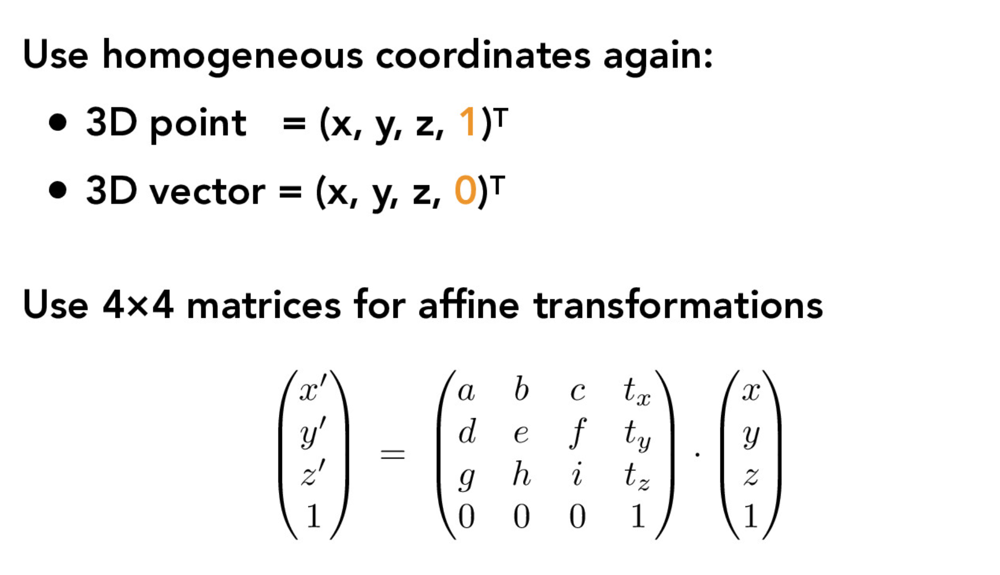

## Coordinate Transformation
> [!important]
> Suppose we have a point in 2D space, which can be represented by two different coordinates. One basis is $\vec{o},\vec{x},\vec{y}$ and another is $\vec{e},\vec{u},\vec{v}$. Here $\vec{o}$ and $\vec{e}$ are the origin of the coordinate respectively.
> 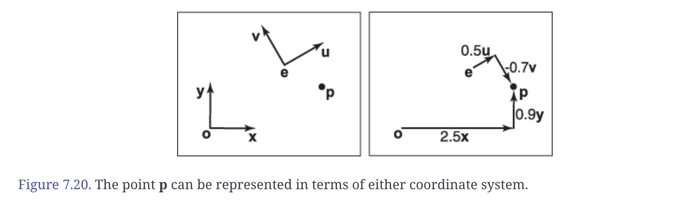
> To express the same point $\vec{p}$, we have two formulations:
> 1. $\vec{p}=\vec{o}+x_p\vec{x}+y_p\vec{y}$
> 2. $\vec{p}=\vec{e}+u_p\vec{u}+v_p\vec{v}$
> 
> Frame to canonical(uvw -> xyz): $$$$
> Canonical to Frame(xyz -> uvw):

## Two Interpretations of a Transform
> [!important]
> 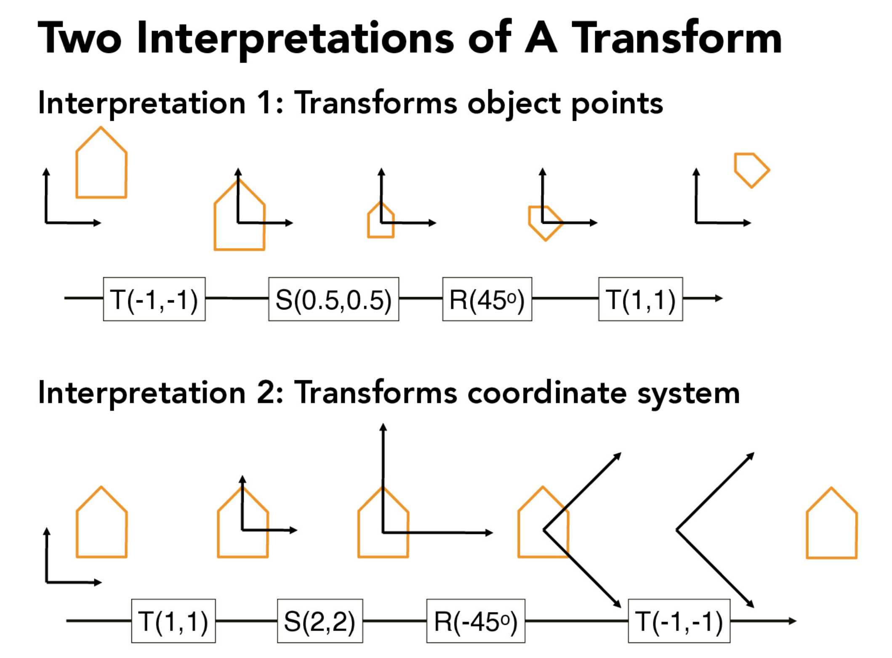

# 2D Transformations
## Reflection
> [!def]
> Suppose our reflection axis has polar angle $\theta$, then the reflection matrix is $\begin{bmatrix} cos(2\theta)&sin(2\theta)\\sin(2\theta)&-cos(2\theta) \end{bmatrix}$
> 
> Derivations:
> Suppose the point to be reflected has polar expression $(rcos(\beta),rsin(\beta))$, then after reflecting, we should get $(rcos(2\theta-\beta),rsin(2\theta-\beta))$.
> 
> Using trignometric function we could have: $cos(2\theta-\beta)=cos(2\theta)cos(\beta)+sin(2\theta)sin(\beta)$ and $sin(2\theta-\beta)=sin(2\theta)cos(\beta)-cos(2\theta)sin(\beta)$.
> 
> Writing it as the matrix form we get: $$\begin{bmatrix} cos(2\theta)& sin(2\theta)\\sin(2\theta)&-cos(2\theta) \end{bmatrix}$$
> 
> 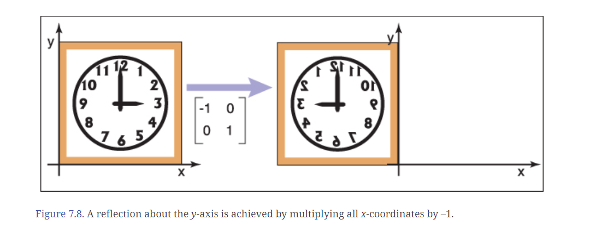 
> In this example $\theta=\frac{\pi}{2}$.

## Rotation
> [!def]
> Suppose we rotate $\theta$ **counterclockwise**, we should have the rotation matrix defined as follows:
> $$\begin{bmatrix} cos(\theta)& -sin(\theta)\\sin(\theta)&cos(\theta) \end{bmatrix}$$
> 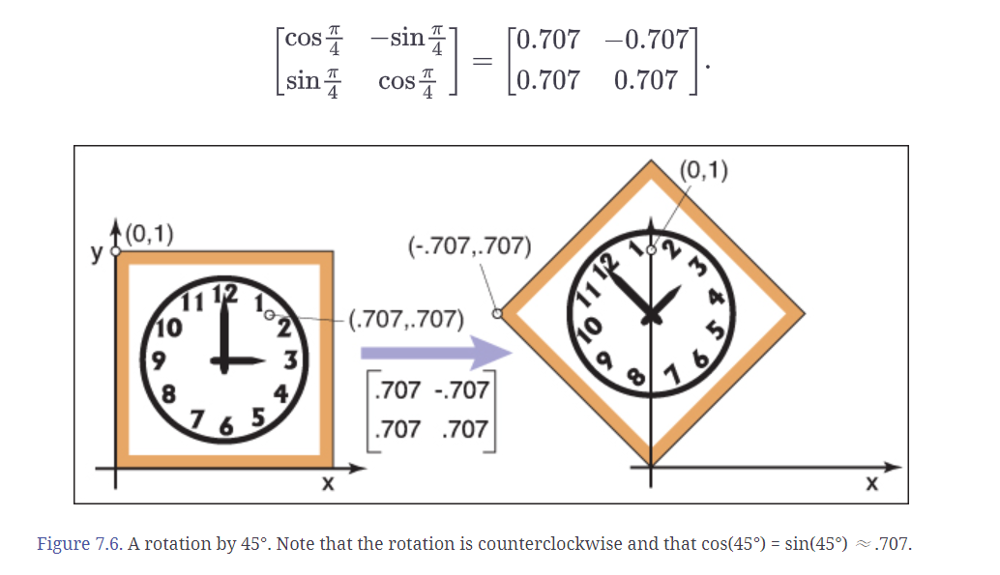

## Scaling
> [!def]
> 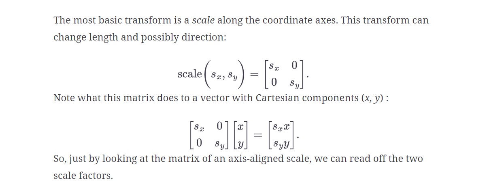

## Shearing
> [!def]
> Suppose we want to apply a shear along x-axis by a factor of t(y-axis is unchanged), we have the following shearing matrix:
> $$\begin{bmatrix} 1&t\\0&1\end{bmatrix}$$
> 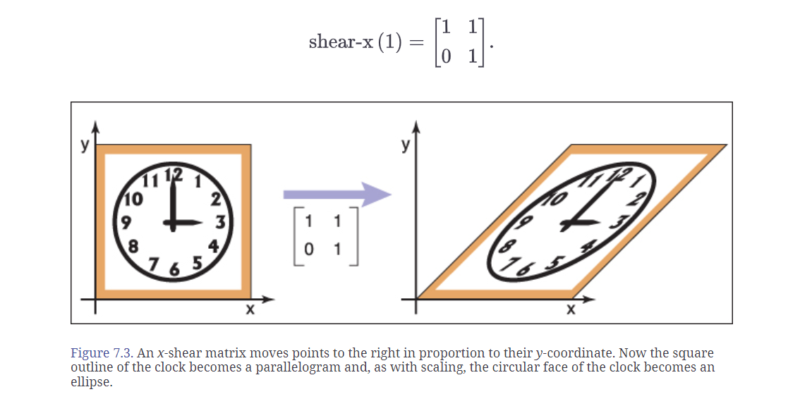
> Suppose we want to apply a shear along y-axis by a factor of t(x-axis is unchanged), we have the following shearing matrix:
> $$\begin{bmatrix} 1&0\\t&1\end{bmatrix}$$
> 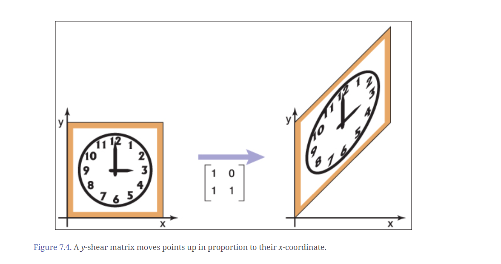

## Translation
> [!def]
> Using homogeneous coordinate, if we translate a 2D object by ($t_{x},t_{y}$ in $x$ and $y$ axis respectively), we could get the translation matrix:
> $$\begin{bmatrix} 1&0&t_{x}\\0&1&t_{y}\\0&0&1\end{bmatrix}$$ where the 2D object is represented by $\begin{bmatrix} x\\y\\1\end{bmatrix}$.

## Coordinate Transformations
> [!important]
> 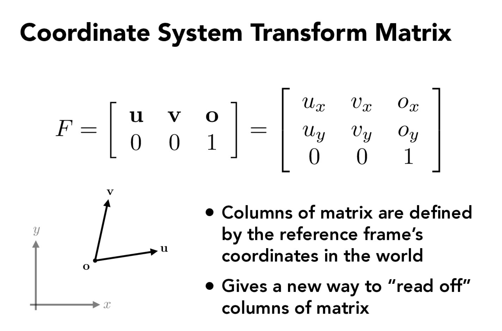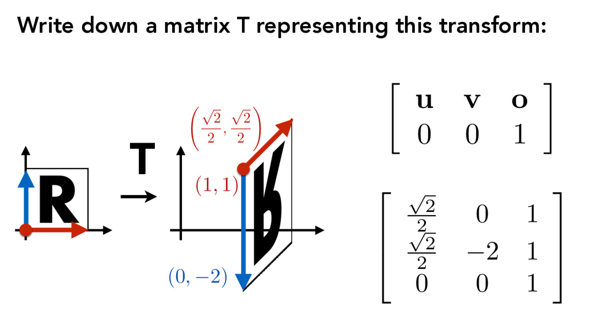

## Decomposition
> [!example] CS184 Disc02 P2
> 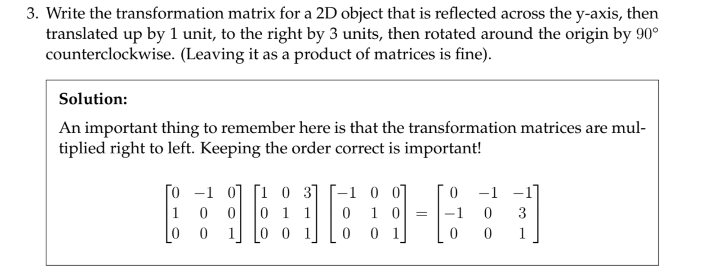
> Here since there is a translation transformation, so we use homogeneous coordinate.
> - For reflection, the axis angle is $\theta=\frac{\pi}{2}$
> - For rotation, the angle is $\theta=\frac{\pi}{2}$

# Creating a 3D Basis
> [!def]
> Given an arbitrary vector $\vec{w}$, we can create a right-handed coordinate system with the following steps:
> 1. Normalize $\vec{w}$ and get $\vec{w}=\frac{\vec{w}}{\|\vec{w}\|}$
> 2. Choose a vector that's orthogonal to $\vec{w}$, call it $\vec{t}$. Then compute the cross product of $\vec{w}$ and $\vec{t}$, denote by $\vec{u}=\vec{w}\times \vec{t}$. Then normalize it.
> 3. The target right-handed coordinate system is formed by ($\vec{w},\vec{t},\vec{u}$), which are orthonormal.

# 3D Transformations
## 3D Rotations
### Around X-Y-Z
> [!def]
> 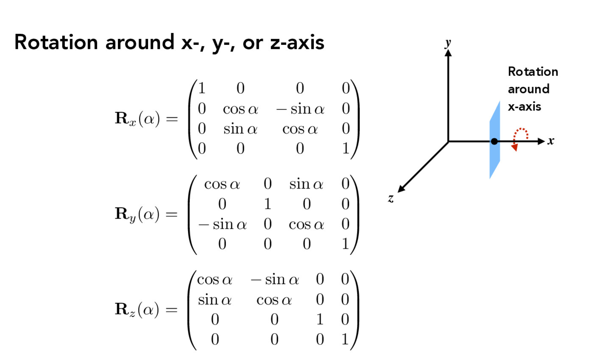
> In the right-handed system, counter-clockwise follows the direction of x-y-z, so if we rotate w.r.t y-axis, we are following z-x-y, which is the left-handed system, so the rotation angle should be the opposite.  

### Around Arbitrary Axis
> [!important]
> 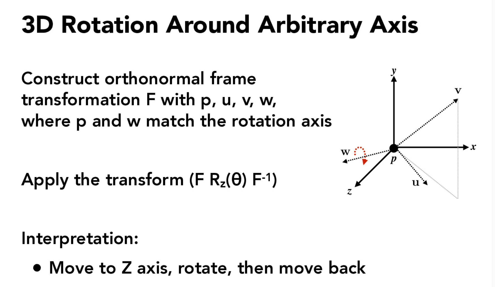

> [!proof]
> 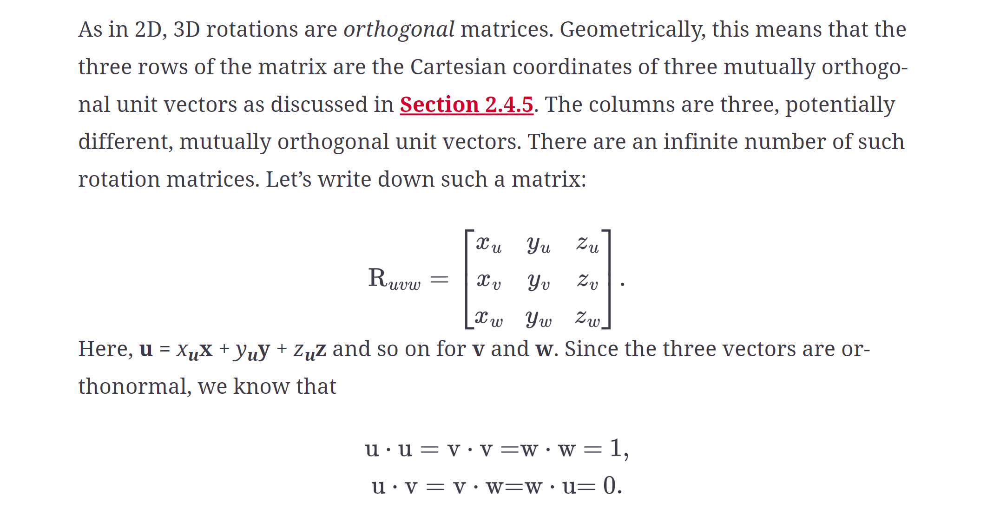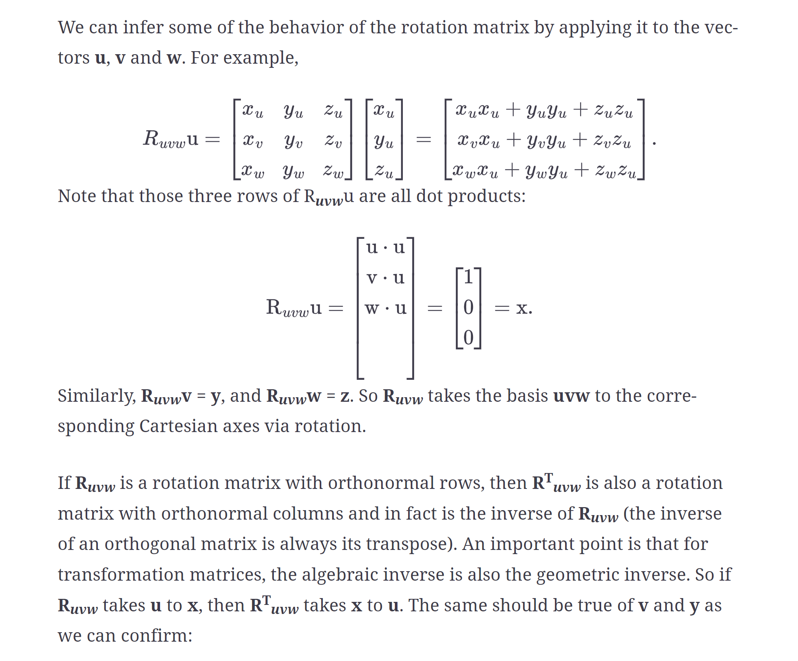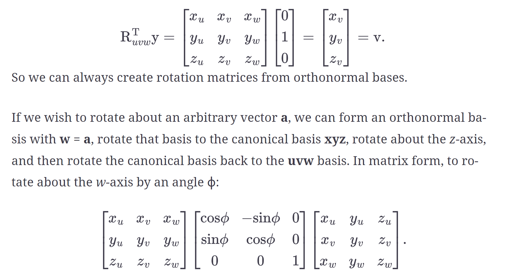

### Rodrigue's Rotation Formula
> [!def]
> 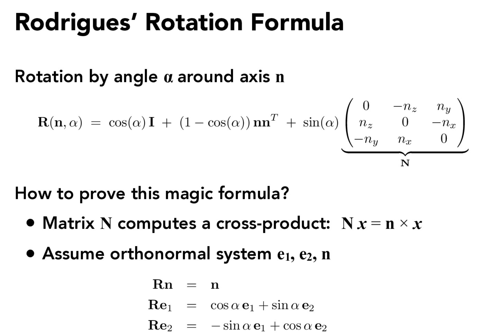

    

## 3D Shearing
> [!def]

## 3D Scale
> [!def]
> 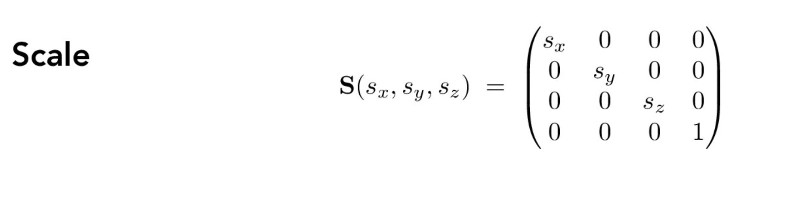

## 3D Translation
> [!def]
> 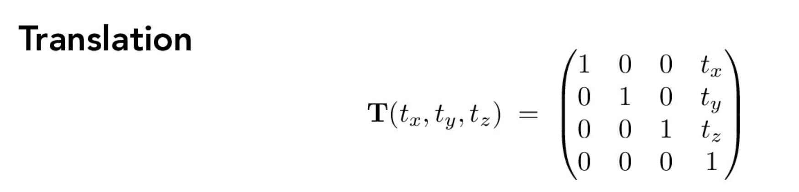

## Coordinate Transformation
> [!def]
> 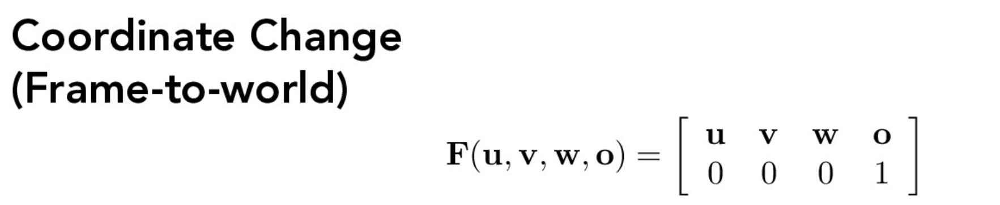

# Hierarchical Transform

# Viewing Transformation
## Camera Transformation
> [!def]
> 

## Viewing Transformation

## Projective Transformation

## Projective Projection
