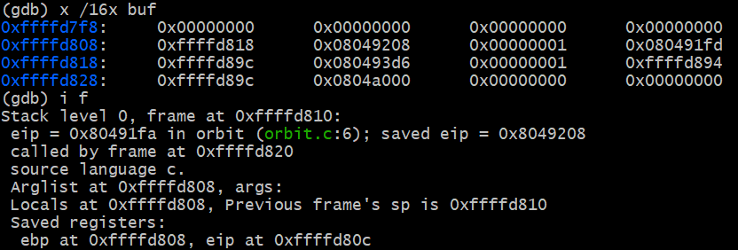
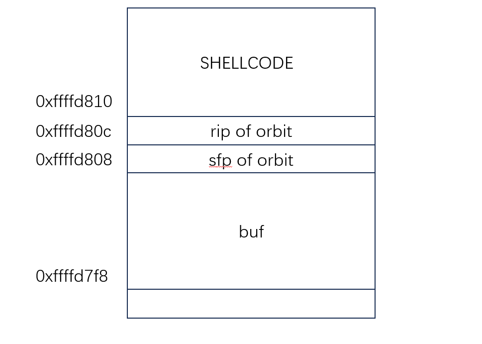
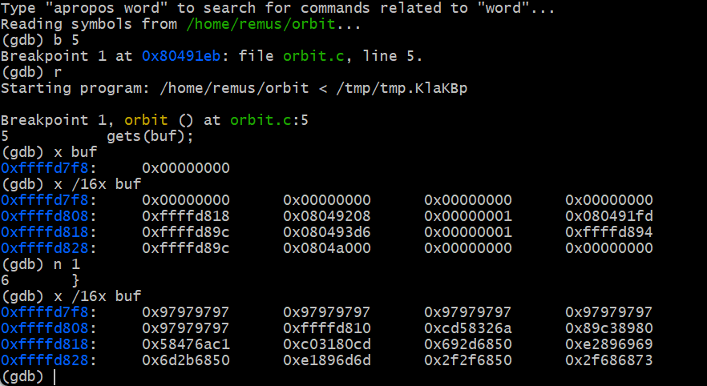
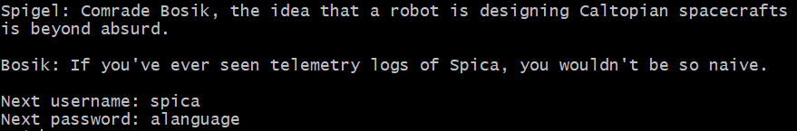
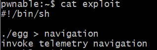
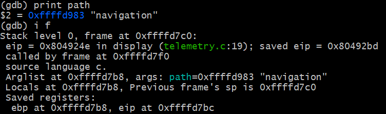
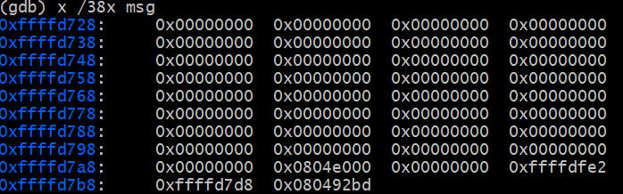
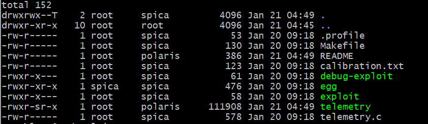

# Attack Workflow
> [!important]
> The output of `egg` is forwarded to the input file, so `print` statements in `egg` will be written to the file.


# Q1 Buffer Overflow Attack
> [!note]
> username: `remus`
> password: `ilearned`


## Vulnerable Code
> [!code]
```c
#include <stdio.h>

void orbit(void) {
    char buf[8];
    gets(buf);  // Vulnerable
}

int main(void) {
    orbit();
    return 0;
}

```


## Main Idea
> [!note]
> The code is vulnerable because `gets(buf)` does not check the length of the input from the user, which lets an attacker write past the end of the buffer. So we could use buffer overflow attack scheme. 
> 
> Since the shellcode is long(more than 16 bytes), and the buffer is defaulted to be 16 bytes, so we can just put the shellcode starting from the address of the buffer. Instead, we put the shellcode at the stack frame of `orbit()`'s caller and overwrite the `RIP` of `orbit()` with the address of the `SHELLCODE`. 


## Magic Numbers
> [!note]
> First, we print out nothing from the `egg` file(no input to `orbit` program). We get the following:
> 
> By doing this, we know:
> - The location of the `sfp`(at address `0xffffd808`)and `rip`(which is at address `0xffffd80c`, which we want to overwrite)
> - The starting address of the `buf`, which is at address `0xffffd7f8`, 16 bytes below the `sfp`.


## Exploit Structure
> [!note]
> Here is the stack diagram:
> 
> The explit has three parts:
> 1. Writing 20 bytes of padding characters to overwrite the `buf` and `sfp`.
> 2. Overwrite the `rip` with the starting address of the `SHELLCODE`, which is `0xffffd80c+0x04=0xffffd810`
> 3. Finally, insert the shellcode directly after the `rip`.
> 
> This cause the `orbit` function to start executing the `SHELLCODE` at address `0xffffd810` when it returns.


## Exploit GDB Output
> [!note]
> When we ran GDB after inputting the malicious exploit string, we got the following output:
> 
> After 20 bytes of garbage (`\x97`), the rip is overwritten with `0xffffd810`, which points to the shellcode directly after the rip.


# Q2 Buffer Overflow Attack
> [!overview]
> 


## Vulnerable Code
> [!code]
> `telemetry` is the vulnerable C program in this question. It takes a file and prints out its contents, but it expects the file to be specially formatted: The first byte of the file specifies its length, followed by the actual file.
> 
> The program also implements a check to make sure the buffer isn’t too large.
> 
```c
#include <stdint.h>
#include <stdio.h>
#include <string.h>

void display(const char *path) {
    char msg[128]; // Vulnerable buffer
    int8_t size;
    FILE *file;
    size_t bytes_read;

    memset(msg, 0, 128);

    file = fopen(path, "r");
    if (!file) {
        perror("fopen");
        return;
    }
	// Read a number from the file at `path`
    bytes_read = fread(&size, 1, 1, file);
    if (bytes_read == 0 || size > 128) {
        return;
	}

    // Read `number` number of bytes from the file at `path`
    bytes_read = fread(msg, 1, size, file);

	// Print the string to the standard output. Append a `\n` at the end.
    puts(msg);
}


int main(int argc, char **argv)
{
    if (argc != 2) {
        return 1;
    }

    display(argv[1]);
    return 0;
}

```


## Main Idea
> [!note]
> First, we print out nothing from the `egg` file(no input to `orbit` program). We get the following:
> 
> By doing this, we know:
> - The location of the `sfp`(at address `0xffffd7b8`)and `rip`(which is at address `0xffffd7bc`, which we want to overwrite)
> - The starting address of the `msg`, which is at address `0xffffd728`, 144 bytes below the `sfp`.
> - The file that the program read the data from is called `navigation`，but we don't have it, so we have to create this.
> 


## Magic Numbers


## Exploit Structure


## Exploit GDB Output


# Q3 
## Vulnerable Code


## Main Idea

## Magic Numbers


## Exploit Structure


## Exploit GDB Output


# Q4 Off-by-one Attack

## Vulnerable Code


## Main Idea

## Magic Numbers


## Exploit Structure


## Exploit GDB Output


# Q5
## Vulnerable Code


## Main Idea

## Magic Numbers


## Exploit Structure


## Exploit GDB Output


# Q6
## Vulnerable Code


## Main Idea

## Magic Numbers


## Exploit Structure


## Exploit GDB Output

# Q7
## Vulnerable Code


## Main Idea

## Magic Numbers


## Exploit Structure


## Exploit GDB Output