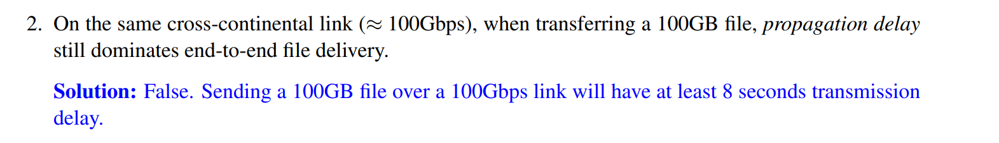
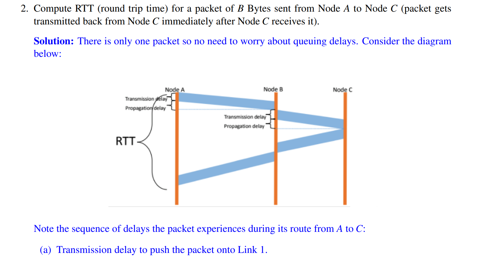
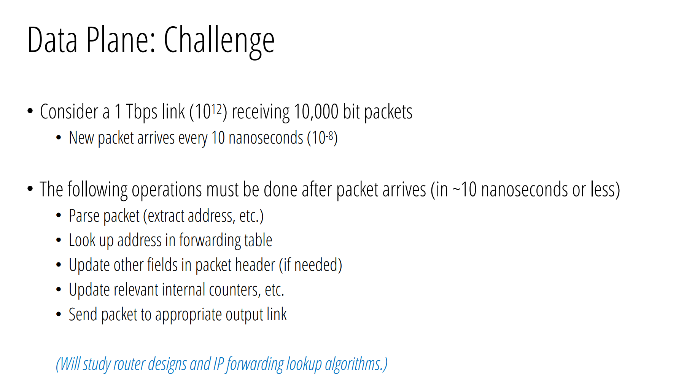

# Overview
## Goal of the Internet
> [!overview]
> 
> The main job of the Internet is to transfer data between end hosts. This is more difficult than it seems because there are many considerations:
> - What path do we take between hosts and switches?
> - Do the available paths have adequate bandwidth?
> - What protocols do we use? Can it handle every possible communication case?

## Internet Components
> [!concept]
> At a very high level, the Internet is composed of **three main types of components**:
> 1. **End hosts**, like phones, computers, and IoT devices, send and receive packets as a first or last destination.
> 2. **Switches**, which are often routers, manage the connections between end hosts and forward packets arriving on one link to another link.
> 3. **Links** connect switches and end hosts together. These could be one of many technologies like fiber cables, WiFi, or phone lines.

# Data Organization
## Packets
> [!def]
> 

## Links
> [!def]
> 
> - `Bandwidth`相当于是我的`Packet`传输到网线上所需要的时间。我进门花的时间。
> - `Propagation Delay`相当于我在网线上传输的时间。我在房间里走到目的地花的时间。
> - `BDP`就是长乘宽，相当于容积。

# Packets on Transmission
## Packets on a Link
### TimeLine View
> [!concept]
> **Terminologies:**
> - **Transmission Delay:** Time for a packet to get on/off the wire.
> - **Propagation Delay:** Time for a packet to be transmitted across the link.
> - **Queuing Delay:** Time for a packet to wait until it can be transmitted off the wire by a router. Queuing delay itself doesn't contain the transmission delay.
> - **Packet Delay:** Sum of the above.
> 
> 
> 这个公式可以理解为我上传的时间加上传输的时间，就是我的`Packet Delay`.
> 
> 
> 计算方法如下:
> - 10B packet:
> 	- Link 1: $\frac{8\times 10}{10\times 10^{6}}s+10ms=8\times10^{-6}s+10ms=8\times10^{-3}ms+10ms\approx10ms$
> 	- Link 2:$\frac{8\times 10}{1\times 10^{6}}s+10ms=8\times10^{-5}s+1ms\approx1ms$
> - 10000B packet:
> 	- Link 1:$\frac{8\times 10^4}{10\times 10^{6}}s+10ms=8\times10^{-3}s+10ms=8ms+10ms=18ms$
> 	- Link 2: $\frac{8\times 10^4}{1\times 10^{6}}s+10ms=8\times10^{-2}s+1ms=80ms+1ms=81ms$

### Pipe View
> [!concept]
> 
> Here the first parameter is **bandwidth(bps)**, the second one is **propagation delay(ms)**.
> 
> 
> In this representation, the bandwidth is just the width of the link and that the propagation delay is just the length of the link.

### Queuing
> [!def]
> 

### Concept Check
> [!example] CS168 Sp24 Disc02 P1
> 

## Packets between Switches/Routers
> [!concept]
> 
> Packet header is useful for those switches to decide how to forward the packets to the desired switches.

## Exercise
> [!example] CS168 Sp24 Disc02 P2
> 

# Challenges
## Addressing and Naming
> [!concept] Important
> 

## Computing Forwarding Table
> [!def]
> 
> `Control Plane`就是全局的路径规划算法。
> `Data Plane`就是针对一个`Switch`来说的，下一步去哪里。

### Control Plane Challenges
> [!important]
> 

### Data Plane Challenges
> [!important]
> 

## Reliable Packet Delivery
> [!important]
> 

## Congestion Control
> [!important]
> 

# Statistical Multiplexing
## Peak of Demand
> [!def]
> 
> Peak of aggregate demand means many internet users are trying to access the same resource at the same time and **we assume that the probability of this event is extremely low.** This assumption is the reason why statistical multiplexing works in real life.
> - Here **peak of the aggregate** is obtained by first stacking the function (i.e. $f(x)+g(x)$ pointwise) and find the pointwise maximum to be the value. Like $\max_{x}(f(x)+g(x))$
> - Aggregate of the peak is obtained by first finding the pointwise maximum of each function, then add these maximum. The argmax of different functions could difinitely be very different. Like $\max_{x}f(x)+\max_{x}g(x)$
> 
> This inequality is very much like the Jesen's Inequality.
> 
> 

## Smooth vs Bursty Applications
> [!def]
> 

## Exercise
> [!example] CS168 Sp24 Disc02 P3
> 

# Resource Sharing
## Overview
> [!overview]
> The key question we should ask for statistical multiplexing is that **at what granularity are we multiplexing things.**
> 
> At the granularity of the users of laptops, there is no multiplexing. But at the granularity of the processes and threads inside an OS, there is multiplexing where processes and threads are sharing the CPU and memory resources of the computer.
> 

> [!important]
> 

## Circuit Switching
> [!def]
> 
> This is like establishing a stable highway(i,e, in terms of transmission speed, determined by the bandwidth  ) between the source and destination before sending any packets of data.
> 
> Note that the bandwidth is guaranteed to be stable once fixed.
> 

## Packet Switching
> [!def]
> 

## Efficiency
### Multiplexing Granularity
> [!concept] Circuit Switching
> 
> In example 2, only two of three sources will be able to reserve the bandwidth. But any two flows won't use the allocated bandwidth across the entire event(that's why they are bursty), which causes waste in bandwidth reservation.

> [!concept] Packet Switching
> 
> Since bandwidth are allocated are packet level instead of flow level, we make more efficient use of bandwidth and get rid of unnecesary reservation of the bandwidth.

### Setup Time
> [!def]
> 

## Handling Failures
> [!concept] Circuit Switching
> For circuit switching, when there is network failure, the end host **has to know** whether there is a network failure and then re-setup the reservation and resend the packet flow.
> 

> [!concept] Packet Switching
> For packet switching, when the network failure happens, the end host has to do nothing. They **don't have to know** that there is a network failure event.
> 

## Complexity of Implementation
> [!concept] Circuit Switching
> 
> When we request a reservation from the source to the destination. The general procedure is to find a path from source to destination on which every engaging routers send a "yes" signal to indicate that it is on the reservation path.
> 
> Now in terms of such design, we have to consider the following questions:
> 1. **How do switches know that the reservation went through?**
> If the reservation went through to the destination, then the destination host should send a confirmation message that travels back along the established reservation path to the source and let the routers and source know.
> 2. **What happens if the reservation request is lost mid way?**
> Before a router confirm itself on the reservation path, then it should set up a timer. Before its timeout, it should receive a confirmation message from the successive routers. If yes, then the router know the reservation is established thereafter. If not, then the router knows that the reservation is not successfully established.
> 3. **What happens if the confirmation that the reservation made is lost?**
> One way is the same as above. Another reasonable way is repeatedly send confirmation message from the destination along the reservation path back to the source, in the hope that at least one message will reach the source.

## Summary
> [!summary]
> 

