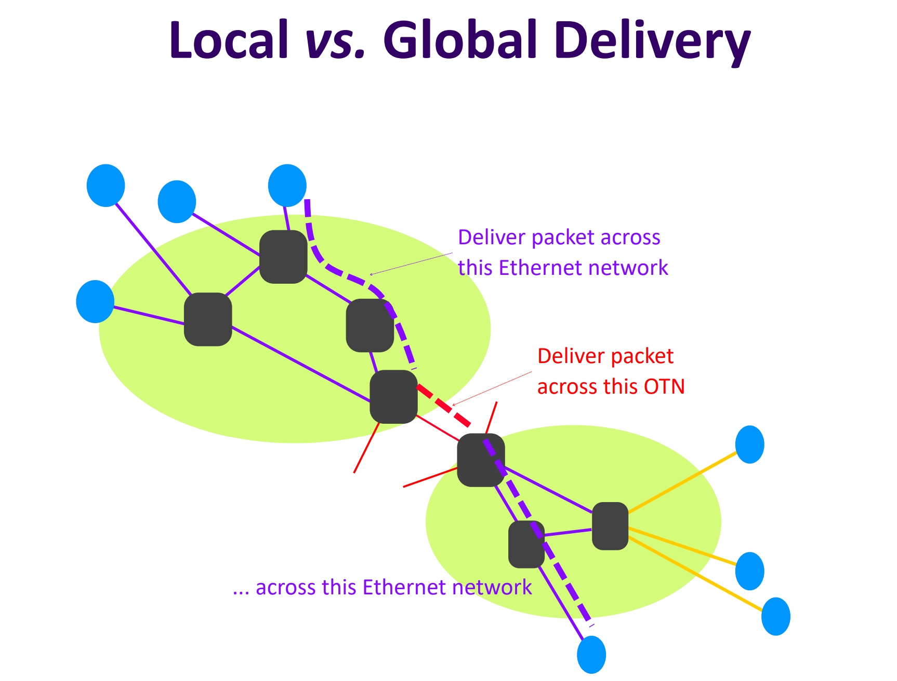

# Internet Layers
> [!def]
> 
> Currently, five internet layers exist:
> - Application (L7), where code interfaces with the internet as an abstraction,
> - Transport (L4), which can guarantee either reliable or unreliable data delivery,
> - Network (L3), which delivers best-effort global packet delivery,
> - Datalink (L2), which delivers best-effort local packet delivery,
> - Physical (L1), which physically moves bits between locations.
> 
> HIstorically, L5 (Session layer) and L6 (Presentation layer) existed, but have since been combined with L7 and L4.

# Local and Global Delivery
> [!def]
> 
> There are many different types of links (ethernet, fiber, wifi…) that connect switches together. However, each type of link only knows how to manage its own network; ethernet packets can’t get transferred into wifi on their own.
> 
> This is the main difference between local (single network) and global (multi network) delivery, which is managed between L2 and L3.

# Protocols Design
## Layered Protocols
> [!def]
> Communication throughout the internet is standardized into **protocols**, which are agreements between parties on how to communicate.
> 
> Protocols include both the syntax (how the data is formatted) and the semantics (how the data corresponds to states). They exist at many levels:
> 
> Note that at each level, only the same protocol could communicate with each other. For example, IPv4 can only talk to IPv4, IPv6 to IPv6.
> 
> The primary benefit of having so many layers is abstraction- each layer only needs to deal with its specific assignment, and assume that all lower layers carry out their assignments.

## Important Properties
> [!property]
> 
> The main benefit of this design is that each of these layers can be maintained and improved in parallel by different developers' communities.
> This will lead to innovation at most levels:
> - Applications (lots)
> - Transport(some)
> - Network(few)
> - Physical(lots)

## Implementation
> [!important]
> 

# End Host Design
## Addressing within End Host
> [!def]
> 

## Sockets
> [!def]
> A **socket** is an OS mechanism that creates and manages logical ports. When an app wants access to the network, a socket is opened and associated with a **port number**. All incoming packets to that port number are then sent to the socket it’s associated with.
> 
> Sockets are an abstraction layer that allow processes in the OS to communicate over the network.
> - Includes `connect`, `listen`, `accept`, `send`, `recv` API calls
> - Clients initiate new connections to servers; servers listen, accept, and dispatch connections to many clients at once
> - Connections pipe data bidirectionally between a process on a client and a process on a host
> - Sockets are uniquely identified by IP:port combination; client port is usually randomly assigned, whereas server port is fixed and already known by the client.
> 
> Logical ports are a part of the socket abstraction. Port numbers are included in the L3 packet header.

## Ports
> [!def]
> Switches and routers have **physical ports** where links connect to switches. The OS supports **logical ports** where applications connect to the operating system’s network stack.
> 

## Packet Header
> [!def]
> 

## Network Stack
> [!def]
> 

# Network Design
## Protocol Diagrams
> [!def] Simplified Version
> 

> [!def] Complicated Version
> 
> **What if there is no IP layer? Then what would happen if we still want to send data from host to host?**
> 
> Then Ethernet interface has to know how to directly communicate with OTN interface, without the help of IP layer. As a result, the ethernet interface would have to know all possible output interfaces' API at this layer. For example, it has to know all the interfaces of OTN, 802.11 in order to communicate through local networks with different data link protocols or **convert betweeen different link technologies.**
> 
> In short, every local network have to know how to convert between different link technologies. Like between Ethernet and OTN, between OTN and 802.11, between Ethernet and 802.11.
> 
> Note that if the middle link is Ethernet, then we don't need IP's helper. Since Ethernet can communicate with Ethernet interface directly. This is useful in a single local network case.

## Layer Encapsulation
> [!def]
> 

## Switches and Routers
> [!def]
> 

# End-to-End Principles
> [!overview]
> 

## Correctness
> [!important]
> 

## Impact of Network Failures
> [!important]
> 

## Performance Analysis
> [!concept]
> 
> Here the E2E fails when at least one link drops the packets, and probabilistically it is $1-(1-0.1)^{10}=0.65=65\%$

