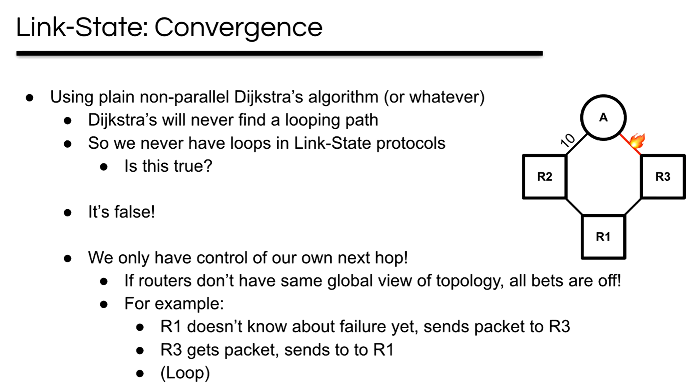

# Routers
## Why Routers?
> [!important]
> Without routers, when we add new customers to the network, we will have to connect it to all the other customers. As the following picture shows, every time we add a new customer to the network, we have to add $n$ links to the rest of them.
> 
> We want to have alternative when there is network failures. As the following pictures show, when one connection fails, it should not interfere with the connection between other clients and should be able to qucikly find an alternative path for the current connection.
> 
> 

## Challenges of Routing
> [!def]
> 

## Challenges of Forwarding
> [!def]
> 

## Routing and Forwarding
> [!important]
> 

# Validity of Routing State
## Delivery Tree
> [!def]
> To model a packet delivery event, we use some concepts from graph topology.
> For destination-based routing, we define its `delivery tree` to have the following properties:
> 1. The set of all paths create `directed delivery tree`. The paths must together **cover every node** since we want to be able to reach the destination from any node.
> 2. Each node has only **one outgoing** arrow. 
> 3. Once paths **meet**, they **never split**.
> 4. It is a **spanning tree** since the paths cover all the nodes. We call it an oriented spanning tree rooted at the destination.
> 5. There is **no cycles** in it since it is a tree.
> 
> 

## Routing State Validity
> [!def]
> - **Local routing state** is table in a single router.
> 	- By itself, the state in a single router can’t be evaluated for validity.
> 	- It must be evaluated in terms of the global context.
> - **Global state** is collection of tables in all routers.
> 	- Global state determines which paths packets take.
> 	- It’s **valid** if it produces forwarding decisions that **always** deliver packets to their destinations
> - Global routing state is valid **if and only if**:
> 	- For **each destination**, there are **no dead ends and no loops** 
> 	- A **dead end** is when there is no outgoing link (next-hop)
> 		- A packet arrives, but is not forwarded (e.g., because there’s no table entry for destination)
> 		- The destination doesn’t forward, but doesn’t count as a dead end!
> 		- But other hosts generally are dead ends, since hosts don’t generally forward packets
> 	- A **loop** is when a packet cycles around the same set of nodes
> 		- If forwarding is deterministic and only depends on destination field, this will go on indefinitely
> - **Necessity:** If there is dead ends or loops, then the forwarding decision will not always deliver packets to their destination, which makes perfect sense.
> - **Sufficiency:** If there is no dead ends and no loops, the forwarding decision will always deliver packets to their destination.
> 	- Packet can't hit the same node twice(no loops).
> 	- Packet can't stop before hitting destination(no dead ends).
> 	- So packets must keep wandering the networj, hitting different nodes
> 		- Only a finite number of unique nodes to visit.
> 		- Must eventually hit the destination.

## Verifying Routing State Validity
> [!def]
> 

> [!example] Valid Example
> 

> [!example] Invalid Example
> 

# Interdomain and Intradomain Routing
## Intra-Domain Routing
> [!def]
> 

## Inter-Domain Routing
> [!def]
> 

## Big Picture
> [!important]

# Least-Cost Routing
## Goal
> [!important]
> 

> [!example]
> 

## Cost Design
> [!def]
> 

## Simple Route Types
### Trivial Routes
> [!def]
> 

### Connected/Direct Routes
> [!def]
> 

### Static Routes
> [!def]
> 
> **Why would we use this?**
> - We want to overwrite some paths. 
> - Want the packets to pass a particular routers.
> 
> 

# Routing Algorithm Classification
>[!def]
>

# Distance-Vector Routing Protocols
## Algorithm: Bellman Ford
> [!algo]
> 
> 1. **Periodic Updates**: Routers configured to use distance vector routing protocols (such as RIP - Routing Information Protocol) periodically broadcast their entire routing table. This interval is often fixed; for example, RIP typically sends updates every 30 seconds.
> 2. **Triggered Updates**: When there is a significant change in the routing table, such as a change in a route's metric or the addition or removal of a route, the router will send out an update immediately to its neighbors. This is known as a triggered update. Triggered updates help the network converge more quickly by promptly disseminating changes in network topology.
> 3. **Initial Startup**: When a router first starts up or comes online, it may broadcast its routing table to inform its neighbors of its presence and to learn about the network topology from responses it receives.

> [!example]
> 

## State Information Diffusion
> [!important]
> 

## Link Cost Changes
> [!def]
> 

## Problem 1: Counting to Infinity
> [!def]
> 
> One solution is to pick a maximum value (e.g. 16) and stop there.

### Solution 1: Split Horizon
> [!def]
> The concept of "split horizon" is a routing strategy used in computer networks to prevent routing loops and ensure efficient network traffic management.
> 
>

### Solution 2: Poison Reverse
> [!def]
> **Poison reverse**: if a router advertises a loop, set that value to ∞ so the next advertisement is immediately accepted(which won't cause a new round of broadcasting). It is an optimization to split horizon.
> 

## Problem 2: Link Failures
### Solution 1: TTL
> [!def]
> If some link fails, we have to wait for some time(TTL) until then we should eliminate the link from the DV table.
> 
> More example see [Distance_Vector_Algo](Distance_Vector_Algo.pdf)
> 
> TTL for some DV table entry is initialized to some constant which is predetermined by the router operator. 
> 
> Every time a entry gets recharged, the TTL is reinitialized.

### Solution 2: Poison
> [!def]
> Instead of clearing out the table entry when that entry's TTL expires, we could change the entry's cost to destination to $\infty$ and broadcast it.
> 

## Summary
> [!summary]
> **The basic table update algorithm for D-V is as follows:**
> - Neighbors advertise a route with a particular distance/cost to a particular destination
> 	- _do not_ advertise to neighbor whos entry is in the nextHop table (avoid split horizon problem)
> - Router adds 1 to advertised distance and saves it in the nextHop table, along with the address of the neighbor that advertised it
> - If a neighbor gives a lower number than the current nextHop, it replaces the previous entry
> 	- Exception: any cost given by current best neighbor will overwrite the entry, even if it’s larger
> 	- Exception to exception: stop counting at some maximum value to avoid counting to infinity when a loop exists
> - Direct routes need to be manually populated to initialize cost

## Exercises
### DV Algorithm
> [!example] CS168 Sp24 Disc03 P1
> 

### Split Horizon and Poisoned Reverse
> [!example] CS168 Sp24 Disc03 P2
> 

### Counting to Infinity
> [!example] CS168 Sp24 Disc03 P3
> 

# Link-State Protocols
## Overview
> [!overview]
> 

## Step 1~2: Learn the Global Topology
> [!algo]
> 

> [!bug] Loop Problems: Flooding
> 

## Step 3: Find Paths
> [!algo]
> 

## Step 4: Populate Tables
> [!algo]
> 

## Convergence
> [!def]
> 
> In other words, after convergence, we can run Dijkistra's algorithm to find the optimal route for each router.

## Timeline for Local Failure
> [!def]
> 

## Why LS Protocols?
> [!important]
> 

## Example 1: Link Failure
> [!example] CS168 Sp24 Disc04 P1
> 

> [!solution] Explanations
> 1. After convergence, we can run a dijkistra's algorithm to find the SSSP from D, which is D -> G -> H -> F -> H1
> 2. The link GH goes down, and G, H have updated but not sent to other routers. In this case, for D, since it doesn't receive the updates, so its local table contains (nextHop: G, distToH1: 7) and thinks that it will go through the same path as in 1. 
> 3. But since G has updated, so the actual path is D -> (G -> E -> F -> H1).
> 4. After another convergence, we run Dijkistra again and know that B will take B -> A -> I -> H2
> 5. Link AI increases to 100, so A's nexthop changes from I to C and I's table is unchanged. So for A, it will hop to C. Since A assume that C shares the same global topology with A, so A will think that C will also choose the optimal shortest path, which is C -> D -> B -> I -> H2.
> 6. Since C has not update yet and its nexthop was A, so the packet will go to C and then back to A, which is a loop.
> 7. In order for successful packet transmission, D has to be correct since it is connected to the SCC on the right(E, G, F, H, H1). If D is correct, then its nexthop should be B(D->B->I->H2), so B must be correct. For router A, in order for successful transmission, C should be correct since A's nexthop is C. So B,C,D should all be updated.
> 8. Since all routers will pass through B if they want to send packets to H2, so B must be correct. But now B is not updated, so no routers(except I, since it doesn't pass B) will successfully send packets.

## Example 2: Delay&Convergence
> [!example] CS168 Sp24 Disc04 P1
> 

> [!solution] Explanations
> For the third question, since we can see that the degrees of the nodes are all bigger than 1, so if we remove any nodes(except S and T)

# Spanning Tree Protocol 
## Learning Switches
> [!def]
> 
> - Unlike Distance-Vector and Link-State protocols, which have static local table states, tables are filled in opportunistically using data packets.
> 	- This means that instead of dropping packets to unknown destinations, send the packet to all possible destinations (i.e. flood it).
> 	- Also flood when the recorded nextHop is the same as the message’s sender (avoid loops).
> - Static routes also need to be learned, so on the initial send typically all of the routers will need to be pinged.
> - Eventually, one of the packets will reach the destination, and information can then be sent backwards so that all routers in the path can learn about the host.
> - **Doesn’t work when network has loops**
> 
> See [Distance_Vector_Algo](Distance_Vector_Algo.pdf)
> 

> [!example]
> 

## From Learning Switches to Spanning Tree 
> [!algo]
> In order to address the issue that learning switches don’t work when the network has cycles, we can use the **spanning tree protocol:** the main idea being that we disable routes until we create a spanning tree of the entire network.
> 
> STP is only used in local (layer 2) networks, where bandwidth is generally not a concern and the number of nodes is relatively small, allowing for packet flooding.
> 
> Since flooding can find hosts, no static routes are needed anymore.
> 
> **Step 1: find least cost paths from every switch to the root**
> 
> Introduction:
> - This is basically the Distance-Vector protocol with a single table entry where that entry is the destination, or the switch at the root of the tree.
> - Every switch has a unique orderable ID.
> - Our goal is to first find the root (lowest ID), then find the best path to the root (lowest cost). Algorithm:
> - All switches begin by thinking they are the root.
> 	- On receiving a route message from a neighbor:
> 	- If the the advertised root is smaller, use it instead.
> 	- If it’s larger, ignore it.
> 	- If it is the same as stored, use normal D-V update rules to minimize the distance, breaking ties by preferring the next hop with the smallest ID.
> - Only the root and switches that think they are the root will generate periodic advertisements. All other switches will forward advertisements when received.
> 
> **Step 2: disable data delivery on every link not on a shortest path to root**
> - Each switch:
> 	- Enables the link along the best path to root
> 	- Enable all links to hosts (anything that is not a switch, i.e. have not sent any advertisements)
> 	- Disables every other link
>  
> **Step 3:** when a link on the tree fails, start over
> - If a route expires, routers think they are the root again

