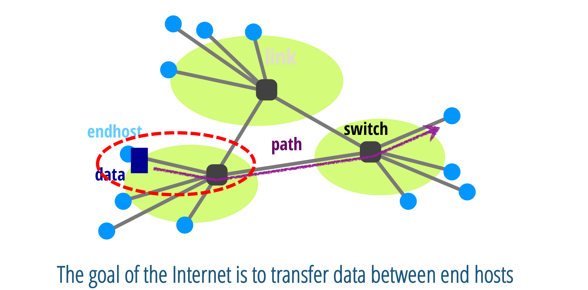
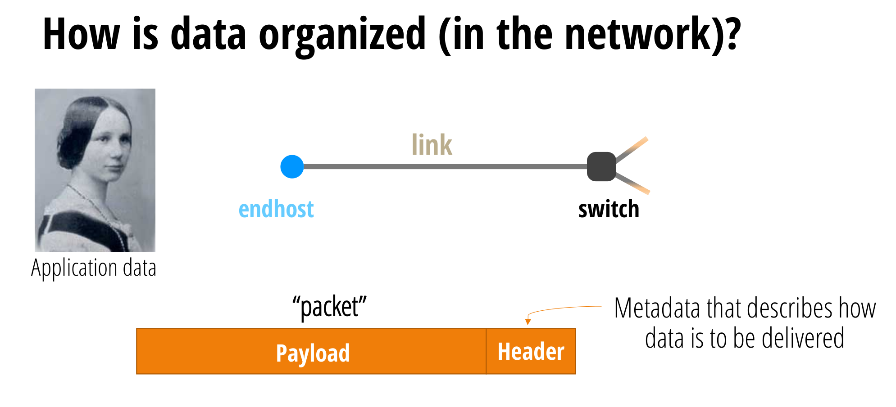
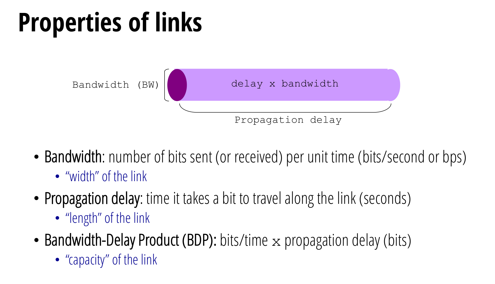
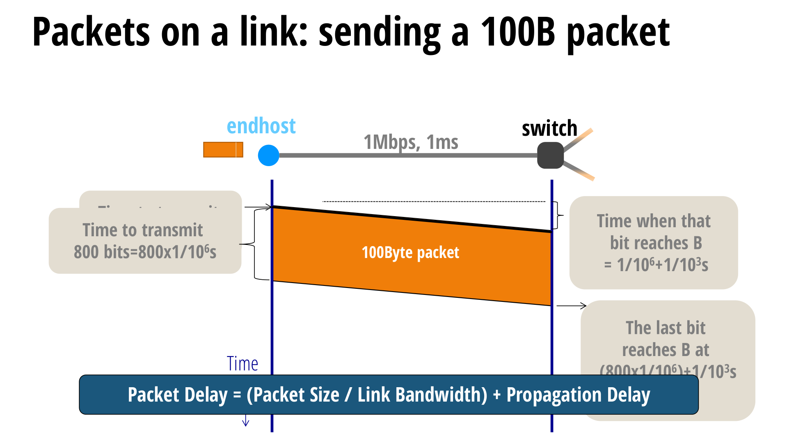
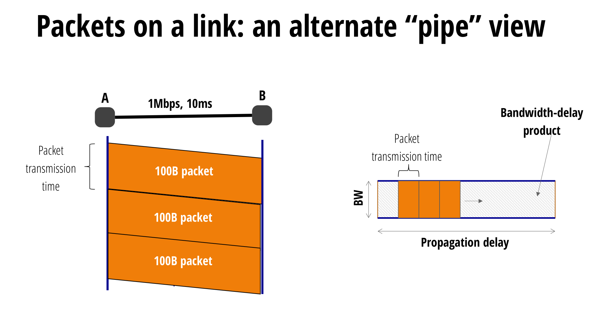
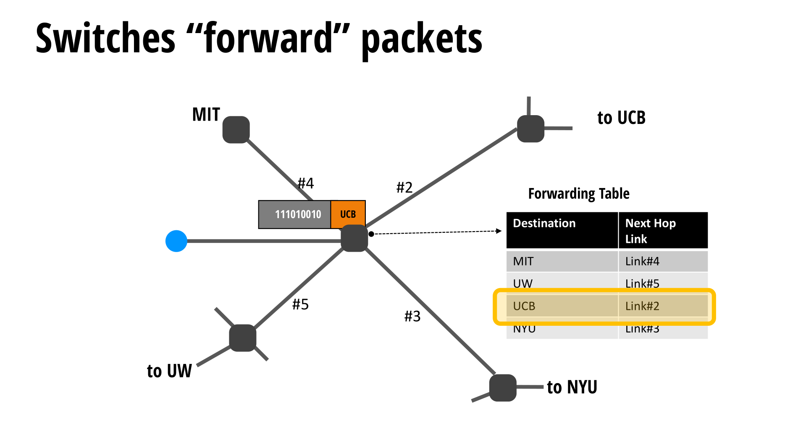
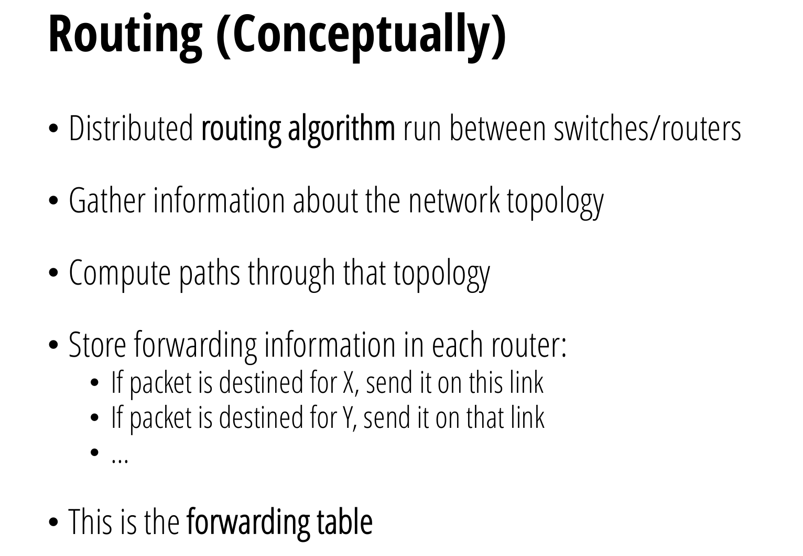
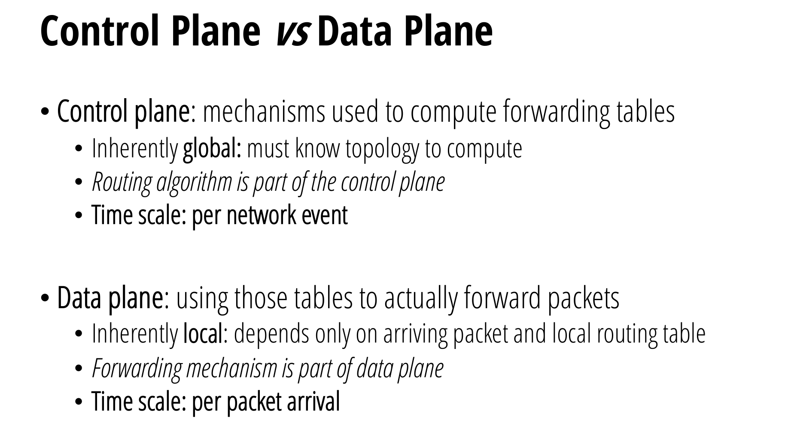

# Overview
## Goal of the Internet
> 
> The main job of the Internet is to transfer data between end hosts. This is more difficult than it seems because there are many considerations:
> - What path do we take between hosts and switches?
> - Do the available paths have adequate bandwidth?
> - What protocols do we use? Can it handle every possible communication case?

## Internet Components
> At a very high level, the Internet is composed of** three main types of components**:
> 1. **End hosts**, like phones, computers, and IoT devices, send and receive packets as a first or last destination.
> 2. **Switches**, which are often routers, manage the connections between end hosts and forward packets arriving on one link to another link.
> 3. **Links **connect switches and end hosts together. These could be one of many technologies like fiber cables, WiFi, or phone lines.

# Data Organization
## Packets
> 

## Links
> 
> `Bandwidth`相当于是我的`Packet`传输到网线上所需要的时间。我进门花的时间。
> `Propagation Delay`相当于我在网线上传输的时间。我在房间里走到目的地花的时间。
> `BDP`就是长乘宽，相当于容积。

# Packets on a Link
## TimeLine View
> 

## Pipe View
> 

# Packets between Switches
> 

# Routing
## Definition
> 

## Forwarding Table
> 
> `Control Plane`就是全局的路径规划算法。
> `Data Plane`就是针对一个`Switch`来说的，下一步去哪里。

