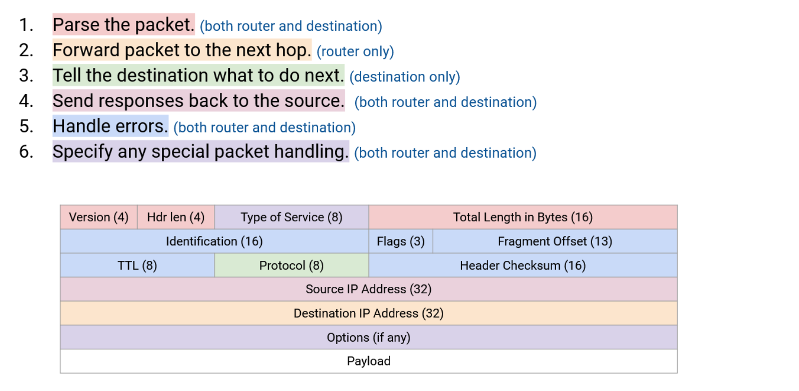
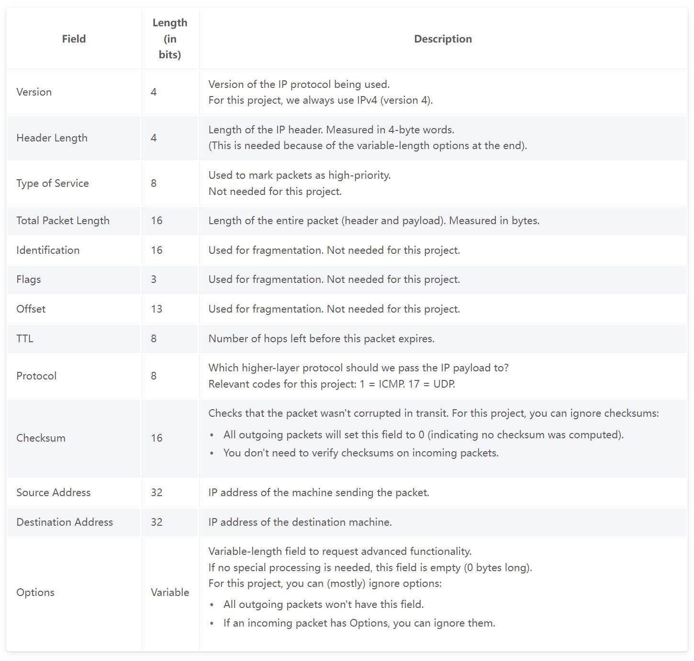
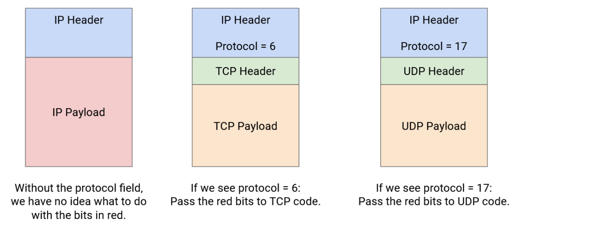

# IPv4
## Header Design
> [!important]
> 
> 其中有一些比较重要的字段:
> - **Everybody(endhosts, routers)** 需要知道当前的数据传输遵循什么协议，所以需要一个`Version`字段来说明是IPv4还是IPv6协议，不同的协议有不同的字段解析规则。
> - **Everybody(endhosts, routers)** 需要知道当前的数据是从哪里发过来的以便响应的时候能够正确传递回去，所以需要`Source Address`字段。
> - **Routers(not end hosts)** 需要将数据传递给下一个route, 并最终传递到目标主机，所以需要`Dest Address`字段。
> - 为了支持可变长度的header, 我们肯定需要`Header Length`字段来标识整个header 的长度，用于推断`Options`的长度。
> - **Endhosts** 需要在收到数据分组(Data packets)之后层层向上传递，但是每一次向上传递都需要决定应该使用什么服务(De multiplexing), 比如Layer 4需要在TCP/UDP中做出选择，于是我们还需要一个字段`Protocol`来告知主机要怎么处理payload, 常见的IP protocol字段值有:
> 	- Protocol = 6, 表示使用TCP
> 	- Protocol = 17, 表示使用UDP
> 	

## Error Handling
> [!important]
> IP packets可能会在`routing` 算法收敛前处于`infinite looping`的状态，浪费网络带宽。
> 
> 为了能检测到这个错误，IP头会包含 `TTL`(time to live), decremented at each hop. 
> 
> 当一个data packet的IP 头中的`TTL`被减到 0 的时候，这个数据包就会被丢弃，并通过`ICMP` 协议向源主机发送一个错误数据包（ICMP Time Exceeded）。

# IPv6
