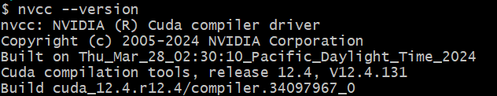
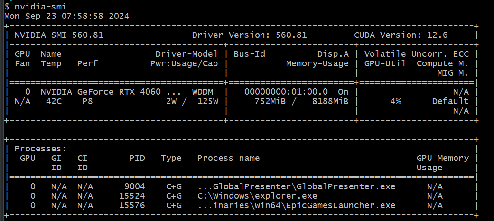

# 虚拟环境创建
> [!important]
> **通过`conda create`创建**:
> **Step one:** `conda create -n <venv_name> python=<python version num>` 
> **Step two:** Windows用户在`git bash`中输入`conda activate 2590-hw2`
> **Step three:** `pip install -r requirements.txt`
> 
> **通过`conda env create`创建:**
> **Step one:** 确保你的项目目录下有`<env_config_name>.yml`
> **Step two:** `conda env create --file <env_config_name>.yml`
> **Step three:** `conda activate <env_name>`

# 安装cuda
> [!important]
> 访问https://developer.nvidia.com/cuda-downloads?target_os=Windows&target_arch=x86_64&target_version=11&target_type=exe_local#直接开始安装
> 
> 访问https://docs.nvidia.com/cuda/cuda-installation-guide-microsoft-windows/index.html#installing-cuda-development-tools从头开始了解并安装cuda
> 
> 安装完后查看`cuda`版本: `nvcc --version`
> 
> 查看GPU信息: `nvidia -smi`
> 
> 

# 安装gpu版本的pyTorch
> [!important]
> 访问网址: https://pytorch.org/get-started/locally/ 按照步骤即可
> 
> 对于`nvcc --version`结果为`cuda_12.4`的情况，在虚拟环境中执行:
> - `pip3 install torch torchvision torchaudio --index-url https://download.pytorch.org/whl/cu124`
> - `pip3 install torch torchvision torchaudio --index-url https://download.pytorch.org/whl/cu121`

# torch1.11.0+cu113 cannot install
> [!important]
> **Step one:** `pip install --user pipenv==2022.1.8`
> **Step two:** 输入regedit, 编辑注册表，在上方路径栏中输入`HKEY_LOCAL_MACHINE\SYSTEM\CurrentControlSet\Control\FileSystem`, 然后选中`LongPathEnabled`字段，修改`value`为`1`激活长文件路径支持。
> **Step three**: `pip install --extra-index-url https://download.pytorch.org/whl/cu113/ "torch==1.11.0+cu113"`

# 解决CUDNN error
> [!important]
> 将`pytorch`降级即可: `pip install torch==2.4.1 torchvision==0.19.1 torchaudio==2.4.1 --index-url https://download.pytorch.org/whl/test/cu124`

# 安装过程中可能出现的问题
## 1. Command Not found error
> [!important]
> 
> 对于Linux系统，执行`conda init bash`之后`source ~/.bashrc`即可

## 2. CUDA安装版本和Torch编译的版本不匹配
> [!important]
> 去官网安装CUDA https://developer.nvidia.com/cuda-12-4-0-download-archive
> 安装torch也要选择12.4

## 3. 系统找不到指定文件
> [!important]
> 

