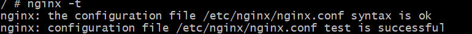
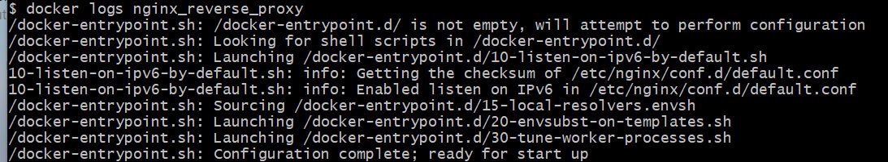
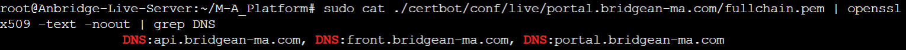

# DockerFile


## Building Image
> [!def]
> `docker build -t <imageName>.`命令可以创建一个名为`<imageName>`的`image`


## Docker Run
> [!def]
> `docker run -it <imageName> sh` 命令可以运行一个交互式的命令行, 开启一个新的container
> 使用`-p <host-port>:<container-port>`来显式将host的port绑定到container的port


## 进入一个Container
> [!important]
> 首先确保目标container已经启动
> 运行`docker exec -it <container_name> sh`


## 清除所有docker文件
> [!important]
> `docker system prune -a --volumes
`


## 修改部分文件重新部署
> [!def]
> `docker compose down`
> `docker-compose up --build`
> 


# Docker部署React+Springboot项目
## 测试Containers之间的连接
> [!important] 
> `docker exec -it <container_name> sh` 进入某一个container的控制台
> `curl http://<service-name>:<port>`尝试和另一个container服务进行通信


## Nginx
> [!important]
> 确保nginx的container正常运行，`docker exec -it nginx_reverse_proxy sh` 打开控制台
> 
> `nginx -t` 验证配置文件语法是否正确, 出现下列文字说明即说明配置无误
> 
> 如果有误，则执行 `nginx -s reload`
> 
> 通过`cat /etc/nginx/nginx.conf` 查看volumes配置是否生效。如果和host上的文件内容一致则表明配置生效。
> 
> 通过`docker logs nginx_reverse_proxy` 查看是否正在运行


## 配置SSL Certificates步骤
### 配置nginx.conf
> [!code]
> 所有的`private keys`都会被存放到`host machine`上的`./certbot/conf/live/portal.bridgean-ma.com`文件夹中 
```
events {
    worker_connections 1024;
}

http {
    include       mime.types;
    default_type  application/octet-stream;

    # First server block for portal
    server {
        listen 80;
        listen [::]:80;
        
        server_name portal.bridgean-ma.com;
        server_tokens off;
        
        # Added try_files and made the location more specific
        location ^~ /.well-known/acme-challenge/ {
            allow all;
            root /var/www/certbot;
            try_files $uri =404;
        }
    }

    # Second server block for front
    server {
        listen 80;
        listen [::]:80;
        server_name front.bridgean-ma.com;
        server_tokens off;

        # Added acme-challenge location block
        location ^~ /.well-known/acme-challenge/ {
            allow all;
            root /var/www/certbot;
            try_files $uri =404;
        }
    }
	
	
	server {
        listen 80;
        listen [::]:80;
        server_name api.bridgean-ma.com;
        server_tokens off;

        # Added acme-challenge location block
        location ^~ /.well-known/acme-challenge/ {
            allow all;
            root /var/www/certbot;
            try_files $uri =404;
        }
    }
}

```


### Generate private keys
> [!important]
> 
```
# Stop all containers
docker-compose down

# Clean up old certbot files
rm -rf ./certbot

# Create fresh directories
mkdir -p ./certbot/www
mkdir -p ./certbot/conf

# Start nginx
docker-compose up -d nginx

# Wait a bit
sleep 10

# Start certbot
docker-compose up -d certbot

# Check logs
docker-compose logs -f certbot
```
> [!code]
> 在`host machine`上查看证书的指令:
> `sudo cat ./certbot/conf/live/<your foldername>/fullchain.pem | openssl x509 -text -noout | grep DNS`


### 再次配置nginx.conf
> [!important]
> 
> 如上图所示，确认域名都存在之后，再次修改nginx.conf文件，添加ssl服务
```config
server {
        listen 443 ssl;
        server_name portal.bridgean-ma.com;

        ssl_certificate /etc/letsencrypt/live/portal.bridgean-ma.com/fullchain.pem;
        ssl_certificate_key /etc/letsencrypt/live/portal.bridgean-ma.com/privkey.pem;

        location / {
            proxy_pass http://admin:5174/;
            proxy_set_header Host $host;
            proxy_set_header X-Real-IP $remote_addr;
            proxy_set_header X-Forwarded-For $proxy_add_x_forwarded_for;
            proxy_set_header X-Forwarded-Proto $scheme;
        }
    }

    server {
        listen 443 ssl;
        server_name front.bridgean-ma.com;

        ssl_certificate /etc/letsencrypt/live/portal.bridgean-ma.com/fullchain.pem;
        ssl_certificate_key /etc/letsencrypt/live/portal.bridgean-ma.com/privkey.pem;

        location / {
            proxy_pass http://landing:5173/;
            proxy_set_header Host $host;
            proxy_set_header X-Real-IP $remote_addr;
            proxy_set_header X-Forwarded-For $proxy_add_x_forwarded_for;
            proxy_set_header X-Forwarded-Proto $scheme;
        }
    }
	
	server {
		listen 443 ssl;
		server_name api.bridgean-ma.com;
		
		ssl_certificate /etc/letsencrypt/live/portal.bridgean-ma.com/fullchain.pem;
		ssl_certificate_key /etc/letsencrypt/live/portal.bridgean-ma.com/privkey.pem;

		location / {
			proxy_pass http://backend:8083/; # Adjust the backend service URL
			proxy_set_header Host $host;
			proxy_set_header X-Real-IP $remote_addr;
			proxy_set_header X-Forwarded-For $proxy_add_x_forwarded_for;
			proxy_set_header X-Forwarded-Proto $scheme;
		}
	}
```
