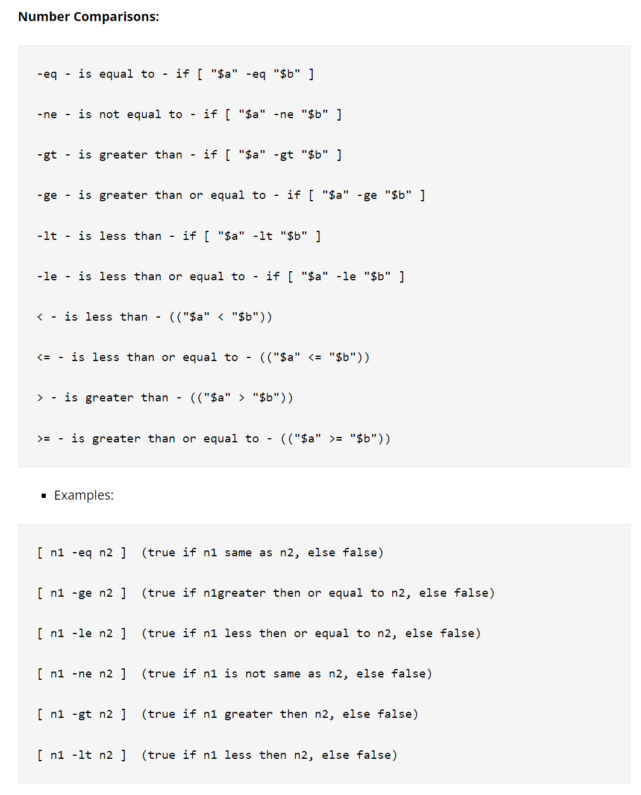
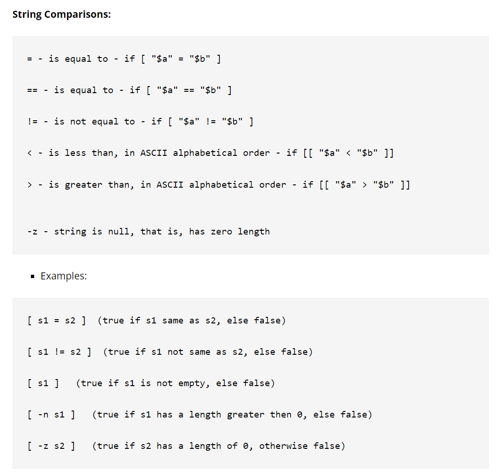

# Basic Syntax
## Shebang Line
> [!def]
> When we define a `.sh` file, we want to associate it with an interpreter. For example, inside the `.sh`, if we type: `print("Hello World")`, we know it is python syntax, so we want it to be executed by a python interpreter, so we should include a shebang line to tell the shell, as follows:
```bash
#! /bin/python3

print("Hello World")
```
> [!important]
> So shebang line is used to tell the system to use what kind of interpreter to execute the script.


## System Variabes
> [!def]
> `$PWD`: current working directory
> `$BASH`: absolute path of the bash interpreter
> `$BASH_VERSION`: bash interpreter version
> `$REPLY`: input from stdin
> `$HOME`: absolute path of user home directory


## User-defined Variables 
> [!def]
> - Use `varname=value` to create. (Be careful, no spaces in between)
> - Use `$varname` to access the value.
> 


## Read User Input
> [!important]
> - `read name` will read user's input(stdin) to the variable `name`.
> - `read var1 var2 var3 ...` to enable multiple variables input.
> - `read -p "Enter Name: " var` to enable prompt and read the user input to the variable `var`.
> - `read -sp "Password: " var` to enable prompt put not show the user input. 
> - `read -a names` to read multiple user input into an array called `names`
> 	- Then use `${names[i]}` to access the `i` th index.
> - It's possible to only type in `read` and the user input will go to the system variable called `$REPLY` 
> 


## Pass Arguments
> [!important]
> - `echo $0 $1 $2 $3` where the first arg(program name) goes to `$0` , and similar for the subsequent ones. Just like in C programs!
> - `args=("$@")` will collect all the results into args, so that we can access the arguments like `${args[i]}`
> - `echo $@` will store all the arguments(**including program name**) into `$@`.
> - `echo $#` will store all the arguments(**not including program name**) into`$#`


# Control Flow
## If Statement
> [!def]
```bash
if [condition]
then 
	... 
elif # optional
    ...
else # optional
    ...
fi
```
> [!example]
```bash
count=10
if [$count -eq 10]
then 
	echo "Condition is true"
fi
```
> [!important] Number Comparisons
> 

> [!important] String Comparisons
> 


## File Test Operator
> [!def]


