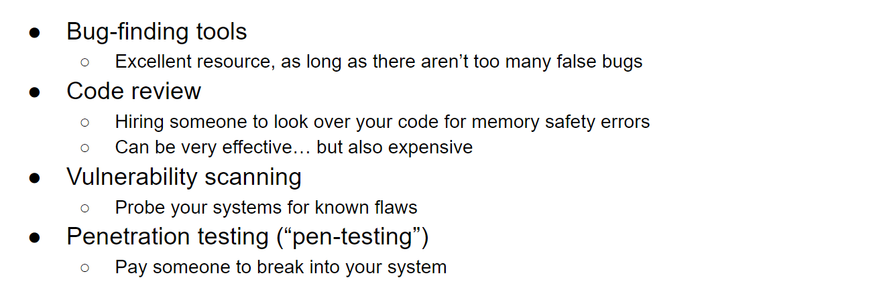

# Using Memory-Safe Languages
> [!concept]
> 
> In short, being memory-safe and having good performance are not zero sums, you can have both or have neither.

> [!example] Iphones
> 

# Writing Memory-Safe Code
> [!concept]
> 

# Building Secure Software
> [!concept]
> 

# Mitigation of Vulnerabilities
## Attacking Steps
> [!recall]
> 

## Non-Executable Pages - Step 5
### Defense
> [!def]
> This method prevents our codes from executing the malicious code by setting the page segments that store the malicious code to be non-executable.
> 
> If non-executable pages are enabled, you cannot execute any code that you write into memory. **The exploit involves writing shellcode into memory, so it would no longer work.**

> [!bug] Vulnerability
> 

### Attack 1: Return-to-libc
> [!concept] Idea
> 

### Important Example - RTL
> [!example] Sp24 Exam Prep03 P1
> 

### Attack 2: Return-oriented Programming
> [!concept]
> Also see [X86_Attack_Lab](../../Computer_Systems/Operating_Systems_Programming/HWs_Projects/CSAPP_CS61C_Projects/3_Assembly_Programming/X86_Attack_Lab.md) and [[CS161 SP24] Lecture 4_ Mitigating Memory Safety Vulnerabilities]([CS161%20SP24]%20Lecture%204_%20Mitigating%20Memory%20Safety%20Vulnerabilities.pdf)
> 
> The key idea is that we want to find some code snippets that starts with the instruction that we want to execute and ends with a `ret` instruction since the `ret` instruction makes sure that we will jump to the next gadget and perform chain calling.

### Important Example - ROP
> [!example] Sp24 Disc03 P3
> 
> Note that here we enabled ASLR, so whatever printed by GDB during a single execution cannot be replicated at the next time.
> 
> **Several Things to Note:**
> 1. Here `eyes` stores the address to the SHELLCODE, instead of shellcode itself.
> 2. `ret` will pop whatever at the top of the stack and treat it as a memory address and let `EIP` jump to it and execute the code there.
> 3. `nop` simply move `EIP` to the next instruction(`EIP + 4`) without affecting the position of `ESP`
> 4. `printf()` is very useful to leak some values(especially some addresses stored on the stack) as long as there is no NULL values before the addresses.

## Stack Canaries - Step 3
> [!story]
> 

### Defense
> [!def]
> Stack canaries help detect if an attacker has modified the RIP or SFP pointers by storing a secret value on the stack and checking if the secret value has been modified.
> 
> Note that the reason why we puit the stack canary in between the stack variables and EIP/SFP is that we want to signal any overwriting event before we touch the EIP/SFP.

### Attacks
> [!bug] Vulnerabilities
> 
> Remember, since stack canary is basically 32 random bits, with the lowest byte being null terminator, which prevents attacks like `printf("%s", buf)` to leak the stack canary. But if there is [Format String Vulnerabilities](2_Memory_Vulnerability.md#Format%20String%20Vulnerabilities) like `print(buf)`, then since format string vulnerability can read and write to any location in the memory, stack canary's null byte defense mechanism won't work.
> 
> 
> Or if there is `printf(buf)` in the code, we can use format string vulnerabilty to attack, since format strings can write to arbitrary locations in the code. Stack canaries only defend against exploits that write continuously from the vulnerable buffer to the rip.

### Concept Check
> [!quiz] Concept Check
> 
> 4. Suppose the stack canary is 32-bit random bits, then what's the probability that user can successfully leak the value of it by padding the local variables below it.
> 
> 

### Example
> [!example]
> See [Example](#ASLR%20-%20Step%202#Example)

## Pointer Authentication - Step 3
### PAC
> [!def]
> _Pointer authentication_ takes advantage of the fact that in a 64-bit architecture, many bits of the address are unused. 
> 
> A 64-bit address space can support $2^{64}$ bytes, or 18 exabytes of memory, but we are a long way off from having a machine with this much memory. 
> 
> A modern CPU might support a 4 terabyte address space, which means 42 bits are needed to address all of memory. This still leaves **22 unused bits** in every address and pointer (the top 22 bits in the address are always 0).
> 

> [!example]
> As an example, suppose the rip of a function in a 64-bit system is `0x0000001234567899`. The address space for this architecture is 40 bits, which means the top 24 bits (3 bytes) are always 0 for every address. Instead of pushing this address directly on the stack, the CPU will first replace the 3 unused bytes with a PAC. For example, if the PAC is `0xABCDEF`, then the address pushed on the stack is `0xABCDEF1234567899`.
> 
> This address (with the secret value inserted) is invalid, and dereferencing it will cause the program to crash. When the function returns and the program needs to start executing instructions at the rip, the CPU will read this address from the stack and check that the PAC `0xABCDEF` is unchanged. If the PAC is correct, then the CPU replaces the secret with the original unused bits to make the address valid again. Now the CPU can start executing instructions at the original rip `0x0000001234567899`.
> 
> Now, an attacker trying to overwrite the rip would need to know the PAC in order to overwrite the rip with the address of some attacker shellcode. If the attacker overwrites the PAC with an incorrect value, the CPU will detect this and crash the program.

### Defense
> [!important]
> You can imagine PAC as a generalization of stack canary where the stack canaries are everywhere on the stack instead of just one.
> 

### Attack - Hard
> [!bug] Vulnerabilities
> 

## ASLR - Step 2
### Defense
> [!def]
> Recall the stack smashing attacks from the previous section, where we overwrote the rip with the address of some malicious code in memory. This required knowing the exact address of the start of the malicious code. 
> 
> ASLR is a mitigation that tries to make predicting addresses in memory more difficult.
> 

### Attack
> [!bug] Vulnerabilities
> 
> The key idea of subverting ASLR mitigation is that we want to leak some values on the stack. There are typically three functions that is related this attack:
> 1. `printf()`, which helps read or write things on the stack, if we terminate the string maliciously.
> 2. `fgets()`, which prevents us from read extra bytes since it will put a `\x00` at the end of the input string.
> 3. `strcpy()`, which prevents us from read extra bytes since it will put a `\x00` at the end of the input string.
> 4. `char a = '0'` and `char a = 0` the first assignment doesn't put a null terminator, but the second one does. 

### Concept Check
> [!quiz] Concept Check
> 
>

### Example
> [!example] Sp24 Exam Prep 03 P2
> 
> **Note that:**
> 1. `alias` is `int8_t`, which means it will overflow when `alias > 127` and round back to `-128`. So when `counter = 255`, `alias = -1`.
> 2. Line 21 basically mean we cannot inject `A` as padding.
> 3. `strcpy()` and `fgets()` will add a null at the end when possible. If `fgets(target, size, src)`, no matter how long your input string is, it only reads `size` to the `target`(including the `\0` at the end, automatically appended).

# Combining Mitigations
> [!def]
> 

> [!quiz] Concept Check
> 

# Enabling Mitigations
> [!def]
> 

# Chapter Exercises