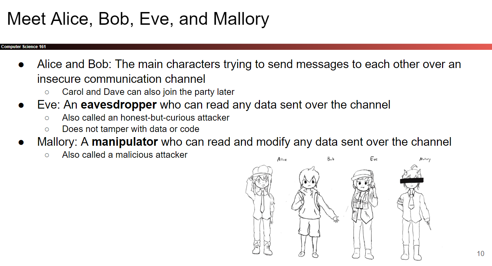
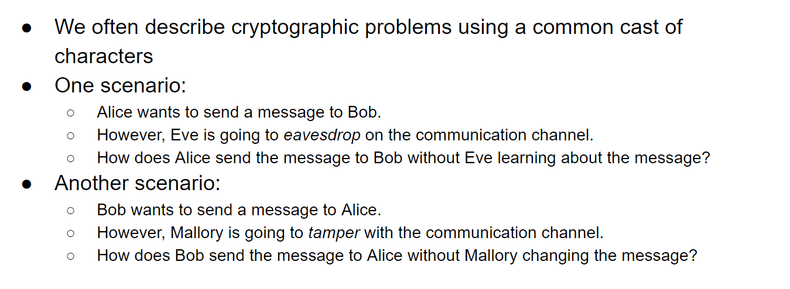
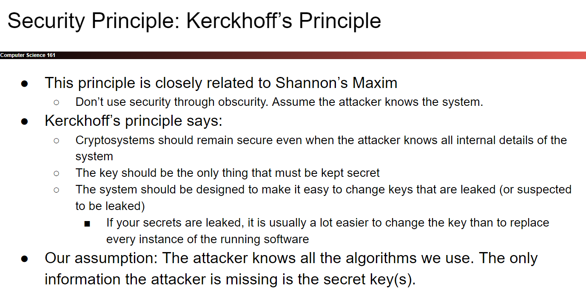
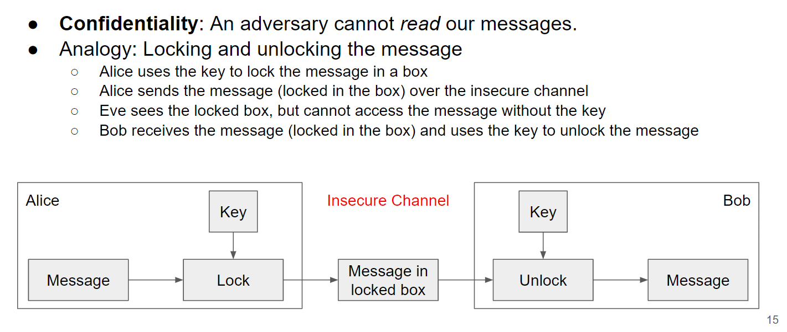
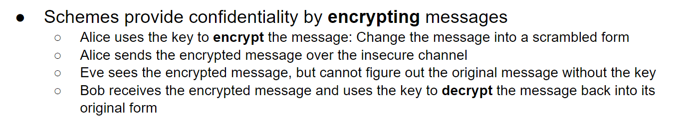
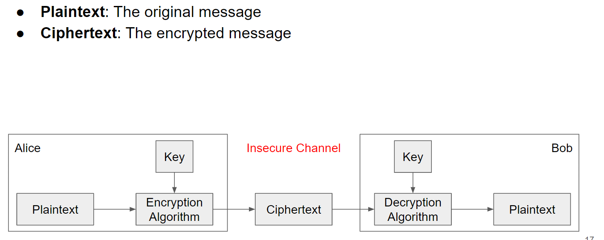
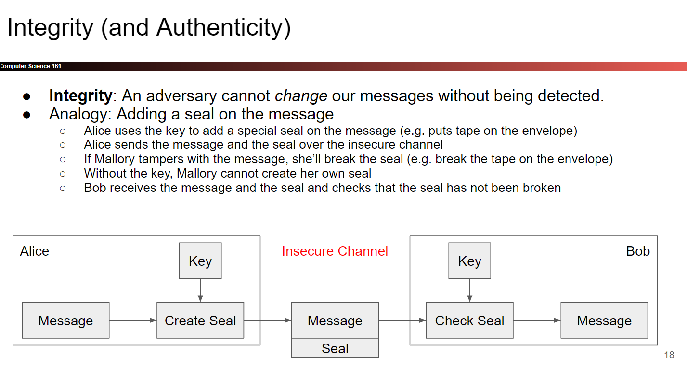
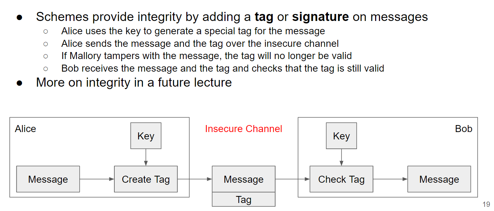
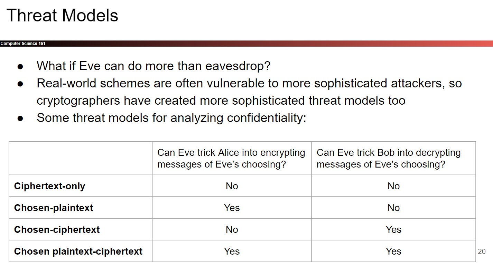
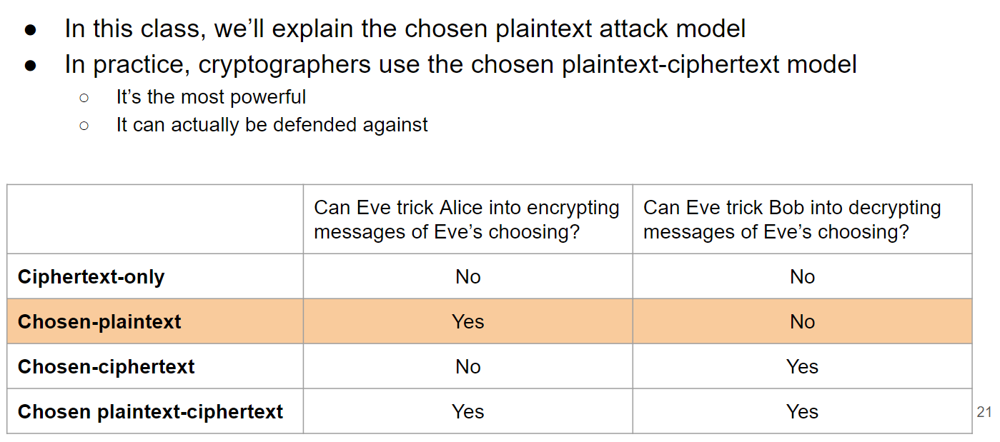

# Basic Principles
## Modeling
> [!overview]
> 

# Security Principle: Kerckhoff's Principle
> [!def]
> 

# Three Goals of Cyptography
## Confidentiality
> [!def]
> **An adversary cannot read our messages.**
> 

## Integrity
> [!def]
> **An adversary cannot change our messages without being detected.**
> 

## Authenticity
> [!def]
>  **I can prove that this message came from the person who claims to have written it.**
>  - Integrity and authenticity are closely related properties.
>  - Before I can prove that a message came from a certain person, I have to prove that the message wasn’t changed!  
>  - But they’re not identical properties

# Threat Models
> [!overview]
> When analyzing the confidentiality of an encryption scheme, there are several possibilities about how much access an eavesdropping attacker Eve has to the insecure channel:
> 

## Ciphertext-Only Attack
> [!def]
> Eve has managed to intercept a single encrypted message and wishes to recover the plaintext (the original message). This is known as a _ciphertext-only attack_ and is very hard for attacker to guess out the encryption system just from the observed cyphertext.

## Known Plaintext Attack
> [!def]
> Eve has intercepted an encrypted message and also already has some **partial information about the plaintext**, which helps with deducing the nature of the encryption. This case is a _known plaintext attack_. In this case Eve’s knowledge of the plaintext is partial, but often we instead consider complete knowledge of one instance of plaintext.

## Replay Attack
> [!def]
> Eve can capture an encrypted message from Alice to Bob and re-send the encrypted message to Bob again. This is known as a _replay attack_. 
> 
> For example, Eve captures the encryption of the message “Hey Bob’s Automatic Payment System: pay Eve \$\$100\$” and sends it repeatedly to Bob so Eve gets paid multiple times. Eve might not know the decryption of the message, but she can still send the encryption repeatedly to carry out the attack.

## Chosen Plaintext Attack
> [!def]
> Eve can trick Alice to encrypt arbitrary messages of Eve’s choice, for which Eve can then observe the resulting ciphertexts. (This might happen if Eve has access to the encryption system, or can generate external events that will lead Alice to sending predictable messages in response.) At some other point in time, Alice encrypts a message that is unknown to Eve; Eve intercepts the encryption of Alice’s message and aims to recover the message given what Eve has observed about previous encryptions. This case is known as a _chosen-plaintext attack_.

## Chosen-Ciphertext Attack
> [!def]
> Eve can trick Bob into decrypting some ciphertexts. Eve would like to use this to learn the decryption of some other ciphertext (different from the ciphertexts Eve tricked Bob into decrypting). This case is known as a _chosen-ciphertext attack_.

## Chosen-Plaintext/Ciphertext Attack
> [!def]
> A combination of the previous two cases: Eve can trick Alice into encrypting some messages of Eve’s choosing, and can trick Bob into decrypting some ciphertexts of Eve’s choosing. Eve would like to learn the decryption of some other ciphertext that was sent by Alice. (To avoid making this case trivial, Eve is not allowed to trick Bob into decrypting the ciphertext sent by Alice.) This case is known as a _chosen-plaintext/ciphertext attack_, and is the most serious threat model.