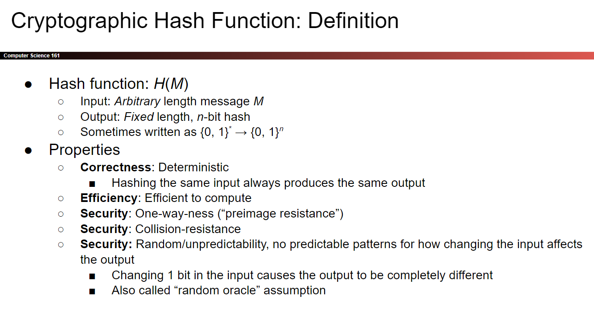
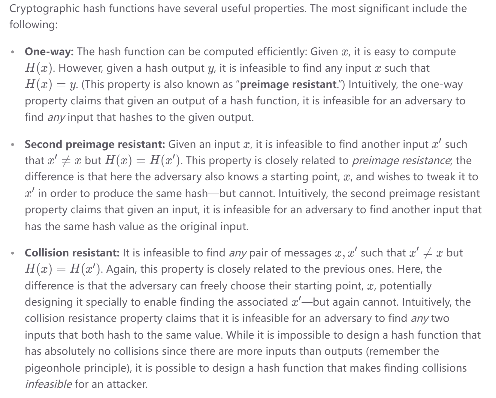
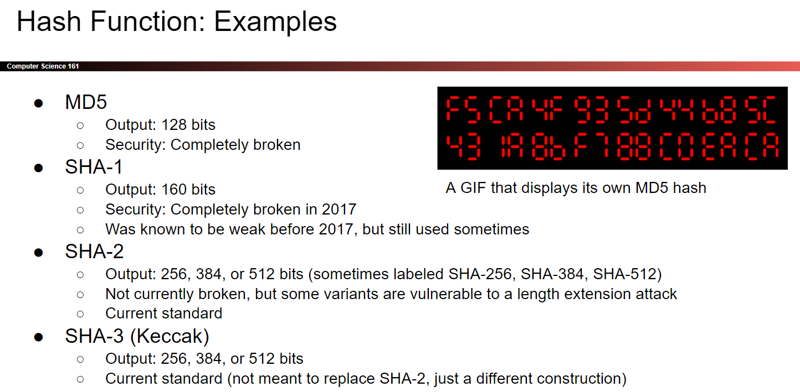
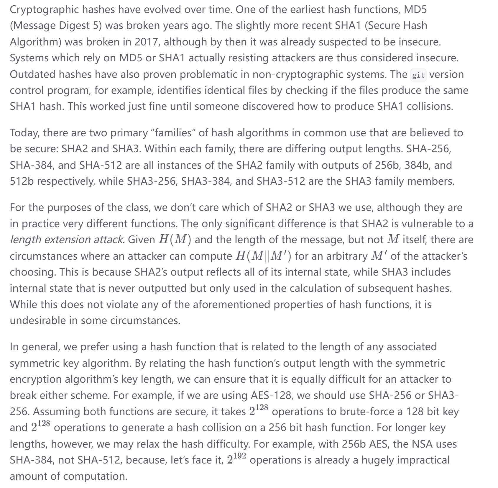

# Cryptographic Hash Function
## Definition of Hash Function
> [!def]
> 

## Properties
> [!property]
> 
> By “infeasible”, we mean that there is no known way to accomplish it with any realistic amount of computing power.
> 
> **Note**, the third property implies the second property. Cryptographers tend to keep them separate because a given hash function’s resistance towards the one might differ from its resistance towards the other (where resistance means the amount of computing power needed to achieve a given chance of success).

> [!example] Application: Message Integrity
> Under certain threat models, hash functions can be used to verify message integrity. For instance, suppose Alice downloads a copy of the installation disk for the latest version of the Ubuntu distribution, but before she installs it onto her computer, she would like to verify that she has a valid copy of the Ubuntu software and not something that was modified in transit by an attacker. 
> 
> One approach is for the Ubuntu developers to compute the SHA256 hash of the intended contents of the installation disk, and distribute this 256-bit hash value over many channels (e.g., print it in the newspaper, include it on their business cards, etc.). Then Alice could compute the SHA256 hash of the contents of the disk image she has downloaded, and compare it to the hash publicized by Ubuntu developers. 
> - If they match, then it would be reasonable for Alice to conclude that she received a good copy of the legitimate Ubuntu software. Because the hash is collision-resistant, an attacker could not change the Ubuntu software while keeping the hash the same. 
> 
> Of course, this procedure only works if Alice has a good reason to believe that she has the correct hash value, and it hasn’t been tampered with by an adversary. If we change our threat model to allow the adversary to tamper with the hash, then this approach no longer works. The adversary could simply change the software, hash the changed software, and present the changed hash to Alice.

# Hash Algorithms
> [!def]
> 

# Lowest Hash Scheme