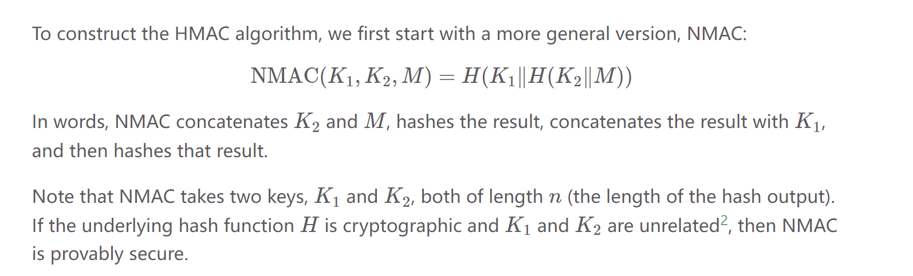

# MAC
## Definition
> [!def]
> A MAC is a keyed checksum of the message that is sent along with the message. It takes in a fixed-length secret key and an arbitrary-length message, and outputs a fixed-length checksum. A secure MAC has the property that any change to the message will render the checksum invalid.
> 
> Formally, the MAC on a message M is a value F(K,M) computed from K and M; 
> 
> The value F(K,M) is called the _tag_ for M or the MAC of M. Typically, we might use a 128-bit key K and 128-bit tags.
> 

> [!example] MAC on File Storage
> MACs can be used for more than just communication security. For instance, suppose we want to store files on a removable USB flash drive, which we occasionally share with our friends. To protect against tampering with the files on our flash drive, our machine could generate a secret key and store a MAC of each file somewhere on the flash drive. When our machine reads the file, it could check that the MAC is valid before using the file contents. In a sense, this is a case where we are “communicating” to a “future version of ourselves,” so security for stored data can be viewed as a variant of communication security.

## MAC Usage
> [!important]
> 
> 本质上就是发送信息的同时计算信息的Tag(MAC), 然后将信息和这个标签一起(<M, T>)发给目标服务器。目标服务器使用和客户端一样的Key(Symmetric Encryption Scheme), 计算F(K,M), 得到的结果和T比较，如果一致则说明M没有被篡改过。
> 这就要求相同的M, 通过F(K,M)得到的结果相同，不同的M'(哪怕只有微小的修改)，得到的结果F(K,M')必须和T=F(K,M)不同。
> - Deterministic: Same input multiple times, output should be the same multiple times.

## Security - EU-CPA
> [!def]
> Given a secure MAC algorithm F, if the attacker replaces M by some other message M, then the tag will almost certainly no longer be valid: in particular, F(K,M)≠F(K,M′) for any M≠M' . **This is used for tampering detection, if the message is tampered, then the signature changes a lot.**
> 
> Given M and T=F(K,M), an attacker who does not know the key K should be unable to find a different message M′ and a tag T′ such that T′ is a valid tag on M′ (i.e., such that T′=F(K,M′)). 
> 
> - Secure MACs are designed to ensure that **even small changes to the message make unpredictable changes to the tag**, so that the adversary cannot guess the correct tag for their malicious message M′.
> - Secure MACs are designed to be deterministic. Calling F(K,M) twice gives the same output.
> - For secure MACs, even if Eve observes a bunch of message-tag pair $\langle M_{1},T_{1}\rangle,\langle M_{2},T_{2}\rangle,\cdots, \langle M_{n},T_{n}\rangle$, we still **cannot** find a valid tag $T'$ for an unseen message $M'\notin\{M_{1},M_{2},\cdots,M_{n}\}$. 
> 
> 

> [!property]
> 

## How MAC ensures Integrity&Authenticity
> [!important]
> 

# Secure MACs
## AES-EMAC
> [!algo]
> 

 

## NMAC
> [!def]
> 

## HMAC
### Definition
> [!def]
> 

### Security(Integrity&Authenticity)
> [!important]
> 
> **Security指的是Hash Function的三个性质:**
> - **One way:**, 从output没法推断出input
> - **Second preimage resistance:** 修改input x -> x'，H(x) = H(x')几乎不可能
> - **Collison resistance:** 对于任意(x, x')来说, $x\neq x'$就意味着$H(x)\neq H(x')$.
> Security保证了integrity and authenticity.
>
> 

### Confidentiality
> [!bug] Not confidential
> 

# Authenticated Encrpytion
> [!overview]
> In authenticated encryption, the goal is to provide both confidentiality and integrity of messages using a combination of encryption and Message Authentication Codes (MACs). There are two primary methods for achieving this: encrypt-then-MAC and MAC-then-encrypt.

## Encrypt-then-MAC
> [!def]
> 

## MAC-then-Encrypt
> [!def]
> 

## Comparisons
> [!important]
> 

# AEAD

 

# Exercises
## MAC-Madness
> [!example] CS161 Sp24 Disc05 P1
> 

## Confidentiality and Integrity
> [!example] CS161 Sp24 Dics05 P2
> 

