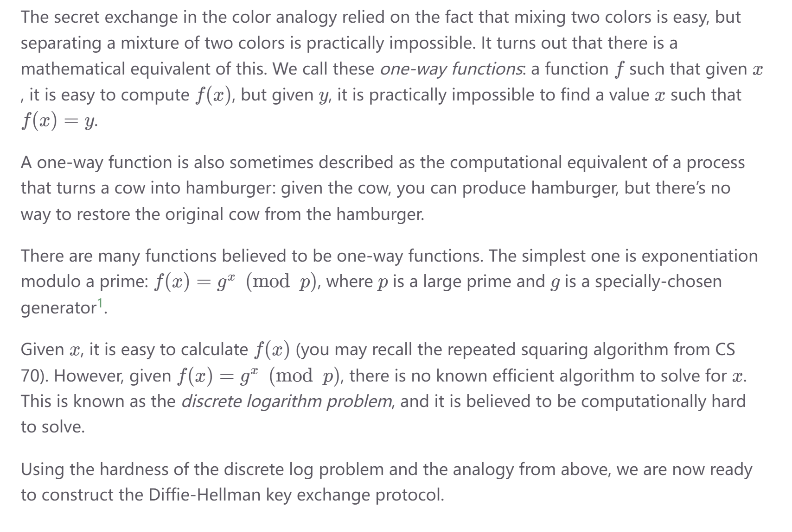

# Discrete Log Diffie-Hellman
## Diffie-Hellman Intuition
> [!important]
> 

## Discrete Logarithm Problem
> [!important]
> 

## Discrete Log Protocol
> [!algo]
> 

> [!exp]
> 

# Elliptic-Curve Diffie-Hellman
## Algorithm
> [!algo]
> 

> [!bug] Difficulties of discrete log problem
> 

# Attacks on Diffie-Hellman
## Issues with Diffie-Hellman
> [!important]
> **Diffie-Hellman is:**
> - Secure against passive adversary(observer). Observer of the transmitted message cannot decuce any information of the original message.
> - **Insecure** against active adversary(tamper). Tamper can fool the receiver into thinking that the sender and receiver has agreed with a shared key.
> - An **active protocol**: Sender and receiver need to be online at the same time to exchange keys. (Asynchronous communication is not natively supported)
> - **Does not provide authentication**, which means you exchanged keys with someone, but Diffie-Hellman makes no guarantees about who you exchanged keys with; it could be Mallory!

## Man-in-the-middle Attack
> [!important]
> 
> **简单来说:**
> - Mallory和Alice之间使用secret key $g^{am}~mod~p$ 进行通讯
> - Mallory和Bob之间使用secret key $g^{bm}~mod~p$ 进行通讯
> - Alice 认为 shared key 是 $g^{am} ~mod~p$
> - Bob 认为shared key是 $g^{bm} ~mod~p$
> - 这样相当于Mallory可以用$g^{am}~mod~p$对Alice的信息进行解密(因为知道了K, 就可以使用$D_K(C)$进行解密)，之后对原信息进行任意修改，最后用$g^{bm}~mod~p$对信息进行加密传给Bob.
> 

