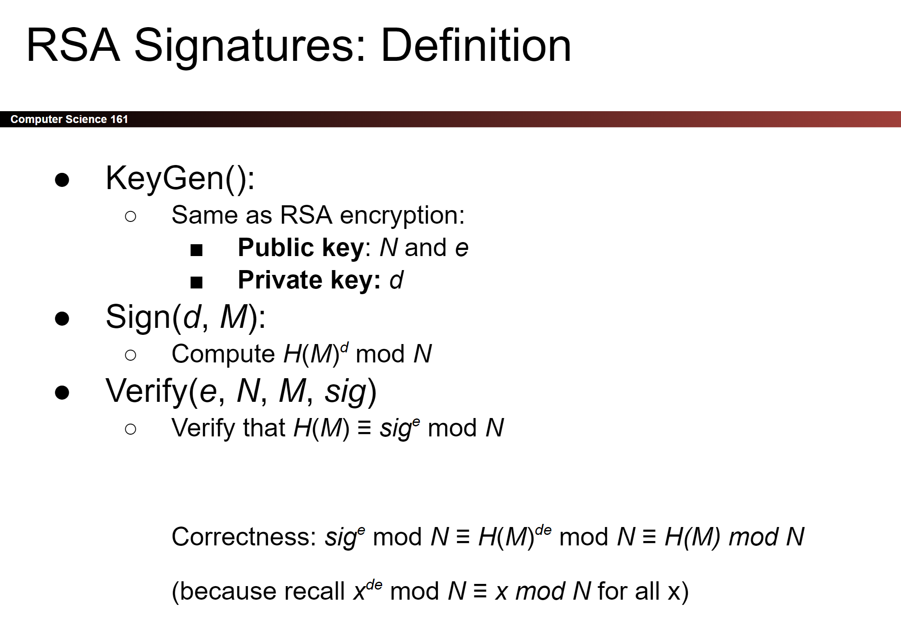

# Digital Signatures
## Definition
> [!def]
> 

## Integrity: EU-CPA
> [!important]
> 

## Digital Signatures in Practice
> [!important]
> 

# RSA Signatures
## Intuition
> [!overview]
> We have a message M, and we want to sign it with a digital signature. 
> - This signature can only be computed by those who has the private key.
> - Anyone who has the private key can sign messages.
> 
> The formula to find the signature of message M is the following equation:
> $$H(M) = F_{U}(S)$$
> - Intuitively, finding $S$ requires us to know the inverse of function $F$.
> - By design, this inverse should be computationally hard to find without the private key $K$ that is generated alongside with the public key $U$.
> 
> Anyone with the $(U, K)$ pair can compute $S$ by $S=F^{-1}(H(M))$.

## Mathematical Background
> [!thm]
> 

## Algorithm
> [!algo]
> 

## Security 
> [!def]
> 

