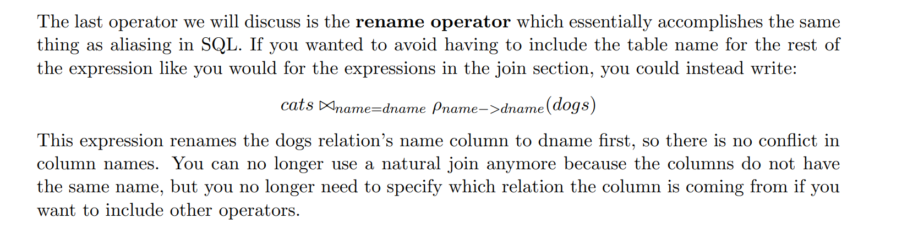
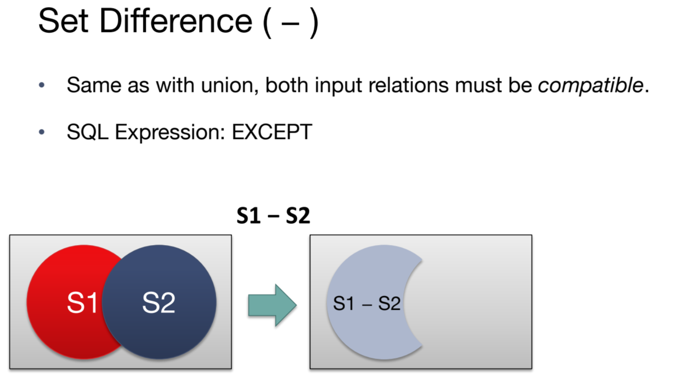

> Note 5 Discussion 5

# Overview
> [!overview]
> 

# Unary Operators
## Projection($\pi$)
> [!def]
> 
> 
> **Summary:**
> 1. Select a subset of columns(vertical).
> 2. Use set semantics, dropping duplicates.
> 3. Correspond to `SELECT` keyword.
> 4. Example: `SELECT name FROM R` becomes $\pi_{name}(R)$

## Selection$(\sigma)$
> [!def]
> 
> **Summary:**
> 1. Select a subset of rows(horizontal).
> 2. Use set semantics, dropping duplicates.
> 3. Correspond to `WHERE` keyword.
> 4. Example: `SELECT * FROM R WHERE id = 100` becomes $\sigma_{id=100}(R)$
> 5. Multiple Condition Example: `SELECT * FROM R WHERE id = 100 and state = 'NJ'` becomes $\sigma_{id=100\lor state='NJ'}(R)$

## Renaming$(\rho)$
> [!def]
> 
> **Summary:**
> 1. Rename columns in a relation.
> 2. Correspond to `AS` keyword.
> 
> **Remaing with Join:**
> 

# Binary Operators
## Union($\cup$)

> [!def]
> 
> **Summary:**
> 1. Union two relations, which must be compatible(same sequence of attributes and types thereof, i.e. perfectly aligned)
> 2. Use **set semantics**. So union doesn't always produce more rows after the operations since it may drop duplicates.
> 3. Correspond to `UNION` keyword.
> 4. Example: $\pi_{col}(R1)\cup\pi_{col}(R2)$ union the rows from two tables.

## Set-Difference($-$)
> [!def]
> 
> **Summary:**
> 1. Compute set difference of two relations, which must be compatible(same sequence of attributes and types thereof, i.e. perfectly aligned)
> 2. Use **set semantics**. Always produce less rows than the first operator after the operations since first it compute difference then it may drop duplicates.
> 3. Correspond to `EXCEPT` keyword.
> 4. Example: $\pi_{col}(R1)-\pi_{col}(R2)$ union the rows from two tables.

## Cross-Product($\times$)
> [!def]
> 
> **Summary:**
> 1. Compute row cartesian product of two relations.
> 2. Use **set semantics**. Since the inputs are relations, they cannot have any duplicates.
> 3. Correspond to `,` keyword.
> 4. Example: $R1\times R2$ union the rows from two tables.

# Compound Operators
> [!important]
> These are shortcut operations, exist because they are very frequently used and can be implemented using unary and binary operators.

## Join($\bowtie$)
> [!def]
> 
> **Takeaways:**
> 1. Equality Join only have equality join conditions across relations.
> 2. Theta Join can specify inequality join conditions across relations.

### Theta Join
> [!def]
> 

### Natural Join
> [!def]
> 

### Other Joins
> [!def]
> 

## Intersection$(\cap)$
> [!def]
> 
> Must be compatible.
> 
> It can be realized using binary and unary operators. For example, using **set difference**.
> 
> 

# Expressions
## Expression Tree
> [!def]
> 

## Rewriting Queries
> [!def]
> 

### Push Down
> [!def]
> 

> [!example] Fa23 Disc04 P2
> 

### Eliminate Nesting
> [!def]
> 
> Here we also use push down of predicate.
> 
> There is a typo, the algebra should be $\pi_{sid}S-\pi_{sid}((\sigma_{bid=103}(R)\bowtie S))$.
> 
> This is **NOT** ok $\pi_{sid}(S-\sigma_{bid=103}(R)\bowtie S)$ since set difference should be defined on perfectly aligned relation columns.
> 

# Extended Operators
> [!def]
> 

# Convert SQL to Relational Algebra
> [!example] Fa20 Disc02 P2
> 

# Appendix
## Latex Shorcuts
> [!concept]
> 

