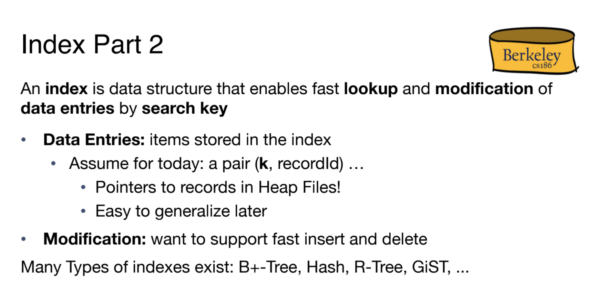
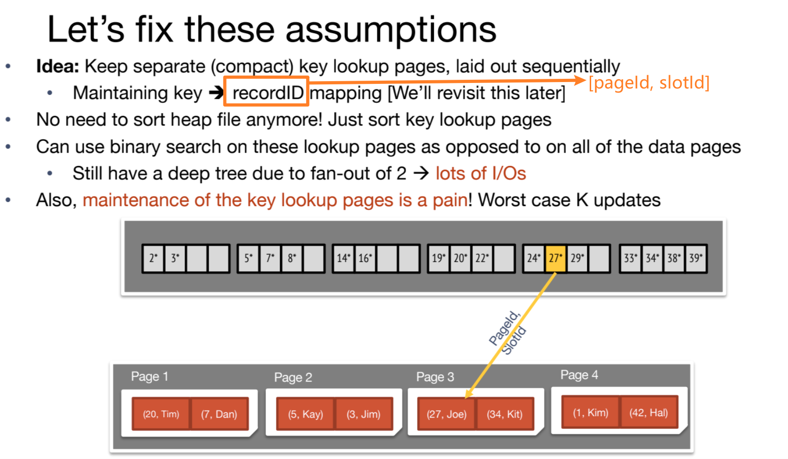
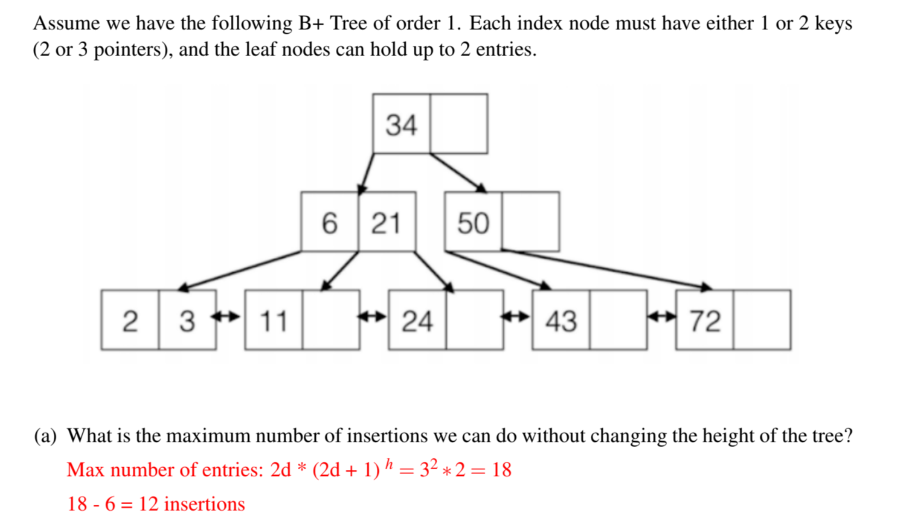
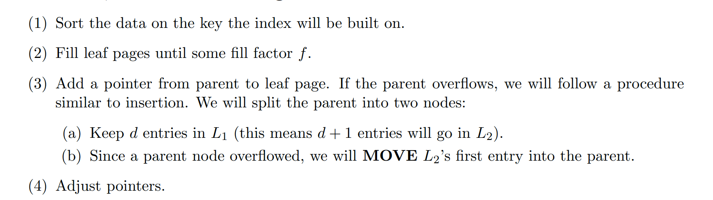
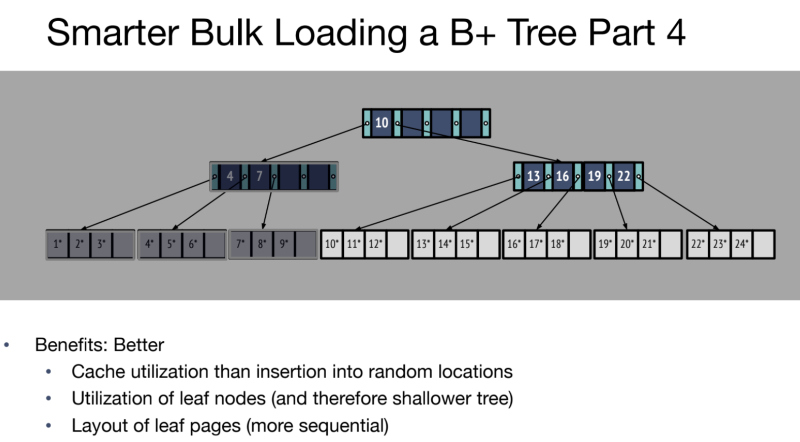
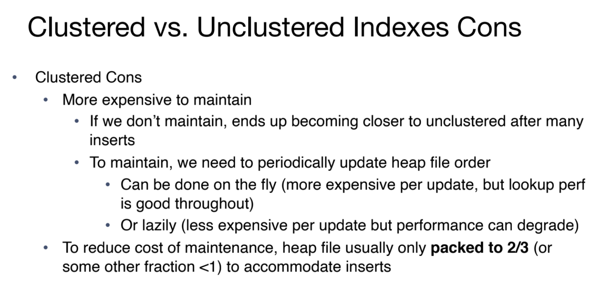
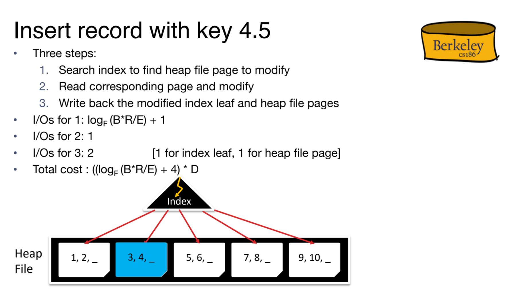

> Note 3 Discussion 3
# Overview
## Index
> [!concept]
> 

# B\+ Tree Index (Reference)
> This is only one way of B\+ Tree Indexing, which is using leaf nodes to keep a reference to the actual records(organized in heap files). Leaf nodes don't store any records.
## Key Idea
> [!important]
> 

## B Tree Nodes
> [!concept] Interior Node
> 

> [!concept] Leaf Nodes
> Note: Leaf node's entry keeps the pointer to a particular record.
> 

## B Tree Properties
> [!property] Occupant Invariant
> 
> **B+ Tree Invariant(Order):** each interior node is full beyond a certain minimum: in this case [and typically], at least half full:
> - This minimum, d, is called the **order** of the tree.
> - In Figure 1, max # of entries = 4(page 9). Thus d = 2.
> - **Guarantee:** d <= # entries <= 2d. In this tree, 2 <= # entries <= 4.
> 
> 
> **Several Properties of B+ Tree:**
> - The number d is the order of a B+ tree. Each node (**with the exception of the root node**) must have d ≤ x ≤ 2d entries **assuming no deletes happen** (it’s possible for leaf nodes to end up with < d entries if you delete data). **The entries within each node must be sorted.**
> - In between each entry of an inner node, there is a pointer to a child node. Since there are at most 2d entries in a node, inner nodes may have at most 2d + 1 child pointers. This is also called the **tree’s fanout**. 
> - The keys in the children to the left of an entry must be less than the entry while the keys in the children to the right must be **greater than or equal to** the entry

> [!property] Non-sequential Page Storage
> 
> Leaf pages at bottom need not be stored in sequence in logical order.
> - In figure 2, we have page 2, 3 at the leaf node, but page 4 being the parent, which indicates that page doesn't have to be stored in sequential order.
> - Next and prev. pointers help examining them in sequence.

## B Tree and Scale 
> [!concept]
> 
> **Note:** Tree height starts from 0 from leaf node of the B+ tree. Or put it another way, tree height doesn't consider the leaf nodes and start with 1 from the deepest index layer(marked in blue).
> 
> 

# B\+ Tree Operations
## Searching
> [!important]
> 
> This is the benefit brought by the doubly linked list at the leaf level.

## Insertion
### Basic Rules
> [!algo]
> 
> **Note:** we want to **COPY** leaf node data into the parent so that we don’t lose the data in the leaf node. Remember that every key that is in the table that the index is built on must be in the leaf nodes! Being in a inner node does not mean that key is actually still in the table. 
> 
> On the other hand, we can **MOVE** inner node data into parent nodes because the inner node does not contain the actual data, they are just a reference of which way to search when traversing the tree.
> 

> [!example]
> 

### Maximum Insertion To Same Height
> [!example] Vitamin 3 P1
> 

> [!example] Fa20 Disc03 P1
> 

### Minimum Insertion To Different Height
> [!example] Vitamin 3 P1
> 

> [!example] Fa20 Disc03 P1
> 

## Deletion
> [!concept]
> 

## Bulk Loading
### Basic Rules
> [!motiv] Motivation
> 

> [!algo]
> 
> This algorithm is very similar to put operation, with a couple of differences:  
> 1. **Leaf nodes** do not fill up to 2\*d+1 and split, but rather, fill up to be 1 record more than `fillFactor` full, then **"splits" by creating a right sibling that contains just one record (leaving the original node with the desired fill factor).**  
> 2. **Inner nodes** should **repeatedly try to bulk load the rightmost child** until either the inner node is full (in which case it should split) or there is no more data and follow the split rule as in put operation.(d and d+1 partition).
> 3. `fillFactor` should ONLY be used for determining how full leaf nodes are (not inner nodes), and calculations should round up, i.e. with d=5 and fillFactor=0.75, leaf nodes should be 8/10 full.

> [!example] 
> Bigger Example see [B+_Tree_Bulk_Load_Visualizations](B+_Tree_Bulk_Load_Visualizations.pdf)
> 

### Calculating Number of Leaf Nodes
> [!example]
> 
> Since the order is 2, then each leaf node can hold at most $4$ entries, but the fill-factor is $0.75$, we know that each leaf node holds $4\times 0.75=3$ entries, so we will need $\frac{60}{3}=20$ leaf nodes in total.

### Draw the tree after bulk-loading
> [!example] Fa20 Disc03 P3
> 

# B\+ Tree Refinement
## Leaf Nodes Refinements
### Alt 1
> [!def]
> 
> Here each entry of the leaf nodes store the actual data, we don't have to do translation between pointer and (pageID, slotID) as we have seen in [B-plus Tree Index (Reference)](B+Tree_Indexing.md#B-plus%20Tree%20Index%20(Reference)).

### Alt 2
> [!def]
> 
> We introduced it in [B-plus Tree Index (Reference)](B+Tree_Indexing.md#B-plus%20Tree%20Index%20(Reference)).
> 
> Each entry in the leaf node stores a (key, (pageID, slotID)), where the latter(after some lookup process in DBMS) will lead us to the exact record.

### Alt3
> [!def]
> 
> Bookkeeping here means if our reference list causes a block to be full and even spillover to a another block, then we have to record which portion of the reference list belongs to which block.

### By Value or By Reference
#### Non-unique Indexes
> [!important]
> In database we have several kinds of index:
> 
> If we are using non-unique index, then multiple records could have the same index, then the leaf node would store too much (pageID, recordID) pairs.
> 
> 

#### Multiple Indexes
> [!def]
> Multiple indexes means that for each column of a table, we can create  a different index using the following syntax:
>  `CREATE INDEX INDEX_NAME_1 ON TABLE(COLUMN1);CREATE INDEX INDEX_NAME_2 ON TABLE(COLUMN2);`
>  
> If we want multiple indexes to point to the same records, by reference **IS REQUIRED**.
> 
> 
> Otherwise, we have to replicate the entire tuple each time a different index is created for the same record. Since tuple is immutable object, we will have to insert a duplicate record into the index system, which requires time.
> 
> Also, each time a record is replicated or copied (for instance, when indexed "by value"), every change to the record needs to be reflected across all copies(copies that are used by different processes or threads).

> [!example] Concept Check Fa20 Disc03 P2
> 

## File Organization Refinement
### Clustered Index
> [!def]
> 

### Unclustered Index
> [!def]
> 

### Build Clustered Index
> [!overview]
> 

### Insertion Operation
> [!def]
> 

### Pros/Cons of Clustered Index
> [!important]
> 

## Integrated Example
> [!example] Fa20 Disc03 P2
> 
> For (d), note that it is possible to not having only one records match, so in the worst case it's equivalent to searching the full table. Moreover, since `grade_received` is not a primary key, nor is it an index, so we have to perform full table scan, which is different from (c) where we are searching based on the composite index (assignment_id, student_id).

# B\+ Tree Operation Costs
## Index Assumptions
> [!def]
> 

## Scanning All Records
> [!def]
> 
> **Note:** 1.5 here since in order to hold the same amount of records in the heap file as the unclustered index case, we have to allocate more pages. Here the data blocks mean the total number of records, not pages.

## Equality Search
> [!def]
> 
> Note here that the leaf will never be counted as part of the height of the index, as shown in [B Tree and Scale](B+Tree_Indexing.md#B%20Tree%20and%20Scale).
> 
> 

## Range Search
> [!def]
> 
> Note that here we are overestimating the number of pages that are used to store the indexes for records in step 2. (Just make the math easy).

## Insertion
> [!def]
> 

## Deletion
> [!def]
> Should be the same as insertion operation since they both requires finding where the record should go and then do some read/write overhead.
> 

## Summary
> [!summary]
> 

 

# B\+ Tree Encoding
## S-Expression
> [!def]
> S-expressions (or sexps) are a compact way of encoding nested tree-like  structures (sort of like how JSON is a way of encoding nested dictionaries and lists). n.toSexp() returns an sexp encoding of the subtree rooted by n. 
> 
> For example, the following tree:
> 
> has the following sexp  (((1 (1 1)) (2 (2 2))) 3 ((3 (3 3)) (4 (4 4)))) .
> 
> Here, (1 (1 1)) represents the mapping from key 1 to record id (1, 1).

