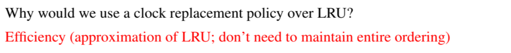

# Buffer Components
## Buffer Pool


## Buffer Manager
> [!def]
> 


# Page Replacement Policy
## Why Software Level?
> [!motiv]
> 
> Remember when something is embedded to the hardware level, it generally cannot change in the future. And software level DBMS can have more flexibility.


## LRU Counting Policy
### Algorithm
> [!concept]
> 
> We can implement the eviction priority using a priority queue(based on heap). Everytime it pops from the queue the frameID with the smallest `last used`.


### Examples
> [!example] Fa23 Disc04 P1 Unpinned Random Access Pattern
> 
> The x-axis is the timeline. (\*) denotes cache hit event and y-axis represent the buffer-ids.

> [!example] Fa23 Disc04 P1 Pinned Random Access Pattern
> 

> [!example] Longer Sequence of Accessment W.O. Pinning
> 


### Implementations
#### Java Implementation - DLL
> [!code]
```java
public class LRUEvictionPolicy implements EvictionPolicy {  
    private Tag listHead;  
    private Tag listTail;  
  
    // Doubly-linked list between frames, in order of least to most  
    // recently used.    private class Tag {  
        Tag prev = null;  
        Tag next = null;  
        BufferFrame cur = null;  
  
        @Override  
        public String toString() {  
            String sprev = (prev == null || prev.cur == null) ? "null" : prev.cur.toString();  
            String snext = (next == null || next.cur == null) ? "null" : next.cur.toString();  
            String scur = cur == null ? "null" : cur.toString();  
            return scur + " (prev=" + sprev + ", next=" + snext + ")";  
        }    }  
    public LRUEvictionPolicy() {  
        this.listHead = new Tag();  
        this.listTail = new Tag();  
        this.listHead.next = this.listTail;  
        this.listTail.prev = this.listHead;  
    }  
    /**  
     * Called to initiaize a new buffer frame.     * @param frame new frame to be initialized  
     */    @Override  
    public void init(BufferFrame frame) {  
        Tag frameTag = new Tag();  
        frameTag.next = listTail;  
        frameTag.prev = listTail.prev;  
        listTail.prev = frameTag;  
        frameTag.prev.next = frameTag;  
        frameTag.cur = frame;  
        frame.tag = frameTag;  
    }  
    /**  
     * Called when a frame is hit.     * @param frame Frame object that is being read from/written to  
     */    @Override  
    public void hit(BufferFrame frame) {  
        Tag frameTag = (Tag) frame.tag;  
        frameTag.prev.next = frameTag.next;  
        frameTag.next.prev = frameTag.prev;  
        frameTag.next = this.listTail;  
        frameTag.prev = this.listTail.prev;  
        this.listTail.prev.next = frameTag;  
        this.listTail.prev = frameTag;  
    }  
    /**  
     * Called when a frame needs to be evicted.     * @param frames Array of all frames (same length every call)  
     * @return index of frame to be evicted  
     * @throws IllegalStateException if everything is pinned  
     */    @Override  
    public BufferFrame evict(BufferFrame[] frames) {  
        Tag frameTag = this.listHead.next;  
        while (frameTag.cur != null && frameTag.cur.isPinned()) {  
            frameTag = frameTag.next;  
        }        if (frameTag.cur == null) {  
            throw new IllegalStateException("cannot evict anything - everything pinned");  
        }        return frameTag.cur;  
    }  
    /**  
     * Called when a frame is removed, either because it     * was returned from a call to evict, or because of other constraints     * (e.g. if the page is deleted on disk).     * @param frame frame being removed  
     */    @Override  
    public void cleanup(BufferFrame frame) {  
        Tag frameTag = (Tag) frame.tag;  
        frameTag.prev.next = frameTag.next;  
        frameTag.next.prev = frameTag.prev;  
        frameTag.prev = frameTag.next = frameTag;  
    }}
```


#### C++ Implementation


## LRU Clock Policy
### Why Clock Policy?
> [!important]
> 


### Algorithm
> [!algo]
> 

> [!example] Hit Event Without Pinning Event
> See [CS 186 Discussion 4](CS%20186%20Discussion%204.pdf)
> 

> [!example] With Pinned Event
> 


## MRU Policy
### Algorithm
> [!def]
> Just a little modification of LRU where we evict the page by the most recently used time frame.


### Examples
> [!example] Disc04 P1 MRU Random Access Pattern
> 

> [!example] Fa23 Disc04 P1 MRU Pinned Random Access Pattern
> 

> [!example] Longer Sequence of Accessment W.O. Pinning
> 


## Random Access Performance
> [!important]
> 


> [!example] Disc04 P1 LRU Random Access Pattern
> 
> The x-axis is the timeline. (\*) denotes cache hit event. 

> [!example] Disc04 P1 MRU Random Access Pattern
> 


## Sequantial Scanning Performance
### LRU - Sequantial Flooding
> [!important]
> 


### MRU - Good at Sequential Requests
> [!important]
> 


