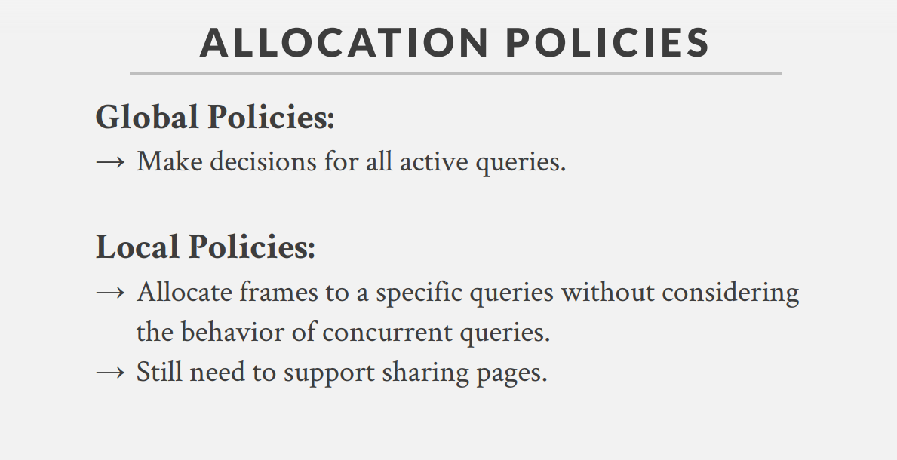
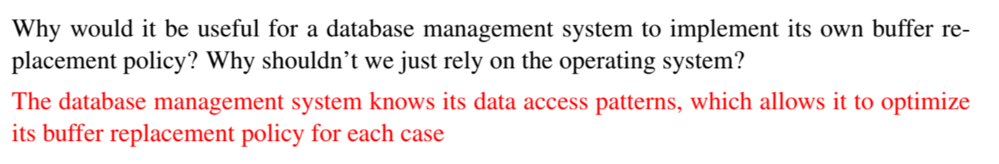
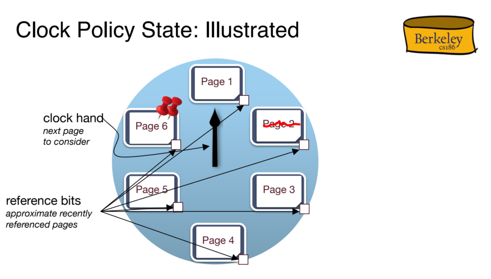
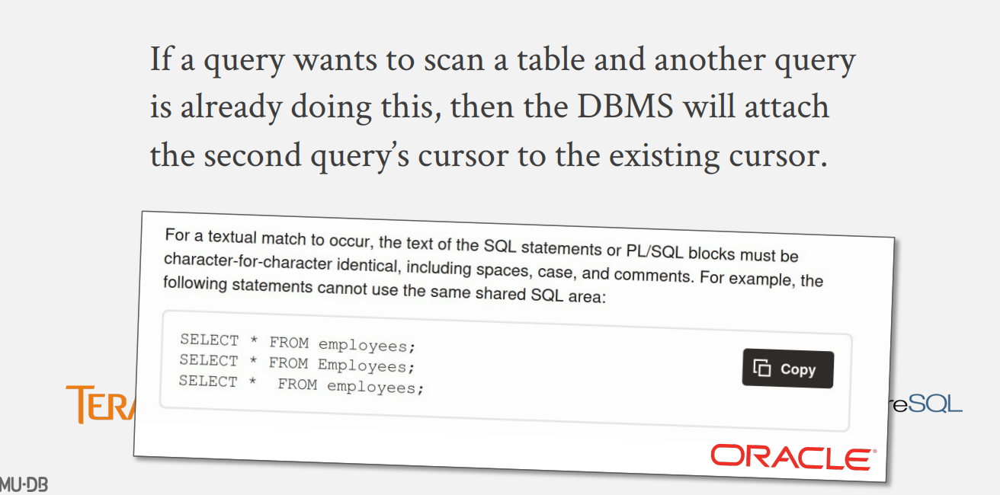
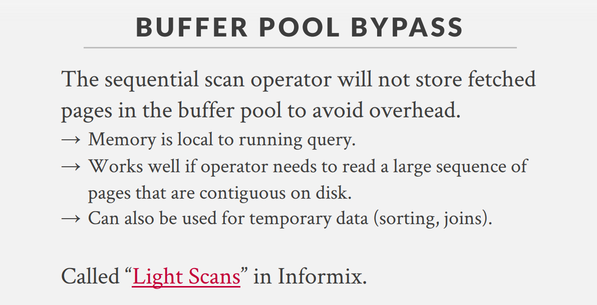

# Buffer Pool Manager
## Organization
> [!important]
> 


## Page Table
> [!def]
> 


## Locks&Latches
> [!important]
> When some trasaction asks the bufferpool manager to load some data into the buffer pool(i.e. asking for records)
> 


## Page Allocation Policy
> [!def]
> 


## Buffer Manager
> [!def]
> 


# Traditional Page Replacement Policy
## Why Software Level?
> [!motiv]
> 
> Remember when something is embedded to the hardware level, it generally cannot change in the future. And software level DBMS can have more flexibility.


## LRU Counting Policy
### Algorithm
> [!concept]
> 
> We can implement the eviction priority using a priority queue(based on heap). Everytime it pops from the queue the frameID with the smallest `last used`.


### Examples
> [!example] Fa23 Disc04 P1 Unpinned Random Access Pattern
> 
> The x-axis is the timeline. (\*) denotes cache hit event and y-axis represent the buffer-ids.

> [!example] Fa23 Disc04 P1 Pinned Random Access Pattern
> 

> [!example] Longer Sequence of Accessment W.O. Pinning
> 


### Implementations
#### Java Implementation - DLL
> [!code]
```java
public class LRUEvictionPolicy implements EvictionPolicy {  
    private Tag listHead;  
    private Tag listTail;  
  
    // Doubly-linked list between frames, in order of least to most  
    // recently used.    private class Tag {  
        Tag prev = null;  
        Tag next = null;  
        BufferFrame cur = null;  
  
        @Override  
        public String toString() {  
            String sprev = (prev == null || prev.cur == null) ? "null" : prev.cur.toString();  
            String snext = (next == null || next.cur == null) ? "null" : next.cur.toString();  
            String scur = cur == null ? "null" : cur.toString();  
            return scur + " (prev=" + sprev + ", next=" + snext + ")";  
        }    }  
    public LRUEvictionPolicy() {  
        this.listHead = new Tag();  
        this.listTail = new Tag();  
        this.listHead.next = this.listTail;  
        this.listTail.prev = this.listHead;  
    }  
    /**  
     * Called to initiaize a new buffer frame.     * @param frame new frame to be initialized  
     */    @Override  
    public void init(BufferFrame frame) {  
        Tag frameTag = new Tag();  
        frameTag.next = listTail;  
        frameTag.prev = listTail.prev;  
        listTail.prev = frameTag;  
        frameTag.prev.next = frameTag;  
        frameTag.cur = frame;  
        frame.tag = frameTag;  
    }  
    /**  
     * Called when a frame is hit.     * @param frame Frame object that is being read from/written to  
     */    @Override  
    public void hit(BufferFrame frame) {  
        Tag frameTag = (Tag) frame.tag;  
        frameTag.prev.next = frameTag.next;  
        frameTag.next.prev = frameTag.prev;  
        frameTag.next = this.listTail;  
        frameTag.prev = this.listTail.prev;  
        this.listTail.prev.next = frameTag;  
        this.listTail.prev = frameTag;  
    }  
    /**  
     * Called when a frame needs to be evicted.     * @param frames Array of all frames (same length every call)  
     * @return index of frame to be evicted  
     * @throws IllegalStateException if everything is pinned  
     */    @Override  
    public BufferFrame evict(BufferFrame[] frames) {  
        Tag frameTag = this.listHead.next;  
        while (frameTag.cur != null && frameTag.cur.isPinned()) {  
            frameTag = frameTag.next;  
        }        if (frameTag.cur == null) {  
            throw new IllegalStateException("cannot evict anything - everything pinned");  
        }        return frameTag.cur;  
    }  
    /**  
     * Called when a frame is removed, either because it     * was returned from a call to evict, or because of other constraints     * (e.g. if the page is deleted on disk).     * @param frame frame being removed  
     */    @Override  
    public void cleanup(BufferFrame frame) {  
        Tag frameTag = (Tag) frame.tag;  
        frameTag.prev.next = frameTag.next;  
        frameTag.next.prev = frameTag.prev;  
        frameTag.prev = frameTag.next = frameTag;  
    }}
```


#### C++ Implementation


## LRU Clock Policy
### Why Clock Policy?
> [!important]
> 


### Algorithm
> [!algo]
> 
> **Note:**
> - When the buffer pool is not full, no replacement policy will be triggered. In this case, the clock hand is nowhere to find.
> - When the buffer pool is full, the clock hand will be set to the first unpinned page in the buffer pool.
> - We don't move the pointer when there is a page hit, we will start the clock hand iteration at this position.(not the next one).

> [!example] Hit Event Without Pinning Event
> See [CS 186 Discussion 4](CS%20186%20Discussion%204.pdf)
> 
> Here the second chance bit is the same as reference bit.

> [!example] With Pinned Event
> 


## MRU Policy
### Algorithm
> [!def]
> Just a little modification of LRU where we evict the page by the most recently used time frame.


### Examples
> [!example] Disc04 P1 MRU Random Access Pattern
> 

> [!example] Fa23 Disc04 P1 MRU Pinned Random Access Pattern
> 

> [!example] Longer Sequence of Accessment W.O. Pinning
> 


## Random Access Performance
> [!important]
> 


> [!example] Disc04 P1 LRU Random Access Pattern
> 
> The x-axis is the timeline. (\*) denotes cache hit event. 

> [!example] Disc04 P1 MRU Random Access Pattern
> 


## Sequantial Scanning Performance
### LRU - Sequantial Flooding
> [!important]
> 
> Is like cache miss if we keep loading conclicting blocks in.


### MRU - Good at Sequential Requests
> [!important]
> 


# Better Page Eviction Policies
## LRU - K
> [!important]
> 


## Localization
> [!important]
> 


## Priority Hints
> [!important]
> 
> For autoincrement key(with index on it) like this, we know pages that stores larger key are more important.


# Buffer Pool Optimization
## Multiple Buffer Pools
> [!important]
> 
> - Each pool can be managed independently, with its own set of resources and management strategies.
> - **Latch contention** occurs when multiple threads or processes attempt to acquire a latch at the same time, leading to delays and decreased performance as each thread waits for access.
> - **How Partitioning Helps**: By dividing memory into multiple pools, the likelihood that two processes will need to access the same memory region simultaneously is reduced. Each process accesses its designated memory pool, thereby reducing the competition or "contention" for latches. This can significantly decrease waiting times and increase throughput.
> 
> 


## Pre-Fetching
> [!def]
> 
> 1. **Identifying Access Pattern:** If sequential scan, pre-fetch the next few consecutive pages so that the SQL executor won't have to wait for data to be ready. If index scan, pre-fetch the next childNode in the index tree.
> 2. **Preactive Loading:** Based on these predictions, the buffer pool manager preloads the anticipated data pages from the disk into the buffer pool. This is done in a way that does not disrupt the current performance but instead utilizes idle I/O capacity or prioritizes prefetching to maximize efficiency.
> 3. **Optimizing Resource Use:** By loading data pages before they are needed, the system can **reduce I/O wait times** when the actual query is executed.
> 
> 
> When Q1 is asking for index-page 1, the buffer pool manager already predicts that the next pages to load are index-page3 and index-page5.


## Scan Sharing
> [!def]
> 


## Buffer Pool ByPass
> [!def]
> 


