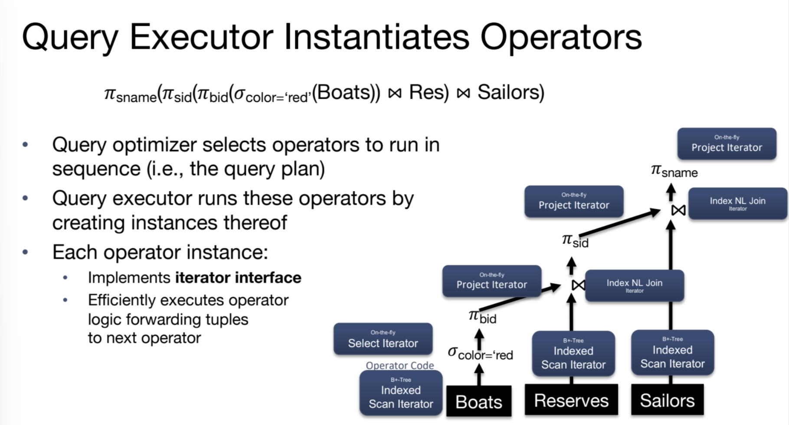

# Relational Operators
## Query Plans
> [!def]
> 
> Basically parent relational operator will call child relational operator and execute them and then collect results from the child operators' results.

## Iterator Interface
> [!def]
> 
> **In other words:**
> - Streaming operator will return a result from its requestee immediately after it receives that result.
> - Blocking operator will not return the results until the requestee has returned all the results. Like a greedy collector.
> 
> 

# Iteration Algorithms
## Select Operator
> [!example] Streaming Operator
> 

## Heap Scan Operator
> [!example] Streaming Operator
> 

## Sort Operator
> [!example] Blocking Operator
> 

## Group By Operator
> [!example] Blocking Operator
> 

## Single-Threaded Summary
> [!summary]
> 

# Loop-based Join Algorithms
## Schema&Costing 
> [!def]
> 
> Another concept is inner relation and outer relation, the inner here means the relation that appears in the inner loop of our nested loop algorithms.

## SNLJ
### Simple Nested Loops Theta Join
> [!def]
> 

### Changing Join Order
> [!def]
> 

## PNLJ
> [!def]
> 

> [!example] Vitamin
> Consider the join(R, S) on R.a = S.b, given the following information about the relations to be joined. The cost metric is the number of page I/Os unless otherwise noted, and the cost of writing out the result should be uniformly ignored. For join(R, S) assume R is the outer loop and S the inner loop.
> - Relation R contains 10,000 tuples and has 10 tuples per page.
> - Relation S contains 2000 tuples and also has 10 tuples per page.
> - Attribute b of relation S is the primary key for S.
> - Both relations are stored as simple heap files.
> - Neither relation has any indexes built on it.
> - 52 buffer pages are available.
> 
> **What is the cost of joining R and S using a page-oriented nested loop join?** 
> 
> Since $R$ is the outer relation, by the formula we have $[R]+[R]\times [S]=\frac{10000}{10}+\frac{10000}{10}\times\frac{2000}{10}=201000$
> 
> **What is the minimum number of buffer pages required for the cost of the above question to remain the same?**
> 
> We need 3 buffer pages at minimum, one for R input page, one for S input page, one for output buffer.

## BNLJ
> [!def]
> 
> **Note:**
> - Here we need 1 buffer page for inner relation, 1 buffer for output, B - 2 buffer for outer relation. 
> - B-2 = Buffer page size - input frame for S - buffer frame for output

> [!example] Vitamin
> Consider the join(R, S) on R.a = S.b, given the following information about the relations to be joined. The cost metric is the number of page I/Os unless otherwise noted, and the cost of writing out the result should be uniformly ignored. For join(R, S) assume R is the outer loop and S the inner loop.
> - Relation R contains 10,000 tuples and has 10 tuples per page.
> - Relation S contains 2000 tuples and also has 10 tuples per page.
> - Attribute b of relation S is the primary key for S.
> - Both relations are stored as simple heap files.
> - Neither relation has any indexes built on it.
> - 52 buffer pages are available.
> 
> **What is the cost of joining R and S using a block nested loop join?** 
> 
> Since $R$ is the outer relation, by the formula we have $[R]+block_{num}\times [S]=\frac{10000}{10}+\frac{\frac{10000}{10}}{52-2}\times\frac{2000}{10}=5000$
> 
> **What is the minimum number of buffer pages required for the cost of the above question to remain the same?**
> 
> We need 52 buffer pages at minimum, 52-2 = 50 for R input block, one for S input page, one for output buffer.

## INLJ
> [!def]
> 
> For unclustered index, since the pointer to RID is in random manner, in order to find all the matching records we have to traverse multiple pages while for clustered index, the record is clustered so we expect less page I/Os to happen.
> 
> Here for alt 2 index, the runtime is approximately computed as follows:
> 1. For **clustered index**, we have: I/O = $log_F(num~of~leaves)$(height of the index) + 1(read leaf page) + $\lceil\frac{num~of~matching~tuples}{tuples~per~page}\rceil$
> 2. For **unclustered index**, we have: I/O = $log_F(num~of~leaves)$(height of the index) + 1(read leaf page) + num of matching tuples

> [!example] Concept Check
> 

> 

## Comparison Example
> [!example] Fa20 Disc06 P1
> 

> [!algo] SNLJ
> 

> [!algo] PNLJ
> Assume that C is the outer relation, we have I/O = $50+50\times 100=5050~I/Os$

> [!algo] BNLJ
> 

> [!algo] INLJ 
> 

# Sort-Merge Join Algorithms
## Algorithm Procedures
> [!algo]
> 
> **Note** that the reason why we have to go back to mark(S) is that in sql join we want all the tuples that satisfies the $r_i=s_j$ to be in the result set. In other words, sort-merge join treats records from $R$ and $S$ as different(so we have to include matching records from $S$ multiple times by moving back to mark(S) first) while merge sort treat records from $R$ and $S$ as the same.
> 
> 
> The worst case could be that we are joining a table with itself, and the joining key of this table contains only one value. In this case we are just doing a cross product.
> 
> Note that the final expression for the I/O cost is computed using the formula:
> 

> [!example] Example in Notes
> 

## Optimizations
### Join First, Sort Later - NLJ + SMJ
> [!algo]
> 

### Sort First, Join Later - SMJ
> [!important]
> 

### SMJ Refinements
> [!concept]
> In SMJ, we have two phases, we first sort $R$ and $S$ independently, then merge them using the algorithm.
> 
> But we could improve the runtime performance by doing the merging across $R$ and $S$ while sorting. In other words, each sorted run now contains both records from $R$ and $S$.
> 
> Bascially the formula is: read and write at pass 0($2\times([R]+[S])$), read and merge at pass 1($[R]+[S]$), so in total the runtime is $3\times([R]+[S])$.

## Cost Analysis
> [!important] Runtime Cost
> Suppose we have two relations $R$ and $S$ and $B$ buffer pages, we want to use SMJ to join them, then:
> - Without optimization, we first sort $R$ and $S$ independently then merge them together. 
> 	- Sorting $R$ and $S$ takes $2\times [R](1+log_{B-1}\lceil\frac{[R]}{B}\rceil)$ and $2\times [S](1+log_{B-1}\lceil\frac{[S]}{B}\rceil)$ respectively. If we enforce 2-pass requirement, then it is $2\times [R](1+1)=4\times [R]$ and $4\times [S]$ respectively.
> 	- Merging steps requires reading both the pages from $R$ and $S$, so it is $[R]+[S]$ in total.
> 	- Adding up we get $2\times [R](1+log_{B-1}\lceil\frac{[R]}{B}\rceil)+2\times [S](1+log_{B-1}\lceil\frac{[S]}{B}\rceil)+[R]+[S]$.
> 	- Under 2-pass framework, we get $4\times ([R]+[S])+([R]+[S])=5\times([R]+[S])$.
> - With optimization, we will sort $R$ and $S$ together at pass 0, and merge them as we have seen in [N-Way External Merge Sort](1_Sorting&Hashing.md#N-Way%20External%20Merge%20Sort), 
> 	- The cost is thus $2\times([R]+[S])$(read and write) at pass 0. 
> 	- At pass 1, 2, 3, ...., the total runtime is $2\times ([R]+[S])\times log_{B-1}\lceil\frac{[R]+[S]}{B}\rceil)-1$. The $-1$ since we don't need to materialize at the write stage of the last pass.
> 	- If we enforce 2-pass requirement, then it is $2\times([R]+[S])\times(1+1)-1=3\times([R]+[S])$ in total.

> [!important] Memory Cost
> Suppose we have two relations $R$ and $S$ and $B$ buffer pages, we want to use SMJ to join them within $p$ passes, then assuming 2-pass requirement we have:
> - Without optimization, we require $$\frac{\frac{[R]}{B}}{B-1}\leq 1$$ and $$\frac{\frac{[S]}{B}}{B-1}\leq 1$$, taking together we mean: $$\frac{\frac{max\{[R],[S]\}}{B}}{B-1}\leq 1$$ and thus $$B(B-1)\geq \max\{[R],[S]\}$$
> - With optimization, we require $$\frac{\frac{[R]+[S]}{B}}{B-1}\leq 1$$ and thus $$B(B-1)\geq [R]+[S]$$

## Analysis Examples
> [!example] Fa20 Disc06 P1
> 

> [!example] Vitamin
> Consider the join(R, S) on R.a = S.b, given the following information about the relations to be joined. The cost metric is the number of page I/Os unless otherwise noted, and the cost of writing out the result should be uniformly ignored. For join(R, S) assume R is the outer loop and S the inner loop.
> - Relation R contains 10,000 tuples and has 10 tuples per page.
> - Relation S contains 2000 tuples and also has 10 tuples per page.
> - Attribute b of relation S is the primary key for S.
> - Both relations are stored as simple heap files.
> - Neither relation has any indexes built on it.
> - 52 buffer pages are available.
> 
> **What is the cost of joining R and S using SMJ within 2-pass.** 
> 
> Since $R$ is the outer relation, by the formula we have $5\times([R]+[S])=6000$ I/Os.
> 
> **What is the minimum number of buffer pages required for the cost of the above question to remain the same(within 2 pass)?**
> 
> We need 33 buffers, which can be calculated as $B^{2}\geq B(B-1)\geq \max\{[R],[S]\}$ where $B\geq \frac{1+\sqrt{4001}}{2}=32.126\approx 33$.

# Hash Join Algorithms
## Naive Hash Join
> [!def]
> 

> [!bug] Caveats
> 

## Grace Hash Join
### Motivation
> [!property]
> 
> The idea behind grace hash join is the property above where we can divide the hash join algorithm into smaller subproblems without losing integrity and correctness.

### Algorithm Procedures
> [!algo]
> 

> [!def] Sketch
> 

> [!example]
> See [11-iterators-joins-2](11-iterators-joins-2.pdf)
> 
> Note that **the only requirement of this method is that the smaller relation partition inside an arbitrary partition should fit into the B-2 buffers.**
> 
> If in some table for some attribute(like gender), we cannot partition it into small partitions that fit into the B-2 buffers, then we cannot use this method at all, there is no way to build in-memory hash-table.

> [!example] Partition Size
> 

> [!example] Hash Function Choice
> 
> The key reason is that the purpose of partition and probing is different:
> - Partition aims to break the input pages into smaller partitions so that the tuples with the keys that have the same hash value will go to the same partition, forming some kind of grouping.
> - Probing aims to associate the probing relation with the in-memory hash table, used for matching the output tuples.

### Cost of Grace Hash Join
> [!code] Runtime Analysis
> Note that the analysis here is simplified. Since typically for partitioning phase, we will have to write out at least as many pages as we read into the buffer. So the I/O given below is an underestimate.
> 

> [!example] Fa20 Disc06 P2
> 
> **Here the first partition steps goes like the following:**
> - There are 100 + 50 pages for Catalog and Transaction table in total, we hash all these 150 pages of data using 1 input buffer and 10 - 1 = 9 output buffers.
> - Since the hash function is uniform for both tables, this means for each output partition, it contains $\lceil\frac{150}{9}\rceil=17$ pages, inside of which roughly $\frac{50}{100+50}=\frac{1}{3}$ of them($\lceil\frac{17}{3}\rceil=6$) are from Transaction table.
> - Since $6<B-2=8$, the smaller relation inside each partition can fit in the buffer, thus we do not need recursive partitioning.
> 
> 

# Summary
> [!concept]
> 

