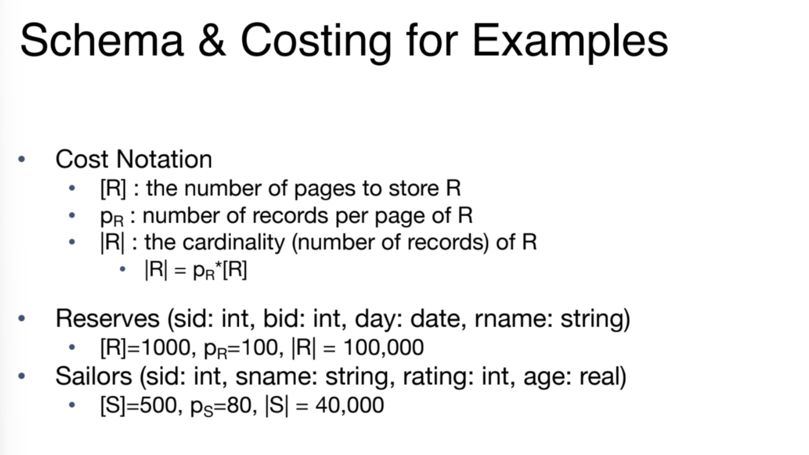
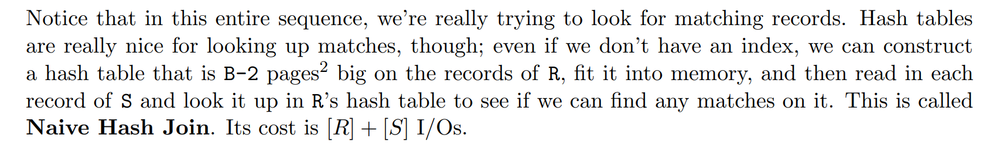

# Relational Operators
## Query Plans
> [!def]
> 
> Basically parent relational operator will call child relational operator and execute them and then collect results from the child operators' results.

## Iterator Interface
> [!def]
> 
> **In other words:**
> - Streaming operator will return a result from its requestee immediately after it receives that result.
> - Blocking operator will not return the results until the requestee has returned all the results. Like a greedy collector.

# Iteration Algorithms
## Select Operator
> [!example] Streaming Operator
> 

## Heap Scan Operator
> [!example] Streaming Operator
> 

## Sort Operator
> [!example] Blocking Operator
> 

## Group By Operator
> [!example] Blocking Operator
> 

## Single-Threaded Summary
> [!summary]
> 

# Loop-based Join Algorithms
## Schema&Costing 
> [!def]
> 

## Simple Theta Join
### Simple Nested Loops Theta Join
> [!def]
> 

### Changing Join Order
> [!def]
> 

## Page Nested Loop Join
> [!def]
> 

## Chunk Nested Loop Join
> [!def]
> 
> **Note:** B-2 = Buffer page size - input frame for S - buffer frame for output

## Index Nested Loops Join
> [!def]
> 
> For unclustered index, since the pointer to RID is in random manner, in order to find all the matching records we have to traverse multiple pages while for clustered index, the record is clustered so we expect less page I/Os to happen.

# Sort-Merge Join Algorithms
## Algorithm Procedures
> [!algo]
> 
> **Note** that the reason why we have to go back to mark(S) is that in sql join we want all the tuples that satisfies the $r_i=s_j$ to be in the result set. In other words, sort-merge join treats records from $R$ and $S$ as different(so we have to include matching records from $S$ multiple times by moving back to mark(S) first) while merge sort treat records from $R$ and $S$ as the same.
> 
> 
> The worst case could be that we are joining a table with itself, and the joining key of this table contains only one value. In this case we are just doing a cross product.
> 
> Note that the final expression for the I/O cost is computed using the formula:
> 

> [!example]
> 

## Comparisons
### Join First, Sort Later - NLJ + SMJ
> [!algo]
> 

### Sort First, Join Later - SMJ
> [!important]
> 

## Refinements
> [!concept]
> In SMJ, we have two phases, we first sort $R$ and $S$ independently, then merge them using the algorithm.
> 
> But we could improve the runtime performance by doing the merging across $R$ and $S$ while sorting. In other words, each sorted run now contains both records from $R$ and $S$.
> 

# Hash Join Algorithms
## Naive Hash Join
> [!def]
> 

> [!bug] Caveats
> 

## Grace Hash Join
### Motivation
> [!property]
> 
> The idea behind grace hash join is the property above where we can divide the hash join algorithm into smaller subproblems without losing integrity and correctness.

### Algorithm Procedures
> [!algo]
> 

> [!def] Sketch
> 

### Example
> [!example]
> See [11-iterators-joins-2](11-iterators-joins-2.pdf)
> 
> Note that the only requirement of this method is that the partition of the smaller relation should fit into the B-2 buffers.
> 
> If in some table for some attribute(like gender), we cannot partition it into small partitions that fit into the B-2 buffers, then we cannot use this method at all, there is no way to build in-memory hashtable.

### Cost of Grace Hash Join
> [!code] Runtime Analysis
> 

# Summary
> [!concept]
> 

