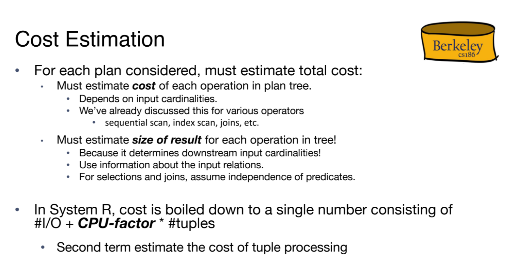
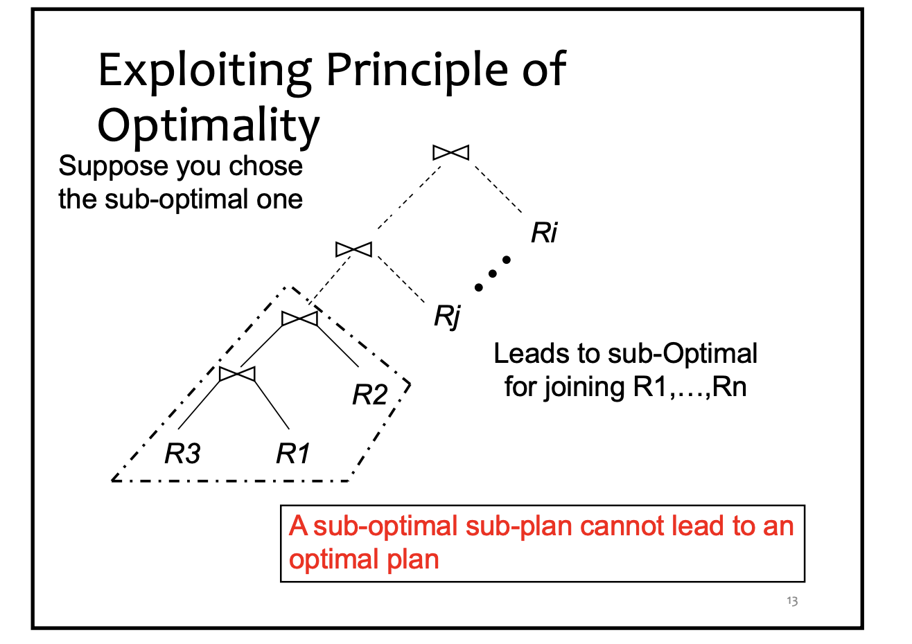
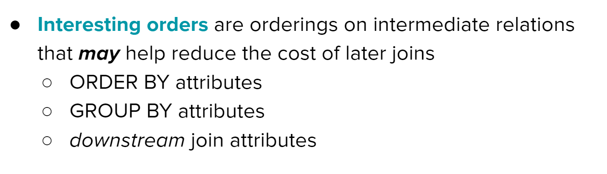
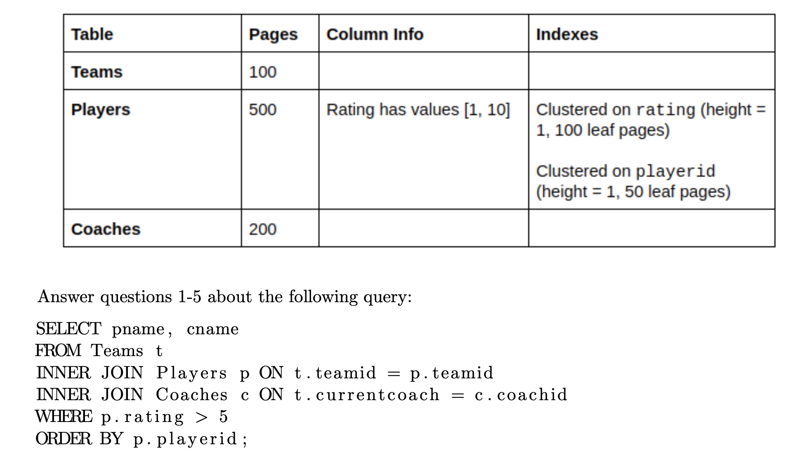

# Query Lifecycle
> [!overview] 
> 

# Query Parsing
> [!overview] 
> 

# Query Rewriting
> [!overview]
> 

## Relational Algebra Equivalences
> [!def]
> 
> Join is communicative but not necessarily associative:
> 
> 

## Join Ordering
> [!important] 
> 

## Rewriting Selection
> [!example]
> 

## Rewriting Projections
> [!example]
> 

## Integrated Example
> [!example]
> 

### Naive Plan
> [!example] Plan 1
> 

### Selection Pushdown
> [!example] Plan 2
> 

> [!example] Plan 3
> 
> Here if we are using NLJ(nested loop join), we could scan less pages such that total I/Os would be $500+250\times (\leq 1000)$.

### Join Ordering
> [!example] Plan 4
> 

### Materialization for Selection On-the-fly
> [!example] Plan 5
> 

### Mat + Join Ordering
> [!example]
> 

### Sort-Merge Join Algorithms
> [!example] Plan 7
> 

### Mat + Block Nested Loop
> [!example]
> 

### Projection Cascade&Pushdown
> [!example]
> 

### Index Nest Loop
> [!example]
> 

### Summary
> [!summary]
> 

# Query Optimizations
## System R Optimizer Framework
> [!overview]
> 
> In System R:
> 1. The **query parser** first checks for correctness and authorization (user permissions to access the table). It then generates a parse tree out of the query. This step is usually fairly straightforward, since it’s just breaking up the query into chunks that our programming language can understand, without having to make any decisions.
> 2. Next, the **query rewriter** converts queries into even smaller query blocks (like a single WHERE clause), and flattens the views.
> 3. Once the query is rewritten, it gets passed into the **query optimizer**. The primary goal of a query optimizer **is to translate a simple query plan into a better query plan**. A cost-based query optimizer processes one query block at a time (e.g. select, project, join, group by, order by)

> [!example] Concept Check
> 

## Components of Query Optimizer
### Query Plan Space
> [!def]
> 

### Query Blocks
> [!def]
> 
> Left-deep tree ensures that we will always have tuples from the right hand side of the operator.

### Cost Estimation
> [!def]
> 

 
## Selectivity Estimation with Formulas
> [!overview]
> Since the number of rows in our output depends heavily on the data and what selections we make out of it, we need a way to estimate the size of outputs after each operation. This is known as **selectivity estimation.**
> 
> Like evaluating query cost, selectivity estimation is very rough and generally prioritizes speed over accuracy- so much so that **if we don’t have enough information, we just assign an operation the arbitrary selectivity value of** 1/10 (meaning that the the output has 1/10 of the number of rows as the input).

### Common Formulas
> [!thm]
> 

### Join Selectvity
> [!def]
> 

### Result Size Estimation
> [!def]
> 

### Practice Examples
> [!example] Fa20 Disc07 P1
> 

## Selectivity Estimation with Statistics
### Assumptions
> [!important]
> 

### Selectivity of Conjunction
> [!def]
> 

### Selectivity of Disjunction
> [!def]
> 

### Column Equality
> [!def]
> 
> The reason why we divide by n is that we want to normalize it to a probability distribution. Here height(binp(40)) is the number of samples within the bin that contains 40, n is the total number of samples. So `height(binp(40)) / n` is the probability that a sample belongs to the bin that contains 40.

# Selinger Algorithm
## Algorithm Assumptions
### System R Heuristics
> [!def]
> 
> Note that the join plan space is exponential. But with left deep join assumption the plan space is permutation in $N$(i.e.$N!$) where $N$ is the number of relations to be joined. 
> 
> 
> 
> Since for we could permute the relation in the tree to get a different plan.
> 
> So even with left deep join heuristics, the join query plan space is still very huge.

### Selinger Optimizer
> [!important]
> Selinger Optimizer assmes all of the heuristics of system R:
> 1. Consider only left deep join plan space.
> 2. Unary operators like selection and projection are pushed down as far as possible.
> 3. Do not consider cross join unless they are the only option.
> 
> Selinger Optimizer has the following properties:
> 1. The Selinger optimizer doesn't output a globally optimal query plan since the optimal one may not be left-deep join.
> 2. The Selinger optimizer output a globally optimal left-join query plan if the estimated cost is exactly the actual cost.
> 
> The plan space size of Selinger Optimizer:
> 

### Principle of Optimality
> [!important]
> 

### Interesting Orders
> [!def]
> 

## Algorithm Procedures
> [!overview]
> 

### Pass 1: Single Table Access Plan
> [!def]
> The first pass of System R determines how to access single tables optimally or interestingly.

#### Phase 1: Scanning 
> [!def]
> 
> **Advantages of Full Scan:**
> - A full table scan is straightforward and does not depend on the existence or condition of any indexes.
> - When a query needs to access a significant portion of the rows in a table, a full table scan can be more efficient than using an index. This is because it involves sequential disk reads, which are faster than the random reads required for accessing data through an index in some cases.
> 
> **Advantages of Index Scan:**
> - Indexes can be designed to support specific query operations like ordering and grouping more efficiently than a full table scan would.
> - Index scans are advantageous for selective queries where only a small subset of rows needs to be fetched based on specific column values.
> 
> **Use an Index Scan when**:
> - The query affects a small portion of the table.
> - There's a well-designed index that matches the query conditions.
> - You need to quickly locate specific rows.
> 
> **Consider a Full Table Scan when**:
> - The query needs to access a large portion of the table.
> - There's no suitable index available.
> - The cost of using an index (such as disk I/O for random access) outweighs the benefits for the specific query workload.
> 

> [!important] Alt 1 Indexing Cost
> 

> [!important] Alt 2/3 Indexing Cost
> 

#### Phase 2: Advancing - Optimality&Interesting Orders
> [!def]
> 
> **Several things to note:**
> 1. Each 1-relation table plan need at least one plan to advance. For example if we are joining on three tables $A,B,C$, then we have to propose a plan for each of these tables for the return value of the base case.
> 2. For each single table, we need to propose the best plan(in terms of I/O costs) and an interesting order plan. So there could be multiple plans being advanced from each base case.

### Pass 2...n: Downstream Joins
> [!def]
> 
> **Several things to note:**
> 1. We don't consider those plans that are not left deep join. Like $A \bowtie (B\bowtie C)$
> 2. We don't consider the plan that are not advanced from previous pass. For example in pass 1, we don't advance $A \bowtie B$ then in pass 2 we won't advance $(A \bowtie B)\bowtie C$ to pass 3.
> 4. We will advance the best plan(in terms of I/O costs) and an interesting order plan for ORDER BY or GROUP BY since WHERE has been pushed down.
> 
> 

> [!code] Pseudocode
> 

### Summary
> [!overview]
> 

> [!def]
> 

## Algorithm Discussions
### Why Left-Deep-Join
> [!important]
> In the join algorithm, the outer loop(left relation) needs to wait until all results are ready from inner relations to proceed joining operation. 
> - Try to think in sort merge join where for each outer relation record, if there is a match, we have to scan all the records from the inner relation(right relation). This requires the right relation to be fully computed. Otherwise we may not see all the matching records.
> - Left-deep join supports pipelining since we can process the output record from left relation on-the-fly(incrementally, without having to materialize) while the right relation is always fully computed(we don't have to wait).
> - For example, (A join B) join C is left-deep join where A join B can be processed on the fly while C is always fully ready. On the other hand, A join (B join C) is a right-deep join where A has to wait until the (B join C)'s completion to start joining.

# Query Plan Searching Examples
## Methodology
> [!important] 
> Suppose we have the following three relations: 
> - R(a,c)
> 	- R has 1000 data pages, and 10000 records
> 	- R.a has a 2-level alt2 unclustered index
> 		- Uniform between [1, 10]
> 		- 50 leaf pages
> 	- R.c has a 2-level **alt1** index
> 		- Uniform between [1,20]
> 		- 1000 leaf pages/data pages
> - S(b,c)
> 	- S has 2000 data pages and 40000 records
> 	- S.b has a 3-level alt2 clustered index
> 		- Unknown value distribution.
> 		- 120 leaf pages
> 	- S.c has a 4-level alt2 unclustered index
> 		- Unknown value distribution.
> 		- 300 leaf pages
> - T(a,c) 
> 	- T has 3000 data pages and 30000 records
> 	- T.c has a 3-level alt2 clustered index
> 		- Unknown value distribution.
> 		- 150 leaf pages
> 
> and now we are joining them together with the following join clause:
> `SELECT R.a, S.b FROM R join S on R.b = S.b join T on S.c = T.c WHERE R.a > = 5 AND T.c <= 20 GROUP BY T.c ORDER BY R.a`
> 
> We first consider the single table access pattern, we have to calculate the following:
> - For R, we have the following access patterns:
> 	- **Full scan** on R, which has I/O cost: 1000 I/Os.
> 	- **Index Scan** on R.a, 
> 		- Selectivity: We first push down the `R.a >= 5` predicate, calculate its selectivity, which is $\frac{1}{2}$.
> 		- I/O cost: 
> 			- Alt 2 unclustered index, cost = height of index + (num of leaf pages + num of records) * selectivity
> 			- $2+(50 + 10000) \times \frac{1}{2}=5027$ IOs.
> 	- Index Scan on R.c:
> 		- Selectivity: No predicate on this column, selectivity is 1.
> 		- I/O Cost: 
> 			- Alt 1 index, cost = height of index + num of leaf pages * selectivity
> 			- $2+ 1000=1002$ IOs.
> 	- **The number of records passed on to the next operator** is $1000\times \frac{1}{2}=500$ pages.

## Example 1: Integrated Example
> [!example] Note09
> 
> Note that here the join is not SMJ, in other words, it is not a sorted join, so we will only consider the plan that has the lowest I/O cost.

## Example 2 Single Table Access Plan
> [!example] Fa20 Disc07 P2 - Single Table Access Plans
> 

## Example 3: Multi-table Plan
> [!example] Fa20 Disc07 P2 - Multi-Table Plan
> 

