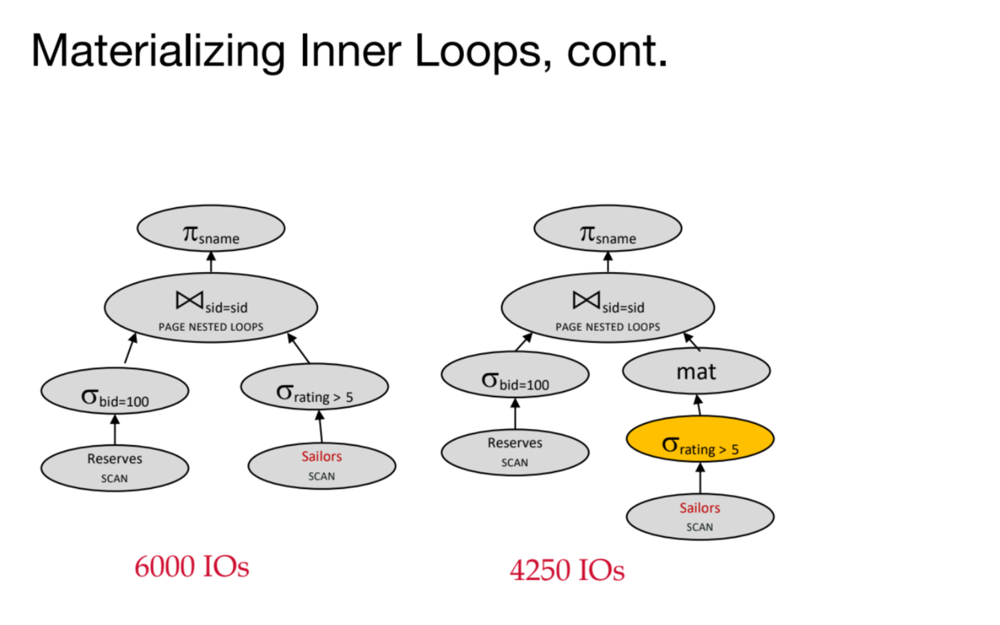

# Query Lifecycle
> [!overview] 
> 

# Query Parsing
> [!overview] 
> 

# Query Rewriting
> [!overview]
> 

## Relational Algebra Equivalences
> [!def]
> 
> Join is communicative but not necessarily associative:
> 
> 

## Join Ordering
> [!important] 
> 

## Rewriting Selection
> [!example]
> 

## Rewriting Projections
> [!example]
> 

## Integrated Example
> [!example]
> 

### Naive Plan
> [!example] Plan 1
> 

### Selection Pushdown
> [!example] Plan 2
> 

> [!example] Plan 3
> 
> Here if we are using NLJ(nested loop join), we could scan less pages such that total I/Os would be $500+250\times (\leq 1000)$.

### Join Ordering
> [!example] Plan 4
> 

### Materialization for Selection On-the-fly
> [!example] Plan 5
> 

### Mat + Join Ordering
> [!example]
> 

### Sort-Merge Join Algorithms
> [!example] Plan 7
> 

### Mat + Block Nested Loop
> [!example]
> 

### Projection Cascade&Pushdown
> [!example]
> 

### Index Nest Loop
> [!example]
> 

### Summary
> [!summary]
> 

# Query Optimizations
## System R Optimizer Framework
> [!overview]
> 
> In System R:
> 1. The **query parser** first checks for correctness and authorization (user permissions to access the table). It then generates a parse tree out of the query. This step is usually fairly straightforward, since it’s just breaking up the query into chunks that our programming language can understand, without having to make any decisions.
> 2. Next, the **query rewriter** converts queries into even smaller query blocks (like a single WHERE clause), and flattens the views.
> 3. Once the query is rewritten, it gets passed into the **query optimizer**. The primary goal of a query optimizer is to translate a simple query plan into a better query plan. A cost-based query optimizer processes one query block at a time (e.g. select, project, join, group by, order by)

## Components of Query Optimizer
### Query Plan Space
> [!def]
> 

### Query Blocks
> [!def]
> 
> Left-deep tree ensures that we will always have tuples from the right hand side of the operator.

### Cost Estimation
> [!def]
> 

 
## Selectivity Estimation wit Formulas
> [!overview]
> Since the number of rows in our output depends heavily on the data and what selections we make out of it, we need a way to estimate the size of outputs after each operation. This is known as **selectivity estimation.**
> 
> Like evaluating query cost, selectivity estimation is very rough and generally prioritizes speed over accuracy- so much so that **if we don’t have enough information, we just assign an operation the arbitrary selectivity value of** 1/101/101/10 (meaning that the the output has 1/10 of the number of rows as the input).

### Common Formulas
> [!thm]
> 

### Join Selectvity
> [!def]
> 

### Result Size Estimation
> [!def]
> 

### Practice Examples
> [!example] Fa20 Disc07 P1
> 

## Selectivity Estimation with Statistics
### Assumptions
> [!important]
> 

### Selectivity of Conjunction
> [!def]
> 

### Selectivity of Disjunction
> [!def]
> 

### Column Equality
> [!def]
> 
> The reason why we divide by n is that we want to normalize it to a probability distribution. Here height(binp(40)) is the number of samples within the bin that contains 40, n is the total number of samples. So `height(binp(40)) / n` is the probability that a sample belongs to the bin that contains 40.

## Cost Estimation
> [!overview]
> 

> [!def]
> 

> [!example]
> 

## Search Algorithms
### System R Heuristics
> [!def]
> 

### Join: Enumeration of Left-Deep Plans
> [!def]
> 

