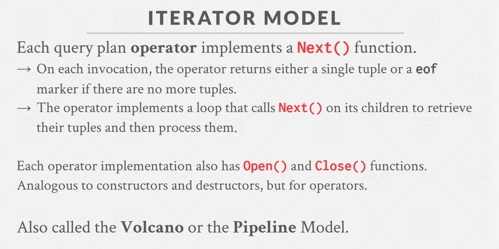
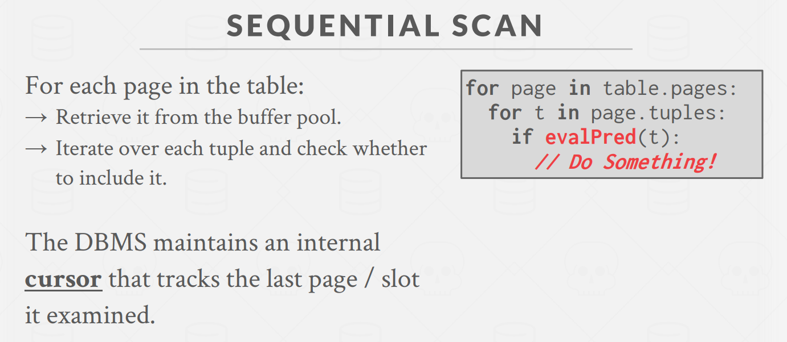

# Processing Model
> [!def]
> 

## Iterator Model
### Definition
> [!def]
> 

### Pros and Cons
> [!important]
> 

## Materialization Model
### Definition
> [!def]
> 

### Pros and Cons
> [!important]
> 

## Vectorization Model
### Definition
> [!def]
> 

### Pros and Cons
> [!important]
> 

## Plan Processing Direction
> [!important]
> 

# Access Methods
## Definition
> [!def]
> 
> Access method is a way to read data from disk.

## Sequential Scan
> [!def]
> 

## Multi-Index Scan
> [!def]
> 

