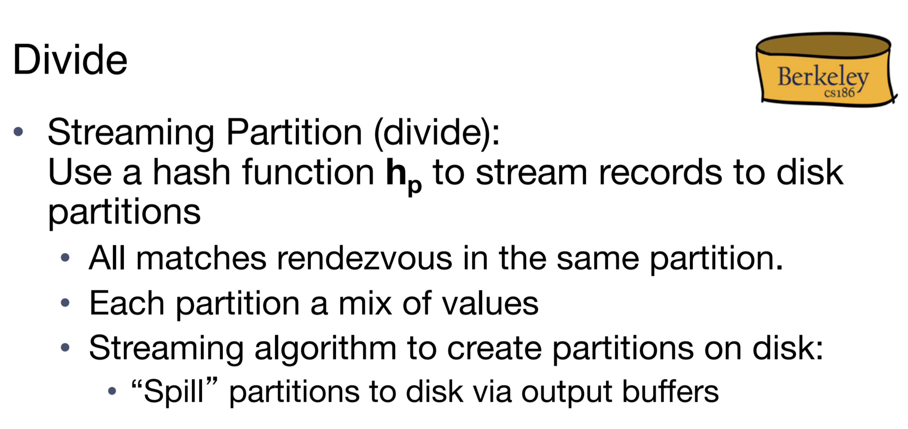

# Data Loading Process
> [!overview] 
> This chapter talks about how we load a page from the disk into the memory and later on write it back to the disk.
> 
> There are generally two patterns: 
> - Single passing streaming 
> - Double buffer streaming.

## Single Passing Streaming
> [!def]
> Say we want to apply a function to all the records on several pages. 
> 
> **Why not clear the buffer each time we write to the output buffer?**
> 
> To reduce the total number of I/Os. Basically if we flush the output buffer each time we write a new, modified records to the output buffer, then since there are huge number of records within a page, we will generate lots of I/Os.

## Double Buffer Streaming
> [!def]
> 

# Sorting&Hashing Overview
> [!overview]
> 
> 

# Sorting - Order By
## Overview
> [!overview]
> 
## Terminology
> [!def]
> We will encounter several terms that are heavily used:
> 1. **Sorted Run:** **The resulting page** that's produced by merging some pages together. 
> 2. **N-page sorted run:** The size of the sorted run is n pages.
> 3. **Pass:** A single step of sorting process. Pass 0 is sorting on initial pages. Pass 1, 2, 3 is merging different pages into larger ones.

## 2-Way External Merge Sort
> [!algo]
> 
> Here the extra +1 at the end accounts for the initial sorting we have to do to the records in each page.

## N-Way External Merge Sort
> [!concept]
> 
> **Note** that here we can still use double buffering techniques to speed up the whole process. Since we have to wait until the input buffer(B-1 pages) to be consumed to load new chunks of pages. But with double buffering, even if we sacrifice a little bit on the branching(we need to spare some buffer pages for a second thread), overall we could still get a reasonable speedup.

> [!example] Practice Question
> 

> [!solution] Practice Question Solution
> For question (a):
> - Pass 0: $\lceil\frac{1960}{8}\rceil=245$ sorted runs of 8 pages.
> - Pass 1: $\lceil\frac{245}{7}\rceil=35$ sorted runs of $7\times 8=56$ pages.
> - Pass 2: $\lceil\frac{35}{7}\rceil=5$ sorted runs of $7*56=392$ pages.
> 
> For question (b):
> - Pass 0: 245 sorted runs(merged pages).
> - Pass 1: 35 sorted runs(merged pages).
> - Pass 2: 5 sorted runs(merged pages).
> 
> For question (c): By the formula: $2N\times( log_{B-1}(\lceil\frac{N}{B}\rceil)+1)=2\times 1960\times (3+1)=15680$ I/Os.
> 

## Number of Pass
> [!def]
> 

## Memory Requirements
> [!important]
> 
> Here B represents the size of the buffer pool, which is B pages.
> What this is saying is that if we have data that occupies X pages, then in order to finish sorting these data **within two passes**, we will need **at least** $B=\sqrt{X}$-page-large buffer pool.
> 
> To calculate it precisely, we will follow the schema below:
> Suppose we have $B$ pages in our buffer and we have to sort $X$ amount of data. Then within two passes, we can at most span $B(B-1)$ amount of memory, so we solve for the smallest integer $B$ that satisfies the inequality $$B(B-1)\geq X$$
> 
> The following example shows the whole calculation process:

> [!example] Practice Question
> 

> [!solution]
> 

# Hashing - Group By
## Overview
> [!overview]
> 
> The goal of hashing is to find a group within which all the keys are the same.

## Phase 1: Dividing
> [!def]
> 
> **Two things to notice:**
> 1. Since we cannot load all the pages into the memory at once, we will have to build different hash tables. But this could cause the same key to appear in different buckets across different hash tables. This causes problem during further concatenation process.
> 2. We must guarantee that if a key is in the memory, then all of its occurrence must also be in the memory within the same read event.
> 3. This is guaranteed by the above dividing process. The first partitioning pass will hash each record to B − 1 partitions. A partition is a set of pages such that the values on the pages all hash to the same value (for the hash function used to construct the partition). We do this by using **B − 1 output buffers**. 
> 	1. When an output buffer fills up we flush the page to disk. 
> 	2. When that buffer fills up the next time, we place it adjacent to the page we flushed to disk before from that same buffer. 
> 4. The most important property of each partition is that **if a certain value appears in that partition, all occurrences of that value in our data appear in that partition**. In other words, if “Brian” appears in that partition, “Brian” will not appear in any other partition. This is because “Brian” always hashes to the same value, so it cannot possibly end up in a different partition. **This could result in a partition to be too big to fit into the memory(discussed below)!**
> 5. **We only have B − 1 partitions because we need to save one buffer frame to be the input buffer.**

## Phase 2: Rehash
### Rehasing Procedure
> [!def]
> 
> 
> 
> Note that all the above operation assumes that each partitions from phase 1 is smaller than B pages(size of the buffer pool). If there are partitions larger than B pages, we will have to introduce the following recursive partitioning algorithm to chop the original partitions into smaller pieces so as to fit into the memory.

### Recursive Partitioning
> [!important]
> 
> The following algorithm makes sure that the partitions are small enough to be fit into the memory.
> 
> 
>
> The reason why we still need the second phase is that:
> 1. **Dividing** only makes sure each partition is within B pages(size of the buffer pool), it doesn't satisfy the important property(same value in the same partition).
> 2. **Conquering** ensures the important property by hashing the same value to the same partition again. 
> 3. Note that we choose $h_r$ as our hashing function(must be different from $h_p$) here since if we choose $h_p$ again we may risk hashing to a big partition again.

### Duplicates - Termination Point
> [!def]
> 
> When a key is very frequent, during phase 1 we may hash all of this frequent value to the same partition, causing this partition to be too big. But if we opt to recursive partitioning, attempting to reduce the size of the partition, we will find that the value are always hashed to the same partition again since there is **no variety in the original partitioning**. For example, the gender column only has two possible values ("male" and "female"), recursive partitioning will hash all the male to the same partition, which causes **infinite recursion**.
> 
> So the best option in this case is to stop and don't do recursive partitioning at all since we have already found the group(male group), which is the termination point of our hashing process.

## Memory Requirement
> [!concept]
> 

## Analysis of Hashing
> [!important]
> 

> [!example]
> 

> [!solution] Solution
> 

## Easy Calculation
> [!concept]
> 

## Examples
> [!example] 
> 

# Parallelized Hashing
> [!important] Mapping Phase
> 

> [!important] Reduce Phase
> Sorting matters since it matters what machine gets what tuples since we are trying to produce one single file at the end.
> 
> The idea is that different range of records(from different range)will reside on different machines. Remember, we should not use hashing in the phase because we no longer want to put data in different buckets, we want data to appear organized in order.
> 
> To resolve unbalanced distribution, we could draw a histogram of the records where the x-axis is the range and y-axis is the number of records within the range. Then according to the histogram we can distribute the records evenly.

