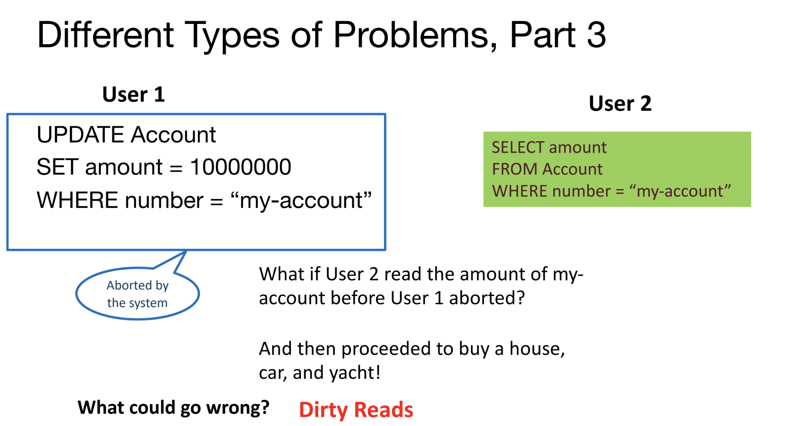
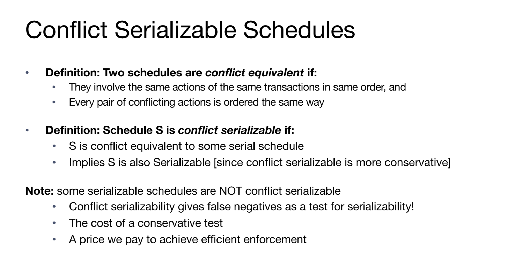

 # Transactions
## Dangerous Operations on DB
> [!motiv] Motivation
> Many users can make requests to a database at a time which can cause concurrency issues. What happens when one user writes and then another user reads from the same resource? 
> 
> What if both users try to write to the same resource? There are several problems we can run into when several users are using the database at the same time if we’re not careful:
> 

### Inconsistent Reads
> [!example]
> 
> Now suppose the user 2 read from product again he would get a different result, so different reads give different results, which is an instance of inconsistent read.

### Lost Updates
> [!example]
> 
> The right logic should be user 1 made his change, and based on user1's change, user 2 made his change. 
> 
> But in the above scheme, user 1 and user 2 are making their changes independently.

### Dirty Reads
> [!example]
> 
> User 2 reads an invalid number(updated failure) from the data base.

## Transaction Definition
> [!def]
> 
> Can be understood as a bunch of CPU instructions that has its logic flow. 
> 
> But the execution flow of these instructions depends on the scheduling of processes by CPU.
> 

## ACID Properties
> [!property]
> 

### Isolation
> [!def]
> 
> In short, isolation preserves the logic flow of each transaction despite the interleaving essense of their execution flow.

### Atomicity and Durability
> [!def]
> 
> This means that if after committing the current transaction but before writing the update to the disk, the DBMS should do a sanity check(keep a log of actions) to see if there is any failure in the current commission. 
> - If there is, then DBMS should roll back to the most recently committed consistent state.
> - If no, just proceed and do nothing more and user can rest assured that the content in DB is consistent and most updated.

### Consistency
> [!def]
> 

# Concurrency Control
## Why Concurrency?
> [!concept]
> Multiple queries are allowed to run concurrently in the system. Advantages are twofold:
> - **Throughput** (queries per second): Increase processor/disk utilization
> 	- Single core: one query can use the CPU while another is reading to/writing from the disk
> 	- Multicore: ideally, scale throughput in the number of processors
> - **Latency** (response time per query start request):
> 	- Lower latency means we can initiate a query as fast as possible as long as there is resources instead of waiting for previous queries to finish.
> 	- Multiple queries can run at the same time rather than waiting for earlier ones to finish
> 	- So one query’s latency need not be dependent on another unrelated one’s
> 	- Lightweight queries are not bottlenecked on more time-consuming ones to finish

## Transaction Schedules
> [!def]
> 

## Serial Equivalence
### Definition
> [!def]
> 

### Serializability
> [!def]
> 

## Conflict Equivalence
### Conflict Operations
> [!def]
> 
> Conflict Equivalence Test不放过一个坏人但是会冤枉一些好人.
> 
> More conservative, like strengthened induction.

### Conflict Serializable Schedules
> [!def]
> 

> [!example] Conflict Serializable -> Seralizable
> 
> We could first swap W(A) with R(B) and W(B), then swap R(A) with R(B) and W(B).
> 
> All of the swaps are non-conflicting since they are operating on different relations.

> [!example] Non Conflict-Serializable 
> 

## Conflict Dependency Graph
### Theorem
> [!thm] 
> 
> (=>) Acyclic makes sure that for any operations $O_i$ in $T_i$, all the conflicting operations $O_j$ in $T_j$ appears after $O_i$ and so that there are no more conflicting operations before $O_i$, which means we can swap $O_i$ backward, making it conflict equivalent and thus serial equivalent.
> 
> (<=) But if it is not acyclic, then $O_i$ get stuck when trying to swap backward, making it not conflict equivalent to a serial schedule, only conflict equivalent to some other non-serial schedules.
> 
> **In other words, a serial schedule is a topological ordering of the dependency graph of any of its conflict-serializable schedules.**
> 

### Examples
> [!example] Conflict Serializable
> 

> [!example] Non-conflict Serializable
> 

## View Equivalence
> [!def]
> 

# Implementing Isolation
## Two Phase Locking
