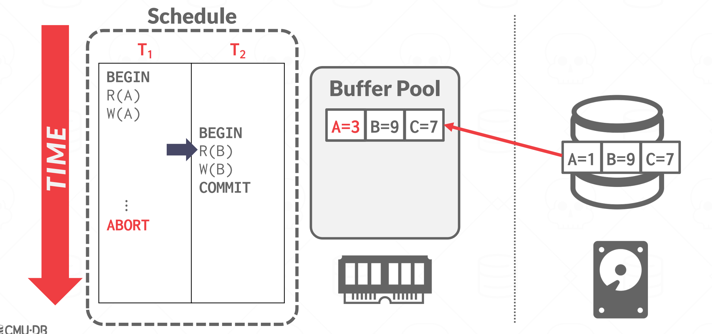
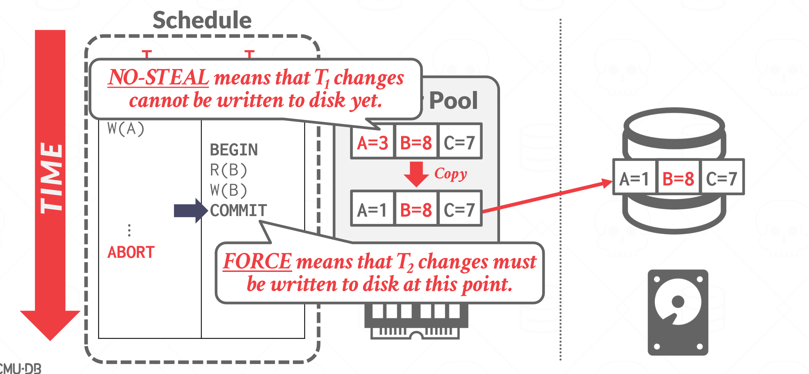
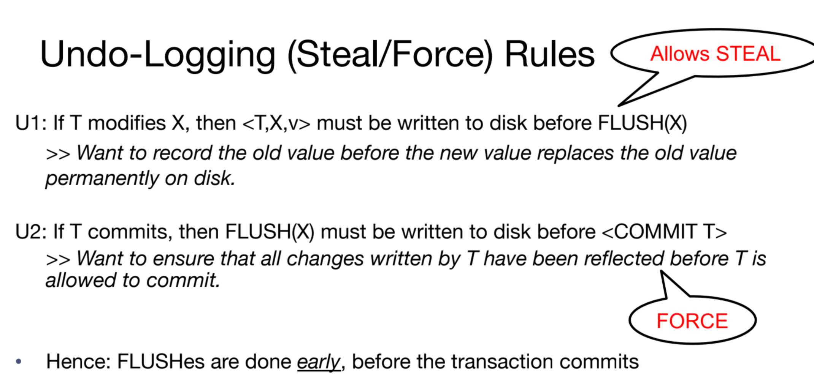
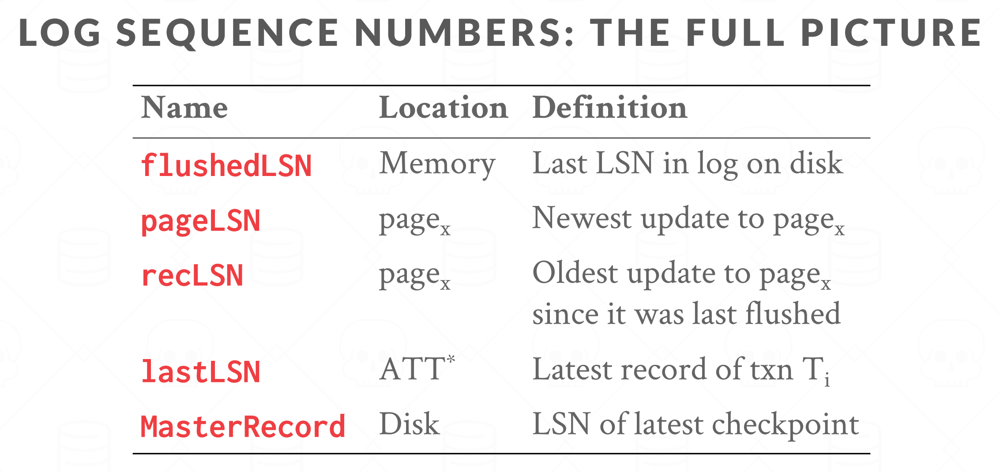
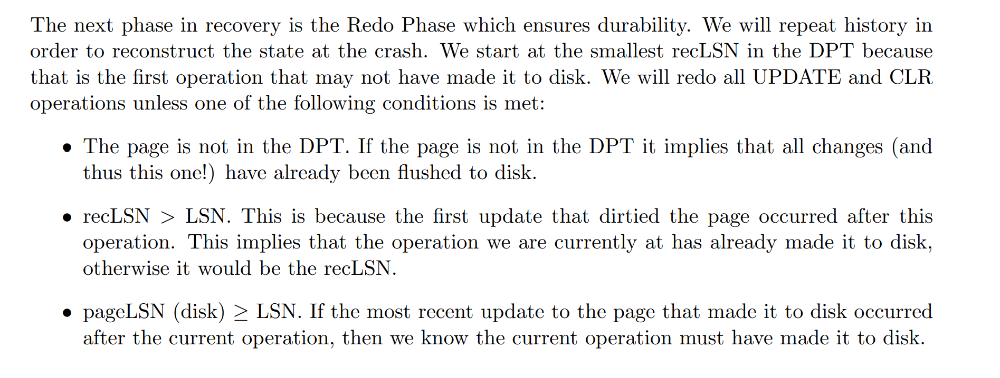

# Crash Classification

# Buffer Pool Management Policies
## Force/No Force
> [!def]
> - **Force**: Make sure all the modifications are flushed to disk before COMMIT.
> 	- Ensure durability. If the machine crashes after COMMIT, the bits in the memory are "erased", so flushing to disk before COMMIT make sures all updates are reflected in disk and no data loss happened.
> 	- Performance is bad, have to do lots of writes I/O.
> - **No Force**: Don't have to flush all modifications to disk before COMMIT.
> 	- Allow some modifications to be flushed to disk after COMMIT.
> 	- Doesn't guarantee durability due to data loss.
> 
> 

## Steal/No Steal
> [!def]
> - **Steal**: Can one transaction write uncommitted changes belonging to a different transaction to disk? Yes, we can.
> 	- Doesn't guarantee atomicity. Create intermediate states.
> - **No Steal**: No, we don't allow.
> 	- Ensure atomicity, no intermediate states.
> 	- Bad performance, we may have to wait until there are free pages to evict. We may have to keep every modified page in memory until a transaction completes. Page eviction operation is exclusive to one transaction at a time.
> 
> 

## Summary
> [!summary]
> 

# Shadow Paging
> [!overview]
> Use the `NO-STEAL` + `FORCE` policy.

## No Steal + Force Example
> [!def]
> 

> [!example]
> 

## Shadow Paging Example
> [!def]
> 

# Undo/Redo Logging
## Undo Logging
### Components
> [!def]
> 

### Walkthrough
> [!example] EECS186 Fa20 Disc09 P1
> 
> If system crashes while we are undoing, we simply redo all the undos again since we have no idea what has been undone before this crash, so it's better to redo all the undos.

### Recovery
> [!example]
> 

## Redo Logging
### Components
> [!def]
> 

 

### Walkthrough
> [!example] EECS186 Fa20 Disc09 P2
> 

## Comparisons
> [!important]
> 

# Write Ahead Logging
## WAL Protocols
> [!def]
> Having undo logging and redo logging alone is not enough to ensure atomicity and durability.
> - Undo logging only guarantees durability(due to force) but no guarantees on atomicity(due to steal).
> - Redo logging only guarantees atmociticy(due to no-steal) but no gurantees on durability(do to no-force).
> 
> In short, we want to achieve atomicity and durablity for the log records, just like regular data pages.
> 
> So we need a protocol for the undo/redo logging as follows:
> 

## WAL Implementations
### Update Log Record
> [!def]
> 
> - Each log has a an `LSN` , which serves as unique identifer of the log record and it's automatically increasing on each newly created log record.
> 	- This will be flushed to disk since log is flushed to disk.
> 	- Need for tracing.
> - Each log also has an `prevLSN` to help track the log record chain during recovery process.
> 	- Same as above.
> - `flushedLSN` keeps track of the `LSN` of the **last** log record that's flushed to the disk. This helps to spot the last operation before the log and mark the start of undo process or the end of the redo process. 
> - We will store `flushedLSN` at disk, naming it as `masterRecord`.
> 
> 

### Compensation Log Record
> [!def]
> 

### Page
> [!def]
> Each page in the memory has a `pageLSN`, which stores the `LSN` of the operation that last modified the page.
> - `pageLSN <= flushedLSN` for all pages. This comes from our first rule for WAL(atomicity) - we must flush the corresponding log records before we can flush the data page to disk. A data page is only flushed to disk if the LSN of the last operation to modify it is less than or equal to the flushedLSN. In other words, before page i can be flushed to disk, the log records for all operations that have modified page i must have been flushed to disk.
> - `pageLSN` is stored in buffer pool, and will be flushed to disk. 

### Dirty Page Table - DPT
> [!def]
> 
> **Note:**
> - `recLSN` as part of the page, will be together flushed to the disk.
> - Any time when a page is loaded into the memory by the buffer pool manager, the `recLSN` value will be set to `null` in the `DPT`, and will then be set to the `LSN` of the first operation that modified this page.

### Transaction Table - Xact Table
> [!def]
> The transaction table stores information on the active transactions. The transaction table has three fields:
> 
> **Note on some inequalities:**
> 
> 

### Summary
> [!summary]
> 

## WAL Example
> [!example]
> 

## Group Commiting Optimization
> [!important]
> 

## Logging Scheme
> [!def]
> 

> [!important] Comparisons
> 

# ARIES Recovery Algorithm
> [!overview]
> 

## ARIES Normal Operations
### Assumptions
> [!def]
> 

### Transaction Starts
> [!def]
> 

### Transaction Updates
> [!def]
> 

### Page Flushes
> [!def]
> 
> After page flush:
> 
> 

### Page Fetches
> [!def]
> 

### Transaction Commits
> [!def]
> 

### Transaction Aborts
> [!def]
> 

## Checkpointing
### Motivations
> [!bug] Problem with Undo/Redo
> 
> The main problem with **a WAL-based DBMS is that the log file will grow forever.** 
> 
> After a crash, the DBMS has to replay the entire log, which can take a long time if the log file is large. 
> 
> Thus, the DBMS can periodically take a checkpoint where it flushes all buffers out to disk. 
> 
> How often the DBMS should take a checkpoint depends on the application’s performance and downtime requirements. 
> 
> Taking a checkpoint too often causes the DBMS’s runtime performance to degrade. But waiting a long time between checkpoints can potentially be just as bad, as the system’s recovery time after a restart increases.

### Non-Fuzzy Checkpointing
> [!def]
> 

### Fuzzy Checkpointing
> [!def]
> 

> [!example] Protocol and Example
> - Any txn that begins but not end before `CKPT` is included in the ATT and DPT. But the ATT and DPT that's actually written to the `END CKPT` log can be any state between `BEGIN CKPT` and `END CKPT`. 
> 	- In this example, `END CKPT1` only write the `C->P22` to the DPT
> 	- The latest one before `END CKPT 1`, which is `A->P11`, is not written to DPT.
> - Any txn that begins and ends before `CKPT` is excluded from the ATT and DPT.
> - Any txn that begins after the `CKPT` is excluded from the ATT and DPT.
> 
> 
> **In this example:**
> - `T1` ends before `CKPT1`, so it is not included in ATT and DPT.
> - `T2` begins before `CKPT1` but not ends before `CKPT`, so all of its modifications are reflected in ATT and DPT.
> - `T3` begins after `CKPT1`, so it is not included in ATT and DPT.

 

## Algorithm Procedures
> [!overview]
> 

### Analysis Phase
> [!important]
> 
> We start out traversing of logs from the last `BEGIN CKPT`. Since the tables written to the log can be the state of tables at any point between the `BEGIN CKPT` and `END CKPT`. 
> 
> This means we need to start at the `BEGIN CKPT` because we’re not sure if the records after it are actually reflected in the tables that were written to the log.
> 

> [!example] Example from Notes
> 

> [!example] Example from Fa20 Disc09 P3
> See [CS 186 Discussion 9](CS%20186%20Discussion%209.pdf)
> 

### Redo Phase
> [!important]
> 

> [!example]
> 
> 

> [!bug] Caveats
> 

### Undo Phase
> [!overview] Overview
> 

> [!def]
> 

> [!example]
> 

> [!bug] Caveats
> 
> Otherwise, we would be undoing the undone, which is equivalent to do something that we don't want.

### Undo Implementations
> [!algo]
> 

## Caveats
> [!bug] Caveats
> 

# Appendix
> [!def]
> 

