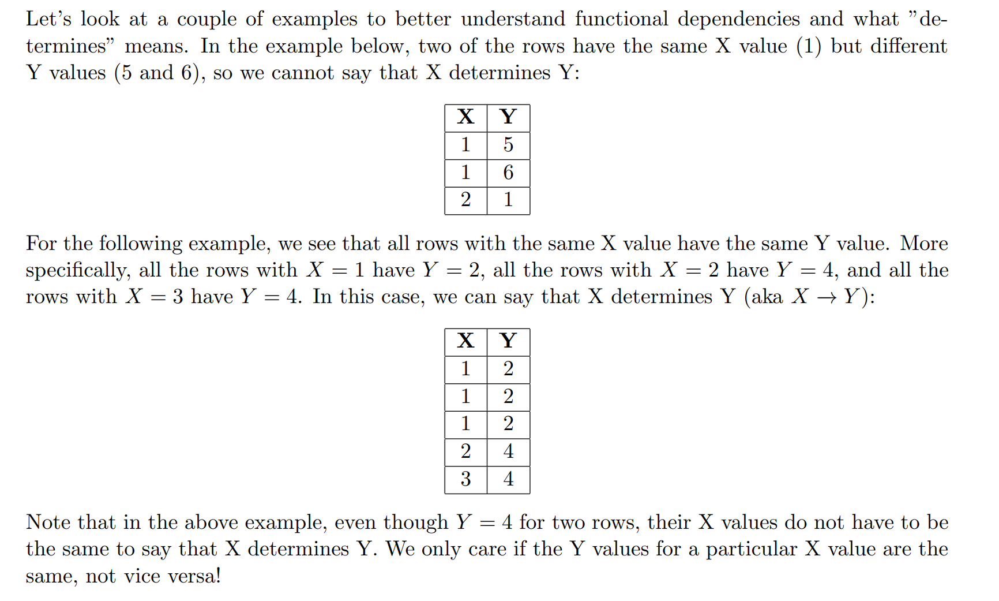
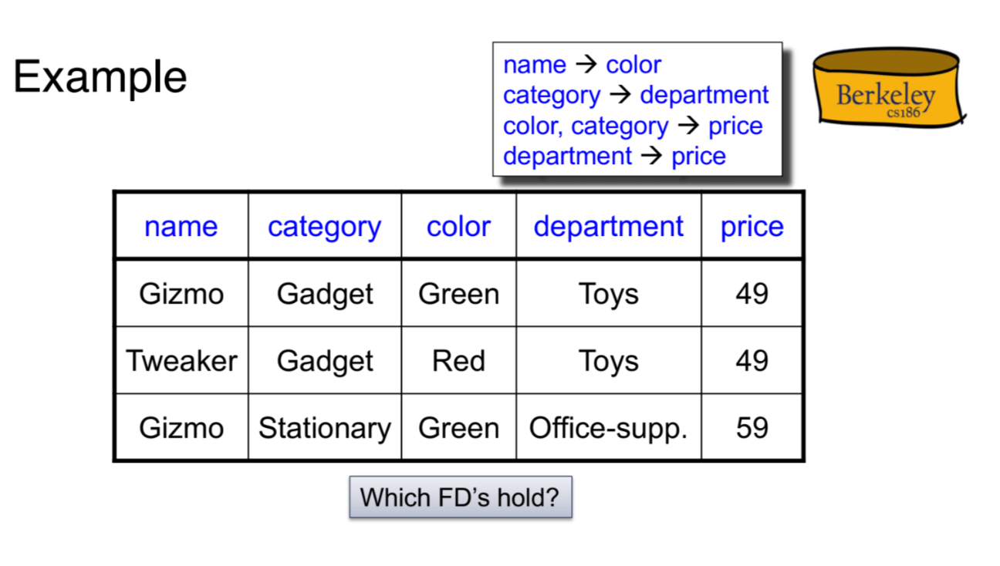

# ER_Models
## Entity
> [!def]
> 

## Relationship
> [!def]
> 

## Relational Constraints
> [!def]
> 

## Weak Entity
> [!def]
> 

## Exercises
> [!example] CS186 Fa20 Disc10 P1
> 
> **Note:**
> 1. When we say relation A needs relation B, we mean that each entry in relation A should relate to at least one entry in B, which is a participation constraint.
> 2. "Exactly One" means key constraint with total participation.
> 3. When we say that relation A is uniquely identified by relation B, we mean that each entry in A should correspond to exactly one entry in relation B.

# Functional Dependencies
## Basic Definition
> [!motiv]
> - In some data sets, if you already know a set of columns, you can use that information to infer the other columns.
> - Example: imagine that you have birthday and age columns in a table. Birthday uniquely determines age.
> - These relationships are called functional dependencies. We want to use them to eliminate redundancy.

> [!def]
> A functional dependency X → Y means that the X column determines Y column in a table R. This means given any two tuples in table R, if their X values are the same, then their Y values must be the same (but not vice versa).
> 
> If t and t' doesn't agree at A, then t and t' can agree/or not at B, and this FD holds. 

> [!example]
> 

> [!example] CS186 Fa20 Disc10 P3.1~ P3.2
> 

## Anomalies
> [!def]
> 

## Terminologies
> [!important]
> 

## Inference Rules
> [!def]
> 

> [!example]
> Consider the set $F=\{A\to B, AB\to AC, BC\to BD, DA\to C\}$ of functional dependencies, compute:
> 1. $A+$: By reflexivity, we have $A\to A$. By union we know $A\to AB$. By transitivity we know $A\to AB\to AC$, which implies $A\to C$ by decomposition. By $A\to B$ and $A\to C$ we have $A\to BC$, which implies $A\to BD$ and $A\to D$. Thus $A+=\{A,B,C,D\}$.
> 2. $B+,C+,D+$: $B,C,D$ only determine themselves, which means $B+=\{B\}$, $C+=\{C\}$ and $D+=\{D\}$.
> 3. $AB+,AC+,AD+$: Since $A+=\{A,B,C,D\}$, we have that the closure of all these set of attributes are $\{A,B,C,D\}$.
> 4. $BC+$: $\{B,C,D\}$, since $BC\to B, BC\to C, BC\to BD\to D$.
> 5. $BD+$: $\{B,D\}$ since there is no clue for $BD\to C$.
> 6. $CD+$: $\{C,D\}$.
> 7. $BCD+$: $\{B,C,D\}$.

## Closure
> [!def]
> There are two kinds of closure:
> - FD Closure, which turns out to be a set of FDs.
> - Attribute Closure, which turns out to be a set of attributes.
> 
> 

> [!algo]
> 

## Super/Candidate Key
> [!def]
> 

> [!example]
> 

> [!example] CS186 Fa20 Disc10 P3.4
> Consider the set $F=\{A\to B, AB\to AC, BC\to BD, DA\to C\}$ of functional dependencies, compute:
> 

  

# Normal Form
## Boyce-Codd Normal Form
> [!def]
> 

## Decomposition Algorithm
> [!def]
> 

> [!example] CS186 Fa20 Disc10 P3
> 

## Reversibility
> [!def]
> 

> [!example]
> 

## Dependency Preserving Decompositions
> [!important]
> 

## Properties of BCNF
> [!property]
> 

# Other Normal Form
## 3rd NF

