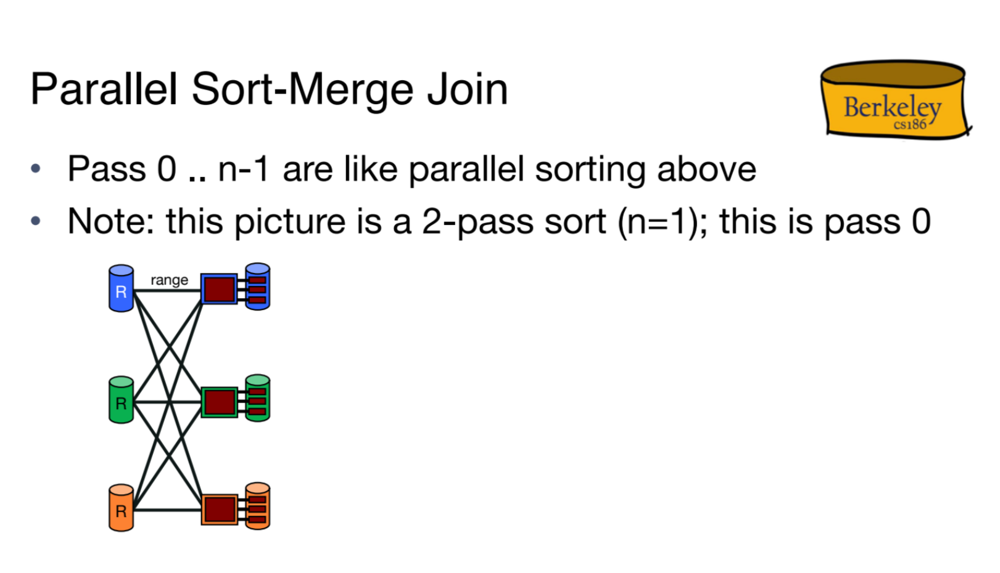

# Parallel Architectures
> [!def]
> 

# Types of Parallelism
## Intra-Query Parallelism
> [!def]
> Intra-query parallelism attempts to make one query run as fast as possible by spreading the work over multiple computers.
> 
> Within intra-query parallelism, we have two subcategories:
> - **Intra-operator parallelism:** Intra-operator parallelism is dividing up the data onto several machines and having them sort the data in parallel. This parallelism makes sorting (**one operation**) as fast as possible.
> - **Inter-operator parallelism:** Inter-operator parallelism involves executing multiple independent operations in parallel. This form of parallelism operates between different operators or functions in a process or query. This is useful in processes where several operations are independent and can be executed simultaneously without waiting for the results of others.
> - Within inter-operator parallism, we have two subtypes:
> 	- Pipeline Parallelism
> 	- Bushy Tree Parallelism

### Inter-Operator Parallelism
> [!overview]
> 

#### Pipeline Parallelism
> [!def]
> The first type is pipeline parallelism. In pipeline parallelism records are passed to the parent operator as soon as they are done. The parent operator can work on a record that its child has already processed while the child operator is working on a different record.
> 
> In pipeline parallelism the project and filter can run at the same time because as soon as filter finishes a record, project can operate on it while filter picks up a new record to operate on.

#### Bushy Tree Parallelism
> [!def]
> The other type of inter-operator parallelism is bushy tree parallelism in which different branches of the tree are run in parallel.
> 
> One machine can work on sorting R and another machine can sort S at the same time.

### Intra-Operator Parallelism
See [Data Partitioning](Parallel_Query_Processing.md#Data%20Partioning)

## Inter-Query Parallelism
> [!def]
> Inter-query parallelism gives each machine different queries to work on so that the system can achieve a high throughput and complete as many queries as possible.

# Data Partitioning
## Sharding, Replication, Partitioning
> [!def]
> **Data Sharding:** Sharding typically involves dividing data horizontally, where each shard holds a subset of the rows from the entire dataset but maintains the same schema. This is also known as "data sharding."
> 
> **Data Replication:** Copying data from one database to one or more other databases. It is primarily used to improve the availability and fault tolerance of a system, ensuring that data remains accessible even in the case of a server failure or during maintenance activities.
> 
> **Data Partitioning:** To decide what machines get what data we will use a partitioning scheme. A partitioning scheme is a rule that determines what machine a certain record will end up on. The three we will study are range partitioning, hash partitioning, and round-robin.

## Range Partitioning
> [!def]
> 

## Hash Partitioning
> [!def]
> 

## Round Robin Partitioning
> [!def]
> 

## Comparisons
> [!important]
> 
> Here balance load means the amount of task that is distributed to the particular machine. Because round robin partitioning basically use a modulus operation on each row of data to decide where it should reside. As a result, each machine has roughly the same amount of data.
> - Shared nothing particularly benefits from "good" partitioning
> 	- Reduces network traffic
> 	- Better if operations are “localized” to certain nodes
> - Indexes can be built at each partition
> 	- E.g., a B+tree at each node

### Look Up Operation
> [!def]
> 
> To look up for a particular key, range/hash partitioning works better since we know the key will reside in just one machine. The function that maps the key to partitioning should be one-to-one, each key gets mapped to exactly one partitioning.
> 
> In contrast, round-robin will distribute the key among multiple machines.

### Insert Operation
> [!def]
> 

### Scans
> [!def]
> 

# Parallelized Algorithms
## Parallel Sorting
> [!important]
> 

## Parallel Hashing
> [!important]
> 
> Have to want for all machines to finish phase 1 in order for data to be synced before we move onto the phase 2.

## Parallel Sort Merge Join
> [!important]
> 

## Parallel Naive Hash Join
> [!important]
> 

## Parallel Grace Hash Join
> [!important]
> 

## Broadcast Join
> [!important]
> 
> Since R is small enough to fit into the memory, we can simply just send the copy of $R$ to every machine instead of partitioning them.
> - Then we don't need to worry about data skew and histogram.

## Symmetric Hash Join
> [!important]
> 

# Parallel Aggregation
## Hierarchical Aggregation
> [!important]
> 

## Parallel GroupBy
> [!important]
> 

