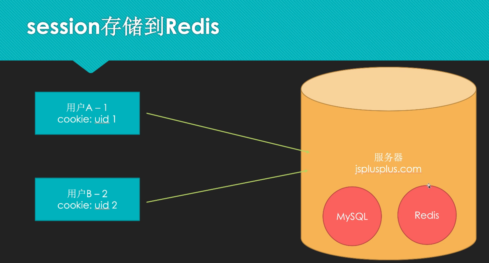

# Installations
> [!important]
> https://www.runoob.com/redis/redis-install.html 安装服务
> 

# CRUD
> [!important]
> 假设`redis`就是一个`HashMap<K, V> map` , 则
> 下面是基本操作:
> - 启动redis服务，同上
> - 启动客户端: `redis-cli`
> - `get name` 相当于`map.get(name)`
> - `set name 'value'` 相当于`map.put(name, value)`
> - `keys *` 相当于 `map.keySet()`获取所有的`key`
> - `del name` 相当于`map.remove(name)`
> - 退出客户端`exit`

# Cookie与Session
> [!def]
> 
> 服务器在返回的时候会在响应头中设置一个`set-cookie: cookie-value`字段，浏览器识别这个字段之后会在浏览器`localStorage`中将`cookie-value`保存下来以便下次请求的时候表明身份。
> 
> HTTP 本身是无状态的，但是有了`cookie`机制使得用户访问变得有状态。
> Session的储存问题:
> 1. 系统会限制每个进程的最大可用内存，session本身作为一个服务端的进程，也会被限制内存大小，因此其可存储的用户信息十分有限。
> 2. 进程之间数据隔离，无法相互访问。
> 
> 于是我们考虑使用一个内存型数据库对用户的登录信息进行集中管理。Redis也得以大放异彩。
> 

