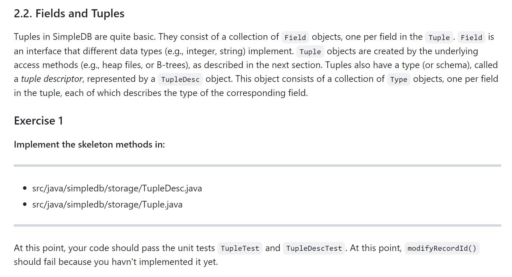
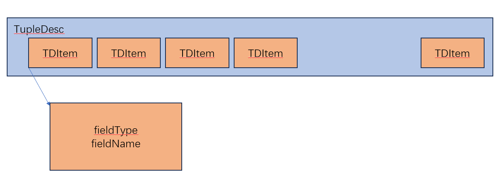
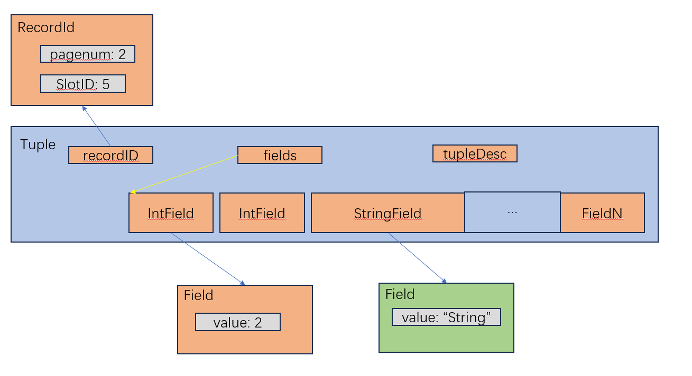

# Ant Testing Framework
## Downloading
> https://ant.apache.org/


## Change Encoding
```xml
<!-- Common macro for compiling Java source -->  
<macrodef name="Compile">  
    <attribute name="srcdir"/>  
    <attribute name="destdir"/>  
    <element name="compileoptions" implicit="true" optional="true"/>  
    <sequential>  
        <mkdir dir="@{destdir}"/>  
        <!-- avoids needing ant clean when changing interfaces -->  
        <depend srcdir="@{srcdir}" destdir="@{destdir}" cache="${depcache}"/>  
        <!-- Need to change encoding of javac on Windows platform, even if your file is stored in UTF-8 encoding, the javac is still using GBK, defaulted on Windows, to compile, so we should add an encoding flag to it -->
        <javac srcdir="@{srcdir}" destdir="@{destdir}" includeAntRuntime="no"  
                debug="${compile.debug}" source="${sourceversion}" encoding="UTF-8">  
            <compilerarg value="-Xlint:unchecked" />  
            <!--<compilerarg value="-Xlint:deprecation" />-->  
            <compileoptions/>  
        </javac>  
    </sequential>  
</macrodef>
```


## Adding Integrated Test
```xml
<target name="test" depends="testcompile" description="Run all unit tests">  
    <RunJunit timeoutMs="${timeoutMs}">  
        <batchtest>  
            <fileset dir="${build.test}">  
                <include name="**/*Test.class"/>  
                <exclude name="**/*$*.class"/>  
                <exclude name="simpledb/systemtest/*.class"/>  
            </fileset>  
        </batchtest>  
    </RunJunit>  
</target>
```


# Task 1: Fields and Tuples
> [!task]
> 


### TupleDesc
> [!design]
> 
> **TupleDesc** is similar to the scheme of a relation, it contains all the column information of a record, like columnFieldName and columnFieldType.
> 
> Here we pair each columnFieldName and columnFieldType up as a nested data structure TDItem.
> 
> We use a linked list to hold all the TDItems in the TupleDesc data structure.

> [!code]
```java
package simpledb.storage;

import simpledb.common.Type;

import java.io.Serializable;
import java.util.*;

/**
 * TupleDesc describes the schema of a tuple.
 */
public class TupleDesc implements Serializable {

	/*
	  Added resource management field.
	*/
    private List<TDItem> tdItemList = new ArrayList<>();

    /**
     * A help class to facilitate organizing the information of each field
     */
    public static class TDItem implements Serializable {

        private static final long serialVersionUID = 1L;

        /**
         * The type of the field
         */
        public final Type fieldType;

        /**
         * The name of the field
         */
        public final String fieldName;

        public TDItem(Type t, String n) {
            this.fieldName = n;
            this.fieldType = t;
        }

        public String toString() {
            return fieldName + "(" + fieldType + ")";
        }
    }

    /**
     * @return An iterator which iterates over all the field TDItems
     *         that are included in this TupleDesc
     */
    public Iterator<TDItem> iterator() {
        // TODO: some code goes here
        return tdItemList.iterator();
    }

    private static final long serialVersionUID = 1L;

    /**
     * Create a new TupleDesc with typeAr.length fields with fields of the
     * specified types, with associated named fields.
     *
     * @param typeAr  array specifying the number of and types of fields in this
     *                TupleDesc. It must contain at least one entry.
     * @param fieldAr array specifying the names of the fields. Note that names may
     *                be null.
     */
    public TupleDesc(Type[] typeAr, String[] fieldAr) {
        // TODO: some code goes here
        Type currType;
        String currName;
        TDItem tdItem;
        for (int i = 0; i < typeAr.length; i++) {
            currType = typeAr[i];
            currName = fieldAr[i];
            tdItem = new TDItem(currType, currName);
            tdItemList.add(tdItem);
        }
    }

    /**
     * Constructor. Create a new tuple desc with typeAr.length fields with
     * fields of the specified types, with anonymous (unnamed) fields.
     *
     * @param typeAr array specifying the number of and types of fields in this
     *               TupleDesc. It must contain at least one entry.
     */
    public TupleDesc(Type[] typeAr) {
        // TODO: some code goes here
        Type currType;
        TDItem tdItem;
        for (int i = 0; i < typeAr.length; i++) {
            currType = typeAr[i];
            tdItem = new TDItem(currType, null);
            tdItemList.add(tdItem);
        }
    }

    /**
     * @return the number of fields in this TupleDesc
     */
    public int numFields() {
        // TODO: some code goes here
        return tdItemList.size();
    }

    /**
     * Gets the (possibly null) field name of the ith field of this TupleDesc.
     *
     * @param i index of the field name to return. It must be a valid index.
     * @return the name of the ith field
     * @throws NoSuchElementException if i is not a valid field reference.
     */
    public String getFieldName(int i) throws NoSuchElementException {
        // TODO: some code goes here
        return tdItemList.get(i).fieldName;
    }

    /**
     * Gets the type of the ith field of this TupleDesc.
     *
     * @param i The index of the field to get the type of. It must be a valid
     *          index.
     * @return the type of the ith field
     * @throws NoSuchElementException if i is not a valid field reference.
     */
    public Type getFieldType(int i) throws NoSuchElementException {
        // TODO: some code goes here
        return tdItemList.get(i).fieldType;
    }

    /**
     * Find the index of the field with a given name.
     *
     * @param name name of the field.
     * @return the index of the field that is first to have the given name.
     * @throws NoSuchElementException if no field with a matching name is found.
     */
    public int indexForFieldName(String name) throws NoSuchElementException {
        // TODO: some code goes here
        if (name == null) {
            throw new NoSuchElementException("null is not a valid field name");
        }
        for (int i = 0; i < tdItemList.size(); i++) {
            TDItem currItem = tdItemList.get(i);
            if (currItem.fieldName == null) {
                continue;
            }
            if (currItem.fieldName.equals(name)) {
                return i;
            }
        }
        throw new NoSuchElementException("No Such FieldName");
    }

    /**
     * @return The size (in bytes) of tuples corresponding to this TupleDesc.
     *         Note that tuples from a given TupleDesc are of a fixed size.
     */
    public int getSize() {
        // TODO: some code goes here
        int sizeInBytes = 0;
        for (TDItem tdItem: tdItemList) {
            sizeInBytes += tdItem.fieldType.getLen();
        }
        return sizeInBytes;
    }

    /**
     * Merge two TupleDescs into one, with td1.numFields + td2.numFields fields,
     * with the first td1.numFields coming from td1 and the remaining from td2.
     *
     * @param td1 The TupleDesc with the first fields of the new TupleDesc
     * @param td2 The TupleDesc with the last fields of the TupleDesc
     * @return the new TupleDesc
     */
    public static TupleDesc merge(TupleDesc td1, TupleDesc td2) {
        // TODO: some code goes here
        List<TDItem> tdItems1 = td1.tdItemList;
        List<TDItem> tdItems2 = td2.tdItemList;
        Iterator<TDItem> tdItems1Iter = td1.iterator();
        Iterator<TDItem> tdItems2Iter = td2.iterator();

        int mergedLength = tdItems1.size() + tdItems2.size();

        Type[] mergedType = new Type[mergedLength];
        String[] mergedField = new String[mergedLength];

        int i = 0;
        while(tdItems1Iter.hasNext()) {
            TDItem tdItem = tdItems1Iter.next();
            mergedType[i] = tdItem.fieldType;
            mergedField[i] = tdItem.fieldName;
            i++;
        }

        while(tdItems2Iter.hasNext()) {
            TDItem tdItem = tdItems2Iter.next();
            mergedType[i] = tdItem.fieldType;
            mergedField[i] = tdItem.fieldName;
            i++;
        }

        return new TupleDesc(mergedType, mergedField);
    }

    /**
     * Compares the specified object with this TupleDesc for equality. Two
     * TupleDescs are considered equal if they have the same number of items
     * and if the i-th type in this TupleDesc is equal to the i-th type in o
     * for every i.
     *
     * @param o the Object to be compared for equality with this TupleDesc.
     * @return true if the object is equal to this TupleDesc.
     */

    public boolean equals(Object o) {
        // TODO: some code goes here
        if (o == null) {
            return false;
        }

        if (o.getClass() != getClass()) {
            return false;
        }

        if (this == o) {
            return true;
        }

        TupleDesc other = (TupleDesc) o;

        if (numFields() != other.numFields()) {
            return false;
        }

        TDItem thisItem;
        TDItem otherItem;

        Iterator<TDItem> thisIter = iterator();
        Iterator<TDItem> otherIter = other.iterator();

        while (thisIter.hasNext() && otherIter.hasNext()) {
            thisItem = thisIter.next();
            otherItem = otherIter.next();
            if (!thisItem.fieldType.equals(otherItem.fieldType)) {
                return false;
            }
        }
        return true;
    }

    public int hashCode() {
        // If you want to use TupleDesc as keys for HashMap, implement this so
        // that equal objects have equals hashCode() results
        throw new UnsupportedOperationException("unimplemented");
    }

    /**
     * Returns a String describing this descriptor. It should be of the form
     * "fieldType[0](fieldName[0]), ..., fieldType[M](fieldName[M])", although
     * the exact format does not matter.
     *
     * @return String describing this descriptor.
     */
    public String toString() {
        // TODO: some code goes here
        StringBuilder sb = new StringBuilder();
        while(iterator().hasNext()) {
            TDItem currItem = iterator().next();
            // Is the last item?
            if (iterator().hasNext()) {
                sb.append(currItem.fieldType+"("+currItem.fieldName+"), ");
            } else {
                sb.append(currItem.fieldType+"("+currItem.fieldName+")");
            }

        }

        return sb.toString();
    }
}
```

## Tuple
> [!design]
> **Tuple** is the actual data structure for a record, it contains the record data and record description, which we abstracted to be **TupleDesc**.
> 

> [!code]
```java
package simpledb.storage;

import simpledb.common.Type;

import java.io.Serializable;
import java.util.ArrayList;
import java.util.Arrays;
import java.util.Iterator;
import java.util.List;

/**
 * Tuple maintains information about the contents of a tuple. Tuples have a
 * specified schema specified by a TupleDesc object and contain Field objects
 * with the data for each field.
 */
public class Tuple implements Serializable {

    private static final long serialVersionUID = 1L;

    /**
     * Private members
     */
    private Field[] fields;
    private TupleDesc td; // One td object per class
    private RecordId rid;

    /**
     * Create a new tuple with the specified schema (type).
     *
     * @param td the schema of this tuple. It must be a valid TupleDesc
     *           instance with at least one field.
     */
    public Tuple(TupleDesc td) {
        // TODO: some code goes here
        this.td = td;
        int fieldNum = td.numFields();
        fields = new Field[fieldNum];
    }

    /**
     * @return The TupleDesc representing the schema of this tuple.
     */
    public TupleDesc getTupleDesc() {
        // TODO: some code goes here
        return td;
    }

    /**
     * @return The RecordId representing the location of this tuple on disk. May
     *         be null.
     */
    public RecordId getRecordId() {
        // TODO: some code goes here
        return rid;
    }

    /**
     * Set the RecordId information for this tuple.
     *
     * @param rid the new RecordId for this tuple.
     */
    public void setRecordId(RecordId rid) {
        // TODO: some code goes here
        this.rid = rid;
    }

    /**
     * Change the value of the ith field of this tuple.
     *
     * @param i index of the field to change. It must be a valid index.
     * @param f new value for the field.
     */
    public void setField(int i, Field f) {
        // TODO: some code goes here
        if (!(i >= 0 && i < fields.length)) {
            return;
        }
        fields[i] = f;
    }

    /**
     * @param i field index to return. Must be a valid index.
     * @return the value of the ith field, or null if it has not been set.
     */
    public Field getField(int i) {
        // TODO: some code goes here
        if (!(i >= 0 && i < fields.length)) {
            return null;
        }
        return fields[i];
    }

    /**
     * Returns the contents of this Tuple as a string. Note that to pass the
     * system tests, the format needs to be as follows:
     * <p>
     * column1\tcolumn2\tcolumn3\t...\tcolumnN
     * <p>
     * where \t is any whitespace (except a newline)
     */
    public String toString() {
        // TODO: some code goes here
        StringBuilder sb = new StringBuilder();
        sb.append("<p>\n");
        for (int i = 0; i < fields.length; i++) {
            if (i + 1 == fields.length) {
                sb.append(fields[i] + "\n");
            } else {
                sb.append(fields[i] + "\t");
            }
        }
        sb.append("<p>\n");
        return sb.toString();
    }

    /**
     * @return An iterator which iterates over all the fields of this tuple
     */
    public Iterator<Field> fields() {
        // TODO: some code goes here
        return Arrays.asList(fields).iterator();
    }

    /**
     * reset the TupleDesc of this tuple (only affecting the TupleDesc)
     */
    public void resetTupleDesc(TupleDesc td) {
        // TODO: some code goes here
        this.td = td;
    }
}

```


# Task 2: Catalog


# Task 3: BufferPool