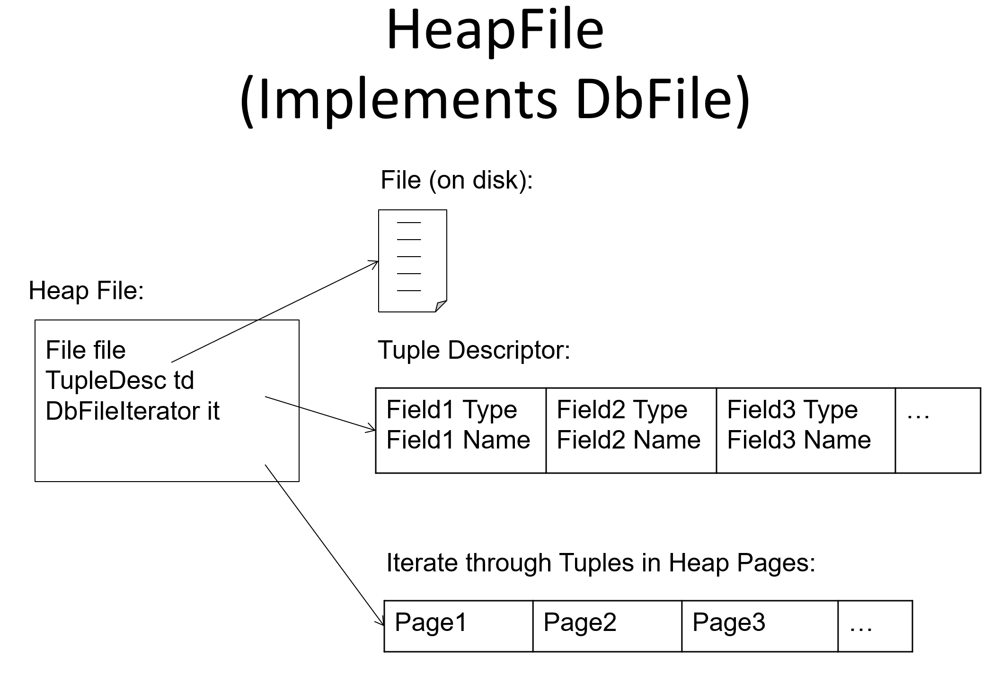

# Ant Framework
## Downloading
> https://ant.apache.org/


## Change Encoding
```xml
<!-- Common macro for compiling Java source -->  
<macrodef name="Compile">  
    <attribute name="srcdir"/>  
    <attribute name="destdir"/>  
    <element name="compileoptions" implicit="true" optional="true"/>  
    <sequential>  
        <mkdir dir="@{destdir}"/>  
        <!-- avoids needing ant clean when changing interfaces -->  
        <depend srcdir="@{srcdir}" destdir="@{destdir}" cache="${depcache}"/>  
        <!-- Need to change encoding of javac on Windows platform, even if your file is stored in UTF-8 encoding, the javac is still using GBK, defaulted on Windows, to compile, so we should add an encoding flag to it -->
        <javac srcdir="@{srcdir}" destdir="@{destdir}" includeAntRuntime="no"  
                debug="${compile.debug}" source="${sourceversion}" encoding="UTF-8">  
            <compilerarg value="-Xlint:unchecked" />  
            <!--<compilerarg value="-Xlint:deprecation" />-->  
            <compileoptions/>  
        </javac>  
    </sequential>  
</macrodef>
```


## Adding Integrated Test
```xml
<target name="test" depends="testcompile" description="Run all unit tests">  
    <RunJunit timeoutMs="${timeoutMs}">  
        <batchtest>  
            <fileset dir="${build.test}">  
                <include name="**/*Test.class"/>  
                <exclude name="**/*$*.class"/>  
                <exclude name="simpledb/systemtest/*.class"/>  
            </fileset>  
        </batchtest>  
    </RunJunit>  
</target>
```


## Ant Build
> [!important]
> 
> `ant dist` will compile your source code into a jar file for later use.


## Create Tables
> [!important]
> 


# Module Diagram
> [!important]
> 


# Task 1: Fields and Tuples
> [!task]
> 


### TupleDesc
> [!design]
> 
> **TupleDesc** is similar to the **scheme** of a relation, it contains all the column information of a record, like columnFieldName and columnFieldType.
> 
> Here we pair each columnFieldName and columnFieldType up as a nested data structure TDItem.
> 
> We use a linked list to hold all the TDItems in the TupleDesc data structure.

> [!code]
```java
package simpledb.storage;

import simpledb.common.Type;

import java.io.Serializable;
import java.util.*;

/**
 * TupleDesc describes the schema of a tuple.
 */
public class TupleDesc implements Serializable {

	/*
	  Added resource management field.
	*/
    private List<TDItem> tdItemList = new ArrayList<>();

    /**
     * A help class to facilitate organizing the information of each field
     */
    public static class TDItem implements Serializable {

        private static final long serialVersionUID = 1L;

        /**
         * The type of the field
         */
        public final Type fieldType;

        /**
         * The name of the field
         */
        public final String fieldName;

        public TDItem(Type t, String n) {
            this.fieldName = n;
            this.fieldType = t;
        }

        public String toString() {
            return fieldName + "(" + fieldType + ")";
        }
    }

    /**
     * @return An iterator which iterates over all the field TDItems
     *         that are included in this TupleDesc
     */
    public Iterator<TDItem> iterator() {
        // TODO: some code goes here
        return tdItemList.iterator();
    }

    private static final long serialVersionUID = 1L;

    /**
     * Create a new TupleDesc with typeAr.length fields with fields of the
     * specified types, with associated named fields.
     *
     * @param typeAr  array specifying the number of and types of fields in this
     *                TupleDesc. It must contain at least one entry.
     * @param fieldAr array specifying the names of the fields. Note that names may
     *                be null.
     */
    public TupleDesc(Type[] typeAr, String[] fieldAr) {
        // TODO: some code goes here
        Type currType;
        String currName;
        TDItem tdItem;
        for (int i = 0; i < typeAr.length; i++) {
            currType = typeAr[i];
            currName = fieldAr[i];
            tdItem = new TDItem(currType, currName);
            tdItemList.add(tdItem);
        }
    }

    /**
     * Constructor. Create a new tuple desc with typeAr.length fields with
     * fields of the specified types, with anonymous (unnamed) fields.
     *
     * @param typeAr array specifying the number of and types of fields in this
     *               TupleDesc. It must contain at least one entry.
     */
    public TupleDesc(Type[] typeAr) {
        // TODO: some code goes here
        Type currType;
        TDItem tdItem;
        for (int i = 0; i < typeAr.length; i++) {
            currType = typeAr[i];
            tdItem = new TDItem(currType, null);
            tdItemList.add(tdItem);
        }
    }

    /**
     * @return the number of fields in this TupleDesc
     */
    public int numFields() {
        // TODO: some code goes here
        return tdItemList.size();
    }

    /**
     * Gets the (possibly null) field name of the ith field of this TupleDesc.
     *
     * @param i index of the field name to return. It must be a valid index.
     * @return the name of the ith field
     * @throws NoSuchElementException if i is not a valid field reference.
     */
    public String getFieldName(int i) throws NoSuchElementException {
        // TODO: some code goes here
        return tdItemList.get(i).fieldName;
    }

    /**
     * Gets the type of the ith field of this TupleDesc.
     *
     * @param i The index of the field to get the type of. It must be a valid
     *          index.
     * @return the type of the ith field
     * @throws NoSuchElementException if i is not a valid field reference.
     */
    public Type getFieldType(int i) throws NoSuchElementException {
        // TODO: some code goes here
        return tdItemList.get(i).fieldType;
    }

    /**
     * Find the index of the field with a given name.
     *
     * @param name name of the field.
     * @return the index of the field that is first to have the given name.
     * @throws NoSuchElementException if no field with a matching name is found.
     */
    public int indexForFieldName(String name) throws NoSuchElementException {
        // TODO: some code goes here
        if (name == null) {
            throw new NoSuchElementException("null is not a valid field name");
        }
        for (int i = 0; i < tdItemList.size(); i++) {
            TDItem currItem = tdItemList.get(i);
            if (currItem.fieldName == null) {
                continue;
            }
            if (currItem.fieldName.equals(name)) {
                return i;
            }
        }
        throw new NoSuchElementException("No Such FieldName");
    }

    /**
     * @return The size (in bytes) of tuples corresponding to this TupleDesc.
     *         Note that tuples from a given TupleDesc are of a fixed size.
     */
    public int getSize() {
        // TODO: some code goes here
        int sizeInBytes = 0;
        for (TDItem tdItem: tdItemList) {
            sizeInBytes += tdItem.fieldType.getLen();
        }
        return sizeInBytes;
    }

    /**
     * Merge two TupleDescs into one, with td1.numFields + td2.numFields fields,
     * with the first td1.numFields coming from td1 and the remaining from td2.
     *
     * @param td1 The TupleDesc with the first fields of the new TupleDesc
     * @param td2 The TupleDesc with the last fields of the TupleDesc
     * @return the new TupleDesc
     */
    public static TupleDesc merge(TupleDesc td1, TupleDesc td2) {
        // TODO: some code goes here
        List<TDItem> tdItems1 = td1.tdItemList;
        List<TDItem> tdItems2 = td2.tdItemList;
        Iterator<TDItem> tdItems1Iter = td1.iterator();
        Iterator<TDItem> tdItems2Iter = td2.iterator();

        int mergedLength = tdItems1.size() + tdItems2.size();

        Type[] mergedType = new Type[mergedLength];
        String[] mergedField = new String[mergedLength];

        int i = 0;
        while(tdItems1Iter.hasNext()) {
            TDItem tdItem = tdItems1Iter.next();
            mergedType[i] = tdItem.fieldType;
            mergedField[i] = tdItem.fieldName;
            i++;
        }

        while(tdItems2Iter.hasNext()) {
            TDItem tdItem = tdItems2Iter.next();
            mergedType[i] = tdItem.fieldType;
            mergedField[i] = tdItem.fieldName;
            i++;
        }

        return new TupleDesc(mergedType, mergedField);
    }

    /**
     * Compares the specified object with this TupleDesc for equality. Two
     * TupleDescs are considered equal if they have the same number of items
     * and if the i-th type in this TupleDesc is equal to the i-th type in o
     * for every i.
     *
     * @param o the Object to be compared for equality with this TupleDesc.
     * @return true if the object is equal to this TupleDesc.
     */

    public boolean equals(Object o) {
        // TODO: some code goes here
        if (o == null) {
            return false;
        }

        if (o.getClass() != getClass()) {
            return false;
        }

        if (this == o) {
            return true;
        }

        TupleDesc other = (TupleDesc) o;

        if (numFields() != other.numFields()) {
            return false;
        }

        TDItem thisItem;
        TDItem otherItem;

        Iterator<TDItem> thisIter = iterator();
        Iterator<TDItem> otherIter = other.iterator();

        while (thisIter.hasNext() && otherIter.hasNext()) {
            thisItem = thisIter.next();
            otherItem = otherIter.next();
            if (!thisItem.fieldType.equals(otherItem.fieldType)) {
                return false;
            }
        }
        return true;
    }

    public int hashCode() {
        // If you want to use TupleDesc as keys for HashMap, implement this so
        // that equal objects have equals hashCode() results
        throw new UnsupportedOperationException("unimplemented");
    }

    /**
     * Returns a String describing this descriptor. It should be of the form
     * "fieldType[0](fieldName[0]), ..., fieldType[M](fieldName[M])", although
     * the exact format does not matter.
     *
     * @return String describing this descriptor.
     */
    public String toString() {
        // TODO: some code goes here
        StringBuilder sb = new StringBuilder();
        while(iterator().hasNext()) {
            TDItem currItem = iterator().next();
            // Is the last item?
            if (iterator().hasNext()) {
                sb.append(currItem.fieldType+"("+currItem.fieldName+"), ");
            } else {
                sb.append(currItem.fieldType+"("+currItem.fieldName+")");
            }

        }

        return sb.toString();
    }
}
```

## Tuple
> [!design]
> **Tuple** is the actual data structure for a record, it contains the record data and record description, which we abstracted to be **TupleDesc**.
> 

> [!code]
```java
package simpledb.storage;

import simpledb.common.Type;

import java.io.Serializable;
import java.util.ArrayList;
import java.util.Arrays;
import java.util.Iterator;
import java.util.List;

/**
 * Tuple maintains information about the contents of a tuple. Tuples have a
 * specified schema specified by a TupleDesc object and contain Field objects
 * with the data for each field.
 */
public class Tuple implements Serializable {

    private static final long serialVersionUID = 1L;

    /**
     * Private members
     */
    private Field[] fields;
    private TupleDesc td; // One td object per class
    private RecordId rid;

    /**
     * Create a new tuple with the specified schema (type).
     *
     * @param td the schema of this tuple. It must be a valid TupleDesc
     *           instance with at least one field.
     */
    public Tuple(TupleDesc td) {
        // TODO: some code goes here
        this.td = td;
        int fieldNum = td.numFields();
        fields = new Field[fieldNum];
    }

    /**
     * @return The TupleDesc representing the schema of this tuple.
     */
    public TupleDesc getTupleDesc() {
        // TODO: some code goes here
        return td;
    }

    /**
     * @return The RecordId representing the location of this tuple on disk. May
     *         be null.
     */
    public RecordId getRecordId() {
        // TODO: some code goes here
        return rid;
    }

    /**
     * Set the RecordId information for this tuple.
     *
     * @param rid the new RecordId for this tuple.
     */
    public void setRecordId(RecordId rid) {
        // TODO: some code goes here
        this.rid = rid;
    }

    /**
     * Change the value of the ith field of this tuple.
     *
     * @param i index of the field to change. It must be a valid index.
     * @param f new value for the field.
     */
    public void setField(int i, Field f) {
        // TODO: some code goes here
        if (!(i >= 0 && i < fields.length)) {
            return;
        }
        fields[i] = f;
    }

    /**
     * @param i field index to return. Must be a valid index.
     * @return the value of the ith field, or null if it has not been set.
     */
    public Field getField(int i) {
        // TODO: some code goes here
        if (!(i >= 0 && i < fields.length)) {
            return null;
        }
        return fields[i];
    }

    /**
     * Returns the contents of this Tuple as a string. Note that to pass the
     * system tests, the format needs to be as follows:
     * <p>
     * column1\tcolumn2\tcolumn3\t...\tcolumnN
     * <p>
     * where \t is any whitespace (except a newline)
     */
    public String toString() {
        // TODO: some code goes here
        StringBuilder sb = new StringBuilder();
        sb.append("<p>\n");
        for (int i = 0; i < fields.length; i++) {
            if (i + 1 == fields.length) {
                sb.append(fields[i] + "\n");
            } else {
                sb.append(fields[i] + "\t");
            }
        }
        sb.append("<p>\n");
        return sb.toString();
    }

    /**
     * @return An iterator which iterates over all the fields of this tuple
     */
    public Iterator<Field> fields() {
        // TODO: some code goes here
        return Arrays.asList(fields).iterator();
    }

    /**
     * reset the TupleDesc of this tuple (only affecting the TupleDesc)
     */
    public void resetTupleDesc(TupleDesc td) {
        // TODO: some code goes here
        this.td = td;
    }
}

```


# Task 2: Catalog
## Catalog 
> [!def]
> The catalog (class `Catalog` in SimpleDB) consists of a list of the tables and schemas of the tables that are currently in the database.
> 
> 在整个 SimpleDb 中, CataLog 是全局唯一的，可以通过方法Database.getCatalog()获得，global buffer pool可以通过方法Database.getBufferPool()获得。
> 
> 总的来说，`Catalog`会使用一个`HashMap<?, ?>`管理一个从`tableId`到`Table`的映射，管理所有的在`DBMS`运行时创建的`Table`对象。
> 
```java
package simpledb.common;

import simpledb.storage.*;

import java.io.BufferedReader;
import java.io.File;
import java.io.FileReader;
import java.io.IOException;
import java.util.*;
import java.util.concurrent.ConcurrentHashMap;

/**
 * The Catalog keeps track of all available tables in the database and their
 * associated schemas.
 * For now, this is a stub catalog that must be populated with tables by a
 * user program before it can be used -- eventually, this should be converted
 * to a catalog that reads a catalog table from disk.
 *
 * @Threadsafe
 */
public class Catalog {

    private Map<Integer, Table> tables;

    /**
     * Constructor.
     * Creates a new, empty catalog.
     */
    public Catalog() {
        // TODO: some code goes here
        this.tables = new HashMap<>();
    }

    /**
     * Add a new table to the catalog.
     * This table's contents are stored in the specified DbFile.
     *
     * @param file      the contents of the table to add;  file.getId() is the identfier of
     *                  this file/tupledesc param for the calls getTupleDesc and getFile
     * @param name      the name of the table -- may be an empty string.  May not be null.  If a name
     *                  conflict exists, use the last table to be added as the table for a given name.
     * @param pkeyField the name of the primary key field
     */
    public void addTable(DbFile file, String name, String pkeyField) {
        // TODO: some code goes here
        if (name == null) {
            System.out.println("The name of the table cannot be null");
            return;
        }

        Table newTable =  new Table(file.getTupleDesc(), file, pkeyField, name);
        int tableId = file.getId();
        // If id conflicts, id --> old Table(old DbFile) => id ---> new Table(old DbFile)
        if (tables.containsKey(tableId)) {
            tables.put(tableId, newTable);
            return;
        }


        // 文件是由tableid绝对定位的，而不是由name标识的
        // If name conflicts, overwrite old table with "name" with new table instance
        // 给老名字换新文件
        for (Map.Entry<Integer, Table> pair: tables.entrySet()) {
            Table table = pair.getValue();
            if (table.getTableName().equals(name)) {
                tables.remove(pair.getKey());
            }
        }

        // No conflicts happen
        tables.put(tableId, newTable);
    }

    public void addTable(DbFile file, String name) {
        addTable(file, name, "");
    }

    /**
     * Add a new table to the catalog.
     * This table has tuples formatted using the specified TupleDesc and its
     * contents are stored in the specified DbFile.
     *
     * @param file the contents of the table to add;  file.getId() is the identfier of
     *             this file/tupledesc param for the calls getTupleDesc and getFile
     */
    public void addTable(DbFile file) {
        addTable(file, (UUID.randomUUID()).toString());
    }

    /**
     * Return the id of the table with  a specified name,
     *
     * @throws NoSuchElementException if the table doesn't exist
     */
    public int getTableId(String name) throws NoSuchElementException {
        // TODO: some code goes here
        for (Map.Entry<Integer, Table> pair: tables.entrySet()) {
            if (pair.getValue().getTableName().equals(name)) {
                return pair.getKey();
            }
        }

        // If not found
        throw new NoSuchElementException(String.format("No such table named: %s", name));
    }

    /**
     * Returns the tuple descriptor (schema) of the specified table
     *
     * @param tableid The id of the table, as specified by the DbFile.getId()
     *                function passed to addTable
     * @throws NoSuchElementException if the table doesn't exist
     */
    public TupleDesc getTupleDesc(int tableid) throws NoSuchElementException {
        // TODO: some code goes here
        return getTableById(tableid).getTableSchema();
    }

    /**
     * Get the Table object by tableid, throw error if there is no table with this id
     * @param tableid
     * @return
     * @throws NoSuchElementException
     */
    private Table getTableById(int tableid) throws NoSuchElementException {
        if (tables.containsKey(tableid)) {
            return tables.get(tableid);
        }

        // If not found
        throw new NoSuchElementException(String.format("No such table with id: %s", tableid));

    }

    /**
     * Get a table by name, throw NoSuchElementException if not found
     * @param name
     * @return
     * @throws NoSuchElementException
     */
    private Table getTableByName(String name) throws NoSuchElementException {
        for (Map.Entry<Integer, Table> pair: tables.entrySet()) {
            if (pair.getValue().getTableName().equals(name)) {
                return pair.getValue();
            }
        }
        // If not found
        throw new NoSuchElementException(String.format("No such table named: %s", name));
    }

    /**
     * Returns the DbFile that can be used to read the contents of the
     * specified table.
     *
     * @param tableid The id of the table, as specified by the DbFile.getId()
     *                function passed to addTable
     */
    public DbFile getDatabaseFile(int tableid) throws NoSuchElementException {
        // TODO: some code goes here
        return getTableById(tableid).getTableContent();
    }

    public String getPrimaryKey(int tableid) {
        // TODO: some code goes here
        return getTableById(tableid).getTablePrimaryKey();
    }

    public Iterator<Integer> tableIdIterator() {
        // TODO: some code goes here
        return tables.keySet().iterator();
    }

    public String getTableName(int tableid) {
        // TODO: some code goes here
        return getTableById(tableid).getTableName();
    }

    /**
     * Delete all tables from the catalog
     */
    public void clear() {
        // TODO: some code goes here
        java.lang.reflect.Field[] fields = this.getClass().getDeclaredFields();
        for (java.lang.reflect.Field field: fields) {
            field.setAccessible(true);
            try {
                Object value = field.get(this);
                if (value instanceof Map) {
                    ((Map<?, ?>) value).clear();
                }
            } catch (IllegalAccessException e) {
                System.out.println("Error accessing field: " + e.getMessage());
            }
        }
    }

    /**
     * Reads the schema from a file and creates the appropriate tables in the database.
     *
     * @param catalogFile
     */
    public void loadSchema(String catalogFile) {
        String line = "";
        String baseFolder = new File(new File(catalogFile).getAbsolutePath()).getParent();
        try {
            BufferedReader br = new BufferedReader(new FileReader(catalogFile));

            while ((line = br.readLine()) != null) {
                //assume line is of the format name (field type, field type, ...)
                String name = line.substring(0, line.indexOf("(")).trim();
                //System.out.println("TABLE NAME: " + name);
                String fields = line.substring(line.indexOf("(") + 1, line.indexOf(")")).trim();
                String[] els = fields.split(",");
                List<String> names = new ArrayList<>();
                List<Type> types = new ArrayList<>();
                String primaryKey = "";
                for (String e : els) {
                    String[] els2 = e.trim().split(" ");
                    names.add(els2[0].trim());
                    if (els2[1].trim().equalsIgnoreCase("int"))
                        types.add(Type.INT_TYPE);
                    else if (els2[1].trim().equalsIgnoreCase("string"))
                        types.add(Type.STRING_TYPE);
                    else {
                        System.out.println("Unknown type " + els2[1]);
                        System.exit(0);
                    }
                    if (els2.length == 3) {
                        if (els2[2].trim().equals("pk"))
                            primaryKey = els2[0].trim();
                        else {
                            System.out.println("Unknown annotation " + els2[2]);
                            System.exit(0);
                        }
                    }
                }
                Type[] typeAr = types.toArray(new Type[0]);
                String[] namesAr = names.toArray(new String[0]);
                TupleDesc t = new TupleDesc(typeAr, namesAr);
                HeapFile tabHf = new HeapFile(new File(baseFolder + "/" + name + ".dat"), t);
                addTable(tabHf, name, primaryKey);
                System.out.println("Added table : " + name + " with schema " + t);
            }
        } catch (IOException e) {
            e.printStackTrace();
            System.exit(0);
        } catch (IndexOutOfBoundsException e) {
            System.out.println("Invalid catalog entry : " + line);
            System.exit(0);
        }
    }
}

```

## DbFile
> [!def]
> `DbFile`接口抽象了一个`Table`中的`Tuples`信息和`metadata`，以及添加/删除`records(tuples)`, 获取table schema等方法。
> 
> 同时`DbFile`还抽象了`readPage()`和`writePage()`表示从磁盘中读取和写入一个页的数据。
> 
> 本质上就是文件输入输出接口。
> 


## Table
> [!code]
> 抽象一个`Table`的信息，包含Table的:
> - Schema
> - TableName
> - Table主键名
> - TableContent(`DbFile`)对象
```java
public class Table {

    // 一张表对应一个DbFile文件接口，
    private TupleDesc tableSchema;
    private DbFile tableContent;  // A list of tuples stored on some pages
    private String tablePrimaryKey;
    private String tableName;

    public Table(TupleDesc tableSchema, DbFile tableContent, String tablePrimaryKey, String tableName) {
        this.tableSchema = tableSchema;
        this.tableContent = tableContent;
        this.tableName = tableName;
        this.tablePrimaryKey = tablePrimaryKey;
    }
...
}
```

## Page
> [!def]
> 抽象了`BufferPool/Disk`中的一个`Frame/Page`。Buffer Pool Manager中会管理这些`Pages`, 负责加载和移除`Page`。
> - 当`Page`被序列化时，可以看作是`Disk`上的静态文件
> - 当`Page`被反序列化加载进内存时，可以看作是`BufferPool`中的一个`Frame`


# Task 3: BufferPool
> [!def]
> 


# Task 4: File/Page
> [!algo]
> 
> Here the byte data are stored in big-endianess fashion.
> 


## HeapPage
> [!algo]
> See [Unpacked Layout](../../2_DBMS_Architecture/Disk_Space_Management.md#Unpacked%20Layout), the heappage in simple DB is implemented in an unpacked fashion.
> 
> - Page Header contains a bitmap with one bit per tuple slot
> 	- 0 indicates no tuple at that slot(invalid)
> 		- Has been deleted 
> 		- Or never been initialized.
> 	- 1 indicates validity.
> - The maximum number of tuples within a page should be `floor(pagesize * 8 / tuplesize * 8 + 1) `
> 	- tuplesize is the number of bytes for the actual content of the fields.
> 	- 1 extra bit for the header.
> 
> `HeapPage`主要用于模拟一个页的数据，页中存放了`PageHeader` 和 `Tuples`. 需要通过`byte[] data` 来初始化。


# End-to-end Test
> [!important]
> - First create a table file at `filepath/filename.txt`
> - Compile the java source code with ant: `ant dist`(dist is the output folder for the compiler), output is a `.jar` file that can be executed directly.
> - Then convert the table file to a `.dat` file with `java -jar dist/simpledb convert filepath/filename.txt N`(N indicates that the table has N columns), this will produce a `.data` file at the same folder as `filename.txt`
> - Write a sample test program:
```java
public class TestQuery1 {
    public static void main(String[] args) {


        Type[] types = new Type[]{Type.INT_TYPE, Type.INT_TYPE, Type.INT_TYPE};
        String[] fieldNames = new String[]{"col1", "col2", "col3"};

        TupleDesc schema = new TupleDesc(types, fieldNames);
        HeapFile table1 = new HeapFile(new File("F:\\Study_Notes_Backup\\Computer_Science\\MIT_6830\\simple-db-hw-2022-main\\simple-db-hw-2022-main\\db_files\\table1.dat"), schema);


        Database.getCatalog().addTable(table1, "table1", "col1");

        TransactionId tid = new TransactionId();
        SeqScan f = new SeqScan(tid, table1.getId());

        try {
            f.open();
            while(f.hasNext()) {
                Tuple tup = f.next();
                System.out.println(tup);
            }
            f.close();
            Database.getBufferPool().transactionComplete(tid);
        } catch (Exception e) {
            e.printStackTrace();
        }
    }
}
```
> [!important]
> Run `ant` , then `java -classpath dist/simpledb.jar simpledb.endtests.TestQuery1` to compile and link these files into a new `.jar` file, overwrite the old one. 
> 
> It will also execute the logic in `TestQuery1`.


