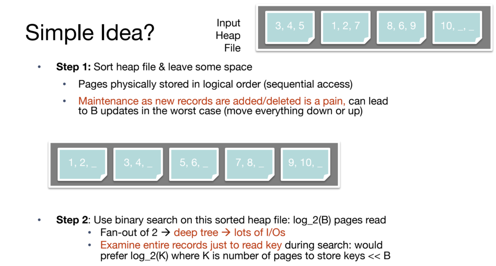
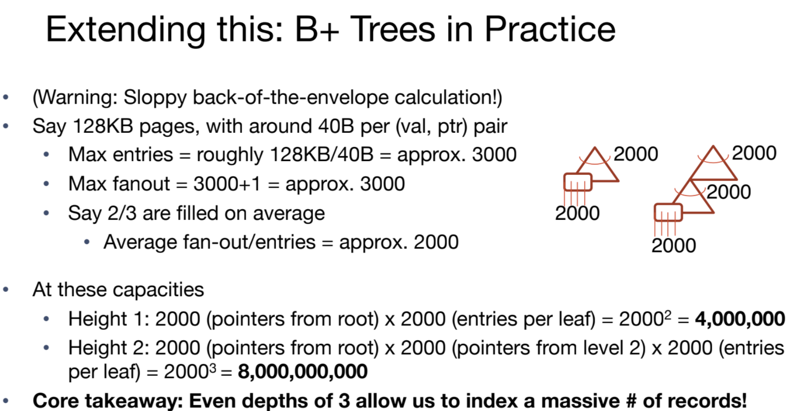
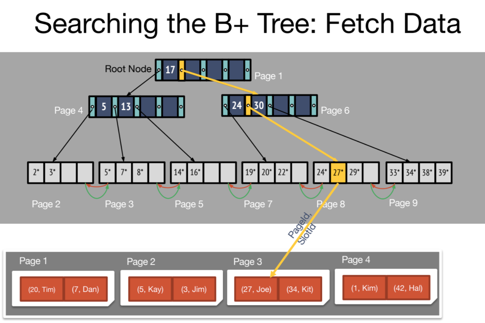
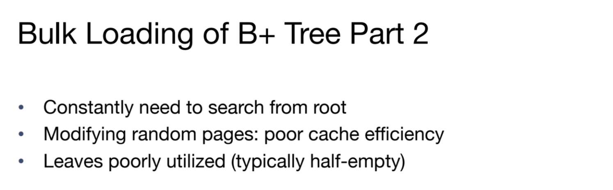

> Note 3 Discussion 3
# Overview
## Index
> [!concept]
> 

# B-plus Tree Index
## Key Idea
> [!important]
> 

## B Tree Nodes
> [!concept] Interior Node
> 

> [!concept] Leaf Nodes
> Note: Leaf node's entry keeps the pointer to a particular record.
> 

## B Tree Properties
> [!property] Occupant Invariant
> 
> **B+ Tree Invariant(Order):** each interior node is full beyond a certain minimum: in this case [and typically], at least half full:
> - This minimum, d, is called the **order** of the tree.
> - In Figure 1, max # of entries = 4(page 9). Thus d = 2.
> - **Guarantee:** d <= # entries <= 2d. In this tree, 2 <= # entries <= 4.
> 
> 
> **Several Properties of B+ Tree:**
> - The number d is the order of a B+ tree. Each node (**with the exception of the root node**) must have d ≤ x ≤ 2d entries **assuming no deletes happen** (it’s possible for leaf nodes to end up with < d entries if you delete data). **The entries within each node must be sorted.**
> - In between each entry of an inner node, there is a pointer to a child node. Since there are at most 2d entries in a node, inner nodes may have at most 2d + 1 child pointers. This is also called the **tree’s fanout**. 
> - The keys in the children to the left of an entry must be less than the entry while the keys in the children to the right must be **greater than or equal to** the entry

> [!property] Non-sequential Page Storage
> 
> Leaf pages at bottom need not be stored in sequence in logical order.
> - In figure 2, we have page 2, 3 at the leaf node, but page 4 being the parent, which indicates that page doesn't have to be stored in sequential order.
> - Next and prev. pointers help examining them in sequence.

## B Tree and Scale 
> [!concept]
> 
> **Note:** Tree geight starts from 0 from leaf node of the B+ tree.
> 
> 

# B-Plus Tree Operations
## Searching
> [!important]
> 
> This is the benefit brought by the doubly linked list at the leaf level.

## Insertion
> [!algo]
> 
> **Note:** we want to **COPY** leaf node data into the parent so that we don’t lose the data in the leaf node. Remember that every key that is in the table that the index is built on must be in the leaf nodes! Being in a inner node does not mean that key is actually still in the table. 
> 
> On the other hand, we can **MOVE** inner node data into parent nodes because the inner node does not contain the actual data, they are just a reference of which way to search when traversing the tree.
> 

> [!example]
> 

## Deletion
> [!concept]
> 

## Bulk Loading
> [!motiv] Motivation
> 

> [!algo]
> 

> [!example] 
> 

# B-plus Tree Refinement

