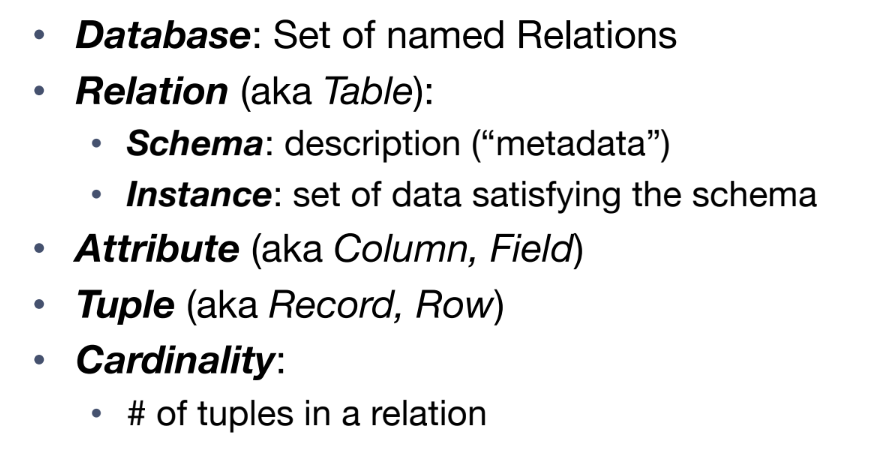
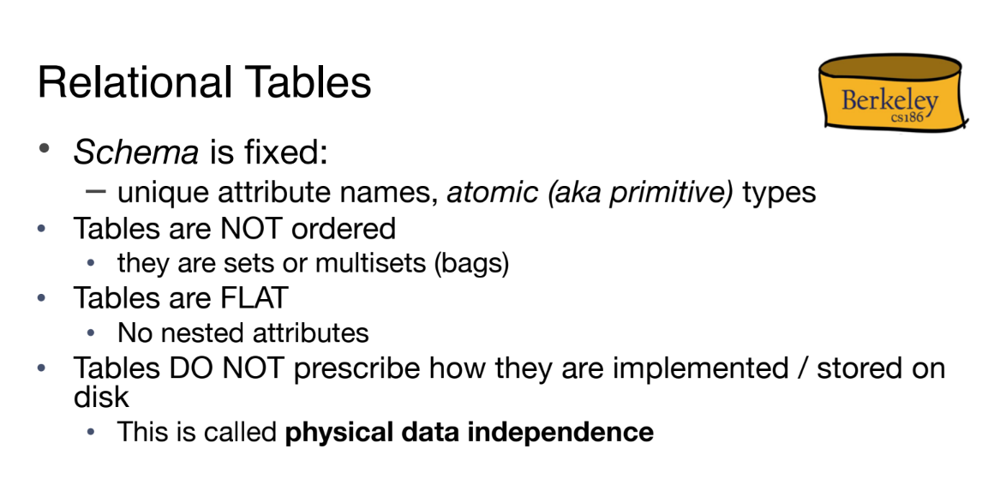
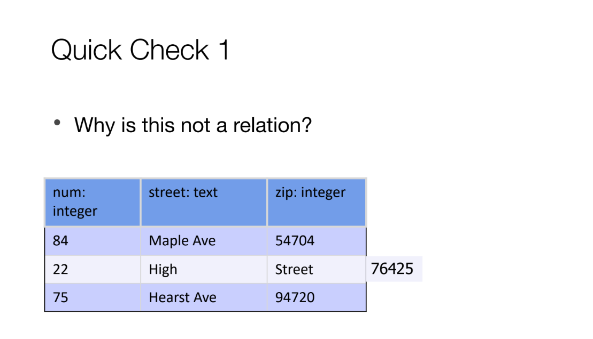
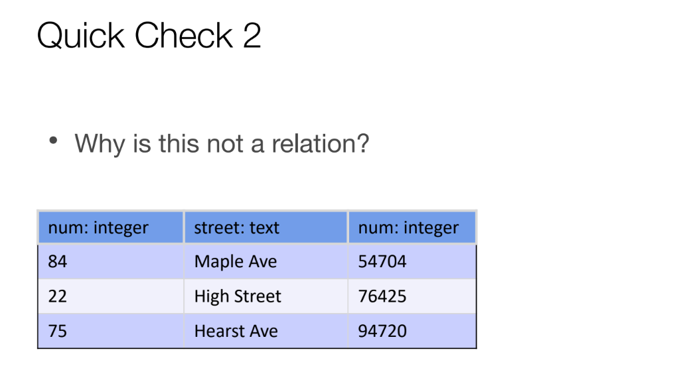
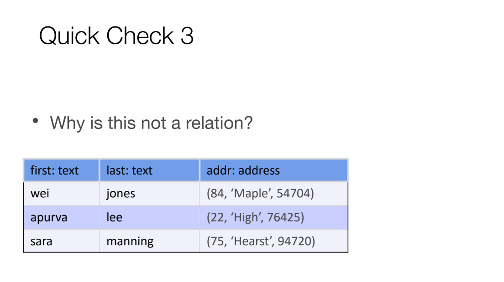
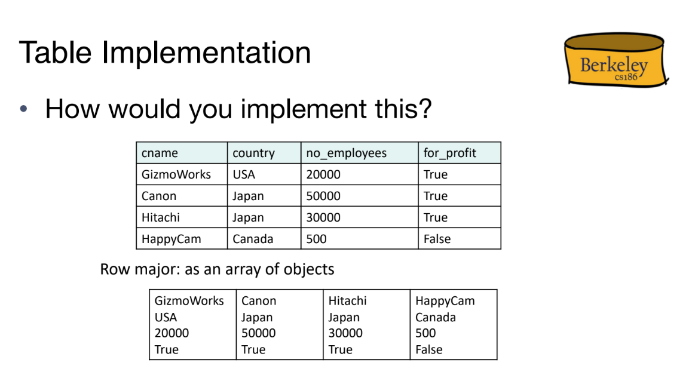
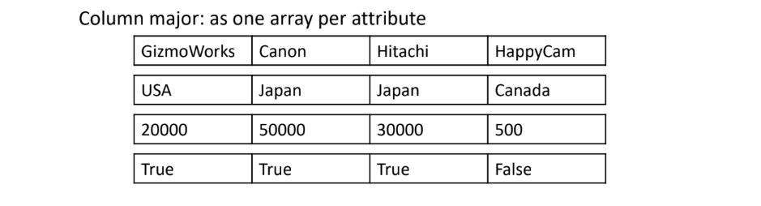
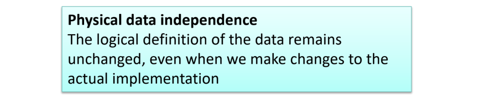
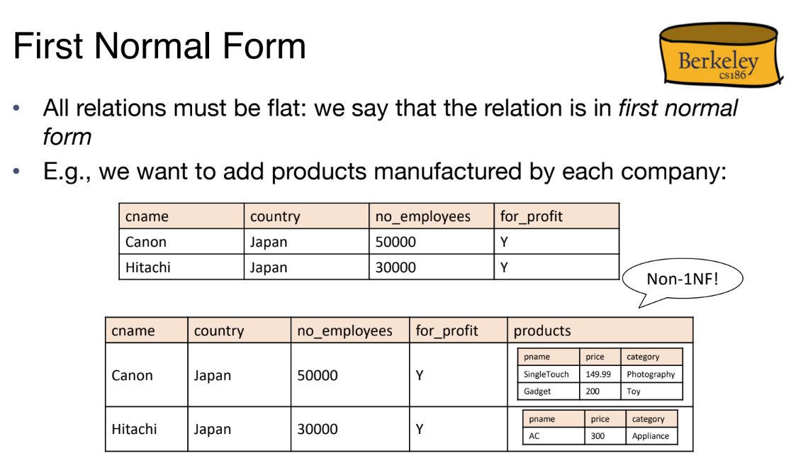
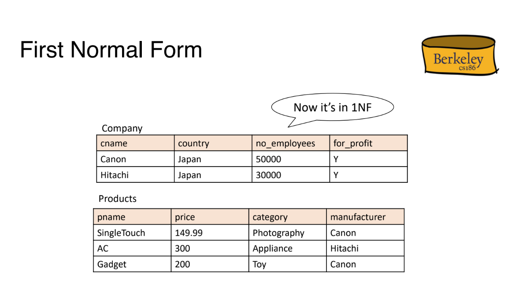

# Relation
## Relational Terminology
> [!def]
> 

## Relational Tables
> [!summary]
> 

## Concept Check
> [!example]
> 
> Since the second row doesn't satisfy the scheme. Very obvious visually.
> 
> 
> Two columns have the same name. Attributes have to be unique.
> 
> 
> Table is not flat. Addr is not as primitive type.

## Table Implementation
> [!concept]
> 

## First Normal Form
> [!concept]
> 

# SQL

