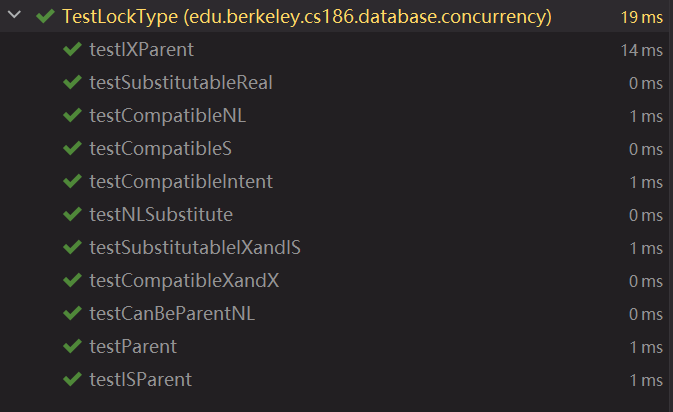

# Preliminaries
## Lock Manager
> [!important]
> 

> [!solution]
> 


## Lock Privileges
> [!important]
> We have the following lock privileges:
> - X > S
> - X > S> IX
> - S > IS
> - S > IX > IS
> - SIX > IS
> 
> In summary, any lock's privilege is higher than intention lock, and is higher than `NL`(no lock). Lower privilege lock can be substituted by higher ones without any side effects.


## Lock Hierarchy
> [!important]
> - Any locktype can be parent lock of of NL.
> - IX can be parent of any child node.(IX can be seen as of higher rank). Intention to write prioritize intention to read. After all, writing including reading first.
> - IS can be parent of IS, S, NL.
> - IS cannot be parent of IX, X, SIX


# Part 1: Queuing
## Task 1: LockType
> [!task]
> 
```python
/**
 * Utility methods to track the relationships between different lock types.
 */
public enum LockType {
    S,   // shared
    X,   // exclusive
    IS,  // intention shared
    IX,  // intention exclusive
    SIX, // shared intention exclusive
    NL;  // no lock held

    /**
     * This method checks whether lock types A and B are compatible with
     * each other. If a transaction can hold lock type A on a resource
     * at the same time another transaction holds lock type B on the same
     * resource, the lock types are compatible.
     */
    public static boolean compatible(LockType a, LockType b) {
        if (a == null || b == null) {
            throw new NullPointerException("null lock type");
        }
        // TODO(proj4_part1): implement
        if (a == NL || b == NL) {
            return true;
        }

        if (a == X || b == X) {
            return false;
        }

        if ((a == SIX && b == IS) || (a == IS && b == SIX)) {
            return true;
        }

        if ((a == S && (b == IS || b == S)) || (b == S && (a == IS || a == S)))
            return true;

        if (a == IS && b == IS) {
            return true;
        }

        if (a == IX && b == IX) {
            return true;
        }

        if ((a == IS && b == IX) || (a == IX && b == IS)) {
            return true;
        }

        return false;
    }

    /**
     * This method returns the lock on the parent resource
     * that should be requested for a lock of type A to be granted.
     */
    public static LockType parentLock(LockType a) {
        if (a == null) {
            throw new NullPointerException("null lock type");
        }
        switch (a) {
        case S: return IS;
        case X: return IX;
        case IS: return IS;
        case IX: return IX;
        case SIX: return IX;
        case NL: return NL;
        default: throw new UnsupportedOperationException("bad lock type");
        }
    }

    /**
     * This method returns if parentLockType has permissions to grant a childLockType
     * on a child.
     */
    public static boolean canBeParentLock(LockType parentLockType, LockType childLockType) {
        if (parentLockType == null || childLockType == null) {
            throw new NullPointerException("null lock type");
        }
        // TODO(proj4_part1): implement
        // Any locktype can be parent lock of of NL
        if (childLockType == NL) {
            return true;
        }

        // IX can be parent of any child node.(IX can be seen as of higher rank)
        // Intention to write prioritize intention to read.
        if (parentLockType == IX) {
            return true;
        }

        // IS can be parent of IS, S, NL
        if (parentLockType == IS) {
            // IS cannot be parent of IX, X, SIX
            if (childLockType == SIX || childLockType == X || childLockType == IX) {
                return false;
            }
            return true;
        }


        return false;
    }

    /**
     * This method returns whether a lock can be used for a situation
     * requiring another lock (e.g. an S lock can be substituted with
     * an X lock, because an X lock allows the transaction to do everything
     * the S lock allowed it to do).
     */
    public static boolean substitutable(LockType substitute, LockType required) {
        if (required == null || substitute == null) {
            throw new NullPointerException("null lock type");
        }
        // TODO(proj4_part1): implement
        // We can definitely replace itself with itself
        if (required == substitute) {
            return true;
        }

        if (required == S && (substitute == X || substitute == SIX)) {
            return true;
        }

        if (required == IS && substitute == IX) {
            return true;
        }

        return false;
    }

    /**
     * @return True if this lock is IX, IS, or SIX. False otherwise.
     */
    public boolean isIntent() {
        return this == LockType.IX || this == LockType.IS || this == LockType.SIX;
    }

    @Override
    public String toString() {
        switch (this) {
        case S: return "S";
        case X: return "X";
        case IS: return "IS";
        case IX: return "IX";
        case SIX: return "SIX";
        case NL: return "NL";
        default: throw new UnsupportedOperationException("bad lock type");
        }
    }
}
```
> [!code] TestOutput
> 

   


## Task 2: LockManager
### Lock Request
> [!important]
> Lock Request Class Design:
```java
/**  
 * Represents a lock request on the queue for `transaction`, requesting `lock` * and releasing everything in `releasedLocks`. `lock` should be granted and * everything in `releasedLocks` should be released *before* the transaction is * unblocked. */class LockRequest {  
    TransactionContext transaction;  // The transaction that try to acquire a lock
    Lock lock;   // the lock to acquire
    List<Lock> releasedLocks;   // The locks to be released
  
    // Lock request for `lock`, that is not releasing anything.  
    LockRequest(TransactionContext transaction, Lock lock) {  
        this.transaction = transaction;  
        this.lock = lock;  
        this.releasedLocks = Collections.emptyList();  
    }  
    // Lock request for `lock`, in exchange for all the locks in `releasedLocks`.  
    LockRequest(TransactionContext transaction, Lock lock, List<Lock> releasedLocks) {  
        this.transaction = transaction;  
        this.lock = lock;  
        this.releasedLocks = releasedLocks;  
    }  
    @Override  
    public String toString() {  
        return "Request for " + lock.toString() + " (releasing " + releasedLocks.toString() + ")";  
    }}
```


> [!task]


