# Amdahl's Law
> 

# Flynn's Taxonomy
> 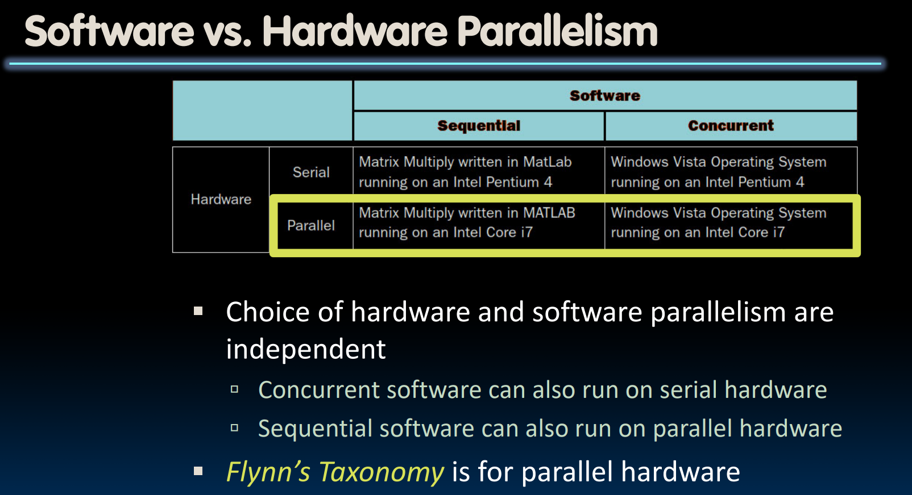
> 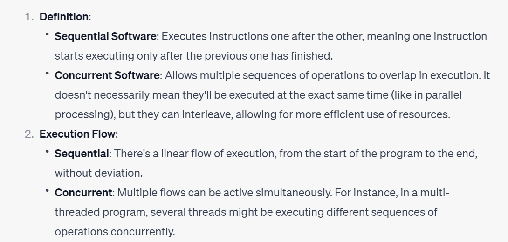
> 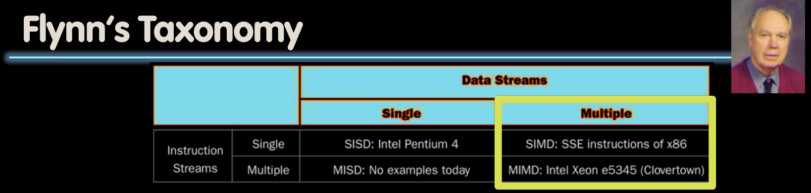
> SIMD 和 MIMD 是目前最常见的并行处理技术。最普遍的并行处理编程风格是SPMD，一个程序在MIMD的所有处理器上运行。通过条件表达式进行跨处理器的执行协调。
> SIMD是专门的硬件单元，用于处理数组计算，常应用于科学计算、机器学习、信号处理和多媒体处理。

# SIMD History
## SISD/SIMD/MIMD/MISD
> 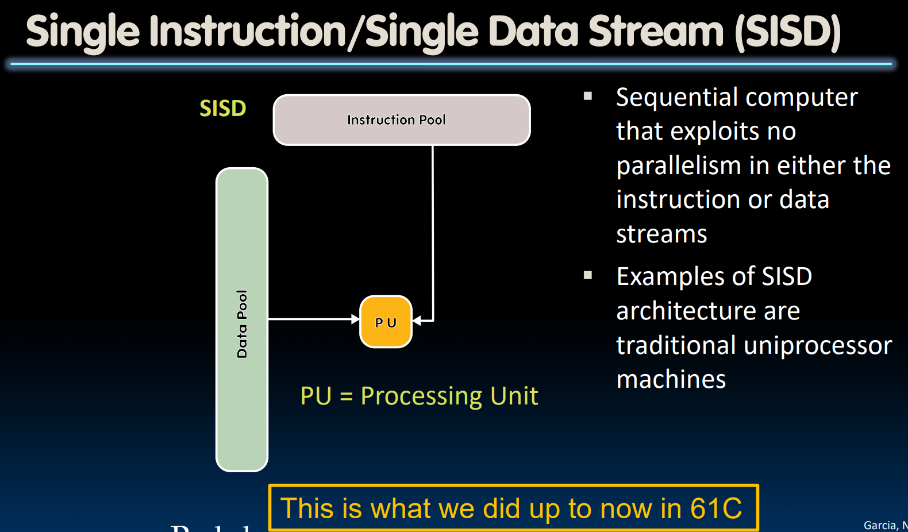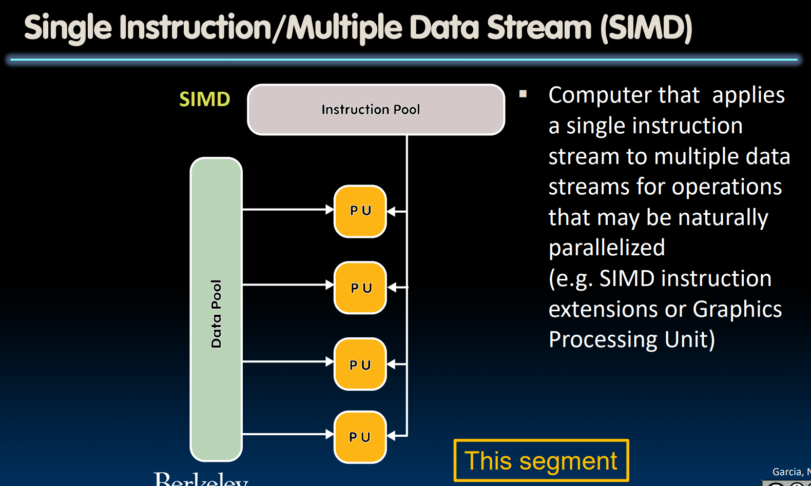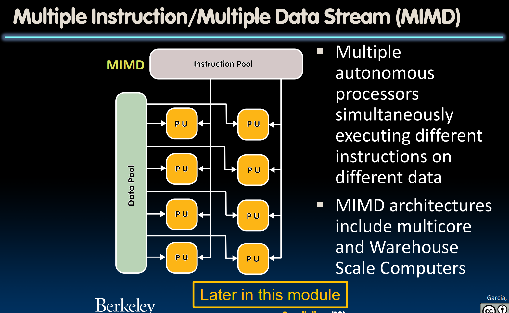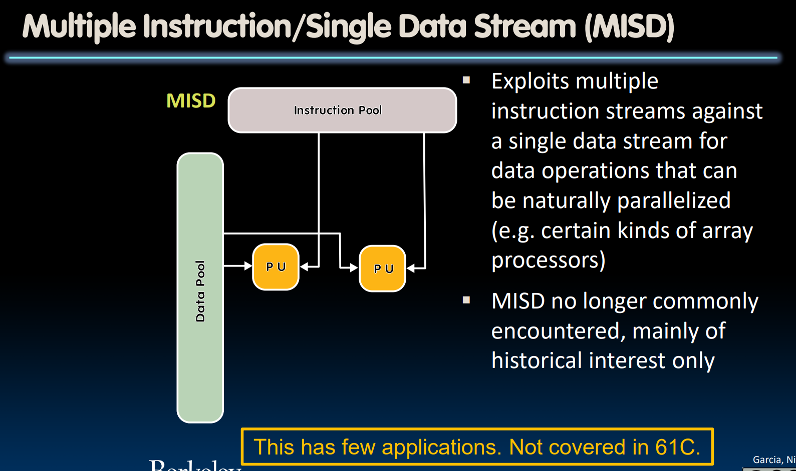

## SIMD Evolution
> 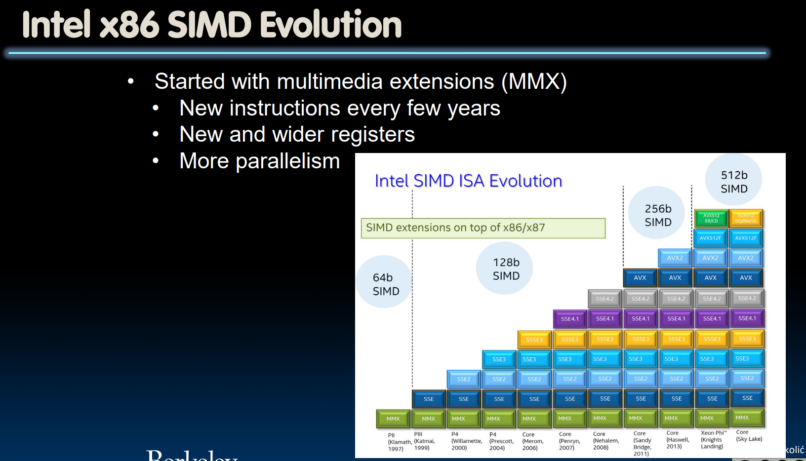

### MMX
> 

### SSE
> 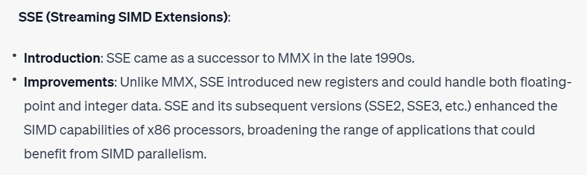

### AVX
> 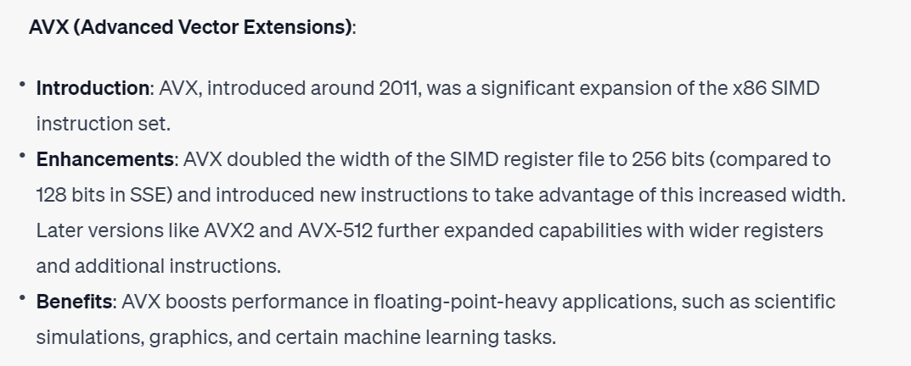

## SIMD Architecture
### XMM Register in SSE
> 本质上说，`XMM Register`就是一个能够储存位宽为`128bit`的大号寄存器，一共有`16`个。
> 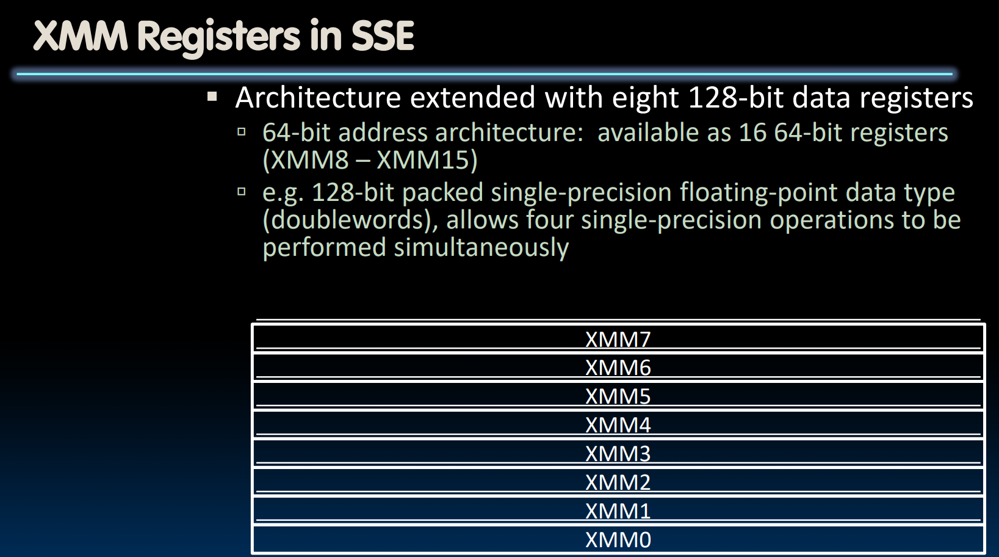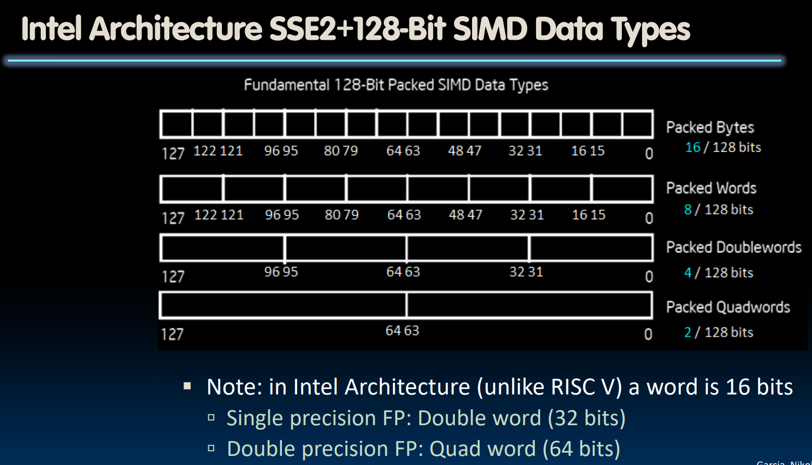
> `Packed`的意思就是我们可以同时处理多个数据段。

### SIMD Register in AVX512
> 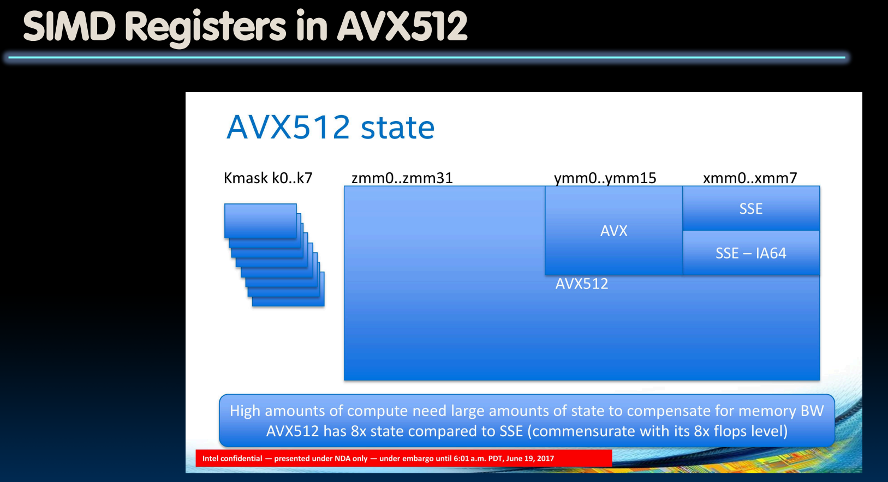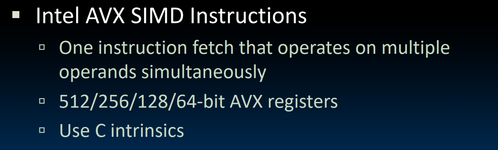

### WSL Parameter(lscpu)
> 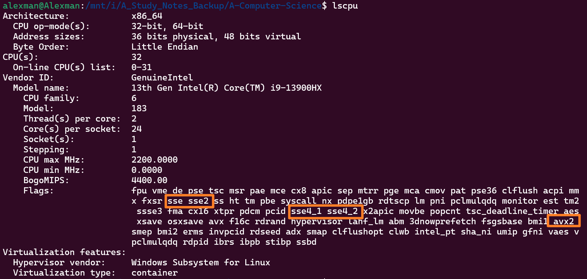

# SIMD Parallel Instructions
## SIMD Array Processing
> 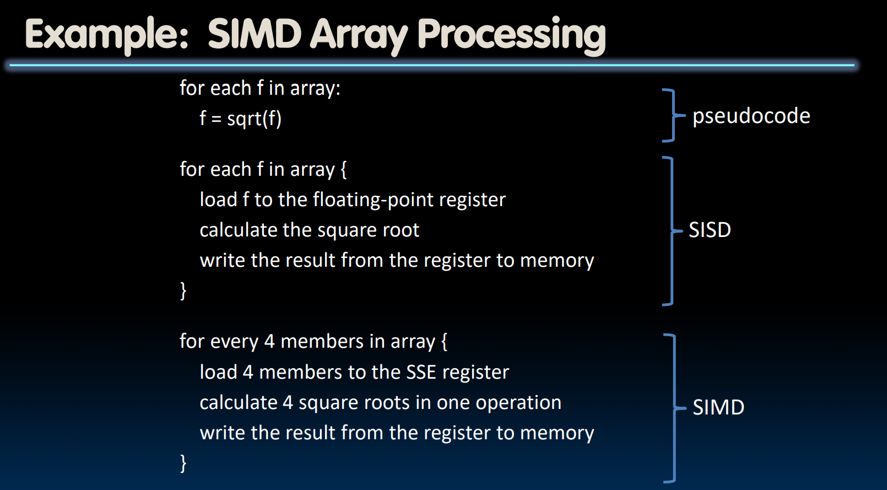
> 我们可以发现`SIMD`可以极大程度上的缩减我们循环体执行的次数，每个循环体内做的事情会比`SISD`更多。
> 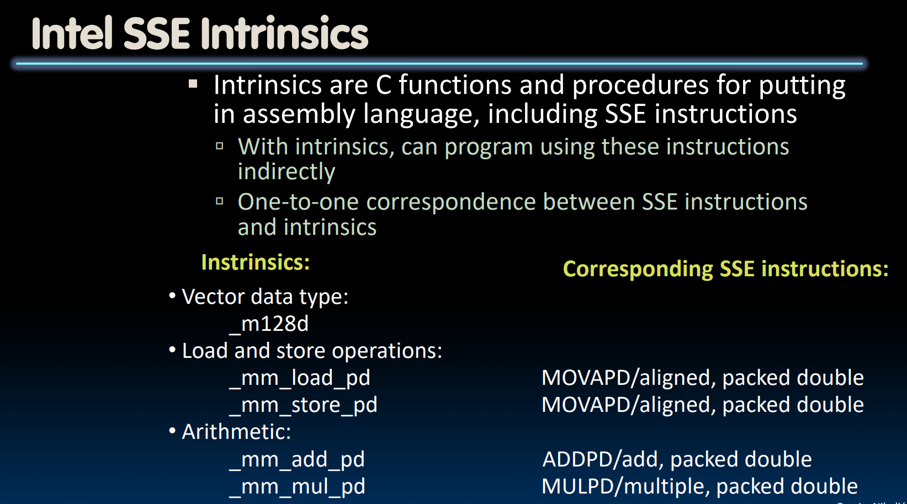

## SIMD Matrix Multiplication
> 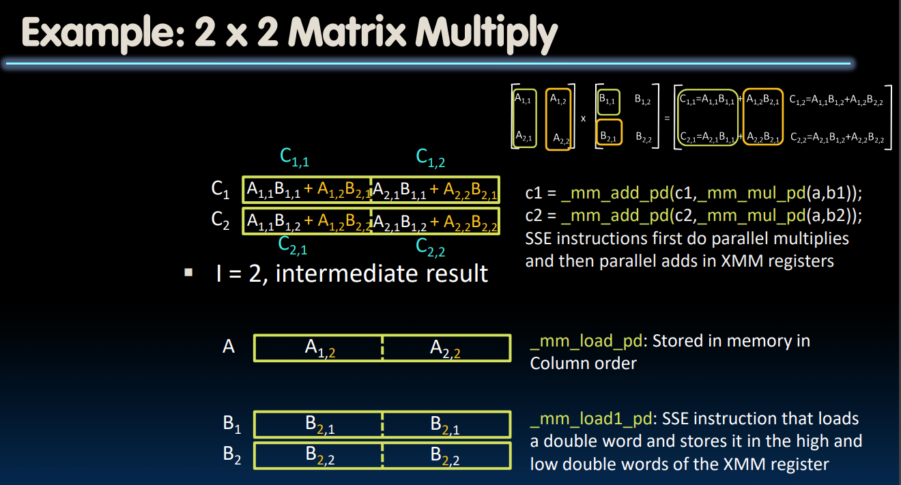

