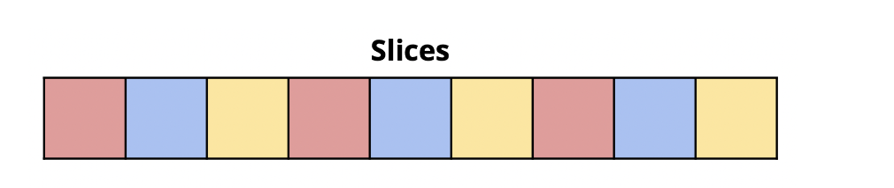
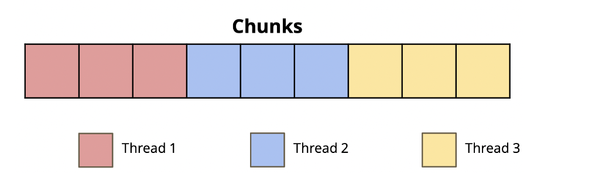
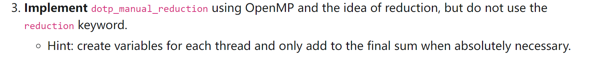

# OpenMP

## Vector Multiplication Example
> [!lab] CS61C Sp23 Lab07 Ex2, Lab08 Ex1
### parallel 
> [!def]
> 在`parallel directive`下的代码会被所有线程同时执行。
> 对于向量乘法来说，我们可以使用多线程进行运算，每一个线程只负责特定`arr[index]`的元素相乘操作。一般有两种线程任务分配方式:
> 1. Adjacent Method
> 
> 2. Chunk Method
> 

#### Adjacent Method
```c
// Adjacent Method

void v_add_optimized_adjacent(double* x, double* y, double* z) {

	// TODO: Implement this function
	
	// Do NOT use the `for` directive here!

	// 所有线程都会执行下面的{...}中的代码
	#pragma omp parallel
	
	{
	
		int total_num_thread = omp_get_num_threads();
		
		int thread_id = omp_get_thread_num();
		
		int stride = thread_id % total_num_thread;
		
		for (int i = stride; i < ARRAY_SIZE; i += total_num_thread) {
		
			z[i] = x[i] + y[i];
		
		}
	
	}

}
```


#### Chunk Method
> [!example]
> 这里采用的分块逻辑是:
> - 如果线程数量`n`能够整除数组的元素个数`m`，则每个线程平分相同数量的数组元素。
> - 如果不能，则前`n-1`个线程分配相同数量的数组元素`k`，且保证`k`使得`(n-1)*k < m`成立。计算方法也很简单，只要令$k=\lfloor\frac{m}{n}\rfloor$即可。这样前`n-1`个线程处理`k`个元素，最后一个线程处理`m-(n-1)*k`个元素。

```c
// Chunks Method

void v_add_optimized_chunks(double* x, double* y, double* z) {

	// TODO: Implement this function
	
	// Do NOT use the `for` directive here!
	
	#pragma omp parallel
	
	{
	
		int total_num_thread = omp_get_num_threads();
		
		int thread_id = omp_get_thread_num();
		
		// Compute the total number of full chunks
		
		// Chunk Logic
		
		int equal_chunk_size = ARRAY_SIZE / total_num_thread;
		
		int tail_chunk_size = ARRAY_SIZE - ARRAY_SIZE / total_num_thread * (total_num_thread - 1);
		
		  
		
		// Deal with the equal_size chunk
		
		if (thread_id < total_num_thread - 1) {
		
		// printf("thread id %d dealing with equal size\n", thread_id);
		
		int start_index = thread_id * equal_chunk_size;
		
		for (int i = 0; i < equal_chunk_size; i++) {
		
				z[start_index + i] = x[start_index + i] + y[start_index + i];
				
			}
	
		} else {
			
			// Deal with the tail chunk
			
			// printf("thread id %d dealing with tail chunk\n", thread_id);
			
			int start_index = (total_num_thread - 1) * equal_chunk_size;
			
			for (int i = 0; i < tail_chunk_size; i++) {
			
			z[start_index + i] = x[start_index + i] + y[start_index + i];
			
			}
			
		}
	
	}

}
```


#### Automatic Split
> [!def]
> 上述的两种实现方式可以使用`#pragma omp parallel for`来简化实现, 有两种编写方式:
> 
> 1. 在`pragma omp parallel for`后紧接着`for`循环
> 2. 在`pragma omp parallel`中写`pragma omp for`
```c
// 1. 第一种写法:
#pragma omp parallel for
for(...) {
...
}

// 2. 第二种写法:
#pragma omp parallel 
{
	#pragma omp for
	for(...){
	...
	}
}
```


### critical
> [!def]
> 用于防止线程读取公共变量时的脏读现象。
```c
double dotp_critical(double* x, double* y, int arr_size) {
	// 公共变量
	double global_sum = 0.0;
	
	// TODO: Implement this function
	
	// Use the critical keyword here!
	
	// Need to compute the inner product of two vectors
	
	#pragma omp parallel
	
	{
	
		for (int i = 0; i < arr_size; i++) {
			// 某一时刻只有一个线程能够读取并修改global_sum变量
			#pragma omp critical
			
			{
			
				global_sum += x[i] * y[i];
			
			}
			
		}
	
	}
	
	return global_sum;

}
```

### reduction
> [!def]
> 用于提升`critical`关键字带来的多线程性能下降。原理如下:
> 

#### Use Reduction Keyword
```c
// Reduction Keyword

double dotp_reduction(double* x, double* y, int arr_size) {

	double global_sum = 0.0;
	// Use the reduction keyword here!
	
	#pragma omp parallel
	{
		// + 是 operator
		// :global_sum 是 shared variables
		#pragma omp for reduction(+:global_sum)
		for (int i = 0; i < arr_size; i++){
			global_sum += x[i] * y[i];
		}
	}

	return global_sum;
}
```


#### Manual Implementations
```c

```


