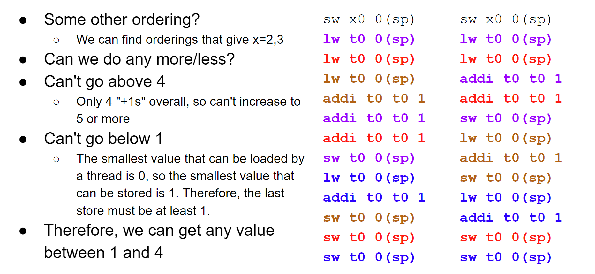
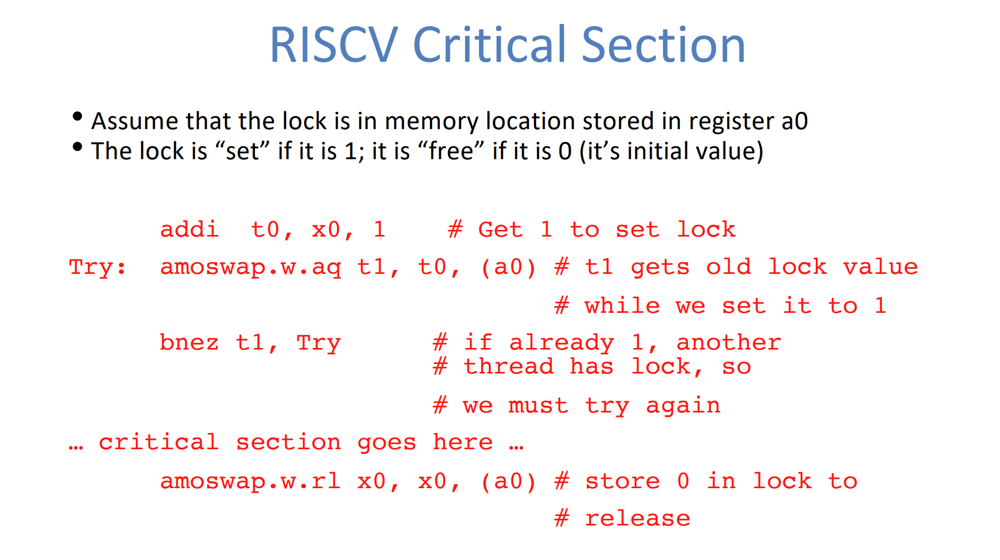
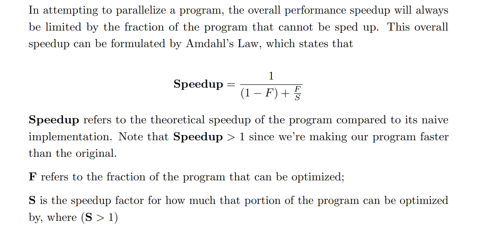

# Data Races
## Definition
> [!important]
> 


## Sum Reduction Example
> [!example]
> 


## Data Race Example
> [!example]
> 


# Software Synchronization - Lock 
> [!motiv] Motivation
> 


## Lock Synchronization
> [!def]
> 


## Code Format
> [!example]
> 


## Problem with Software Synchonization
> [!bug]
> 


# Hardware Synchonization
> [!motiv] Motivation
> 
> 关键就在于，`atomic instruction`可以同时完成`check lock`和`set lock`的操作，不给其他的`threads`留余地。


## Atomic Instruction
> [!important]
> 


## Memory Ordering
> [!important]
> 
> More in CS152


## Atomic Lock Setting
> [!example]
> 


## Parallel Hello World
> [!example]
> 


# OpenMP

## Summary
> [!important]
> 


## Vector Multiplication Example
> [!lab] CS61C Sp23 Lab07 Ex2, Lab08 Ex1
### parallel 
> [!def]
> 在`parallel directive`下的代码会被所有线程同时执行。
> 对于向量乘法来说，我们可以使用多线程进行运算，每一个线程只负责特定`arr[index]`的元素相乘操作。一般有两种线程任务分配方式:
> 1. Adjacent Method
> 
> 2. Chunk Method
> 

#### Adjacent Method
```c
// Adjacent Method

void v_add_optimized_adjacent(double* x, double* y, double* z) {

	// TODO: Implement this function
	
	// Do NOT use the `for` directive here!

	// 所有线程都会执行下面的{...}中的代码
	#pragma omp parallel
	
	{
	
		int total_num_thread = omp_get_num_threads();
		
		int thread_id = omp_get_thread_num();
		
		int stride = thread_id % total_num_thread;
		
		for (int i = stride; i < ARRAY_SIZE; i += total_num_thread) {
		
			z[i] = x[i] + y[i];
		
		}
	
	}

}
```


#### Chunk Method
> [!example]
> 这里采用的分块逻辑是:
> - 如果线程数量`n`能够整除数组的元素个数`m`，则每个线程平分相同数量的数组元素。
> - 如果不能，则前`n-1`个线程分配相同数量的数组元素`k`，且保证`k`使得`(n-1)*k < m`成立。计算方法也很简单，只要令$k=\lfloor\frac{m}{n}\rfloor$即可。这样前`n-1`个线程处理`k`个元素，最后一个线程处理`m-(n-1)*k`个元素。

```c
// Chunks Method

void v_add_optimized_chunks(double* x, double* y, double* z) {

	// TODO: Implement this function
	
	// Do NOT use the `for` directive here!
	
	#pragma omp parallel
	
	{
	
		int total_num_thread = omp_get_num_threads();
		
		int thread_id = omp_get_thread_num();
		
		// Compute the total number of full chunks
		
		// Chunk Logic
		
		int equal_chunk_size = ARRAY_SIZE / total_num_thread;
		
		int tail_chunk_size = ARRAY_SIZE - ARRAY_SIZE / total_num_thread * (total_num_thread - 1);
		
		  
		
		// Deal with the equal_size chunk
		
		if (thread_id < total_num_thread - 1) {
		
		// printf("thread id %d dealing with equal size\n", thread_id);
		
		int start_index = thread_id * equal_chunk_size;
		
		for (int i = 0; i < equal_chunk_size; i++) {
		
				z[start_index + i] = x[start_index + i] + y[start_index + i];
				
			}
	
		} else {
			
			// Deal with the tail chunk
			
			// printf("thread id %d dealing with tail chunk\n", thread_id);
			
			int start_index = (total_num_thread - 1) * equal_chunk_size;
			
			for (int i = 0; i < tail_chunk_size; i++) {
			
			z[start_index + i] = x[start_index + i] + y[start_index + i];
			
			}
			
		}
	
	}

}
```


#### Automatic Split
> [!def]
> 上述的两种实现方式可以使用`#pragma omp parallel for`来简化实现, 有两种编写方式:
> 
> 1. 在`pragma omp parallel for`后紧接着`for`循环
> 2. 在`pragma omp parallel`中写`pragma omp for`
```c
// 1. 第一种写法:
#pragma omp parallel for
for(...) {
...
}

// 2. 第二种写法:
#pragma omp parallel 
{
	#pragma omp for
	for(...){
	...
	}
}
```


### critical
> [!def]
> 用于防止线程读取公共变量时的脏读现象。
```c
double dotp_critical(double* x, double* y, int arr_size) {
	// 公共变量
	double global_sum = 0.0;
	
	// TODO: Implement this function
	
	// Use the critical keyword here!
	
	// Need to compute the inner product of two vectors
	
	#pragma omp parallel
	
	{
	
		for (int i = 0; i < arr_size; i++) {
			// 某一时刻只有一个线程能够读取并修改global_sum变量
			#pragma omp critical
			
			{
			
				global_sum += x[i] * y[i];
			
			}
			
		}
	
	}
	
	return global_sum;

}
```

### reduction
> [!motiv] Motivation
> 


> [!def]
> 用于提升`critical`关键字带来的多线程性能下降。原理如下:
> 


#### Use Reduction Keyword
```c
// Reduction Keyword

double dotp_reduction(double* x, double* y, int arr_size) {

	double global_sum = 0.0;
	// Use the reduction keyword here!
	
	#pragma omp parallel
	{
		// + 是 operator
		// :global_sum 是 shared variables
		#pragma omp for reduction(+:global_sum)
		for (int i = 0; i < arr_size; i++){
			global_sum += x[i] * y[i];
		}
	}

	return global_sum;
}
```


#### Manual Implementations
```c
double dotp_manual_reduction(double* x, double* y, int arr_size) {
    double global_sum = 0.0;
    // TODO: Implement this function
    // Do NOT use the `reduction` directive here!

    #pragma omp parallel
    {
        int thread_num = omp_get_thread_num();
        int total_thread_num = omp_get_num_threads();
    // Must be double
        double local_sum = 0;
        
        #pragma omp for
        for (int i = 0; i < arr_size; i+=1) {
            local_sum += x[i] * y[i];
        }

// Here is the code which can be executed by one thread at the same time
        #pragma omp critical
        {
            global_sum += local_sum;
       }
    }

    return global_sum;
}
```


## Matrix Multiplication Example
### Naive Matrix Multiply
> [!example]
> 


### Matrix Multiply in OpenMP
> [!example]
> 


# OpenMP Pitfalls
## Data Dependency
> [!important]
> 


## Sharing Issues
> [!important]
> 
> 多个线程会读取/修改同一个`temp`变量，所以每个线程读取到的`temp`都有可能被其他的线程修改过。


## Updating Shared Variables Simultaneously
> [!important]
> 


## Parallel Overhead
> [!important]
> 


# Multithreading Cache Coherence
## Multiprocessor Caches
> [!def]
> 


## Shared Memory and Caches
> [!def]
> 
> Process 0 的介入造成了Process 1 和 Process 2的Cache中的值和内存中不一致了。
> 所以我们需要Proceess 0 在 Write Allocate 的时候通过 interconnection network 通知其他的cache, 自己修改了 main memory的数据。


## Cache Coherency
> [!important] 
> 
> 假设Process 1 和 2 事先已经从内存`0x1000`处读取 20 到各自的 Cache 中了。然后 Process 0 向内存`0x1000`处写入 40, 采用 write allocate (process 0 的 cache 中也有一份 40), 然后 Process 0 通过 interconnection network 查询 Process 0 和 1的 Cache的 `0x1000` 处的数值是否和自己的 Cache 的 `0x1000` 处的数值一样，如果一样则无事发生，否则 Process 0 将 Process 1 和 Process 2 的 Cache 的 `0x1000` 处的`valid bit` 设置为`0`, 表示数据已过期。


## Concept Check
> [!example]
> 
> A: Write through policy means when I want to write to the memory, I have to update my cache(On a write hit event), which may cause incoherence between different processor's caches. So it doesn't remove the need for cache coherence, and A is wrong.
> B: Store Instruction means we want to write to the memory, which is the same as A, so we must check the contents of other caches, invalidate the contents there or sth, so B is right.
> C: From B we know if we are storing elements, we have to check cache incoherence, so C is wrong.
> D: It is definitely wrong. As long as the contents in the cache of different processors are the same(up to date), then lives are good.


## Cache Blocking - More in Lab07
> [!example]
> 
> We don't want to stride too short, in which case we may miss some of the data in the block
> We don't want to stride too large,  in which case we will have to bring in new blocks every single time.
> 


# Cache Coherence Protocol
## MSI Protocol
> [!important]
> 


### MSI Protocol: Current Processor
> [!example]
> 


### MSI Protocol: Response to Other Processors
> [!example]
> 


### Keeping Track of State Block
> [!important]
> 


### MSI Example
> [!example]
> 


### Compatibility Matrix
> [!def]
> 
> 下图中是两个Processors的Same Cache Block的状态的组合情况。打勾的是可能出现的情况，反之是不可能出现的性质。


## MESI Protocol
### Problem with MSI 1: Writing to Shared is Expensive
> [!bug]
> 

### Fix 1: MESI Protocol
> [!debug] Exclusive State
> 


## MOESI Protocol
### Problem with MSI 2: Expensive to Shared Modified
> [!bug]
> 


### Fix 2: MOESI Protocol
> [!debug] Owned State
> 


# False Sharing Problem
> [!important]
> 


# Cache Coherency and Atomic Instructions
> CS61C Su20 Disc13 P2


## Basic Concepts
> [!important]
> 
> - **Load Reserve:** Loads the four bytes at M[R[rs1]], writes them to R[rd], this part is the same as `lw` instruction. But it does one additional thing, which is to register a reservation on that word in memory. This means no other threads are allowed to write to this portion of memory(but can still read) until current load reserve operation finishes.
> - **Store Conditional:** Store the four bytes in register R[rs2] to M[R[rs1]], which is same as `sw`, but it does one additional thing, which is to check if there is a reservation(think of this as a marker) that's registered by load reserve before, if there is, then we are allowed to write to the memory.
> - Load Reserve and Store Conditional appears in pair to implement atomicity.
> - Basically we don't want other threads to interleave between our read and write procedures(modify part).
> 
> 


## Procedures
> [!example]
> 


## LR/SC Example
> [!example] CS61C Su20 Disc13 P3
> 


## Amoswap Example
> [!example] CS61C Sp23 Disc10 P2
> 
> line 7 之前都在定义shared variables, 所以之后就是Parallel Region.

# Code Analysis
## False Sharing
> [!example]  False Sharing Problem - CS61C Sp23 Disc09 P4 / CS61C Su20 Disc13 P3
> 
> Here, since multiple threads are accessing the same array, and each thread has its only cache, chances are that multiple threading are writing to the same memory address and thus the same block of the cache, which may result in false sharing problem where thread  1's block 0 that's in the shared state has a write hit, then the thread 1 has to set other thread's same block 0 that's in the shared state (let's say thread 1)to invalid state. Later on, if thread 1 has a write hit, it has to invalidate thread 0 in the modified state of block 0. This ping-pong effect is one representation of the false sharing.
> 
> 
> **Another example is as follows:**
> Even if the following codes are functionally correct, but it is slower than serial codes and is subject to false sharing since multiple threads are accessing the same array.
> 
> 


## Data Dependency
> [!example] Data Dependency - CS61C Sp23 Disc09 P4
> 
> This is a representation of data dependency where in serial execution, the correctness  of data[i] is dependent on the correctness of data[i-1] and data[i-2], but the multithread program doesn't guarantee such correctness. 
> 
> 


## Good Multithread Program
> [!example] Good Multithread Program - CS61C Sp23 Disc09 P4
> 


## Data Races
### Example 1
> [!example] CS61C Sp23 Disc09 P4
> 


### Example 2
> [!example] CS61C Su20 Disc13 P3
> 


> [!example] CS61C Sp23 Disc10 P2
> 


# Concept Check
## Instruction-Level Parallelsim
> [!important]
> 


## Increasing Clock Speed Fix Everything?
> [!important]
> 
> 现代处理器的时钟频率几乎已经达到了极限，不能再提升了。所以只能再软件层面下功夫。也就是充分利用多核性能。


## More Cores are always good?
> [!important]
> 


## Interleaving Code Execution
> [!important]
> 
> Execution Flow is different from Logic Flow.
> - Execution Flow is the actual sequence of instructions that are executed, which may contain instructions from multiple processes/threads.
> - Logic Flow is to describe the logic of the code, which typically only contains codes from a single process/thread.
> 


## Amdahl's Law of Multi-Thread 
> [!important]
> 
> 本质上，在线程数量确定时($S>1$固定)，Speed up 是一个关于$F$的增函数。在多线程程序中，$F$ 常常代表初始化线程的开销。
> 
> 因为$Speedup=\frac{1}{1-F+\frac{F}{S}}=\frac{1}{1+(\frac{1}{S}-1)F}$
> 


