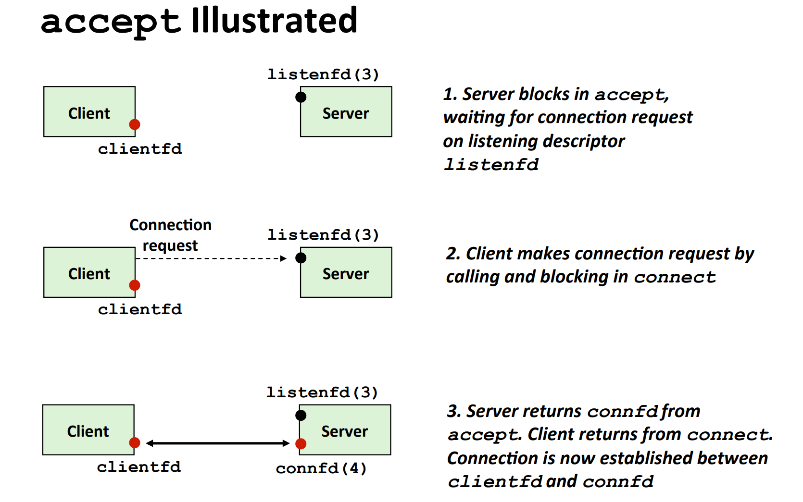

# Socket Interface
## Socket Definition
> [!def]
> 

## Socket Address Structures
### Generic Socket Address
> [!def]
> 
> **Details:**
> - `sa_family`(2 bytes) stores the type of socket connection it is. For example, TCP socket, UDP Socket or IPv6 Socket.

### IP Socket Address
> [!def]
> 
> Can think of `sockaddr_in` as a subclass of `sockaddr` where if you want to pass a `struct sockaddr_in*`   object as a function paramater, you have to cast it to `struct sockaddr*`。

## Sockets Interface
> [!important]
> 

# Socket APIs
## socket()
> [!def]
> 
> **Details:**
> - The `clientfd` descriptor returned by socket is only partially opened and cannot yet be used for reading and writing.
> - Only after the `clientfd` descriptor is decorated by `connect()` function call can we read and write data through it.

## bind()
> [!def]
> 
> **Details:**
> - Here `SA*` is an abbreviationi of `struct sockaddr*`
> - The addrlen argument is `sizeof(sockaddr_in)`.
> - `bind()` is a **kernel call** that designates which particular server this program is supposed to be hosting.
> - In practice, the parameters that you should pass in this function should be obtained from `getaddrinfo()` function.

## listen()
> [!def]
> 
> **Details:**
> 1. The most important thing is that if you create a socket object, then by calling `listen()` on this socket object, you are declaring that this socket object is used for server side.
> 

## accept()
> [!def]
> 

## connect()
> [!def]
> 
> **Details**:
> 1. In the example above, we see that the server's listening fd is 3, since 0,1,2 is preoccupied by stdin, stdout, stderr. 
> 2. The listening fd is used for detecting incoming connection requests from client. The connected fd is used for actually reading and writing data between client and server.

# Host and Service Conversion
## getaddrinfo()
> [!def]
> 

## addrinfo Struct
> [!def]
> 

## getnameinfo()
> [!def]
> 

# Socket Helper Functions
> [!overview]
> These functions simplify the connection procedures.

## open_clientfd()
> [!def]
> 
> The `open_clientfd()` function establishes a connection with a server running on host hostname and listening for connection requests on port number port. 
> 
> It returns an open socket descriptor that is ready for input and output using the Unix I/O functions. 
> 
> We can see that to initialize a socket for client, we have to set:
> - `hints.ai_family = AF_UNSPEC`. When creating a socket, specifying `AF_UNSPEC` as the domain parameter to the `socket()` function tells the system that the application does not have a preference for the underlying network protocol (IPv4 vs. IPv6), and the system should choose automatically based on what is available and applicable. However, in many systems and use cases, the domain is explicitly specified (e.g., `AF_INET` for IPv4 or `AF_INET6` for IPv6) because the application is designed for a specific network protocol.
> - `hints.ai_socktype = SOCK_STREAM` to indicate that it is a TCP connection, where data are read and written in byte stream.

## open_listenfd()
> [!def]
> 
> **Details:**
> 1. Since we have called getaddrinfo with the AI_PASSIVE flag and a NULL host argument, the address field in each socket address structure is set to the wildcard address, which tells the kernel that this server will accept requests to any of the IP addresses for this host.
> 2. In order to initialize a server socket, we have to add `AI_PASSIVE` to  `hints.ai_flags`.
> 
> 

