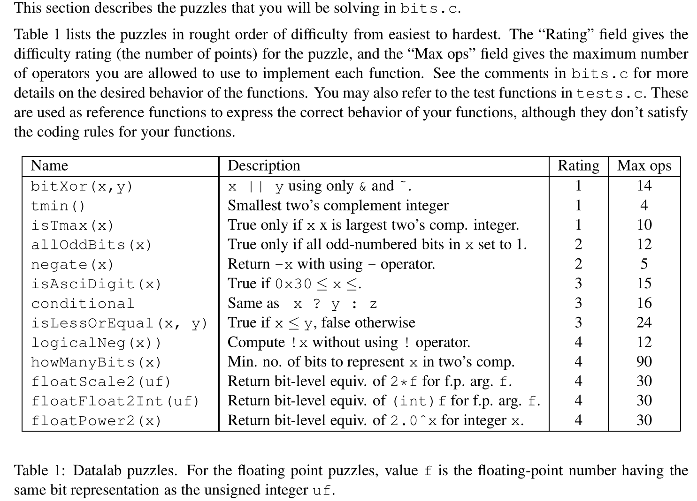
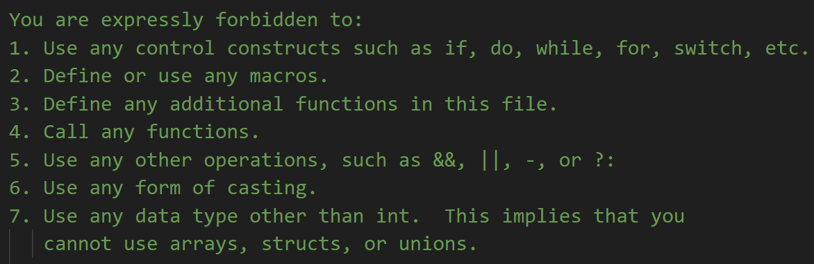
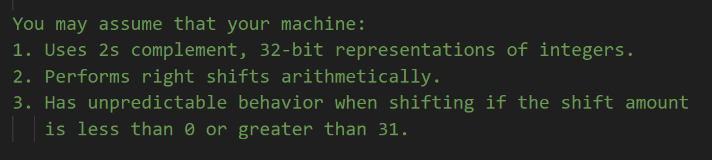
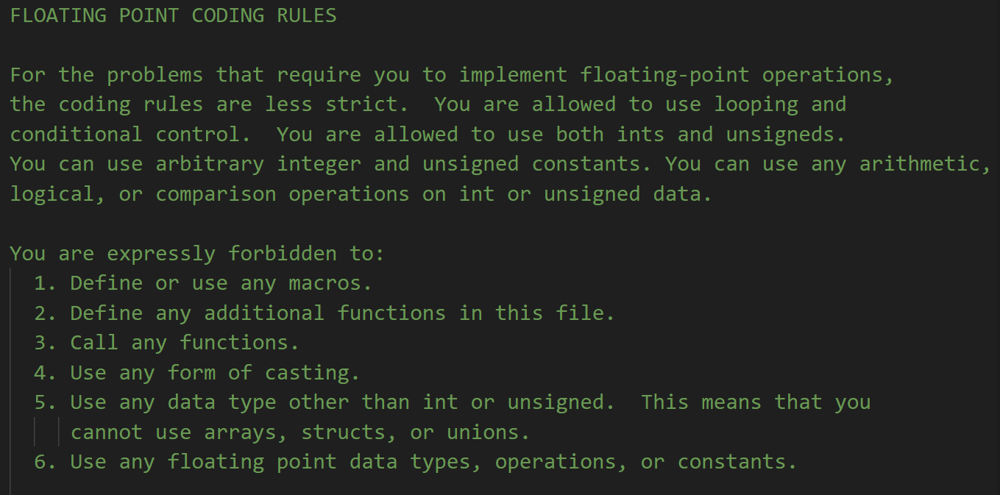
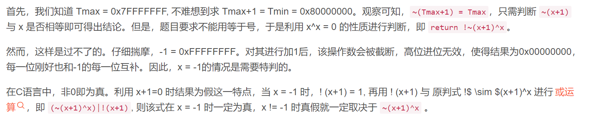
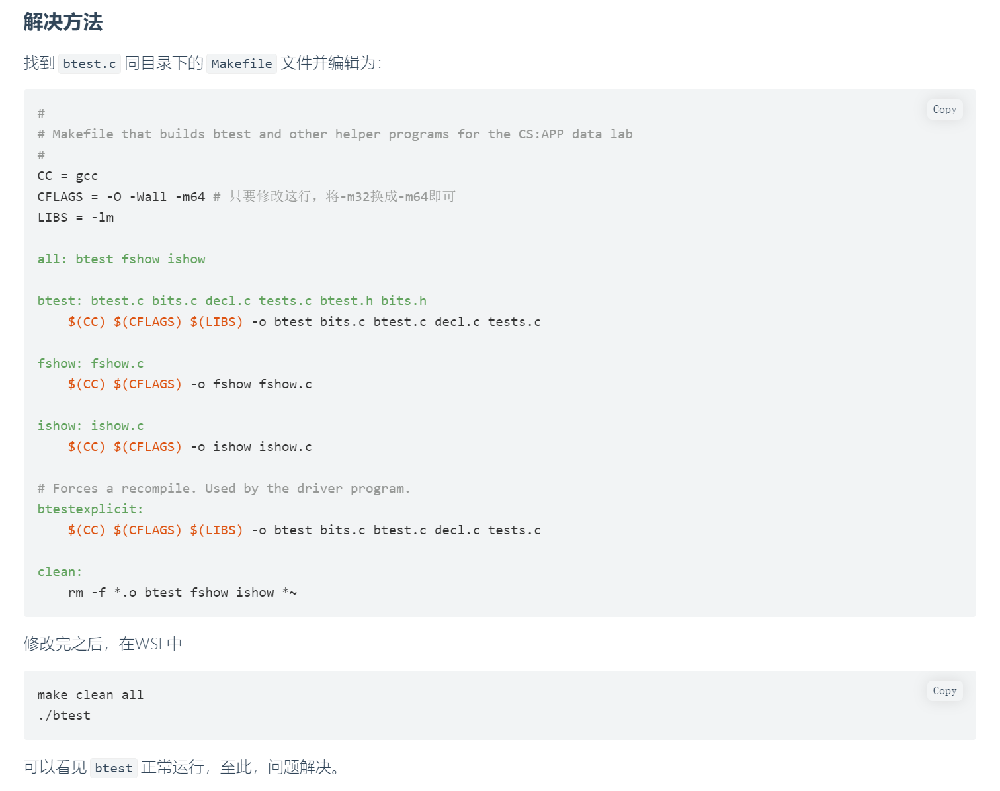

# Overview
> 
> **Prereq: Bits&C Language**


## Integer Coding Rules
> 


## Floating Coding Rules
> 


# Easy Level
## P1 用&和~实现xor
```c
//1
/* 
 * bitXor - x^y using only ~ and & 
 *   Example: bitXor(4, 5) = 1
 *   Legal ops: ~ &
 *   Max ops: 14
 *   Rating: 1
 */
int bitXor(int x, int y) {
  return 2;
}
```
> **算法思路如下:**
> 首先我们可以写出$A$和$B$的`Bitwise Truth Table`:

| A | B | A$\oplus$B |
| --- | --- | --- |
| 0 | 0 | 0 |
| 0 | 1 | 1 |
| 1 | 0 | 1 |
| 1 | 1 | 0 |

> 我们使用`Boolean Logic`中的`CNF`表达成$(A+B)(\overline{A}+\overline{B})$，然后使用`Demorgan's Law`把$+$转化成$\cdot$, 即得到$(\overline{\overline{A}\cdot \overline{B}})\cdot(\overline{A\cdot B})$, 所以答案也就呼之欲出了, 只使用~和&就可以实现`xor Gate`

```c
int bitXor(int x, int y) {
  return ~(~x&~y)&(~(x&y));
}
```


## P2: 最小32bit-2s Complement数
```c
/* 
 * tmin - return minimum two's complement integer 
 *   Legal ops: ! ~ & ^ | + << >>
 *   Max ops: 4
 *   Rating: 1
 */
int tmin(void) {

  return 2;

}
```
> 算法思路很简单，我们要得到的是`0x80000000`, 所以只需要$0x1$向左`Shift 31`位即可。

```c
int tmin(void) {
  return 1<<31;
}
```


## P3: 最大32bit-2s Complement数
```c
//2
/*
 * isTmax - returns 1 if x is the maximum, two's complement number,
 *     and 0 otherwise 
 *   Legal ops: ! ~ & ^ | +
 *   Max ops: 10
 *   Rating: 1
 */
int isTmax(int x) {
  return 2;
}
```
> **一种算法思路如下:**
> 我们要判断的是`x`是否等于`0x7fffffff`, 于是我们使用`^`看看结果是否为零。如果是零，则`x`是最大的`2s complement`数。
> 注意当`x=0x7fffffff`时，函数返回`1`，所以我们要在`x^0x7fffffff`之后使用`!`再返回。
> 但是违反了`Constant`使用规则(只能使用`0x00~0xff`, 也就是一个`byte`)

```c
int isTmax(int x) {
  return !(x^0x7fffffff);
}
```
> **另一种思路是:**
> 

```c
int isTmax(int x) {
  return !((~(x+1)^x)|(!(x+1)));
}
```
> **一个经典错误答案可能是:**
> 判断`x+1`和`0x80000000`是否相等， 在代码逻辑层面，这样做没有问题，但是这样在答案层面就是不对的，原因就是`Signed int overflow is undefined behavior`，程序执行的结果可能并不符合逻辑。下面的代码展示了这个问题。
> 所以在编写`C`语言代码的时候最好不要手动去触发`Integer Overflow`。
> [https://godbolt.org/z/cffqKMMv7](https://godbolt.org/z/cffqKMMv7)

```c
int isTmax(int x) {
  return !((x + 0x01)^(1 << 31));
}
```
```c
#include <stdio.h>


int isTmax(int x) {
  printf("Parameter,%x\n", x + 0x01);
  printf("Mask, %x\n", 1 << 31);
  printf("inside the function 1, %d\n",(x + 0x01)^(1 << 31));  // 0
  printf("inside the function 2, %d\n",!((x + 0x01)^(1 << 31)));  // Output 0, but should be 1, strange behavior.
  return !((x + 0x01)^(1 << 31));
}

int main(){
    
    printf("Function return, %d\n", isTmax(0x7fffffff));
    printf("Outside the function,%d\n", !((2147483647 + 0x01)^(1 << 31)));
    return 0;
}
```

# Medium Level
## P1: 奇数位全是1
```c
/* 
 * allOddBits - return 1 if all odd-numbered bits in word set to 1
 *   where bits are numbered from 0 (least significant) to 31 (most significant)
 *   Examples allOddBits(0xFFFFFFFD) = 0, allOddBits(0xAAAAAAAA) = 1
 *   Legal ops: ! ~ & ^ | + << >>
 *   Max ops: 12
 *   Rating: 2
 */
int allOddBits(int x) {
  return 2;
}
```
> **本题的一种思路如下:**
> 1. 使用`0xAAAAAAAA`这个`mask`将所有偶数位的`bit`都映射到`0`，得到结果`y`, 因为我们只关心奇数位是否全是`1`。
> 2. 查看`y&x`是否和`x`本身一致即可。
> 
注意这里我们的`Integer Constant`范围限定为`0x00~0xff`, 所以需要多花几行代码来构造出想要的`32-bit mask`。

```c
int allOddBits(int x) {
  int mask = 0xAA + (0xAA << 8); // Get 0xAAAA
  mask = mask + (mask << 16); // Get 0xAAAAAAAA
  return !((x&mask)^mask);
}
```

## P2: Negate the Number
```c
/* 
 * negate - return -x 
 *   Example: negate(1) = -1.
 *   Legal ops: ! ~ & ^ | + << >>
 *   Max ops: 5
 *   Rating: 2
 */
int negate(int x) {
  return 2;
}
```
> 本题使用一个关键性质，就是`~x+x=-1`(In two's complement number representation).
> 所以我们要求的`-x = ~x+1`

```c
int negate(int x) { 
  return ~x+1;
}
```


# Medium-Hard Level
## P1: 数字字符检测
```c
//3
/* 
 * isAsciiDigit - return 1 if 0x30 <= x <= 0x39 (ASCII codes for characters '0' to '9')
 *   Example: isAsciiDigit(0x35) = 1.
 *            isAsciiDigit(0x3a) = 0.
 *            isAsciiDigit(0x05) = 0.
 *   Legal ops: ! ~ & ^ | + << >>
 *   Max ops: 15
 *   Rating: 3
 */
int isAsciiDigit(int x) {
  return 2;
}
```
> **第一种解法，很容易想到：**
> 将`0x30~0x39`中的每一个数拆分成两部分看，首先第一位必须是`3`, 第二位我们需要判断末四位是否是`0x0~0x9`中的一个。
> 我们注意到`0x0~0x7`对应的二进制表达中最高位都是`0`，`0x8, 0x9`只需要额外多加两个判断情况即可，所以代码如下:

```c
int isAsciiDigit(int x) {
  // Compare the higher 4 bits
  int z = x >> 4;
  int hi_bool = !(z^0x3);
  // Compare the lower 4 bits
  // 1. 0x30 ~ 0x37
  int lo_MSB = (0x0f & x) >> 3;
  int lo_MSB_30_37 = !(lo_MSB^0x0);

  // 2. 0x38
  int lo_MSB_38 = !(x ^ 0x38); 

  // 3. 0x39
  int lo_MSB_39 = !(x^ 0x39); 


  // Short Circuiting, at least one is true
  int lo_bool = lo_MSB_30_37 | lo_MSB_38 | lo_MSB_39;
  return hi_bool & lo_bool;
}
```
> **(Optional)另一种解法思路很独特，展现了位运算的强大:**
> 通过位级运算计算`x`是否在 `0x30 - 0x39` 范围内就是这个题的解决方案。那如何用位级运算来操作呢？我们可以使用两个数，一个数是加上比`0x39`大的数后符号由正变负，另一个数是加上比`0x30`小的值时是负数。这两个数是代码中初始化的`upperBound` 和`lowerBound`，然后加法之后获取其符号位判断即可。下列代码仅供参考。

```c
int isAsciiDigit(int x) {
  int sign = 0x1<<31;
  int upperBound = ~(sign|0x39);
  int lowerBound = ~0x30;
  upperBound = sign&(upperBound+x)>>31;
  lowerBound = sign&(lowerBound+1+x)>>31;
  return !(upperBound|lowerBound);
}
```

## P2: 三元运算
```c
/* 
 * conditional - same as x ? y : z 
 *   Example: conditional(2,4,5) = 4
 *   Legal ops: ! ~ & ^ | + << >>
 *   Max ops: 16
 *   Rating: 3
 */
int conditional(int x, int y, int z) {
  return 2;
}
```
> **本题思路如下:**
> 1. 使用`Short Circuiting`相关知识，`a|b|c|d|e|f|g`会返回第一个非零的结果。假设`a,b=0,c=1,d,e,f=0,g=6`, 则上述表达式会返回`c`。
> 2. 所以我们想到可以构造一个类似于`y|z`的返回结构，当`x`非零时返回`y`，当`x`为零时返回`z`。
> 3. 再进一步我们想让`y|z`在`x`非零时`y=y,z=0`, 在`x`为零时`y=0,z=z`。
> 4. 所以我们需要将`x`糅合进`y|z`的表达式中，我们分两种情况:
>    1. `x`非零时，`y=y, z=0`, 这表明对于`y`来说我们需要有一个`bit mask 0xffffffff`和其相交。同时对`z`来说我们需要有一个`bit mask 0x00000000`和其相交。
>    2. `x`为零时，`y=0, z=z`, 这表明对于`y`来说我们需要有一个`bit mask 0x00000000`和其相交。同时对`z`来说我们需要有一个`bit mask 0xffffffff`和其相交。
>    3. 最终返回的结构应该是`(bit mask 1&y)|(bit mask 2&z)`
> 5. 下一步我们要决定这个`bit mask`怎么生成，怎么由`x`生成。
>    1. `x`非零时，`bit mask 1`需要是`0xffffffff`, `bit mask 2`需要是`0x00000000`。当`x`非零时，一个小技巧是`!!x = 0x00000001`, 所以`~(!!x)+1`得到`bit mask 1`，对其取反得到`bit mask 2`
>    2. `x`为零时，`bit mask 1`需要是`0x00000000`, `bit mask 2`需要是`0xffffffff`，此时`!!x=0x00000000`，所以`~(!!x)+1`得到`bit mask 1`，对其取反得到`bit mask 2`
> 6. 综上所述，我们的结果为`(~(!!x)+1)&y|~(~(!!x)+1)&z`。
> 
🔔: 这里`0xffffffff+0x1`的操作并不是`overflow`, `overflow`是`wrap around effect`，比如`0x7fffffff+1=0x80000000`才是`overflow`，`0x80000000-1=0x7fffffff`是`underflow/overflow`。

```c
int conditional(int x, int y, int z) {
  return ((~(!!x)+1)&y)|(~(~(!!x)+1)&z);
}
```
```c
int conditional(int x, int y, int z) {
    x = !!x;
    x = ~x+1;
    return (x&y)|(~x&z);
}
```


## P3: 布尔运算 - Leq
```c
/* 
 * isLessOrEqual - if x <= y  then return 1, else return 0 
 *   Example: isLessOrEqual(4,5) = 1.
 *   Legal ops: ! ~ & ^ | + << >>
 *   Max ops: 24
 *   Rating: 3
 */
int isLessOrEqual(int x, int y) {
  return 2;
}
```
> **整体思路也不难想到:**
> 1. 首先`x<=y`相当于`x-y<=0`。但是我们不允许使用`-`, 所以只能用`+(-y)`来代表`-y`。`-y`的表示很简单，就是`~y+1`。
> 2. 然后是判断什么情况下`x-y<=0`成立。因为在`Two's Complement`表示中，如果最高位是`1`, 则表明这个数是负数。
> 3. 于是我们需要查看`x-y`的最高位是否是`1`, 一种方法就是使用一个`bit mask = 0x80000000`和`x-y`的结果取`&`(位与)。这样如果`x-y`是负数，则`0x80000000 & (x-y) = 0x80000000`, 否则`0x80000000 & (x-y) = 0x00000000`。
> 4. 所以答案就呼之欲出了，只需要使用`^`判断一下`0x80000000 & (x-y)`等于`0x80000000`还是`0x00000000`就可以了。

```c
int isLessOrEqual(int x, int y) {
  int neg_y = ~y+1;
  int result = x + neg_y;
  int bit_mask = 0x1 << 31;
  int andi = bit_mask & result;
  int is_neg = !(andi ^ bit_mask);
  return is_neg | !(result ^ 0x0);
}
```


# Hard Level
## P1: 使用位级运算求逻辑非(!)
```c
//4
/* 
 * logicalNeg - implement the ! operator, using all of 
 *              the legal operators except !
 *   Examples: logicalNeg(3) = 0, logicalNeg(0) = 1
 *   Legal ops: ~ & ^ | + << >>
 *   Max ops: 12
 *   Rating: 4 
 */
int logicalNeg(int x) {
  return 2;
}
```
> **本题较难，思路如下:**
> 1. 熟悉补码的定义: 对于任意有符号的整数`x`, 其补码（相反数）为`~x+1`
> 2. 对于任意非零整数`x`, `x`和其补码的**位或（**`**|**`**）**的最高位总是`1`, 因为符号相反。有一个情况需要注意（虽然不印象这个结论的有效性），就是我们的最小整数`0x80000000`, 因为它的相反数会造成上溢出，所以又会回到其本身，所以`0x80000000`和其补码的**位或(**`**|**`**)**的是其本身，但是最高位仍然是`1`。
> 3. 对于`0x0`来说，其补码是`0xffffffff+0x1 = 0x00000000`，和其**位或**的结果是零。
> 4. 于是我们只需要利用`>>31`的高位补零得到答案。
> 
所以答案如下:

```c
int logicalNeg(int x) {
  return ((x|(~x+1))>>31)+1;
}
```


## P2: Min Bits for 2s Representation
```c
/* howManyBits - return the minimum number of bits required to represent x in
 *             two's complement
 *  Examples: howManyBits(12) = 5
 *            howManyBits(298) = 10
 *            howManyBits(-5) = 4
 *            howManyBits(0)  = 1
 *            howManyBits(-1) = 1
 *            howManyBits(0x80000000) = 32
 *  Legal ops: ! ~ & ^ | + << >>
 *  Max ops: 90
 *  Rating: 4
 */
int howManyBits(int x) {
  return 0;
}
```
> **本题思路不难想: **
> 对于所有非负数而言，我们只需要找到最高位的`1`, 然后在前面加一位`0`即可表示，对于所有负数而言，我们只需要找到最高位的`1`即可表示，因为`0x101`和`0x1101`表示的都是`-3`，最少只需要`3`位即可。
> **代码实现相对复杂：**
> 实现的难点逻辑在于怎么找到最高位的`1`，我们可以采用二分查找的思路，简单地说，对于一个`32 bit`的整数的二进制表示$b_{31}b_{30}...b_0$, 如果$[b_{31}b_{30}...b_x]=0$则最高位的`1`一定在$[b_{x-1}...b_0]$中。所以我们看到这是一种分治的思想。


## P3: Double the Float
```c
//float
/* 
 * floatScale2 - Return bit-level equivalent of expression 2*f for
 *   floating point argument f.
 *   Both the argument and result are passed as unsigned int's, but
 *   they are to be interpreted as the bit-level representation of
 *   single-precision floating point values.
 *   When argument is NaN, return argument
 *   Legal ops: Any integer/unsigned operations incl. ||, &&. also if, while
 *   Max ops: 30
 *   Rating: 4
 */
unsigned floatScale2(unsigned uf) {
  return 2;
}
```
> 


## P4: Convert from Float to Int
```c
/* 
 * floatFloat2Int - Return bit-level equivalent of expression (int) f
 *   for floating point argument f.
 *   Argument is passed as unsigned int, but
 *   it is to be interpreted as the bit-level representation of a
 *   single-precision floating point value.
 *   Anything out of range (including NaN and infinity) should return
 *   0x80000000u.
 *   Legal ops: Any integer/unsigned operations incl. ||, &&. also if, while
 *   Max ops: 30
 *   Rating: 4
 */
int floatFloat2Int(unsigned uf) {
  return 2;
}
```
> 


## P5: Power the Float
```c
/* 
 * floatPower2 - Return bit-level equivalent of the expression 2.0^x
 *   (2.0 raised to the power x) for any 32-bit integer x.
 *
 *   The unsigned value that is returned should have the identical bit
 *   representation as the single-precision floating-point number 2.0^x.
 *   If the result is too small to be represented as a denorm, return
 *   0. If too large, return +INF.
 * 
 *   Legal ops: Any integer/unsigned operations incl. ||, &&. Also if, while 
 *   Max ops: 30 
 *   Rating: 4
 */
unsigned floatPower2(int x) {
    return 2;
}

```
> 


# ./btest无法运行的问题
> 

