# Preparations
## gcc and objdump
> 运行`objdump -d ctarget > ctarget_dumped.txt`得到反汇编结果。
> **对于编写好的汇编语言文件**`.s`**, 我们可以使用如下步骤得到其反汇编文件:**
> 1. `gcc -c filename.s`得到`filename.o`。
> 2. `objdump -d filename.o > filename.d`得到反汇编文件`filename.d`。

## Code Injection Attack - ctarget
> **对于每一个要触发的函数，我们需要执行以下几个步骤:**
> 1. 创建用于注入的字符串文件，`ctarget.txt`
> 2. 调用`hex2raw`程序，`./hex2raw < ctarget.txt > ctarget_raw.txt`
> 3. 将`raw`文件作为参数传入`ctarget`程序，`./ctarget -q -i ctarget_raw.txt`

## gdb passing flags
> **在使用**`gdb`**时，我们可以使用**`flags`**和**`arguments`**如下:**
> 1. `gdb ctarget`
> 2. `break getbuf`
> 3. `run -q -i rawfile.txt`

## ROP Instruction Encoding
> 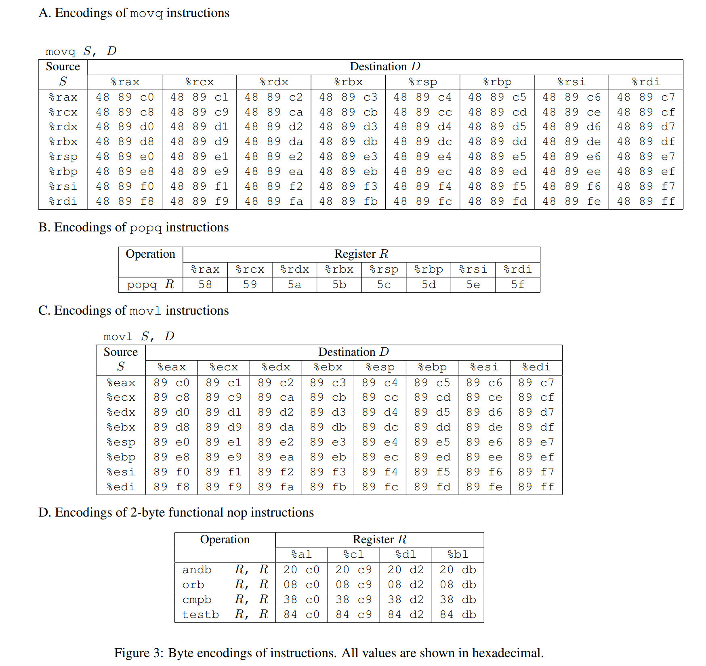

# Phase 1 - Code Injection
## Touch 1 -CI (Easy)
> 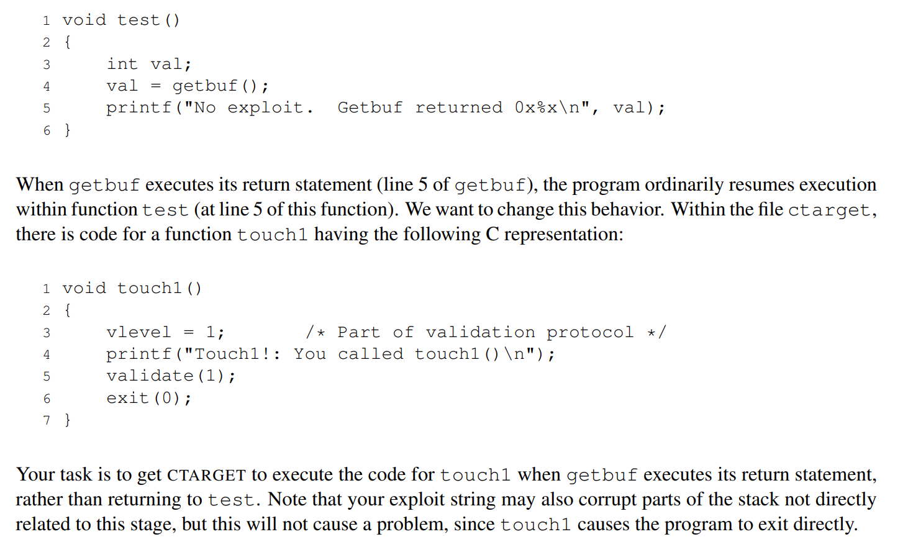
> `test`函数就是我们的`exploit code`，我们需要借用`getbuf()`创造`buffer overflow`，输入正确的字符串来调用`touch1`函数。
> 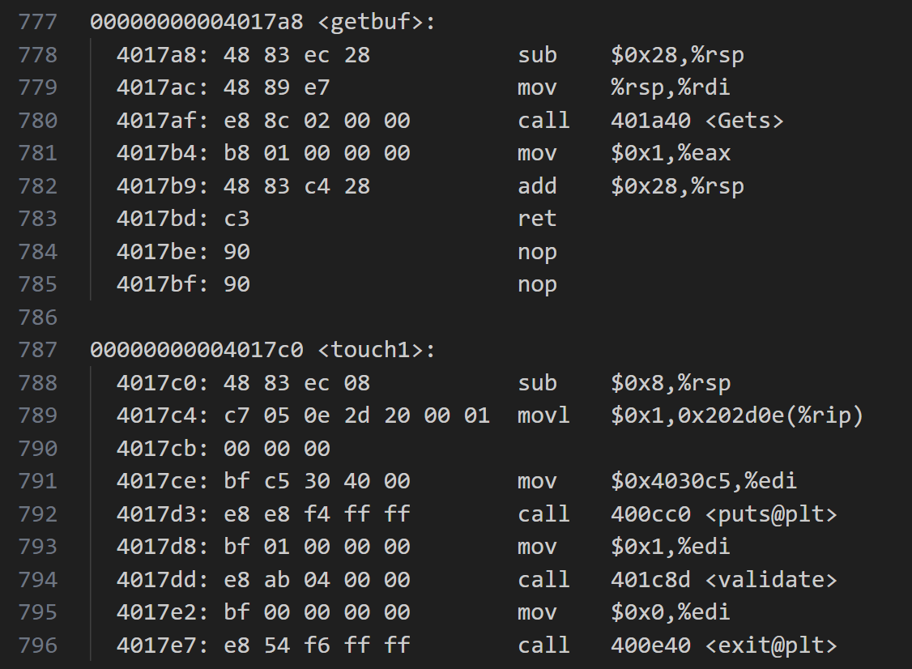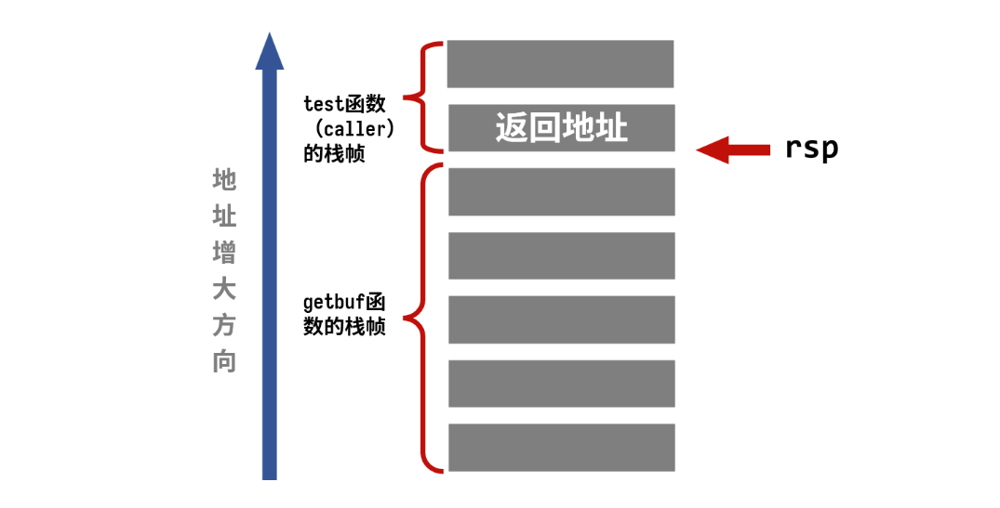
> 观察上面的`getbuf`在栈上分配了`40 bytes`的缓冲区，所以我们只需要传入大小`40 bytes`的字符串作为`padding`, 然后再原来的返回值存放处覆盖我们`touch 1`的地址`40 17 c0`, 但是注意我们的系统是`Little Endianess`的， 所以传入的字符串需要反向, 为`c0 17 40`
> **综上我们有:**
> 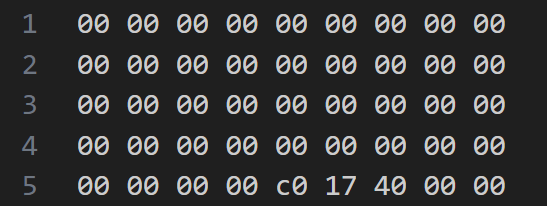

## Touch 2 - CI (Easy)
> 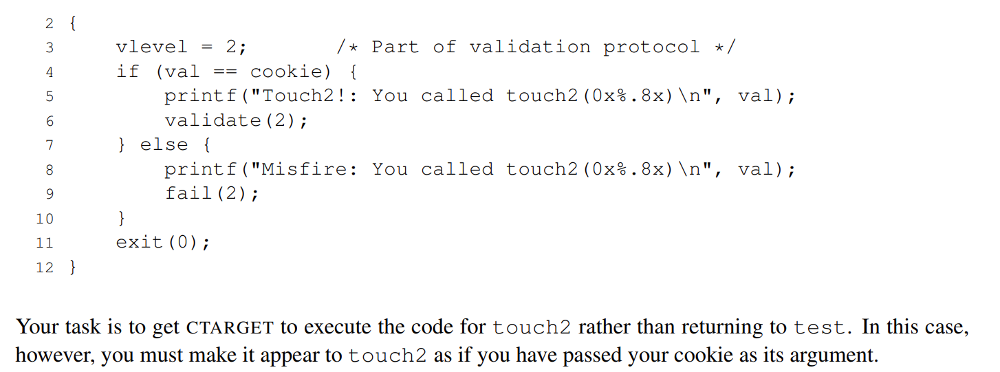
> **思路如下：**
> - 首先，通过字符串输入把`caller`的栈中储存的返回地址改为注入代码的存放地址
> - 然后，编写代码。我们的代码应该完成哪些工作呢？
>    - 查看`cookie`文件中的值为`0x59b997fa`，先将第一个参数寄存器修改为该值。
>    - 在栈中压入`touch 2`代码地址, 反汇编可知`touch2`的地址是`0x4017ec`。
>    - `ret`指令调用返回地址也就是`touch 2`。
> - 确定注入代码的地址。代码应该存在`getbuf`分配的栈中，地址为`getbuf`函数中的栈顶, 栈顶结果是`0x5561dc78`
> 
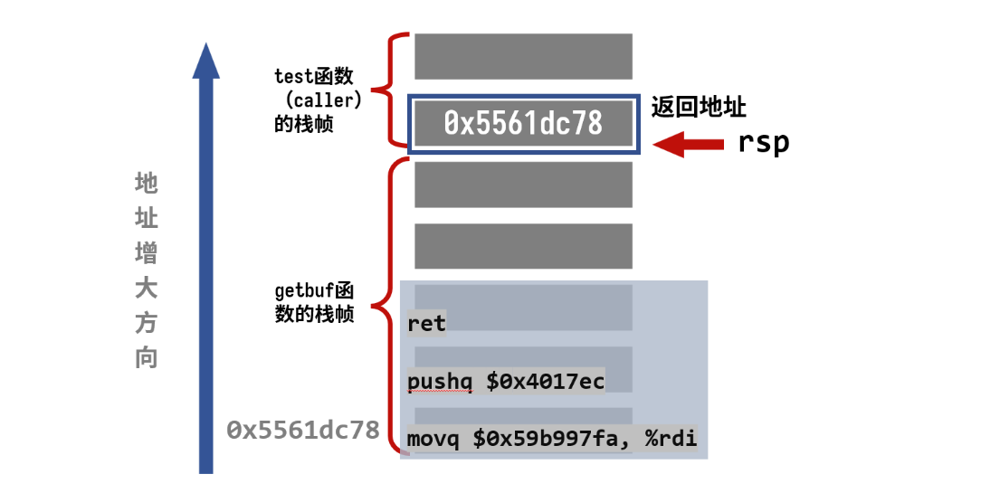
> **反汇编代码:**
> 
> **综上我们有:**
> 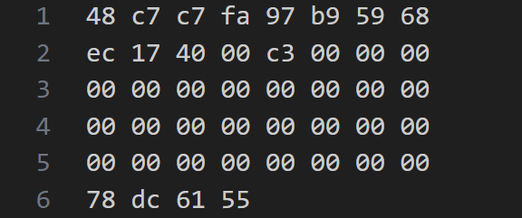

## Touch 3 - CI (Hard)
### Problem
> 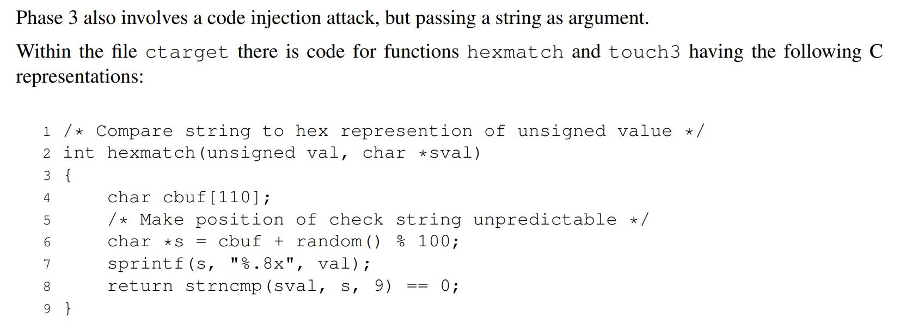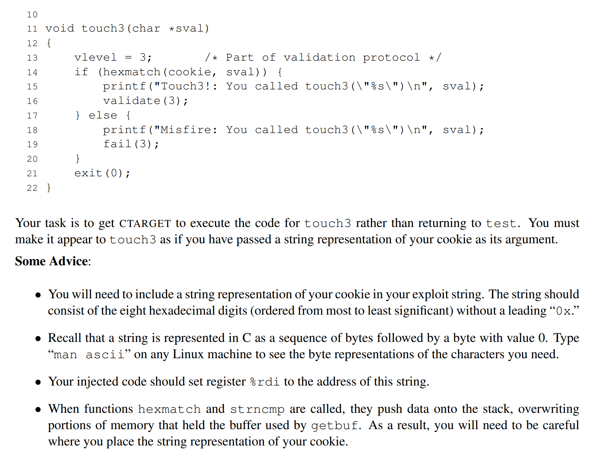

### Analysis
> 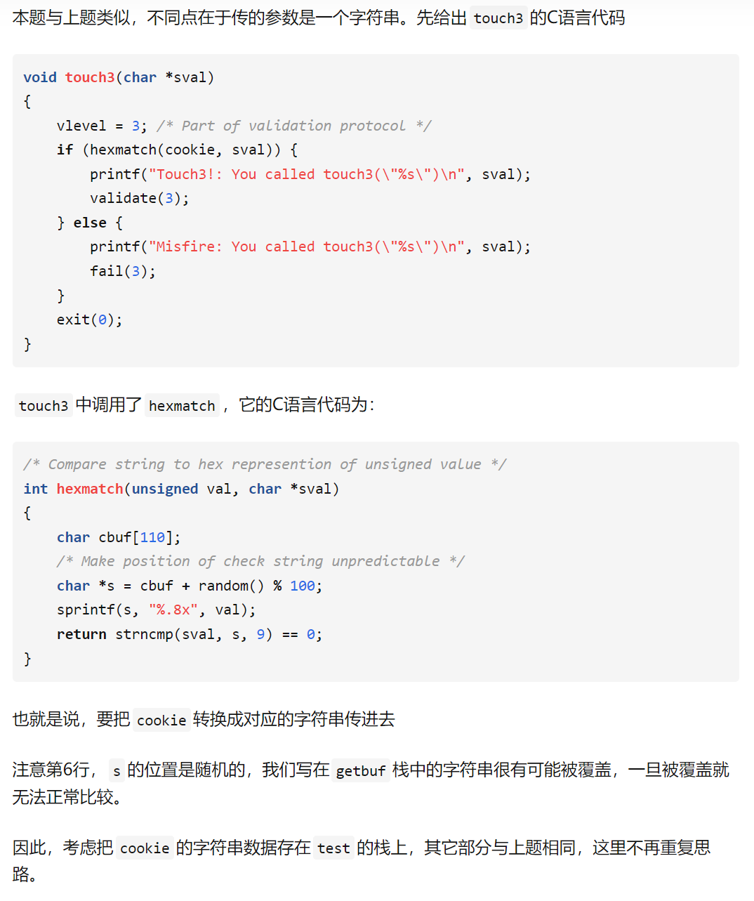这里如果字符串如果写`getbuf`的栈内,不是由于随机位置`s`覆盖的。在`random()`执行前就已经被覆盖了。是被`touch3`中`push %rbx`、`call<hexmatch>` 以及`hexmatch`中 `push %r12`、`push %rbp`、`push %rbx`、`mov %rax,0x78(%rsp)` 这六个指令，分别把 `0x5561dca0 - 0x5561dc78`覆盖了一遍。所以只能放`test`栈。
> 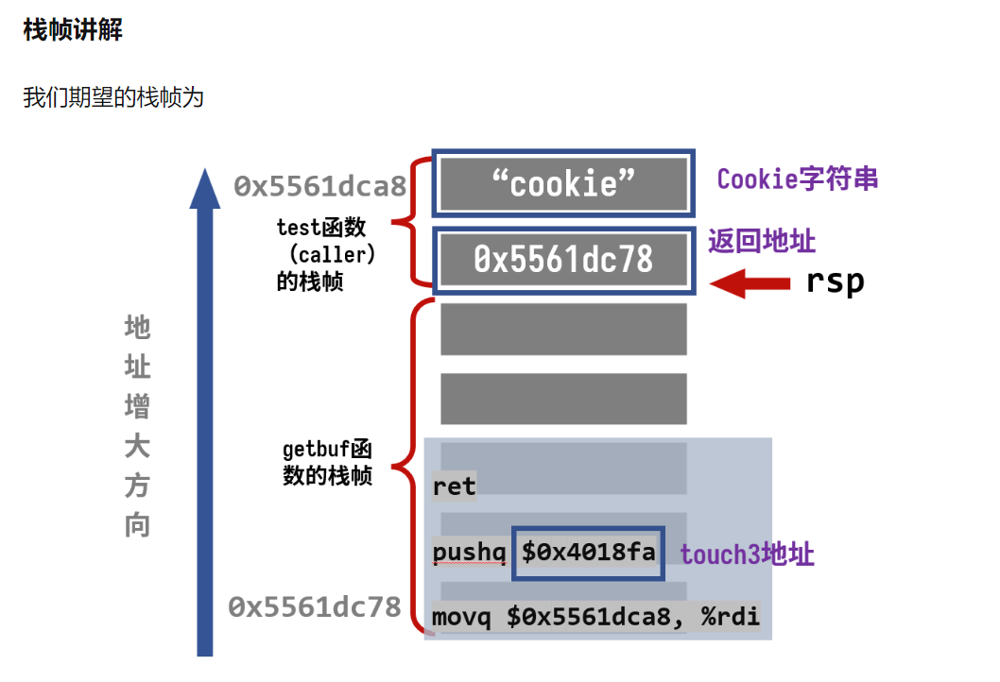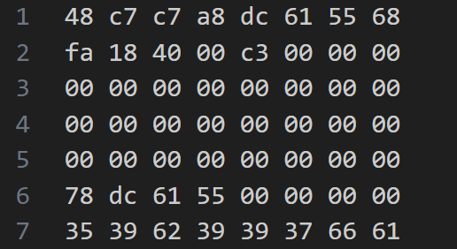

# Phase 2 - ROP
## Overview
> [!overview]
> 
> Also see [Attack 2 Return-oriented Programming](../../../../Computer_Networks/Computer_Security/Ch2_Memory_Safety/3_Mitigating_Vulnerabilities.md#Attack%202%20Return-oriented%20Programming) and [X86_Advanced](../../3_X86_Assembly/X86_Advanced.md)

## Touch 2 - ROP (Medium)
### Problem
> [!task]
> 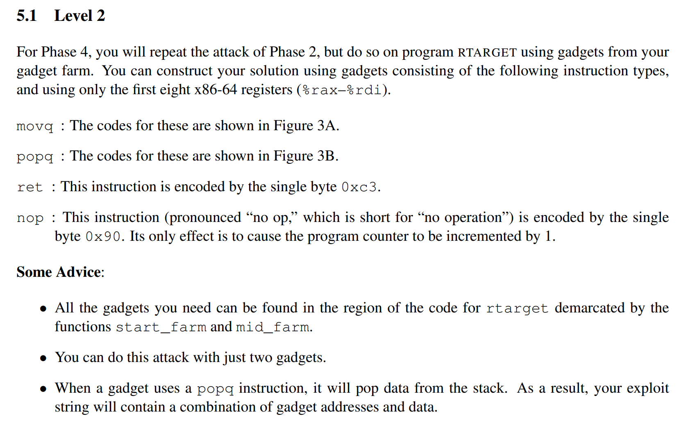

### Analysis
> [!code]
> 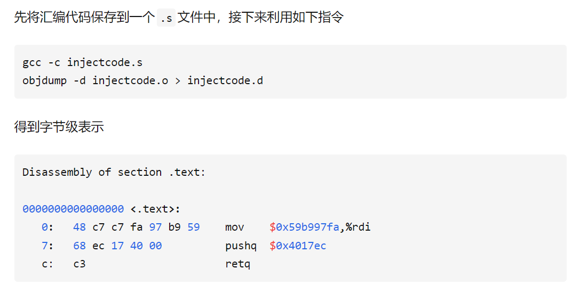
> 我们的目标就是使用`gadgets`来构造出上面的汇编代码执行逻辑。
> **和**`Code Injection Attack`**的辨析:**
> 1. 相同点在于我们都是利用了`Buffer Overflow`这一行为进行代码攻击。
> 2. 不同点在于
>    1. `Code Injection Attack`利用注入自行构建的代码片段(前提是栈帧地址都是已知的情况)，修改函数`ret`时的行为（即跳转地址）。而`Return Oriented Programming`则是利用程序已有的代码片段，从指令中抽取出诸如`mov % rax, %rdi; ret`或者`mov % rax, %rdi; nop; ret`之类的结构，利用`ret`指令会从栈上`pop`的行为使得每次`ret`之后都从一个`gadget`指向下一个`gadget`执行。
>    2. 在编写注入字符串时，对于`Code Injection`来说，我们的`Injected Instructions`是从低地址到高地址连续执行的，所以我们不需要写完一行指令的二进制表示之后在后面补零成`8 bytes`。而对于`ROP`来说。如果我们使用`movq`指令，那么指令一次会读取`8 bytes`的数据，所以我们要保证下一条指令或者数据必须和其对齐，也就是我们必须在编写完当前指令的二进制形式之后在后面补零。对于`ret`指令来说，我们知道`ret`相当于`pop/jump`, 而`pop`的过程在`64-bit address machine`上也是一次性会`pop 8 bytes from stack`，所以我们也必须补零。
> 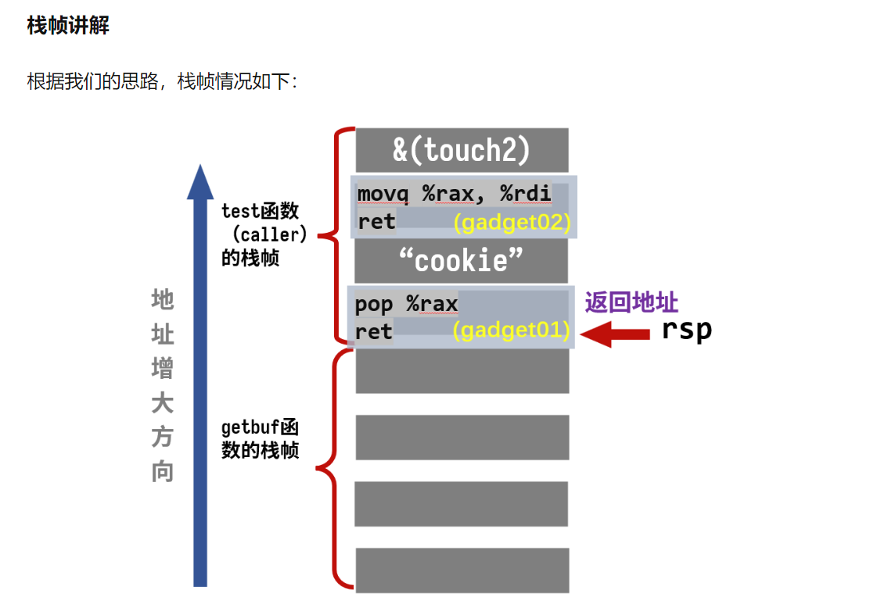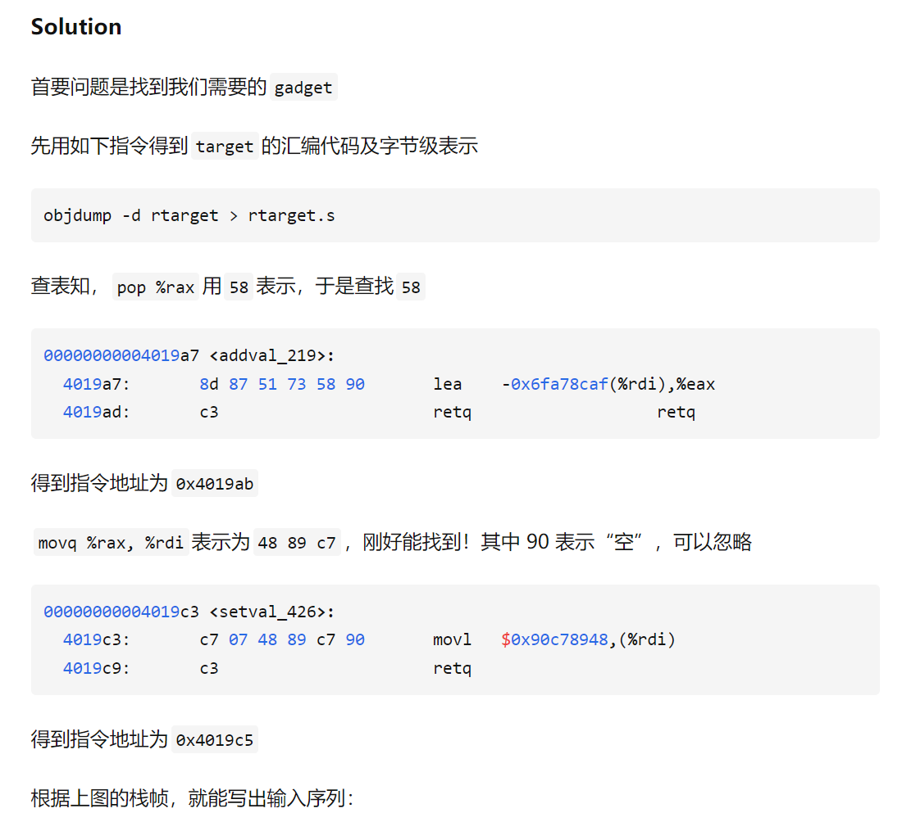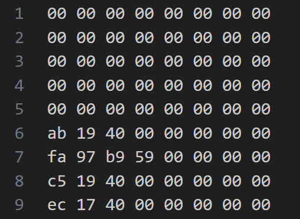

## Touch 3 - ROP (Hard)
### Review
> [!overview]
> 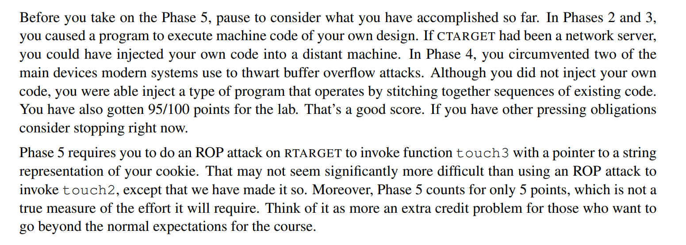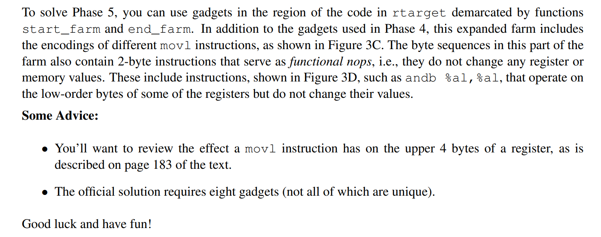

### Analysis
> [!code]
> 本题的思路如下:
> 1. 首先本题需要我们构造出下列指令
>    1. `mov <cookie's stack address> <some register>`
>    2. `jump to the address of touch3`
> 2. 我们观察`gadget`中的指令(`start_farm`to `end_farm`), 发现在茫茫指令中有一条指令非常显眼:
> 

> 这条指令看起来是在做一个`offset`的操作。因为我们知道使用`ROP`的一个很重要的原因就是我们的栈内存的地址每次执行都会发生变化，所以我们直接获得`cookie string`所在的栈内存地址是不现实的，所以我们考虑通过`%rsp+offset`的方法(也就是上述指令在做的事)来获取`cookie string`的栈内存地址。后面整个攻击逻辑都在围绕着这个指令的逻辑。所以最终我们要达成的目的是将`%rsp`放在`%rdi`中，将偏移量放在`%rsi`中。其中因为`%rsp`一直在动态的变化(因为`ret`会改变`%rsp`的指向)，所以我们可以以函数`test`的栈帧顶部作为起始点，先将其存入一个临时寄存器中。
> ❔: 为什么不选其他地址?
> 1. 因为`gadget`的限制，唯一和`%rsp`相关的指令是`mov %rsp, %rax; ret`，所以我们需要在某个指令执行完之后`ret`到`mov %rsp, %rax; ret`所在的位置开始我们的攻击逻辑。即使我们选取其他位置，后面的攻击逻辑也是不变的。
> 2. 况且我们当然可以选取其他地址作为起始点（比如`test`函数栈帧底部`+24 bytes`作为起点，之前全部填充其他无用的指令），只是有点浪费时间。
> 
**继续我们的分析:**
> 3. 但是要将`cookie string`放在哪里呢。我们需要细致地分析一下整个程序执行过程中的栈帧变化情况。
>    1. 首先是`test`函数作为入口函数开始执行，函数在调用`getbuf()`之前先将返回地址放在栈上，然后修改`%rip`指针执行`getbuf()`，`getbuf()`分配`40 bytes`的空间作为`buffer`，用于获取用户输入的攻击字符串。于是我们首先需要让`getbuf()`不能返回到`test`函数中，而是跳转到我们的第一个`gadget`指令所在的内存地址处。
>    2. 那么**第一个**`gadget`**指令**应该是什么呢，根据上面的分析，因为我们要尽快将`%rsp`保存下来，开始攻击逻辑，所以**第一条指令就是**`**mov %rsp, %rax**`，然后我们在`gadget`中寻找，结合`Encoding of movq`我们发现有好多满足条件的指令，但是我们必须选取那些后边紧接着的是`nop`的指令，于是我们**可以选取**`**0x401a06/0x401aad**`**。**
>    3. **第二条指令**按逻辑就是将`%rax`中的值放在`%rdi`中(即`mov %rax, %rdi`)，查表和反汇编可以得到`**4019c5/4019a2**`**满足条件**。
>    4. **第三条指令**按照正常逻辑就应该是将`offset`放在`%rsi`中了，但是有两个问题，第一是`offset`大小是多少，第二是用什么指令。
>       1. 第一个问题：因为我们要保证这个`%rsp+offset`得到的地址值在我们跳转到`touch3`之后仍然是合法的，也就是说我们的`cookie string`仍然可以被引用到，所以我们的`offset`必须等我们编写完剩下的所有`tcuch`参数分配逻辑后才能确定。
>       2. 第二个问题，用什么指令。在`Code Injection`中我们可以通过注入`mov $0x48, %rsi`来实现，但是在`ROP`中我们的`gadget`中没有这样的指令支撑，所以我们考虑将数据写在栈上然后`pop`到寄存器中，也就是`pop %rsi`的方式实现。但是很不幸我们的`gadget`中没有提供这样的指令组合。但是`gadget`中有很多`58`(即`pop %rax`指令的二进制表示)，所以我们可以考虑先将`offset``pop`到`%rax`上，然后使用`mov %rax, %rsi`。所以**第三条指令应该是**`**pop %rax**`**, 二进制表示是**`**0x4019cc/4019ab**`。
>    5. 第四条指令按照正常逻辑是`mov %rax, %rsi`, 但是`gadget`中没有。事实上，实验的设计者就是为了让答案尽可能固定唯一，去掉了很多可行的构造方式。同时在`Hint`中有这样一句话` You’ll want to review the effect a movl instruction has on the upper 4 bytes of a register`。这表明我们可能要使用`movl`指令。因为查表后我们发现，除了`mov %rax, %rdi`能够通过构造`gadget`实现，其他的`mov %rax, %destination`都无法构造出来。所以我们必须使用`movl`。一凡查表后，我们得到只有`movl %eax, %edx`, `movl %edx, %ecx`, 和`movl %ecx, %esi`三个指令能够通过`gadget`实现。所以第四条~第六条指令分别如上所示。
>    6. 第七~八条指令就应该是`leq (%rdi, %rsi, 1), %rax`和`mov %rax, %rsi`了。
>    7. 准备好参数之后，就是调用`touch3`了。但等一下，我们的`offset`还没有确定呢？但是到了这一步，我们已经能够计算出`offset=0x48`了，如下图所示。
> 
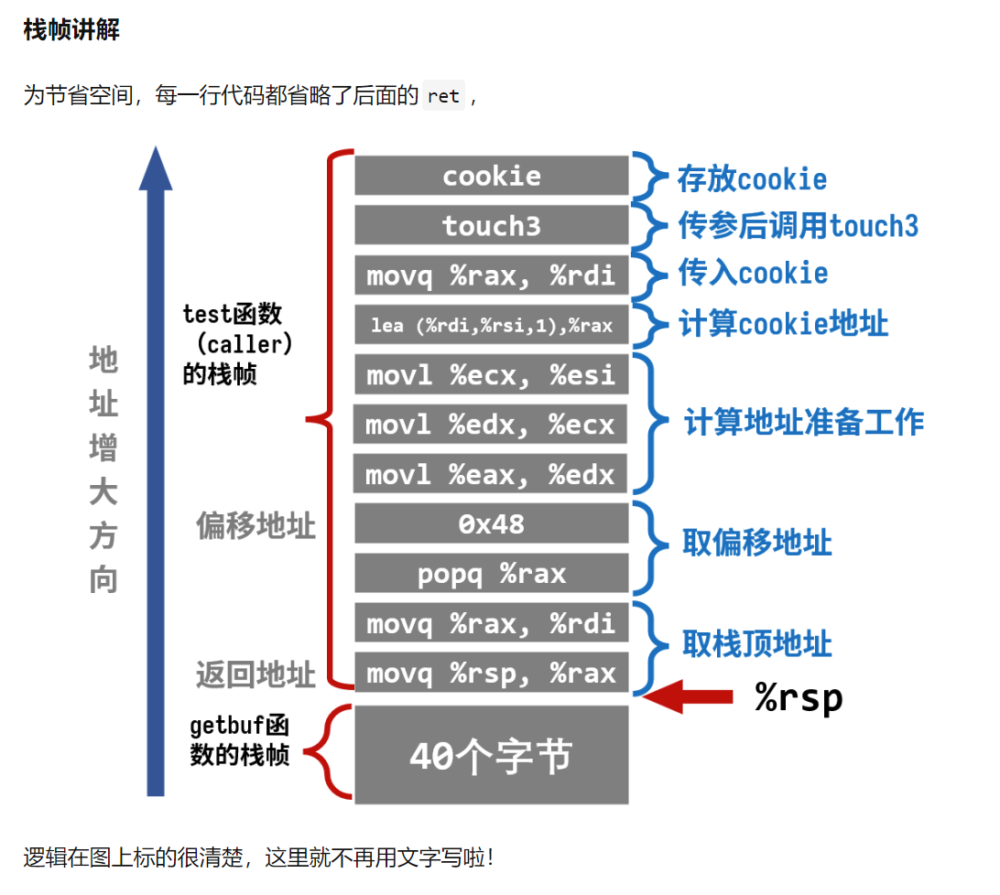

