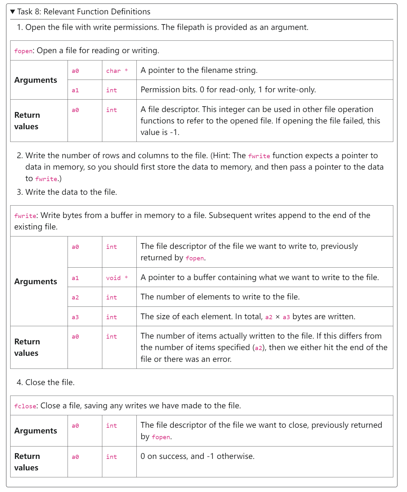

[sp23-proj2-starter-main.zip](https://www.yuque.com/attachments/yuque/0/2023/zip/12393765/1695310699569-0632540c-71e6-4785-a087-f2f077fc875c.zip)
[proj02_spec_part_a.pdf](https://www.yuque.com/attachments/yuque/0/2023/pdf/12393765/1695311217897-f5b655e5-fe11-4b68-8b9a-be8f84186012.pdf)
[proj02_spec_part_b.pdf](https://www.yuque.com/attachments/yuque/0/2023/pdf/12393765/1695311507109-164e08dd-a4e9-4c30-8a13-1b9d3006b82f.pdf)
[Appendix_A_Function_Definitions.pdf](https://www.yuque.com/attachments/yuque/0/2023/pdf/12393765/1695311296386-f9fb8ffe-3056-4e37-b314-7ee24f656b3f.pdf)
[Appendix_B_Calling_Convention.pdf](https://www.yuque.com/attachments/yuque/0/2023/pdf/12393765/1695311296044-be21bc35-83d8-4a7a-8280-4d6bd1951946.pdf)


# Task 1 Test Framework - Abs
> **在本地:**
> 1. `bash test.sh <func_name>` to test if the output is correct
> 2. `bash test.sh <func_name> -mc`to test if there is invalid memory access
> 3. `bash test.sh <func_name> -mcv`for a more verbose version for 2
> 
**在**[**https://venus.cs61c.org/**](https://venus.cs61c.org/)**中:**
> 1. `mount local vmfs` to mount local files to the server
> 2. `cd vmfs/test-src` and `ls`to see all the available tests on functions.
> 3. **Debugging: **`vdb <test_name>.s` to test a given function and this will jump your website to the `Simulator Tab`
> 4. **Set Break Point: **Add `ebreak` to a specific line in the venus editor to set up a break point in venus debugger.


# Task 2: ReLU(Easy)
## Concepts
> 


## Task
> 
> **算法思路如下:**
> 算法很简单，就是逐个遍历数组，遇到小于零的就设置为零，大于零的就跳过。
> **注意点:**
> 1. 如果我们要自定义`Label`的话，要尽量避免使用诸如`exit, ecall`等系统指令。
> 2. 在访问数组的时候要注意不要越界。

```bash
.globl relu

.text
# ==============================================================================
# FUNCTION: Performs an inplace element-wise ReLU on an array of ints
# Arguments:
#   a0 (int*) is the pointer to the array
#   a1 (int)  is the # of elements in the array
# Returns:
#   None
# Exceptions:
#   - If the length of the array is less than 1,
#     this function terminates the program with error code 36
# ==============================================================================
relu:
    # Prologue


loop_start:


loop_continue:


loop_end:


    # Epilogue


    jr ra

```
```bash
.globl relu

.text
# ==============================================================================
# FUNCTION: Performs an inplace element-wise ReLU on an array of ints
# Arguments:
#   a0 (int*) is the pointer to the array
#   a1 (int)  is the # of elements in the array
# Returns:
#   None
# Exceptions:
#   - If the length of the array is less than 1,
#     this function terminates the program with error code 36
# ==============================================================================
relu:
    # Prologue
    addi sp sp -4
    sw s1 0(sp)
    
    
    bge x0 a1 error
    li s1 0   # Counter for array index
    
loop_start:
    
    beq s1 a1 loop_end
    
    mv t0 s1
    slli t0 t0 2    # Calculating offset, 4-byte integer
    add t1 a0 t0   # Calculating the address of the current integer
    
    lw t2 0(t1)  # Get the current element of array
    
    slt t3 t2 x0
    beq t3 x0 loop_continue # If current element is bigger than 0, skip 
       
    # If current element is negative, set it to zero in place
    sw x0 0(t1)
loop_continue:
    
    addi s1 s1 1
    j loop_start

loop_end:

    li a0 0
    

    # Epilogue
    lw s1 0(sp)
    addi sp sp 4
    

    jr ra

error:
    # Epilogue
    lw s1 0(sp)
    addi sp sp 4
    li a0 36
    j exit
```


# Task 3: Argmax(Easy)
## Concepts
> 


## Task
> 

```bash
.globl argmax

.text
# =================================================================
# FUNCTION: Given a int array, return the index of the largest
#   element. If there are multiple, return the one
#   with the smallest index.
# Arguments:
#   a0 (int*) is the pointer to the start of the array
#   a1 (int)  is the # of elements in the array
# Returns:
#   a0 (int)  is the first index of the largest element
# Exceptions:
#   - If the length of the array is less than 1,
#     this function terminates the program with error code 36
# =================================================================
argmax:
    # Prologue
    


loop_start:


loop_continue:


loop_end:
    # Epilogue

    jr ra

```
```bash
.globl argmax

.text
# =================================================================
# FUNCTION: Given a int array, return the index of the largest
#   element. If there are multiple, return the one
#   with the smallest index.
# Arguments:
#   a0 (int*) is the pointer to the start of the array
#   a1 (int)  is the # of elements in the array
# Returns:
#   a0 (int)  is the first index of the largest element
# Exceptions:
#   - If the length of the array is less than 1,
#     this function terminates the program with error code 36
# =================================================================
argmax:
    # Prologue
    addi sp sp -12
    sw s0 0(sp)     # Index of the array
    sw s1 4(sp)     # Maximum counter, argmax
    sw s2 8(sp)     # Maximum value till now
        
    # If array_length < 1, return 36 and exit
    bge x0 a1 error 
    
    
    # Initialization
    li s0 0
    li s1 0
    lw s2 0(a0)     # Initialize to be the first element of the array
 
loop_start:

    # Traverse to the end of the array
    beq s0 a1 loop_end
    

    # Get the current offset
    addi t0 s0 0
    slli t0 t0 2
    add t1 a0 t0
    
    # Load the current element
    lw t2 0(t1)
    
    # Compare with the biggest element
    # If the current element is smaller or equal to the maximum till now, skip
    bge s2 t2  loop_continue
    
    # Update the max_value and argmax
    addi s2 t2 0
    addi s1 s0 0

loop_continue:
    
    # Update the index
    addi s0 s0 1
    j loop_start


loop_end:

    # Prepare for the return value
    addi a0 s1 0
    # Epilogue
    lw s0 0(sp)     # Index of the array
    lw s1 4(sp)     # Maximum counter, argmax
    lw s2 8(sp)     # Maximum value till now
    addi sp sp 12
    
   
    jr ra


error: 
    # Handle the case where the array length is less than 1
    li a0 36
    j exit
```


# Task 4: Dot Product(Easy)
## Concept: Dot Product
> 


## Concept: Array Strides
> 


## Task
> 
> **注意点:** 这里有一个容易让人产生误解的地方，就是这里的参数`a2`(Number of elements to use)实际上是**Number of** **element' pair** to be considered, 所以每次循环之后迭代的**元素对**个数只需要加一就可以了。

```bash
.globl dot

.text
# =======================================================
# FUNCTION: Dot product of 2 int arrays
# Arguments:
#   a0 (int*) is the pointer to the start of arr0
#   a1 (int*) is the pointer to the start of arr1
#   a2 (int)  is the number of elements to use
#   a3 (int)  is the stride of arr0
#   a4 (int)  is the stride of arr1
# Returns:
#   a0 (int)  is the dot product of arr0 and arr1
# Exceptions:
#   - If the length of the array is less than 1,
#     this function terminates the program with error code 36
#   - If the stride of either array is less than 1,
#     this function terminates the program with error code 37
# =======================================================
dot:

    # Prologue


loop_start:


loop_end:


    # Epilogue

    jr ra

```
```bash
.globl dot

.text
# =======================================================
# FUNCTION: Dot product of 2 int arrays
# Arguments:
#   a0 (int*) is the pointer to the start of arr0
#   a1 (int*) is the pointer to the start of arr1
#   a2 (int)  is the number of elements to use
#   a3 (int)  is the stride of arr0
#   a4 (int)  is the stride of arr1
# Returns:
#   a0 (int)  is the dot product of arr0 and arr1
# Exceptions:
#   - If the length of the array is less than 1,
#     this function terminates the program with error code 36
#   - If the stride of either array is less than 1,
#     this function terminates the program with error code 37
# =======================================================
dot:

    # Prologue
    addi sp sp -16
    sw s0 0(sp)
    sw s1 4(sp)
    sw s2 8(sp)
    sw s3 12(sp)
    
    # Termination 1, not enough element to use, exit with 36
    bge x0 a2 terminate_1
    
    # Termination 2, either stride is less than 1
    bge x0 a3,terminate_2
    bge x0 a4,terminate_2

    # Initialization
    li s0 0     # Store for the return result
    li s1 0     # Index for array a0
    li s2 0     # Index for array a1
    li s3 0     # Number of elements' pair that have been used to calculate dot product
    
loop_start:
    bge s3 a2 loop_end   # while loop ends, number of elements exceed
    
    # Calculate the offset and get the element
    # Array 0
    mv t1 s1
    slli t1 t1 2
    add t1 a0 t1
    lw t1 0(t1)
    
    # Array 1
    mv t2 s2
    slli t2 t2 2
    add t2 a1 t2
    lw t2 0(t2)
    
    # Calculate
    mul t0 t1 t2
    
    # Update for the next iteration
    add s0 s0 t0
    add s1 s1 a3        # Update stride for array 1
    add s2 s2 a4        # Update stride for array 2
    addi s3 s3 1        # Update the number used for calculation
    
    j loop_start
    
loop_end:
    
    mv a0 s0

    # Epilogue
    lw s0 0(sp)
    lw s1 4(sp)
    lw s2 8(sp)
    lw s3 12(sp)
    addi sp sp 16
    
    jr ra
    
terminate_1:
    li a0 36
    j exit
    
terminate_2:
    li a0 37
    j exit
```


# Task 5: Testing(Easy)
## Concept: Loss Function
> 


## Task
> 这个任务要求我们实现一系列`Loss Functions`行为的测试函数，方便我们熟悉`framweork.py`的测试框架。
> 

```bash
import sys
import unittest
from framework import AssemblyTest, print_coverage, _venus_default_args
from tools.check_hashes import check_hashes

"""
Coverage tests for project 2 is meant to make sure you understand
how to test RISC-V code based on function descriptions.
Before you attempt to write these tests, it might be helpful to read
unittests.py and framework.py.
Like project 1, you can see your coverage score by submitting to gradescope.
The coverage will be determined by how many lines of code your tests run,
so remember to test for the exceptions!
"""

"""
abs_loss
# =======================================================
# FUNCTION: Get the absolute difference of 2 int arrays,
#   store in the result array and compute the sum
# Arguments:
#   a0 (int*) is the pointer to the start of arr0
#   a1 (int*) is the pointer to the start of arr1
#   a2 (int)  is the length of the arrays
#   a3 (int*) is the pointer to the start of the result array

# Returns:
#   a0 (int)  is the sum of the absolute loss
# Exceptions:
# - If the length of the array is less than 1,
#   this function terminates the program with error code 36.
# =======================================================
"""


class TestAbsLoss(unittest.TestCase):
    def test_simple(self):
        # load the test for abs_loss.s
        t = AssemblyTest(self, "../coverage-src/abs_loss.s")

        raise NotImplementedError("TODO")

        # create array0 in the data section
        # TODO
        # load address of `array0` into register a0
        # TODO
        # create array1 in the data section
        # TODO
        # load address of `array1` into register a1
        # TODO
        # set a2 to the length of the array
        # TODO
        # create a result array in the data section (fill values with -1)
        # TODO
        # load address of `array2` into register a3
        # TODO
        # call the `abs_loss` function
        # TODO
        # check that the result array contains the correct output
        # TODO
        # check that the register a0 contains the correct output
        # TODO
        # generate the `assembly/TestAbsLoss_test_simple.s` file and run it through venus
        t.execute()

    # Add other test cases if neccesary

    @classmethod
    def tearDownClass(cls):
        print_coverage("abs_loss.s", verbose=False)


"""
squared_loss
# =======================================================
# FUNCTION: Get the squared difference of 2 int arrays,
#   store in the result array and compute the sum
# Arguments:
#   a0 (int*) is the pointer to the start of arr0
#   a1 (int*) is the pointer to the start of arr1
#   a2 (int)  is the length of the arrays
#   a3 (int*) is the pointer to the start of the result array

# Returns:
#   a0 (int)  is the sum of the squared loss
# Exceptions:
# - If the length of the array is less than 1,
#   this function terminates the program with error code 36.
# =======================================================
"""


class TestSquaredLoss(unittest.TestCase):
    def test_simple(self):
        # load the test for squared_loss.s
        t = AssemblyTest(self, "../coverage-src/squared_loss.s")

        raise NotImplementedError("TODO")

        # TODO
        # create input arrays in the data section
        # TODO
        # load array addresses into argument registers
        # TODO
        # load array length into argument register
        # TODO
        # create a result array in the data section (fill values with -1)
        # TODO
        # load result array address into argument register
        # TODO
        # call the `squared_loss` function
        # TODO
        # check that the result array contains the correct output
        # TODO
        # check that the register a0 contains the correct output
        # TODO
        # generate the `assembly/TestSquaredLoss_test_simple.s` file and run it through venus
        # TODO

    # Add other test cases if neccesary

    @classmethod
    def tearDownClass(cls):
        print_coverage("squared_loss.s", verbose=False)


"""
zero_one_loss
# =======================================================
# FUNCTION: Generates a 0-1 classifer array inplace in the result array,
#  where result[i] = (arr0[i] == arr1[i])
# Arguments:
#   a0 (int*) is the pointer to the start of arr0
#   a1 (int*) is the pointer to the start of arr1
#   a2 (int)  is the length of the arrays
#   a3 (int*) is the pointer to the start of the result array

# Returns:
#   NONE
# Exceptions:
# - If the length of the array is less than 1,
#   this function terminates the program with error code 36.
# =======================================================
"""


class TestZeroOneLoss(unittest.TestCase):
    def test_simple(self):
        # load the test for zero_one_loss.s
        t = AssemblyTest(self, "../coverage-src/zero_one_loss.s")

        raise NotImplementedError("TODO")

        # create input arrays in the data section
        # TODO
        # load array addresses into argument registers
        # TODO
        # load array length into argument register
        # TODO
        # create a result array in the data section (fill values with -1)
        # TODO
        # load result array address into argument register
        # TODO
        # call the `zero_one_loss` function
        # TODO
        # check that the result array contains the correct output
        # TODO
        # generate the `assembly/TestZeroOneLoss_test_simple.s` file and run it through venus
        # TODO

    # Add other test cases if neccesary

    @classmethod
    def tearDownClass(cls):
        print_coverage("zero_one_loss.s", verbose=False)


"""
initialize_zero
# =======================================================
# FUNCTION: Initialize a zero array with the given length
# Arguments:
#   a0 (int) size of the array

# Returns:
#   a0 (int*)  is the pointer to the zero array
# Exceptions:
# - If the length of the array is less than 1,
#   this function terminates the program with error code 36.
# - If malloc fails, this function terminates the program with exit code 26.
# =======================================================
"""


class TestInitializeZero(unittest.TestCase):
    def test_simple(self):
        t = AssemblyTest(self, "../coverage-src/initialize_zero.s")

        raise NotImplementedError("TODO")

        # input the length of the desired array
        # TODO
        # call the `initialize_zero` function
        # TODO
        # check that the register a0 contains the correct array (hint: look at the check_array_pointer function in framework.py)
        # TODO
        t.execute()

    # Add other test cases if neccesary

    @classmethod
    def tearDownClass(cls):
        print_coverage("initialize_zero.s", verbose=False)


if __name__ == "__main__":
    split_idx = sys.argv.index("--")
    for arg in sys.argv[split_idx + 1 :]:
        _venus_default_args.append(arg)

    check_hashes()

    unittest.main(argv=sys.argv[:split_idx])

```
```python
import sys
import unittest
from framework import AssemblyTest, print_coverage, _venus_default_args
from tools.check_hashes import check_hashes

"""
Coverage tests for project 2 is meant to make sure you understand
how to test RISC-V code based on function descriptions.
Before you attempt to write these tests, it might be helpful to read
unittests.py and framework.py.
Like project 1, you can see your coverage score by submitting to gradescope.
The coverage will be determined by how many lines of code your tests run,
so remember to test for the exceptions!
"""

"""
abs_loss
# =======================================================
# FUNCTION: Get the absolute difference of 2 int arrays,
#   store in the result array and compute the sum
# Arguments:
#   a0 (int*) is the pointer to the start of arr0
#   a1 (int*) is the pointer to the start of arr1
#   a2 (int)  is the length of the arrays
#   a3 (int*) is the pointer to the start of the result array

# Returns:
#   a0 (int)  is the sum of the absolute loss
# Exceptions:
# - If the length of the array is less than 1,
#   this function terminates the program with error code 36.
# =======================================================
"""


class TestAbsLoss(unittest.TestCase):
    def test_simple(self):
        # load the test for abs_loss.s
        t = AssemblyTest(self, "../coverage-src/abs_loss.s")

        # create array0 in the data section
        array0 = t.array([1,2,3,4,5,6,7,8,9])


        # load address of `array0` into register a0
        t.input_array("a0", array0)


        # create array1 in the data section
        array1 = t.array([1,6,1,6,1,6,1,6,1])


        # load address of `array1` into register a1
        t.input_array("a1", array1)

        
        # set a2 to the length of the array
        t.input_scalar("a2", len(array1))


        # create a result array in the data section (fill values with -1)
        array2 = t.array([-1,-1,-1,-1,-1,-1,-1,-1,-1])


        # load address of `array2` into register a3
        t.input_array("a3",array2)


        # call the `abs_loss` function
        t.call("abs_loss")


        # check that the result array contains the correct output
        t.check_array(array2, [0,4,2,2,4,0,6,2,8])


        # check that the register a0 contains the correct output
        t.check_scalar("a0", 28) 


        # generate the `assembly/TestAbsLoss_test_simple.s` file and run it through venus
        t.execute()


    # Add other test cases if neccesary
    # Array Length less than 1
    def test_zero_input_length(self):
        # load the test for abs_loss.s
        t = AssemblyTest(self, "../coverage-src/abs_loss.s")

        array0 = t.array([])
        array1 = t.array([])
        array2 = t.array([-1,-1,-1,-1,-1,-1])

        t.input_array("a0", array0)
        t.input_array("a1", array1)
        t.input_scalar("a2", len(array0))

        t.call("abs_loss")

        t.check_array_pointer("a3", [-1,-1,-1,-1,-1,-1])

        t.execute(code = 36)


    @classmethod
    def tearDownClass(cls):
        print_coverage("abs_loss.s", verbose=False)


"""
squared_loss
# =======================================================
# FUNCTION: Get the squared difference of 2 int arrays,
#   store in the result array and compute the sum
# Arguments:
#   a0 (int*) is the pointer to the start of arr0
#   a1 (int*) is the pointer to the start of arr1
#   a2 (int)  is the length of the arrays
#   a3 (int*) is the pointer to the start of the result array

# Returns:
#   a0 (int)  is the sum of the squared loss
# Exceptions:
# - If the length of the array is less than 1,
#   this function terminates the program with error code 36.
# =======================================================
"""


class TestSquaredLoss(unittest.TestCase):
    def test_simple(self):
        # load the test for squared_loss.s
        t = AssemblyTest(self, "../coverage-src/squared_loss.s")

        # TODO
        # create input arrays in the data section
        array0 = t.array([1,2,3,4,5,6,7,8,9])
        array1 = t.array([1,6,1,6,1,6,1,6,1])

        # TODO
        # load array addresses into argument registers
        t.input_array("a0", array0)
        t.input_array("a1", array1)

        # TODO
        # load array length into argument register
        t.input_scalar("a2", len(array0))


        # TODO
        # create a result array in the data section (fill values with -1)
        array2 = t.array([-1,-1,-1,-1,-1,-1,-1,-1,-1])

        # TODO
        # load result array address into argument register
        t.input_array("a3", array2)

        # TODO
        # call the `squared_loss` function
        t.call("squared_loss")


        # TODO
        # check that the result array contains the correct output
        t.check_array(array2, [0,16,4,4,16,0,36,4,64])


        # TODO
        # check that the register a0 contains the correct output
        t.check_scalar("a0", 144)


        # TODO
        # generate the `assembly/TestSquaredLoss_test_simple.s` file and run it through venus
        t.execute()

    # Add other test cases if neccesary
    # Array Length less than 1
    def test_zero_input_length(self):
        t = AssemblyTest(self, "../coverage-src/squared_loss.s")
        array0 = t.array([])
        array1 = t.array([])

        t.input_array("a0", array0)
        t.input_array("a1", array1)
        t.input_scalar("a2", len(array0))

        t.call("squared_loss")

        t.execute(code = 36)


    @classmethod
    def tearDownClass(cls):
        print_coverage("squared_loss.s", verbose=False)


"""
zero_one_loss
# =======================================================
# FUNCTION: Generates a 0-1 classifer array inplace in the result array,
#  where result[i] = (arr0[i] == arr1[i])
# Arguments:
#   a0 (int*) is the pointer to the start of arr0
#   a1 (int*) is the pointer to the start of arr1
#   a2 (int)  is the length of the arrays
#   a3 (int*) is the pointer to the start of the result array

# Returns:
#   NONE
# Exceptions:
# - If the length of the array is less than 1,
#   this function terminates the program with error code 36.
# =======================================================
"""


class TestZeroOneLoss(unittest.TestCase):
    def test_simple(self):
        # load the test for zero_one_loss.s
        t = AssemblyTest(self, "../coverage-src/zero_one_loss.s")

        # create input arrays in the data section
        # TODO
        array0 = t.array([1,2,3,4,5,6,7,8,9])
        array1 = t.array([1,6,1,6,1,6,1,6,1])


        # load array addresses into argument registers
        # TODO
        t.input_array("a0", array0)
        t.input_array("a1", array1)

        # load array length into argument register
        # TODO
        t.input_scalar("a2", len(array0))
        
        # create a result array in the data section (fill values with -1)
        # TODO
        array2 = t.array([-1,-1,-1,-1,-1,-1,-1,-1,-1])


        # load result array address into argument register
        # TODO
        t.input_array("a3", array2)

        # call the `zero_one_loss` function
        # TODO
        t.call("zero_one_loss")

        # check that the result array contains the correct output
        # TODO
        t.check_array(array2, [1,0,0,0,0,1,0,0])


        # generate the `assembly/TestZeroOneLoss_test_simple.s` file and run it through venus
        # TODO
        t.execute()


    # Add other test cases if neccesary
    # 1. Add test for corner cases, array length is less than 1
    def test_zero_input_length(self):
        t = AssemblyTest(self, "../coverage-src/zero_one_loss.s")
        array0 = t.array([])
        array1 = t.array([])

        t.input_array("a0", array0)
        t.input_array("a1", array1)
        t.input_scalar("a2", 0)

        t.call("zero_one_loss")

        t.execute(code = 36)


    @classmethod
    def tearDownClass(cls):
        print_coverage("zero_one_loss.s", verbose=False)


"""
initialize_zero
# =======================================================
# FUNCTION: Initialize a zero array with the given length
# Arguments:
#   a0 (int) size of the array

# Returns:
#   a0 (int*)  is the pointer to the zero array
# Exceptions:
# - If the length of the array is less than 1,
#   this function terminates the program with error code 36.
# - If malloc fails, this function terminates the program with exit code 26.
# =======================================================
"""


class TestInitializeZero(unittest.TestCase):
    def test_simple(self):
        t = AssemblyTest(self, "../coverage-src/initialize_zero.s")

        # input the length of the desired array
        # TODO
        t.input_scalar("a0", 5)

        # call the `initialize_zero` function
        # TODO
        t.call("initialize_zero")

        # check that the register a0 contains the correct array (hint: look at the check_array_pointer function in framework.py)
        # TODO
        t.check_array_pointer("a0", [0,0,0,0,0])
        t.execute()
        

    # Add other test cases if neccesary
    def test_zero_input_length(self):
        t = AssemblyTest(self, "../coverage-src/initialize_zero.s")
        t.input_scalar("a0", 0)
        t.call("initialize_zero")
        t.execute(code=36)

    def test_malloc_error(self):
        t = AssemblyTest(self, "../coverage-src/initialize_zero.s")

        # 要保证长度参数是正确的，这样就至少不会触发code = 36
        t.input_scalar("a0", 1)
        t.call("initialize_zero")
        t.execute(fail="malloc", code=26)


    @classmethod
    def tearDownClass(cls):
        print_coverage("initialize_zero.s", verbose=False)


if __name__ == "__main__":
    split_idx = sys.argv.index("--")
    for arg in sys.argv[split_idx + 1 :]:
        _venus_default_args.append(arg)

    check_hashes()

    unittest.main(argv=sys.argv[:split_idx])


```


# Task 6: Matrix Multiplication(Medium)
## Concept: Neural Networks
### AND Gate
> 


### XOR Gate
> 


### MINST
> 


## Concept: Storing Matrices
> 


## Concept: Matrix Multiplication
> 


## Task
> 
> 我们可以复用我们之前实现的`Dot Product with Strides`来实现`Matrix Multiplication`

```python
.globl matmul

.text
# =======================================================
# FUNCTION: Matrix Multiplication of 2 integer matrices
#   d = matmul(m0, m1)
# Arguments:
#   a0 (int*)  is the pointer to the start of m0
#   a1 (int)   is the # of rows (height) of m0
#   a2 (int)   is the # of columns (width) of m0
#   a3 (int*)  is the pointer to the start of m1
#   a4 (int)   is the # of rows (height) of m1
#   a5 (int)   is the # of columns (width) of m1
#   a6 (int*)  is the pointer to the the start of d
# Returns:
#   None (void), sets d = matmul(m0, m1)
# Exceptions:
#   Make sure to check in top to bottom order!
#   - If the dimensions of m0 do not make sense,
#     this function terminates the program with exit code 38
#   - If the dimensions of m1 do not make sense,
#     this function terminates the program with exit code 38
#   - If the dimensions of m0 and m1 don't match,
#     this function terminates the program with exit code 38
# =======================================================
matmul:

    # Error checks


    # Prologue


outer_loop_start:


inner_loop_start:


inner_loop_end:


outer_loop_end:


    # Epilogue


    jr ra
```
```python
.globl matmul

.text
# =======================================================
# FUNCTION: Matrix Multiplication of 2 integer matrices
#   d = matmul(m0, m1)
# Arguments:
#   a0 (int*)  is the pointer to the start of m0
#   a1 (int)   is the # of rows (height) of m0
#   a2 (int)   is the # of columns (width) of m0
#   a3 (int*)  is the pointer to the start of m1
#   a4 (int)   is the # of rows (height) of m1
#   a5 (int)   is the # of columns (width) of m1
#   a6 (int*)  is the pointer to the the start of d
# Returns:
#   None (void), sets d = matmul(m0, m1)
# Exceptions:
#   Make sure to check in top to bottom order!
#   - If the dimensions of m0 do not make sense,
#     this function terminates the program with exit code 38
#   - If the dimensions of m1 do not make sense,
#     this function terminates the program with exit code 38
#   - If the dimensions of m0 and m1 don't match,
#     this function terminates the program with exit code 38
# =======================================================
matmul:

    # Error checks
    # Check for non-zero height and width
    bge x0 a1 error_1
    bge x0 a2 error_1
    bge x0 a4 error_1
    bge x0 a5 error_1
    
    # Check for shape mismatch between matrix
    bne a2, a4 error_1

    # Prologue
    # For matrix C
    addi sp sp -8
    sw s0 0(sp)
    sw s1 4(sp)
    
    # For inner function call
    addi sp sp -28
    sw s2 0(sp)
    sw s3 4(sp)
    sw s4 8(sp)
    sw s5 12(sp)
    sw s6 16(sp)
    sw s7 20(sp)
    sw s8 24(sp)
    
    addi sp sp -4
    sw ra 0(sp)
    
    # Function Body
    li s0 0         # row_index for output matrix
    li s1 0         # column index for output matrix
    

outer_loop_start:
    
    # for (int i = 0; i < row_num_A; i++)
    beq s0 a1 outer_loop_end
    
inner_loop_start:
    # for (int j = 0; j < col_num_B; j++)
    beq s1 a5 inner_loop_end
    
    
    # Ready to call function dot with stride
    # Store the volatile registers on to the saved registers
    mv s2 a0
    mv s3 a1
    mv s4 a2
    mv s5 a3
    mv s6 a4
    mv s7 a5
    mv s8 a6
    
    
    # Preparing for parameters
    # 1. Calculate the pointer to the first array
    mul t1 s0 a2
    slli t1 t1 2
    add a0 a0 t1
    # 2. Calculate the pointer to the second array
    mv t2 s1
    slli t2 t2 2
    add a1 a3 t2
    # 3. Number of elements' pair to use in the calculation(equal to number of columns in matrix A or number of rows in matrix B)
#     mv a2 a2
    # 4. The stride of the first array(should always be 1)
    addi a3 x0 1
    # 5. The stride of the second array(should be the number of columns of the matrix B)
    add a4 x0 a5
    
    # Call the function dot
    jal ra dot
    
    # Restore volatile registers
    mv a1 s3
    mv a2 s4
    mv a3 s5
    mv a4 s6
    mv a5 s7
    mv a6 s8
    
    # Calculate the address where the element should be updated
    mul t0 s0 a5
    add t0 t0 s1
    slli t0 t0 2
    add t3 a6 t0
    sw a0 0(t3)
    
    # Restore volatile registers
    mv a0 s2
    
    # Update for next inner loop
    addi s1 s1 1
    j inner_loop_start

inner_loop_end:
    
    # Update for next outer loop
    addi s0 s0 1
    li s1 0              # Don't forget this! Need to reset the inner loop counter
    j outer_loop_start
    
outer_loop_end:


    # Epilogue
    lw ra 0(sp)
    addi sp sp 4
    
    lw s2 0(sp)
    lw s3 4(sp)
    lw s4 8(sp)
    lw s5 12(sp)
    lw s6 16(sp)
    lw s7 20(sp)
    lw s8 24(sp)
    addi sp sp 28
    lw s0 0(sp)
    lw s1 4(sp)
    addi sp sp 8
    
    jr ra
    
error_1:
    # Height or width < 1 || Mismatch
    li a0 38
    j exit
```
> 


# Task 7: Read Matrix(Hard)
## Concept: Matrix Files
> 


## Task
> 
> 本题比较容易出错的点在于我们读取的时候要`4-byte-wise`地读取`32 bit int`整型。

```bash
.globl read_matrix

.text
# ==============================================================================
# FUNCTION: Allocates memory and reads in a binary file as a matrix of integers
#
# FILE FORMAT:
#   The first 8 bytes are two 4 byte ints representing the # of rows and columns
#   in the matrix. Every 4 bytes afterwards is an element of the matrix in
#   row-major order.
# Arguments:
#   a0 (char*) is the pointer to string representing the filename
#   a1 (int*)  is a pointer to an integer, we will set it to the number of rows
#   a2 (int*)  is a pointer to an integer, we will set it to the number of columns
# Returns:
#   a0 (int*)  is the pointer to the matrix in memory
# Exceptions:
#   - If malloc returns an error,
#     this function terminates the program with error code 26
#   - If you receive an fopen error or eof,
#     this function terminates the program with error code 27
#   - If you receive an fclose error or eof,
#     this function terminates the program with error code 28
#   - If you receive an fread error or eof,
#     this function terminates the program with error code 29
# ==============================================================================
read_matrix:
    
    
    # Prologue


    # Epilogue


    jr ra
```
```python
.globl read_matrix

.text
# ==============================================================================
# FUNCTION: Allocates memory and reads in a binary file as a matrix of integers
#
# FILE FORMAT:
#   The first 8 bytes are two 4 byte ints representing the # of rows and columns
#   in the matrix. Every 4 bytes afterwards is an element of the matrix in
#   row-major order.
# Arguments:
#   a0 (char*) is the pointer to string representing the filename
#   a1 (int*)  is a pointer to an integer, we will set it to the number of rows
#   a2 (int*)  is a pointer to an integer, we will set it to the number of columns
# Returns:
#   a0 (int*)  is the pointer to the matrix in memory
# Exceptions:
#   - If malloc returns an error,
#     this function terminates the program with error code 26
#   - If you receive an fopen error or eof,
#     this function terminates the program with error code 27
#   - If you receive an fclose error or eof,
#     this function terminates the program with error code 28
#   - If you receive an fread error or eof,
#     this function terminates the program with error code 29
# ==============================================================================
read_matrix:

    # Prologue
    addi sp sp -28
    sw ra 0(sp) 
    sw s1 4(sp)    # Store pointer for file descriptor
    sw s2 8(sp)    # Store number of rows
    sw s3 12(sp)   # Store number of columns
    sw s4 16(sp)   # Store pointer for buffer
    sw a1 20(sp)   # Pointer for row
    sw a2 24(sp)   # Pointer for column
    
    
    # 1. Parameter for fopen
    # a0 is prepared by read_matrix()
    li a1 0
    jal ra fopen
    li t0 -1
    beq a0 t0 error_27 
    mv s1 a0
    
    # 2. Parameter for fread
    # a0 is prepared
    # Read for 4 bytes(should be an int) -> num_rows
    lw a1 20(sp)
    li a2 4
    jal ra fread
    li t0 4
    bne t0 a0 error_29
    lw t0 20(sp)
    lw s2 0(t0)
    
    # Read for 4 bytes(should be an int) -> num_columns
    mv a0 s1
    lw a1 24(sp)
    li a2 4
    jal ra fread
    li t0 4
    bne t0 a0 error_29
    lw t0 24(sp)               # Get the addresss that where fread() store the result
    lw s3 0(t0)                # Get the actual result at that address!

    # 3. Parameter for malloc
    mul a0 s2 s3     # Calculate the number of elements to malloc
    slli a0 a0 2     # Calculate the number of bytes to malloc
    jal ra malloc 
    beq a0 x0 error_26  # malloc error
    mv s4 a0
    
    # 4. Read the matrix
    mv a0 s1
    mv a1 s4
    mul a2 s2 s3              # Get the total number of elements
    slli a2 a2 2              # Get the total number of bytes
    jal ra fread
    mul t0 s2 s3
    slli t0 t0 2
    bne t0 a0 error_29
    
    # 5. Close the file
    mv a0 s1
    jal ra fclose
    bne x0 a0 error_28
    
    # Epilogue
    mv a0 s4
    lw a1 20(sp)
    lw a2 24(sp)
    
    lw ra 0(sp) 
    lw s1 4(sp)    # Store pointer for file descriptor
    lw s2 8(sp)    # Store pointer for rows
    lw s3 12(sp)   # Store pointer for columns
    lw s4 16(sp)   # Store pointer for buffer
    addi sp sp 28
    
    jr ra


error_26:
    li a0 26
    lw ra 0(sp) 
    lw s1 4(sp)   
    lw s2 8(sp)   
    lw s3 12(sp)   
    lw s4 16(sp)  
    j exit
    
error_27:
    li a0 27
    lw ra 0(sp) 
    lw s1 4(sp)  
    lw s2 8(sp)    
    lw s3 12(sp)   
    lw s4 16(sp)    
    j exit
    
error_28:
    li a0 28
    lw ra 0(sp) 
    lw s1 4(sp)  
    lw s2 8(sp)    
    lw s3 12(sp)   
    lw s4 16(sp)   
    j exit
   
error_29:
    li a0 29
    lw ra 0(sp) 
    lw s1 4(sp)  
    lw s2 8(sp)   
    lw s3 12(sp)    
    lw s4 16(sp)   
    j exit
    

```
> **用到的函数：**
> 


# Task 8: Write Matrix(Hard)
## Task
> 

```python
.globl write_matrix

.text
# ==============================================================================
# FUNCTION: Writes a matrix of integers into a binary file
# FILE FORMAT:
#   The first 8 bytes of the file will be two 4 byte ints representing the
#   numbers of rows and columns respectively. Every 4 bytes thereafter is an
#   element of the matrix in row-major order.
# Arguments:
#   a0 (char*) is the pointer to string representing the filename
#   a1 (int*)  is the pointer to the start of the matrix in memory
#   a2 (int)   is the number of rows in the matrix
#   a3 (int)   is the number of columns in the matrix
# Returns:
#   None
# Exceptions:
#   - If you receive an fopen error or eof,
#     this function terminates the program with error code 27
#   - If you receive an fclose error or eof,
#     this function terminates the program with error code 28
#   - If you receive an fwrite error or eof,
#     this function terminates the program with error code 30
# ==============================================================================
write_matrix:

    # Prologue
    


    # Epilogue


    jr ra
```
```python
.globl write_matrix

.text
# ==============================================================================
# FUNCTION: Writes a matrix of integers into a binary file
# FILE FORMAT:
#   The first 8 bytes of the file will be two 4 byte ints representing the
#   numbers of rows and columns respectively. Every 4 bytes thereafter is an
#   element of the matrix in row-major order.
# Arguments:
#   a0 (char*) is the pointer to string representing the filename
#   a1 (int*)  is the pointer to the start of the matrix in memory
#   a2 (int)   is the number of rows in the matrix
#   a3 (int)   is the number of columns in the matrix
# Returns:
#   None
# Exceptions:
#   - If you receive an fopen error or eof,
#     this function terminates the program with error code 27
#   - If you receive an fclose error or eof,
#     this function terminates the program with error code 28
#   - If you receive an fwrite error or eof,
#     this function terminates the program with error code 30
# ==============================================================================
write_matrix:

    # Prologue
    addi sp sp -20       # Grow the stack 
    sw ra 0(sp)          # Return register     
    sw a1 4(sp)          # Pointer to the start of matrix buffer
    sw a2 8(sp)          # Number of rows of matrix
    sw a3 12(sp)         # Number of cols of matrix
    sw s0 16(sp)         # Store the file descriptor
    
    # 1. Open the file
    # a0 is prepared already
    li a1 1
    jal ra fopen
    li t0 -1
    beq t0 a0 error_27
    mv s0 a0             # Save the file descriptor

    # 2. f_write
    # 2.1 Write number of rows
    # a0 is prepared
    addi a1 sp 8
    li a2 1
    li a3 4
    jal ra fwrite
    li t0 1
    bne a0 t0 error_30
    
    
    # 2.2 Write number of cols
    # Set a0, a1
    mv a0 s0
    addi a1 sp 12
    
    # Set a2, a3
    li a2 1
    li a3 4
    jal ra fwrite
    li t0 1
    bne a0 t0 error_30
    
    
    # 2.3 Write the matrix
    # Set a0, a1
    mv a0 s0
    lw a1 4(sp)
    
    # Set a2, a3
    lw t0 8(sp)
    lw t1 12(sp)
    mul a2 t0 t1      # Calculate the number of elements to write to the file
    li a3 4           # Integer Array, so hardcoded as 4, representing 4 bytes
    jal ra fwrite
    lw t0 8(sp)
    lw t1 12(sp)
    mul t0 t0 t1 
    bne t0 a0 error_30


    # 3. Close the file
    mv a0 s0
    jal ra fclose
    bne x0 a0 error_28


    # Epilogue
    lw ra 0(sp)          # Return register     
    lw a1 4(sp)          # Pointer to the start of matrix buffer
    lw a2 8(sp)          # Number of rows of matrix
    lw a3 12(sp)         # Number of cols of matrix
    lw s0 16(sp)         # Store the file descriptor
    addi sp sp 20       # Grow the stack 
    

    jr ra


error_27:
    li a0 27
    lw ra 0(sp)          # Return register     
    lw a1 4(sp)          # Pointer to the start of matrix buffer
    lw a2 8(sp)          # Number of rows of matrix
    lw a3 12(sp)         # Number of cols of matrix
    lw s0 16(sp)         # Store the file descriptor
    addi sp sp 20       # Grow the stack 
    j exit
    
error_28:
    li a0 28
    lw ra 0(sp)          # Return register     
    lw a1 4(sp)          # Pointer to the start of matrix buffer
    lw a2 8(sp)          # Number of rows of matrix
    lw a3 12(sp)         # Number of cols of matrix
    lw s0 16(sp)         # Store the file descriptor
    addi sp sp 20       # Grow the stack 
    j exit
    
error_30:
    li a0 30
    lw ra 0(sp)          # Return register     
    lw a1 4(sp)          # Pointer to the start of matrix buffer
    lw a2 8(sp)          # Number of rows of matrix
    lw a3 12(sp)         # Number of cols of matrix
    lw s0 16(sp)         # Store the file descriptor
    addi sp sp 20       # Grow the stack 
    j exit
    
```
> 用到的函数:
> 


# Task 9: Classify(Very Hard)
> 

```python
.globl classify

.text
# =====================================
# COMMAND LINE ARGUMENTS
# =====================================
# Args:
#   a0 (int)        argc
#   a1 (char**)     argv
#   a1[1] (char*)   pointer to the filepath string of m0
#   a1[2] (char*)   pointer to the filepath string of m1
#   a1[3] (char*)   pointer to the filepath string of input matrix
#   a1[4] (char*)   pointer to the filepath string of output file
#   a2 (int)        silent mode, if this is 1, you should not print
#                   anything. Otherwise, you should print the
#                   classification and a newline.
# Returns:
#   a0 (int)        Classification
# Exceptions:
#   - If there are an incorrect number of command line args,
#     this function terminates the program with exit code 31
#   - If malloc fails, this function terminates the program with exit code 26
#
# Usage:
#   main.s <M0_PATH> <M1_PATH> <INPUT_PATH> <OUTPUT_PATH>
classify:
    # Read pretrained m0


    # Read pretrained m1


    # Read input matrix


    # Compute h = matmul(m0, input)


    # Compute h = relu(h)


    # Compute o = matmul(m1, h)


    # Write output matrix o


    # Compute and return argmax(o)


    # If enabled, print argmax(o) and newline


    jr ra
```
> **用到的函数:**
> 


