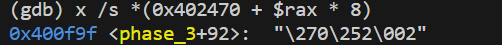

# Preparations
> 记得设置`wsl --set-version Ubuntus 2`, 否则`gdb`无法`debug`。

## Objdump the Bomb ELF
> `objdump -d bomb > bomb_dumped.txt`得到一个`disassembled binary file`。
> 


## Figure out how to input
> 我们需要创建一个`txt`文件，文件中的每一行对应一个`Phase`的`Defusing`输入。


## Instruction Level GDB
> 
> **break at a particular address:** `break *address`
> **delete breakpoint by id:** `delete breakpoint id`
> 


# Phase 1: Stack(Easy)
## Analysis
> 
> **main():**
> 
> **phase_1(input):**
> 
> **分析一下**`**Phase 1**`**做的事情:**
> 1. `main`函数中在调用`Phase 1`之前，我们将`read_line()`的返回值作为`phase_1`的参数传入。
> 2. `phase_1(input_address)`函数首先在栈内存上分配了`8 bytes`的空间，然后将`0x402400`这个地址值放置在了函数`strings_not_equal`的第二个参数中，`strings_not_equal`第一个参数是我们用户输入的字符串的地址值，由`read_line()`函数返回。
> 3. 之后`phase_1(input_address)`比较用户输入的字符串和系统内部写死的字符串是否相同。
> 
**所以破解思路就是: 获取**`**0x402400**`**处的内容，就是我们要输入的字符串。**
> 


## Translated C Program
```c
void phase_1(char* input) {
    char* system = 0x402400;
    if (strings_not_equal(input, system)) {
        boom!
    }
    pass
}
```

# Phase 2: While-Loop(Easy)
## Analysis
### sscanf
> 
> 注意到`sscanf`的第一个参数是数据所在的`buffer`，第二个参数是用于解读数据的格式，后面的参数是用于保存读取到的内容的变量的**地址。**


### read_six_numbers
> 这个函数从文件中读取六个数到对应的地址，我们需要弄清楚这些地址具体是什么。
> 
> **总的来说，这个函数会从文件中读取**`**6**`**个数字到栈内存的对应位置。**
> 我们来拆解一下这个函数:
> 1. `line 805:` 函数首先分配了`24 bytes`的栈内存空间，因为一个`int`是`4 bytes`, 所以很明显这里要为`6`个整型分配空间。
> 2. `line 806 ~ 813:` 函数为`sscanf`准备参数:
>    1. 其中`sscanf`的**第一个参数**默认是缓冲区的地址值，这个地址值由`read_line()`返回，且会一直存放在`%rdi`寄存器中，没有指令会修改它。
>    2. `sscanf`的**第二个参数**是`format`, 由`line 814`指定，是一个字符串的地址，我们可以利用gdb打印一下，`x /s 0x4025c3`得到`"%d %d %d %d %d %d"`, 所以我们的输入也必须是以空格分隔的整数。
>    3. `sscanf`剩余的参数都是用于存放整型的地址值。
> 

> 3. `line 806:` 函数将`%rsi`中的内容放到`%rdx`中。`%rsi`作为`read_six_numbers`的第二个参数，由`phase_2`指定，地址是函数`phase_2`所在的栈帧顶部。`read_six_numbers`的第一个参数是`user input char*`，所以:
>    1. 第一个整数的目标地址值是`%rsi`(`%rdx`)
>    2. 第二个整数的目标地址值是`%rsi+4`(`%rcx`)
>    3. 第三个整数的目标地址值是`%rsi+8`(`%r8`)
>    4. 第四个整数的目标地址值是`%rsi+12`(`%r9`)
>    5. 第五个整数的目标地址值是`%rsi+16`(该地址值放置在当前函数的栈顶，子函数会去找)
>    6. 第六个整数的目标地址值是`%rsi+20`(该地址值放置在当前函数的栈顶`+8`的位置，子函数会去找)
> 4. `line 817:` 比较读取到的整型数量，如果小于`6`就爆炸。


### phase_2
> **读取完**`**6**`**个整型，**`**phase_2**`**开始对六个整型进行校验**
> 
> `line +14`比较第一个整数是否为`1`, 是的话跳转到`line +52`
> 之后的代码是一个循环，目的是比较从第二个整数开始，每个整数是否是前一个整数的两倍，`line 57`用于设置循环体的终止条件, `line 45`用于判断循环是否终止。
> **所以答案就是**`**1 2 4 8 16 32**`**。**


## Translated C Program
```c
void phase_2(char* input) {
    int integer_1;
    int integer_2;
    int integer_3;
    int integer_4;
    int integer_5;
    int integer_6;

    // sscanf returns the number of items successfully read from the input stream
    int number_read = sscanf(input, "%d %d %d %d %d %d", 
                             &integer_1, &integer_2, &integer_3,
                             &integer_4, &integer_5, &integer_6);

    // The number of numbers is not enough, bomb!
	if (numer_read < 5) {
        bomb!
    } else {
        // The first integer is not 1, bomb!
        if (integer_1 != 1) {
            bomb!
        }
    }
    
    int* terminated_pointer = &integer_6 + 1;
    int* start = &integer_2;
    while (start < terminated_pointer) {
    	int* last = start - 1;
        // If current number is not scale 2 of the previous one, bomb!
        if (*start != 2 * (*last)) {
            bomb!
        }
        start++;
    }

    pass!
}
```


# Phase 3: Switch Statement(Medium)
## Analysis
> **Part 1: Read Inputs**
> 下面是`phase_3`的第一部分，从文件中读取内容，第一步就是找出这个`phase`需要什么样的输入
> 
> 上面的反汇编代码的`<+14>`行，我们将`0x4025cf`放在了`sscanf`的第二个参数的位置，表示`format`, 我们打印一下`x /s 0x4025cf`, 得到`"%d %d"`, 发现程序需要两个整型作为输入。
> 这两个整型被储存在当前函数的栈帧中:
> 1. 第一个整型储存在`%rsp+8`(`<+4>`)
> 2. 第二个整型储存在`%rsp+12`(`<+9>`)
> 
**Part 2: Examine First Inputs**
> 
> `cmpl`和`jg`比较的是`0x8(%rsp)`和`7`的值(`unsigned comparison`), 且`0x8(%rsp)`对应着第一个整型的值，我们有:
> 1. 如果输入为负数，则因为无符号比较会将`signed int`看成`unsigned int`, 所以结果一定是大于`7`的，因为最高位为`1`在无符号看来是一个巨大的数。
> 2. 如果输入大于`7`, 则炸弹爆炸。
> 
所以我们的第一个输入可以为`0~7`中的任意一个。**后续的调试中，我们不妨令第一个输入为**`**1**`**。**
> **Part 3: Jump Table**
> 
> 函数接下来是一系列跳表操作，由`<+50>`的特殊结构可以推断出来。
> `jmp *0x402470(, %rax, 8)`中`0x402470`是跳表的起始地址，`%rax`是偏移量，这个偏移量由我们的第一个整型决定。前面的`*`表示我们要跳转到`0x402470 + %rax * 8`这个地址处的内容(这个内容应该是一个地址值)。
> 于是我们需要查看跳转到的具体地址是什么，我们打印一下, 这里`*`表示解引用括号中的地址。
> 
> 我们发现如果`%rax = 1`, 那么我们会跳转到`<+118>`的位置，`<+118>`和`<+123>`这两行代码主要在比较我们的第二个参数是否和`0x137=311`一致，所以一种破解方法就是输入`1 311`。
> **Optional Part,** 我们可以依次尝试不同的数字作为第一个输入，按照上面的流程，我们有:
> 1. 输入为`0`，表示第二个参数是`0xcf=207`
> 

> 2. 输入为`2`，表示第二个参数是`0x2c3=707`
> 

> 3. 输入为`3`，表示第二个参数是`0x100=256`
> 

> 4. 输入为`4`，表示第二个参数是`0x185=389`
> 

> 5. 输入为`5`，表示第二个参数是`0xce=206`
> 

> 6. 输入为`6`，表示第二个参数是`0x2aa=682`
> 

> 7. 输入为`7`，表示第二个参数是`0x147=327`
> 

> 最后一个`default case`无法到达，因为程序有输入范围校验。


## Translated C Program
```c
void phase_3(char* input) {
    int int_1, int_2;
	
    int num_read = sscanf(input,"%d %d", &int_1, &int_2);

    if (num_read <= 1) {
        bomb!
    }

    switch(int_1) {
        case 0:
            if (int_2 != 207) {
                bomb!
            }
            break;
        case 1:
            if (int_2 != 311) {
                bomb!
            }
        	break;
        case 2:
            if (int_2 != 707) {
                bomb!
            }
        	break;
        case 3:
            if (int_2 != 256) {
                bomb!
            }
        	break;
        case 4:
            if (int_2 != 389) {
                bomb!
            }
        	break;
        case 5:
            if (int_2 != 206) {
                bomb!
            }
        	break;
        case 6:
            if (int_2 != 682) {
                bomb!
            }
        	break;
        case 7:
            if (int_2 != 327) {
                bomb!
            }
        	break;
        default:
            if (int_2 != 0) {
                bomb!
            }
            break;
    }
    pass!
    
}
```


# Phase 4: Recursion (Medium)
## Analysis
> **Part 1: Read Inputs**
> 下面是`phase_4`的第一部分，从文件中读取内容，第一步就是找出这个`phase`需要什么样的输入
> 
> 上面的反汇编代码的`<+14>`行，我们将`0x4025cf`放在了`sscanf`的第二个参数的位置，表示`format`, 我们打印一下`x /s 0x4025cf`, 得到`"%d %d"`, 发现程序需要两个整型作为输入。
> **Part 2: Calling Functions**
> 我们省略推导过程，直接给出代码如下


## Translated Program
> 可以发现，我们只要进入`line 7`就可以，因为`b=0, c=14`, 所以`mid=7`，我们只需要令`a=7`即可。因为第二个数必须是`0`, 所以答案是`7 0`。
> **当然我们还有其他两组解:**
> `0 0`和`1 0`, 因为这两种情况也可以满足不触发`line 9~10`就返回`0`。

```c
int func4(int a, int b, int c) {
    int mid = ((c - b) >> 31 + (c - b)) / 2 + b;
    int res;
    if (a >= mid) {
        if (a <= mid) {
            // a == mid, we have found the element!
            return 0;
        } else {
            // a > mid
            res = func4(a, mid + 1, c);
            return 2 * res + 1;
        }
    } else {
        // a < mid
        res = func4(a, 0, mid - 1);
        return 2 * res;
    }
}

void phase_4(char* input) {
    int integer_1, integer_2;

    int num_read = sscanf(input, "%d %d", &integer_1, &integer_2);

    if (num_read != 2) {
        bomb!
    }

    int res = func4(integer_1, 0, 14);
    if (res != 0) {
        bomb!
    }

    // The second number has to be zero.
    if (integer_2 != 0) {
        bomb!
    }

    pass!
}
```


# Phase 5: ASCII Mapping (Medium)
## Analysis
> **Part 1: Read Input and Canary**
> 程序的第一部分从文件中读取一个长度为`6`的字符串，同时读取一个`Stack Canary`(储存在`%fs:0x28`寄存器中)到`0x18(%rsp)`的位置。
> 
> **Part 2: Construct the String**
> 程序的第二部分根据特定规则将用户输入的字符串映射到一个新的字符串上，并比较这个映射过后的字符串和系统内部指定的字符串是否一致。
> 
> 上面的反汇编指令中，我们发现两个`Hardcoded Address`, 其中`0x40245e`就是我们目标字符串的样子，`0x4024b0`就是我们手头能用的，用于构建目标字符串的字符集`maduiersnfotvbyl`。
> 
> 程序的逻辑如下面的代码所示:


## Translated C Program
```c
void phase_5(char* input) {
	char* dest = "flyers";
    char* template = "maduiersnfotvbyl";
    char buf[7];

    int strleng = string_length(input);
    if (strleng != 6) {
        bomb!  
    } 

    int counter = 0;
    while (counter !=6) {
        // Get the counter-ith index character from user input
    	char curr = input[counter];

        // Get the lower four bits, used for indexing into the template
        int index = curr & 0xf;

        // Put the indexed template into buf
        buf[counter] = template[index];

        // Increment the loop counter
        counter++;
    }

    buf[counter] = '\0';

    // Compare the constructed string with the destination string
    if (strings_not_equal(buf, dest)) {
        bomb!
    }

    // We don't care about this for now.
    if (!check_canary_validity()) {
        bomb!
    }

    pass!
}
```
> 所以我们只需要照着`ASCII-Table`找到合适的输入字符串即可破解，这里我们选择了一组满足条件的字符串`IONEFG`, 对应的`ASCII`码是:
> 1. `I: 1001001`, 末四位是`1001`, 对应的`template[index]='f'`
> 2. `O: 1001111`, 末四位是`1111`, 对应的`template[index]='l'`
> 3. `N: 1001110`, 末四位是`1110`, 对应的`template[index]='y'`
> 4. `E: 1000101`, 末四位是`0101`, 对应的`template[index]='e'`
> 5. `F: 1000110`, 末四位是`0110`, 对应的`template[index]='r'`
> 6. `G: 1000111`, 末四位是`0111`, 对应的`template[index]='s'`


# Phase 6: Linked List (Hard)
## Analysis
### Part 1: Read Six Numbers
> 程序第一部分仍然将六个数字读到栈内存上，如下图所示。
> 


### Part 2: Check Difference
> 程序的第二部分构建了一个嵌套循环，目的有两个:
> 1. 比较六个数字是否互不相同
> 2. 每个数字不大于`6`
> 
代码的难点在于如何构建出这个`Nested Loop`的形态
> 
> 构建`Loop`的最快捷的方法就是查看`Terminated Condition`，为了找到最大的循环体，我们只需要找到代码段中会`jump`出`<+23>~<+93>`范围的代码。在`<+60>`处有一个，这就是我们的大循环终止条件，`%r12d == 6`。
> 然后找到循环体的边界在哪里，我们发现`<+93>`行执行结束之后会跳转到`<+32>`，所以`<+32>`便是循环体的第一行代码。
> 之后我们寻找嵌套循环，还是需要找到循环终止条件和循环边界。
> 1. 循环终止条件: `<+87>` 有一个。
> 2. `<+87>`会跳转到`<+65>`, 所以内层循环体就是`<+65>~<+87>`
> 
**❔: 那些**`**explode_bomb**`**是不是循环终止条件呢? 如何判断某个**`**jmp**`**是循环体中的**`**if-else**`**还是循环终止条件的判断呢？**
> 循环体中的`if-else`一般体现在，如果满足跳转条件，都不会往回跳转，而只会往后跳转，说明我们还要往后执行循环体代码。本例中的两个`explode_bomb`条件判断后如果不爆炸都会往下跳转执行之后代码，所以可以判断出不是循环体终止判断。本例中`<+95>`就是往后跳转，但是此时它直接跳出了当前的外层大循环，表示应该是有一个`break`打断了循环。
> 循环终止条件体现在，一般会有一个`update statement`和一个`cmp`, 上例中`<+81>/<+84>`是一个。`<+89>`处没有`cmp`, 但是确实往回`jump`，说明循环条件就一直是`True`。
> ❔: 为什么上述代码中初始化变量后不立即`test`一下呢?
> 这实际上涉及到编译器对代码的处理，一般情况下如果我们指定`gcc -Og`则在初始化循环变量后马上就会`test`一下，但是如果指定`gcc -O1`的话这个`test`在某些情况下会被省略。上述代码中只能说`Compiler`很智能，知道我们一定至少会执行一次循环体，所以初始测试就被优化掉了。
> 


### Part 3: Number Mapping
> 程序的第三部分构建了一个循环，将数组中的每一个数字`x`映射为`7-x`，比较简单。
> 


### Part 4: Linked List
> 程序的第四部分主要逻辑是将链表的每个节点的地址放在栈上。
> 
> 我们先观察这段汇编代码，发现其中有一个固定的地址，我们打印出来发现是六个节点，每个节点占用`16 bytes`, 而且每个节点的后面`8 bytes`的内容都是下一个节点的地址值。且每个节点的中间`4 bytes`的内容似乎是`index`(`1~6`)。
> 
>  这里可以判断出我们用户的输入不能出现负数，否则`Part 3`的`Mapping`过后会得到比`0x603320`还大的地址，造成非法访问(由`mov (%rdx), %rdx`触发)。
> **每个节点都是一个**`**struct**`**：**
> 
> **程序逻辑是:**
> 如果当前的数小于`1`, 则就找到第一个节点，即`0x6032d0`, 然后将其放在`%rsp+0x20`的位置。
> 如果当前的数大于`1`, 则找到这个数对应的节点，比如这个数是`3`, 就找到第三个节点`0x6032f0`。
> 换句话说，程序就是在将节点按照`mapping input integer`进行排序，比如我们用户的输入是`1 3 2 4 6 5`，经过`Part 3`的`Mapping`后得到`6 4 5 3 1 2`，则:
> 栈内存上从`%rsp+0x20`开始分别对应的就是`0x603320, 0x603300, 0x603310, 0x6032f0, 0x6032d0, 0x6032e0`。
> 


### Part 5: Concatenate the Linked List
> 程序的第五部分将链表链接起来，通过将前一个节点的`next`设置为后一个节点的地址值。
> 
> 假如`Part 5`得到的从`%rsp+0x20`开始的栈内存分别对应的就是`0x603320, 0x603300, 0x603310, 0x6032f0, 0x6032d0, 0x6032e0`，则最终得到的链表是`0x603320 -> 0x603300 -> 0x603310 -> 0x6032f0 -> 0x6032d0 -> 0x6032e0`。此时的`%rdx`中存放的是`0x6032e0`，也就是链表中的最后一个节点，`%rbx`存放的是链表中的第一个节点`0x603320`。 


### Part 6: Validation Step
> 程序的最后一个部分: 
> 
> 逻辑是比较链表上的节点内部的`val field`的相对大小关系，后一个的`val field`必须小于前一个的`val field`。上图中`<+239> mov (%rax), %eax`取的就是某一个节点的前`64 bytes`的数据，也就是下图中的数据的`lower 32 bits`进行比较，起始说白了就是比较做左边那列的数据大小。
> 
> 简单计算一下发现`node3.val > node4.val > node5.val > node6.val > node1.val > node2.val`
> 
> 所以链表的节点顺序必须是`node3, node4, node5, node6, node1, node2`。
> 而节点的顺序由用户输入的`7-x`决定，所以用户输入是`4 3 2 1 6 5`。
> 


## Translated C Program
```c
void phase_6(char* input) {
    
}
```


# (Optional)Hidden Phase
> 

