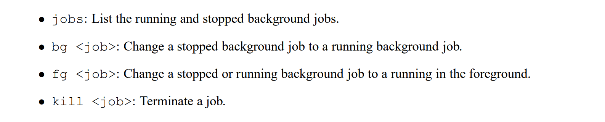

# Preliminaries
## Overview of a Unix Shell
> [!overview]
> The command line is a sequence of ASCII text words delimited by whitespace. The first word in the command line is either the name of a **built-in command** or the **pathname of an executable file**. The remaining words are command-line arguments. 
> - If the first word is a built-in command, the shell immediately executes the command in the current process. 
> - Otherwise, the word is assumed to be the pathname of an executable program. In this case, the shell forks a child process, then loads and runs the program in the context of the child. 
> - **The child processes** created as a result of interpreting a single command line are known collectively as a **job**. In general, a job can consist of multiple child processes connected by Unix pipes. 
> 
> If the command line ends with an ampersand ”&”, then the job runs in the background, which means that the shell **does not wait for** the job to terminate before printing the prompt and awaiting the next command line. 
> 
> Otherwise, the job runs in the foreground, which means that the shell **waits for** the job to terminate before awaiting the next command line. Thus, at any point in time, at most one job can be running in the foreground. However, **an arbitrary number of jobs can run in the background.**

## Job Control
> [!overview]
> More on Signals [Signals](../../8_Linking_OS_Processes/Signals.md)
> Unix shells support the notion of job control, which allows users to move jobs back and forth between background and foreground, and to change the process state (running, stopped, or terminated) of the processes in a job. Typing ctrl-c causes a SIGINT signal to be delivered to each process in the foreground job. 
> 
> The default action for SIGINT is to terminate the process. Similarly, typing ctrl-z causes a SIGTSTP signal to be delivered to each process in the foreground job. The default action for SIGTSTP is to place a process in the stopped state, where it remains until it is awakened by the receipt of a SIGCONT signal. Unix shells also provide various built-in commands that support job control. For example:
> 

# Phase 1: eval

# Phase 2: builtin_cmd

# Phase 3: do_bgfg

# Phase 4: sigchld_handler

# Phase 5: sigint_handler

# Phase 6: sigstp_handler

