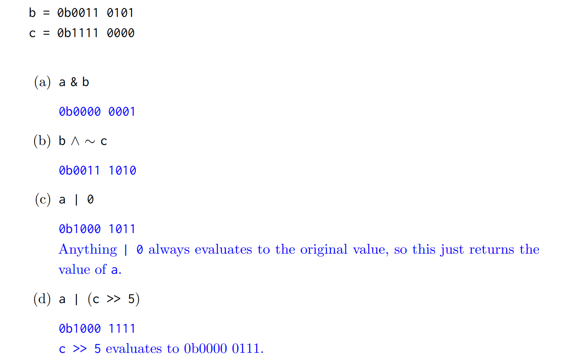
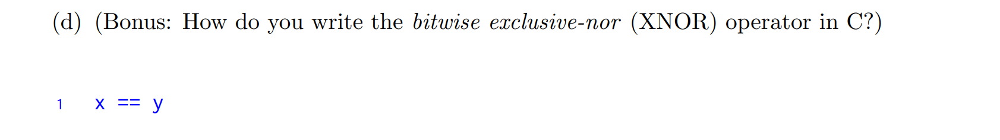
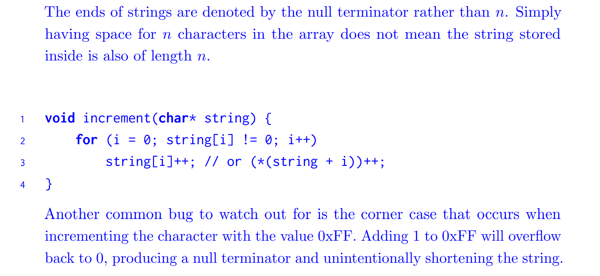
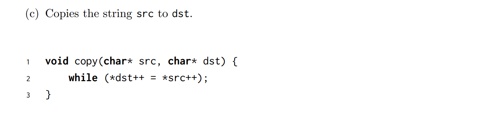
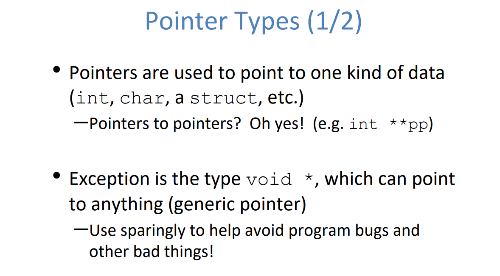
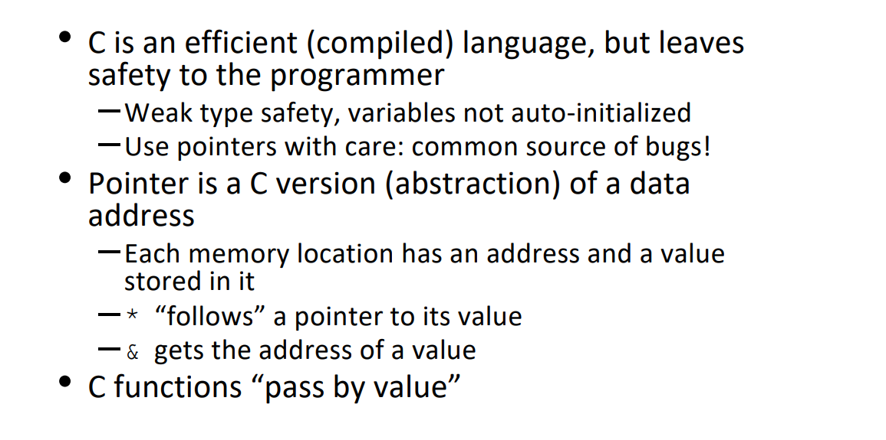
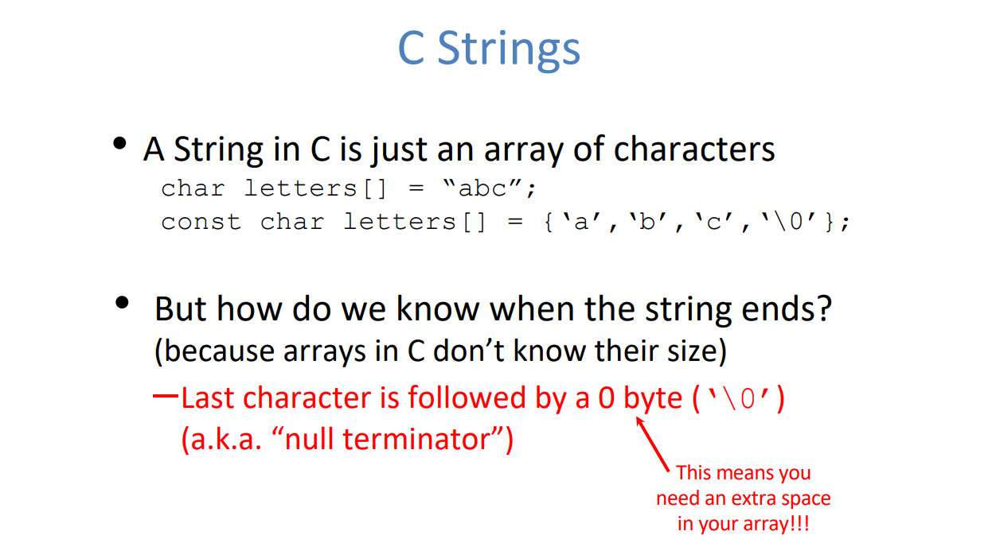

# Bitwise Operations
## Operations
> 
> **几个注意点:**
> 1. `XOR`位值相同返回`0`，不同返回`1`, 用$x\oplus y$表示。
> 2. `XNOR`位值相同返回`1`, 不同返回`0`, 用$\overline{x\oplus y}$表示。
> 



## Shifting Rules
> - Left shift (<<) behaves the same for both signed and unsigned numbers; zero bits are shifted in from the right.
> - Right shift (>>) behavior is different for signed and unsigned numbers:
>    - For unsigned numbers, zero bits are shifted in from the left.
>    - For signed numbers, the sign bit is usually replicated to preserve the sign of the number (arithmetic shift).


## Technical Tips
> 
> **More on **`**XOR**`**:**
> - `XOR`的特性在于，如果数字相同，则结果为零，数字不同则为`1`, 利用这个性质，If we want to flip a particular bit of an integer, we could use `^= 1`at that bit.  这样如果`That particular bit`是`1`，则`1^1=0`且`0^1=1`。 
> - `XOR`两次相当于撤销操作，可以用`Truth Table`证明。换句话说，我们有$x\oplus y \oplus y=x$，这个性质很重要。
> 


# C Syntax
## C Program Layout
> 


## Main Function
> 


## Variable Declarations
> 


## Boolean&Logic Operations
> 


## Control Flow
### if-else
> 


### for, while
> 


### switch&break
> 
> 总而言之就是: 先找到那个符合条件的`case`。然后执行知道遇到某个具有`break`的`case`。


# Functions
## Declaration
> 


## Describe the Function Behaviors
### Computing the Sum
> **Fa20 Disc02**
> 

**Solution**

### Negate the Number
> 

**Solution - Two's Complement Negation**


### XOR - Swap the Number
> 

**Solution - XOR**本质上这段代码想要互换$x$和$y$的值。但是因为被操作对象不是指针，所以修改在函数外部不生效。


### XNOR - Implementation
> 


## Function Writing Exercises
> **Fa20 Disc02**


### swap
> 


### mystrlen
> 


## Function Debugging Exercises
> **Fa20 Disc02**
> 

### array_length
> 

**Solution**

### increment elem⭐⭐⭐⭐⭐
> 


### strcpy
> 
> 这是一种简化的循环条件写法，`*dst++ = *src++`会被拆解成两步:
> 1. `*dst = *src`
> 2. `dst++; src++`


### pointer initialization
> 


# Pointers
## Basics
> 


## Address and Value
> 


## Pointer Arithmetics
> 


## Pointer Types&Sizes
> 
> 注意`int* x,y,z`声明的是`pointer x`, `int y`和`int z`。
> 


## Pointers and Parameter Passing
> 


## Pointer Allocation
> 


## Pointers and Structures
> 


## Pointers to Pointers
> 


## Pointer Deferencing
> 


## Summary
> 


# Operator Precedence
## Definition
> 
> **书中的图表:**
> 


## Pointer In/Decrement
> 


### Example 1: *p++
> 


### Example 2: (*p)++
> 


## Pointer and ++
> 


# Struct
## Basics
> 


## Struct Alignment
> 
> **解释一下这个规则:**
> 1. `char`的地址值起始需要为`1`的倍数
> 2. `short`的地址值起始需要为`2`的倍数
> 3. `int`的地址值起始需要为`4`的倍数
> 4. `pointer`的地址值起始需要为`4`的倍数，和`int`一样
> 5. `struct`的长度`sizeof(struct)`需要为其中占用字节数最大的变量类型的整数倍。
> 


```c
// C Program to demonstrate the structure padding property
#include <stdio.h>
  
// Alignment requirements
// (typical 32 bit machine)
  
// char         1 byte
// short int    2 bytes
// int          4 bytes
// double       8 bytes
  
// structure A
typedef struct structa_tag {
    char c; // 1 bytes, no alignment
    short int s; // 2 bytes, but char is 1 byte, without padding, short_int would start
    // at odd addressing.
} structa_t;
  
// structure B
typedef struct structb_tag {
    short int s;
    char c;
    int i;
} structb_t;
  
// structure C
typedef struct structc_tag {
    char c;
    double d;
    int s;
} structc_t;
  
// structure D
typedef struct structd_tag {
    double d;
    int s;
    char c;
} structd_t;
  
int main()
{
    printf("sizeof(structa_t) = %lu\n", sizeof(structa_t)); // 1 + 1(padding) + 2 = 4
    printf("sizeof(structb_t) = %lu\n", sizeof(structb_t)); // 2 + 1 + 1(padding) + 4 = 8
    printf("sizeof(structc_t) = %lu\n", sizeof(structc_t)); // 1 + 7(padding) + 8 + 4 + 4(natural alignment) = 24
    printf("sizeof(structd_t) = %lu\n", sizeof(structd_t)); // 8 + 4 + 1 + 3(natural alignment) = 16
  
    return 0;
}
```

# Arrays
## Basics
> 


## Accessing an Array
> 


## Array and Pointers
> 


## Array Name is not a Variable
> 
> 这里`a`的地址值是`24`, 非常奇怪。在汇编层面我们会了解到原因。


## Array Usage Caveats
> 


# Strings
## C String Definition⭐⭐⭐⭐⭐
### char[]
> 
> 这种定义方法下`string`是被储存在`stack`上的(如果是在函数中定义的话)。
> 此时调用`sizeof(letters)`返回的是字符串的长度。
> **注意:**
> - `char letters[4]="abcd"`并不会自动加上`Null Terminator`。
> - `char letters[] = "abcd"`会自动加上`Null Terminator`。


### string literals
> 还有一种初始化`C-string`的方法，是`string literal`, 即`char* s = "string"`, 这种情况下`s`被储存在`static`中。
> 此时调用`sizeof(s)`返回的是指针的大小，`4 bytes`。


## C String Functions
> 
> **上面有几个注意点:**
> 1. `strlen`的实现依赖于`string`最后一位的`Null Terminator`, 如果`string`没有`Null Terminator`(发生于我们没有分配足够的空间导致`Null Terminator`没有空间安放或者我们忘记设置了。)
> 2. `strcmp`:
> 
`str1 == str2`只是在比较`str1`和`str2`这两个指针存放的地址值。
> `strcmp(str1,str2)`返回的是`str1`和`str2`第一处不一致的位置处的字母之间的`ASCII-Value`的差值。
>    - 比如`hi`和`hello`的比较，`ord('i') - ord('e') = 4`, 所以返回`4`。(在`boolean condition`的时候可以查看是否大于零即可。)
>    - 比如`hi`和`hola`的比较，`ord('i') - ord('o') = -6`, 所以返回`-6`。
> 


## C String Examples
> 


