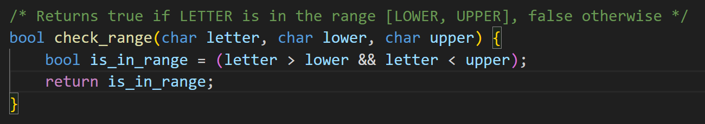

# Installation of CGDB
> [https://cgdb.github.io/](https://cgdb.github.io/)
> gdb5-refcard

[gdb5-refcard.pdf](https://www.yuque.com/attachments/yuque/0/2023/pdf/12393765/1694484953397-454f98be-d0a1-4c71-9176-64a5834dfaaa.pdf)

# Compiler Warnings
```c
#include <stdlib.h>
#include <stdio.h>
#include <string.h>

struct Course {
    int id;
    char *name;
};

struct Course *make_course(int id, char *name) {
    struct Course *new_course = malloc(sizeof(struct Course));
    new_course->id = id;
    new_course->name = *name;

    return &new_course;
}
int main() {
    struct Course *cs161 = make_course(161, "Computer Security");
    printf("Welcome to CS%d: %s!\n", cs161->id, cs161->name);

    return 0;
}
```
> 下面是未修改之前的控制台输出:
> 
> 1. 第一个`warning`: `static type checking`, 右值为`char`类型，左侧为`char*`类型。
> 2. 第二个`warning`: 函数返回值为单指针类型，但是上述代码返回了指针的指针。
> 3. 第二个`warning`: 是函数返回了在内部创建的变量的地址，但是因为分配在堆内存上，所以无伤大雅。

```c
#include <stdlib.h>
#include <stdio.h>
#include <string.h>

struct Course {
    int id;
    char *name;
};

struct Course *make_course(int id, char *name) {
    struct Course *new_course = malloc(sizeof(struct Course));
    new_course->id = id;
    new_course->name = name; // This line is modified

    return new_course; // This line is modified
}
int main() {
    struct Course *cs161 = make_course(161, "Computer Security");
    printf("Welcome to CS%d: %s!\n", cs161->id, cs161->name);

    return 0;
}

```


# GDB Basics
## Intro to GDB
> 

**GDB Commands List**
**Debugging Line 24 - pwd_checker.c**将小于号改成大于即可。


## More GDB
> 
> 本题中的`bug`来源是`check_range(char letter, char lower, char upper)`中的`char lower`和`char upper`的赋值问题。
> 
> 由于`check_number()`作为`caller`调用`check_range()`时，传入的`char lower = 0, char upper =9`。因为`char`变量如果接受的是`9`, 则在计算机内部会自动被转换为这个`ASCII  9`对应的字符，即`\t`, 如果我们用`printf("%c\n", lower)`结果就是`    `，一个制表符。
> 同理，如果`char lower = 'a'`, 那么`printf("%d\n", lower)`结果就是`97`。
> **我们来梳理一下:**
> `check_range`传入的参数被`check_range()`的`char letter = '0', char lower = 0, char upper = 9`接收。
> 在`check_range()`函数中，`letter > lower` 比较的实际上是对应的`ASCII`码，即`48 > 0`。同时`letter < upper`比较的是对应的`ASCII`码，即`48 < 9`, 所以返回`false`, 但是我们想要的结果是返回`true`, 所以问题的根源在于我们传参时应该传入字符`lower = '0'`和`upper='9'`。
> **下面是正确的代码:**
> 


## GDB Command List
> 下面是`debug`过程的步骤:
> 


# Valgrind Basics
## Installations
> Valgrind only works for linux system.
> 在`Linux System`上执行`sudo apt install Valgrind`即可。


## Walkthrough
```c
/* This program translates words to Bork, a language that is very similar to English.
   To translate a word to Bork, you take the English word and add an 'f' after every 
   vowel in the word. */

#include <stdio.h>
#include <stdlib.h>
#include <string.h>

char *alloc_str(int len) {
    return malloc(len * sizeof(char));
}

/* Str helper functions */
typedef struct Str {
    char *data;
    int len;
} Str;

Str make_Str(char *str) {
    /* Below is a designated initializer. It creates a Str struct and initializes
       its data field to str and its len field to strlen(str) */
    return (Str){.data=str,.len=strlen(str)};
}

void free_Str(Str str) {
    free(str.data);
}

/* concatinates two strings together */
Str concat(Str a, Str b) {
    int new_len = a.len + b.len;
    char *new_str = alloc_str(new_len);
    for (int i = 0; i < a.len; ++i) {
        new_str[i] = a.data[i];
    }
    for (int i = 0; i < b.len; ++i) {
        new_str[i+a.len] = b.data[i];
    }
    free(a.data);
    free(b.data);
    return (Str){.data=new_str, .len=new_len};
}

/* translates a letter to Bork */
Str translate_to_bork(char c) {
    switch(c) {
    case 'a': case 'e': case 'i': case 'o': case 'u': {
        char *res = alloc_str(2);
        res[0] = c;
        res[1] = 'f';
        return make_Str(res);
    }
    }
    char *res = alloc_str(1);
    res[0] = c;
    return make_Str(res);
}

int main(int argc, char*argv[]) {
    if (argc == 1) {
        printf("Remember to give me a string to translate to Bork!\n");
        return 1;
    }

    Str dest_str={}; // Fancy syntax to zero initialize struct
    Str src_str = make_Str(argv[1]);
    for (int i = 0; i < src_str.len; ++i) {
        Str bork_substr = translate_to_bork(src_str.data[i]);
        dest_str = concat(dest_str, bork_substr);
    }

    printf("Input string: \"%s\"\n", src_str.data);
    printf("Length of translated string: %d\n", dest_str.len);
    printf("Translate to Bork: \"%s\"\n", dest_str.data);

    return 0;
}
```
[lab02_spec.pdf](https://www.yuque.com/attachments/yuque/0/2023/pdf/12393765/1695306205650-b2efacbd-0ecc-454c-8832-975253b46ded.pdf)
```c
/* This program translates words to Bork, a language that is very similar to English.
   To translate a word to Bork, you take the English word and add an 'f' after every 
   vowel in the word. */

#include <stdio.h>
#include <stdlib.h>
#include <string.h>

char *alloc_str(int len) {
    char* data = (char*) malloc((len + 1)*sizeof(char));
    data[len] = '\0';
    return data;
}

/* Str helper functions */
typedef struct Str {
    char *data;
    int len;
} Str;

Str make_Str(char *str) {
    /* Below is a designated initializer. It creates a Str struct and initializes
       its data field to str and its len field to strlen(str) */
    return (Str){.data=str,.len=strlen(str)};
}

void free_Str(Str str) {
    free(str.data);
}

/* concatinates two strings together */
Str concat(Str a, Str b) {
    int new_len = a.len + b.len;
    char *new_str = alloc_str(new_len);
    for (int i = 0; i < a.len; ++i) {
        new_str[i] = a.data[i];
    }
    for (int i = 0; i < b.len; ++i) {
        new_str[i+a.len] = b.data[i];
    }
    free(a.data);
    free(b.data);
    return (Str){.data=new_str, .len=new_len};
}

/* translates a letter to Bork */
Str translate_to_bork(char c) {
    switch(c) {
    case 'a': case 'e': case 'i': case 'o': case 'u': {
        char *res = alloc_str(2);
        res[0] = c;
        res[1] = 'f';
        return make_Str(res);
    }
    }
    char *res = alloc_str(1);
    res[0] = c;
    return make_Str(res);
}

int main(int argc, char*argv[]) {
    if (argc == 1) {
        printf("Remember to give me a string to translate to Bork!\n");
        return 1;
    }

    Str dest_str={}; // Fancy syntax to zero initialize struct
    Str src_str = make_Str(argv[1]);
    for (int i = 0; i < src_str.len; ++i) {
        Str bork_substr = translate_to_bork(src_str.data[i]);
        dest_str = concat(dest_str, bork_substr);
    }

    printf("Input string: \"%s\"\n", src_str.data);
    printf("Length of translated string: %d\n", dest_str.len);
    printf("Translate to Bork: \"%s\"\n", dest_str.data);

    free_Str(dest_str);

    return 0;
}
```


## How to Use
> 
> `gcc -g -o outoput filename.c`
> `valgrind ./output args`


# Segment Fault
```c
#include <stdlib.h>
#include <stdio.h>
#include <string.h>

char *copy_str(char *s) {
    char *new_str = malloc(strlen(s) * sizeof(char));
    strcpy(new_str, s);
    return new_str;
}

int main() {
    char * copy_of_str = copy_str("hello world!");
    printf("%s\n", copy_of_str);

    return 0;
}

```
> 程序运行`Valgrind`的结果：
> 
> 发现有`Invalid Rad/Write`说明有段错误，访问非法内存的行为。
> 
> 下面是`Debug`的步骤:
> 1. 1, from `invalid write of size 1`
> 2. `strcpy`
> 3. `copy_str`
> 4. `ex5_valgrind.c`
> 5. 7
> 6. 12
> 7. 13, 下面的程序中, 很明显我们少分配了一个字节的空间导致`Seg Fault`。
> 

> 8. Yes
> 9. 12, since we forget to free the `copy_of_str`。


# Memory Management
## Allocation on Stack
```c
/* Bad example of how to create a new vector */
vector_t *bad_vector_new() {
    /* Create the vector and a pointer to it */
    vector_t *retval, v;
    retval = &v;

    /* Initialize attributes */
    retval->size = 1;
    retval->data = malloc(sizeof(int));
    if (retval->data == NULL) {
        allocation_failed();
    }

    retval->data[0] = 0;
    return retval;
}
```
> 上面的代码中，`vector* retval, v`等价于`vector_t* retval, vector_t v;`
> 1. `vector_t* retval`表明我们实例化了一个指针指向`vector_t`这个结构体
> 2. `vector_t v`表明我们在栈内存上为`vector_t`分配了空间
> 
其中产生问题的操作是`retval = &v`, 说明`retval*`存放的地址值是栈内存的地址值。这就导致了如果`bad_vector_new()`函数完成调用之后`retval*`指向的地址空间已经被释放，从而用户无法通过`*retval`来`free`掉申请的空间造成`memory leak`。
> 


## Allocation on Heap
> 

```c
/* Include the system headers we need */
#include <stdlib.h>
#include <stdio.h>

/* Include our header */
#include "ex6_vector.h"

/* Define what our struct is */
struct vector_t {
    size_t size;
    int *data;
};

/* Utility function to handle allocation failures. In this
   case we print a message and exit. */
static void allocation_failed() {
    fprintf(stderr, "Out of memory.\n");
    exit(1);
}

/* Bad example of how to create a new vector */
vector_t *bad_vector_new() {
    /* Create the vector and a pointer to it */
    vector_t *retval, v;
    retval = &v;

    /* Initialize attributes */
    retval->size = 1;
    retval->data = malloc(sizeof(int));
    if (retval->data == NULL) {
        allocation_failed();
    }

    retval->data[0] = 0;
    return retval;
}

/* Create a new vector with a size (length) of 1 and set its single component to zero... the
   right way */
/* TODO: uncomment the code that is preceded by // */
vector_t *vector_new() {
    /* Declare what this function will return */
    // vector_t *retval;

    /* First, we need to allocate memory on the heap for the struct */
    // retval = /* YOUR CODE HERE */

    /* Check our return value to make sure we got memory */
    // if (/* YOUR CODE HERE */) {
    //     allocation_failed();
    // }

    /* Now we need to initialize our data.
       Since retval->data should be able to dynamically grow,
       what do you need to do? */
    // retval->size = /* YOUR CODE HERE */;
    // retval->data = /* YOUR CODE HERE */;

    /* Check the data attribute of our vector to make sure we got memory */
    // if (/* YOUR CODE HERE */) {
    //     free(retval);                //Why is this line necessary?
    //     allocation_failed();
    // }

    /* Complete the initialization by setting the single component to zero */
    // /* YOUR CODE HERE */ = 0;

    /* and return... */
    return NULL; /* UPDATE RETURN VALUE */
}

/* Return the value at the specified location/component "loc" of the vector */
int vector_get(vector_t *v, size_t loc) {

    /* If we are passed a NULL pointer for our vector, complain about it and exit. */
    if(v == NULL) {
        fprintf(stderr, "vector_get: passed a NULL vector.\n");
        abort();
    }

    /* If the requested location is higher than we have allocated, return 0.
     * Otherwise, return what is in the passed location.
     */
    /* YOUR CODE HERE */
    return 0;
}

/* Free up the memory allocated for the passed vector.
   Remember, you need to free up ALL the memory that was allocated. */
void vector_delete(vector_t *v) {
    /* YOUR CODE HERE */
}

/* Set a value in the vector. If the extra memory allocation fails, call
   allocation_failed(). */
void vector_set(vector_t *v, size_t loc, int value) {
    /* What do you need to do if the location is greater than the size we have
     * allocated?  Remember that unset locations should contain a value of 0.
     */

    /* YOUR CODE HERE */
}
```
```c
/* Include the system headers we need */
#include <stdlib.h>
#include <stdio.h>

/* Include our header */
#include "ex6_vector.h"

/* Define what our struct is */
struct vector_t {
    size_t size;
    int *data;
};

/* Utility function to handle allocation failures. In this
   case we print a message and exit. */
static void allocation_failed() {
    fprintf(stderr, "Out of memory.\n");
    exit(1);
}

/* Bad example of how to create a new vector */
vector_t *bad_vector_new() {
    /* Create the vector and a pointer to it */
    vector_t *retval, v;
    retval = &v;

    /* Initialize attributes */
    retval->size = 1;
    retval->data = malloc(sizeof(int));
    if (retval->data == NULL) {
        allocation_failed();
    }

    retval->data[0] = 0;
    return retval;
}

/* Create a new vector with a size (length) of 1 and set its single component to zero... the
   right way */
/* TODO: uncomment the code that is preceded by // */
vector_t *vector_new() {
    /* Declare what this function will return */
    vector_t *retval;

    /* First, we need to allocate memory on the heap for the struct */
    retval =  (vector_t *) malloc(sizeof(vector_t));

    /* Check our return value to make sure we got memory */
    if (retval == NULL) {
         allocation_failed();
     }

    /* Now we need to initialize our data.
       Since retval->data should be able to dynamically grow,
       what do you need to do? */
     retval->size = 1;
     retval->data = (int *) malloc(sizeof(int));

    /* Check the data attribute of our vector to make sure we got memory */
     if (retval -> data == NULL) {
         free(retval);				//Why is this line necessary?
         allocation_failed();
     }

    /* Complete the initialization by setting the single component to zero */
     *retval->data = 0;

    /* and return... */
    return retval; /* UPDATE RETURN VALUE */
}

/* Return the value at the specified location/component "loc" of the vector */
int vector_get(vector_t *v, size_t loc) {

    /* If we are passed a NULL pointer for our vector, complain about it and exit. */
    if(v == NULL) {
        fprintf(stderr, "vector_get: passed a NULL vector.\n");
        abort();
    }

    /* If the requested location is higher than we have allocated, return 0.
     * Otherwise, return what is in the passed location.
     */
    /* YOUR CODE HERE */
    int size = v-> size;
    if (loc >= size) {
        return 0;
    }

    return *(v -> data + loc);
}

/* Free up the memory allocated for the passed vector.
   Remember, you need to free up ALL the memory that was allocated. */
void vector_delete(vector_t *v) {
    /* YOUR CODE HERE */
    int* data_vector = v -> data;
    free(data_vector);
    free(v);
    return;
}

/* Set a value in the vector. If the extra memory allocation fails, call
   allocation_failed(). */
void vector_set(vector_t *v, size_t loc, int value) {
    /* What do you need to do if the location is greater than the size we have
     * allocated?  Remember that unset locations should contain a value of 0.
     */

    /* YOUR CODE HERE */
    int* old_vector;
    int* new_vector;
    int old_size = v -> size;
    old_vector = v -> data;

    if (loc >= v->size) {
        // Resize it
        int new_size = loc + 1;
        new_vector = realloc(v -> data, new_size * sizeof(int));       
        if (new_vector == NULL) {
            allocation_failed();
        }
        v -> data = new_vector;
        v -> size = new_size;

        // Set all the unset vector index value to be zero
        int i = old_size;
        while (i < new_size - 1) {
            *(new_vector + i) = 0;
            i++;
        }

        // Set the value at loc to be 'value'
        *(new_vector + i) = value;

    } else {
        *(v -> data + loc) = value;
    }
}

```
> **Test Output:**
> 


# Related Resources
## Sp23
[lab02.zip](https://www.yuque.com/attachments/yuque/0/2023/zip/12393765/1694454033693-27f18c09-63c0-431b-9270-e535a092b638.zip)
[lab02_spec.pdf](https://www.yuque.com/attachments/yuque/0/2023/pdf/12393765/1694454067083-0ab1e925-75a4-42eb-a85b-3dac549cd918.pdf)


## Su20
[lab01.zip](https://www.yuque.com/attachments/yuque/0/2023/zip/12393765/1694454188117-00547bf5-b311-4a96-8ea6-415cbff79a3a.zip)
[lab01_spec.pdf](https://www.yuque.com/attachments/yuque/0/2023/pdf/12393765/1694454212530-2d4fcd7d-e435-4c08-b9ec-980858bcaf87.pdf)
